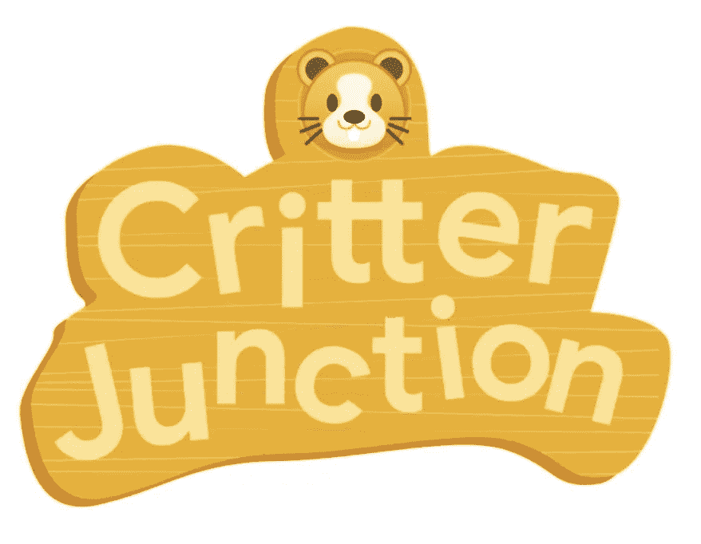

# 规模和弹性不仅仅是流行语

> 原文：<https://medium.com/google-cloud/scale-and-resilience-arent-just-buzzwords-ce748360e80?source=collection_archive---------0----------------------->

## 规模季节

# 介绍

“规模季节”是一个博客和视频系列，旨在帮助企业和开发人员在设计模式中构建规模和弹性。在这一系列文章中，我们计划向您介绍一些创建具有弹性和可伸缩性的应用程序的模式和实践，这是许多现代架构实践的两个基本目标。

在第 1 季中，我们将介绍基础架构自动化和高可用性:

1.  可伸缩和弹性应用的模式
2.  [基础设施为代码](https://medium.com/p/3865ed0e4b03/edit)
3.  [不变的基础设施](https://medium.com/p/624a8e3482d6/edit)
4.  [在哪里扩展您的工作负载](/@swongful/where-to-scale-your-workloads-6420150bf825)
5.  [全球自动扩展 web 服务](/@swongful/globally-autoscaling-web-services-4b650cc6fc49)
6.  高可用性(自动修复和自动更新)

在本文中，我将带您了解规模和弹性背后的基础知识。

# 看看这个视频

随着世界上一切事情的发生，企业不可否认地会受到干扰。全球范围内的社会隔离已经形成，传统的实体公司被迫将业务转移到在线空间，而已经在线的公司每天的流量都在大幅增加。

这可能会给你带来很大的压力，让你去适应和发展你的在线架构，并认识到可伸缩和有弹性的架构不只是时髦的词语，而是在今天的环境下绝对必要的。当资源和业务都受到限制时，这种情况会变得更加严重。

对于在过去的几个月里广受欢迎的多人游戏公司 Critter Junction 来说，这听起来是真的。在线玩家可以在一个模拟生物的虚拟世界中相互交流。

构建和运营这种规模的游戏筹码需要大量精心的规划。因此，我和我的团队正在帮助 Critter Junction 重新审视他们的设计实践，以获得最终的全球成功。

## 业务和运营限制

到目前为止，Critter Junction 在本地运行单个机器方面做得很好，但还不能自动扩展到许多机器来处理流量的高峰和低谷。

有时，他们最终运行过度利用的机器，而其他时候运行未充分利用的机器。他们也没有主动将弹性构建到他们的架构中。网络故障、图像更新或峰值负载可能会导致他们的游戏玩家体验中断。

最重要的是，Critter Junction 有自己的业务和运营压力。

1.  他们的 CTO 致力于变得更加敏捷，以适应不断变化的用户需求。
2.  他们的开发人员正致力于减少调查故障所需的时间。
3.  他们的运营商关心的是找到自动从故障中恢复的方法。

## 可扩展性和可靠性

这是一个需要思考的问题！首先，让我们澄清一下什么是可伸缩性和弹性。

> 可伸缩性是通过在系统中添加或删除资源来衡量系统处理不同工作量的能力。

例如，一个可扩展的 web 应用程序不仅可以很好地处理 1 个用户，还可以很好地处理 1 亿个用户，它可以优雅地处理流量的峰值*和*下降。

好消息是，云让你可以灵活地调整应用消耗的资源。坏消息是:如果没有适当的设计，你最终可能会使用比你需要的更多的资源，就像 Critter Junction 所做的那样。相反，您想要的是在不影响性能或用户体验的情况下，通过移除未充分利用的资源*来降低成本。*

也就是说，即使是可扩展的应用程序也可能面临中断。如果没有内置的弹性，系统故障可能会影响您的运营。

> 弹性意味着设计能够承受失败。弹性应用程序是一种即使系统组件出现故障也能继续运行的应用程序。

这需要在*你的架构的所有*层面进行规划。它会影响您如何布局基础设施和网络，以及如何设计您的数据存储和应用程序。它甚至延伸到人和文化。

让我们面对现实吧——当您想要快速启动并运行时，构建和运行弹性应用程序并不容易。对于分布式游戏堆栈来说尤其如此，这意味着多层基础设施、网络和服务。

## 展望未来

在这个系列中，我们将通过谷歌云设计最佳实践来帮助 Critter Junction 构建可扩展和弹性的应用程序。

总之，这些模式和最佳实践将归入 3 个主题:

1.  **自动化** —因为自动化您的基础架构供应、测试和应用部署提高了一致性和速度，并最大限度地减少了人为错误。
2.  **松耦合**——因为将您的系统视为一个松耦合的独立组件的集合会给您带来灵活性和弹性。
3.  **数据驱动的设计** —因为收集指标来了解你的应用的行为是至关重要的。关于何时扩展应用程序，或者某项服务是否不健康的决策需要基于数据。

这些主题对于为扩展和承受失败打下更坚实的基础至关重要。错误和中断时有发生，但 Critter Junction 的使命是改善他们的应用程序架构和开发流程的设计。请继续关注，了解具体情况。

记住，永远要做架构设计。

# 后续步骤和参考:

*   在[谷歌云平台媒体](https://medium.com/google-cloud)上关注这个博客系列。
*   参考:[可伸缩和弹性应用的模式](https://cloud.google.com/solutions/scalable-and-resilient-apps)。
*   跟随[一季的尺度视频系列](http://bit.ly/seasonofscale)，订阅谷歌云平台 YouTube 频道。
*   想要更多的故事？在[媒体](/@swongful)和[推特](http://twitter.com/swongful)上关注我。
*   与我们一起享受这个系列的旅程，并了解更多关于 Google 云解决方案的信息。