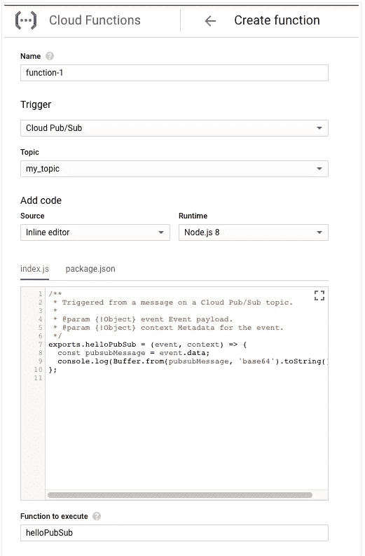
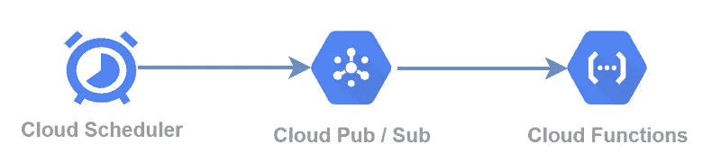

# 带云功能的秤 GKE

> 原文：<https://medium.com/google-cloud/scale-gke-with-cloud-function-d76f20f9416e?source=collection_archive---------0----------------------->

在运行 Kubernetes 集群时，根据需求动态扩展集群至关重要。有时也可能是 Kubernetes 集群的计划扩大或缩小。

在本文中，我们将看一个 GCP GKE 的例子，在这个例子中，您可能需要定期将开发 GKE 集群缩减到零，以便节省成本。我们可以使用云功能扩大和缩小 GKE 集群。

您可以在选项 1–2(使用发布/订阅和云功能)和选项 2(仅创建云 HTTP 功能，不使用发布/订阅)之间进行选择。

下面是 Github 的代码链接:[https://github.com/harsh4870/cloud-function-scale-gke](https://github.com/harsh4870/cloud-function-scale-gke)

## **方法一** — **发布/订阅&云功能**

创建云函数，进入**云函数**页面。[转到云功能](https://console.cloud.google.com/functions)

点击**创建功能**。



给你的函数一个名字。接受默认的内存分配。

在**触发器**列表中，选择**云发布/订阅**。

使用菜单选择现有主题，或使用弹出菜单创建新主题。该主题现已被您的函数订阅。你需要记住主题的名字，所以把它写下来。

从 Github 和 package.json 更新复制/粘贴代码。

现在，当您向发布/订阅服务器发送消息时，有效负载将启动一个云功能和进程，GKE 节点池将根据有效负载扩大或缩小。

发布/订阅的有效负载

```
{  
   "projectId": "auto-x",  
   "zone": "us-central1-c",  
   "cluster_id": "cluster-1",  
   "node_pool_id": "test-pool",  
   "node_count": 1
}
```

## 方法 2— HTTP 云功能

在方法 2 中，想法是将 **HTTP** 云函数 **POST** 请求与 **JSON** 有效载荷放在正文中，基于 params 云函数将处理和缩放 GKE 节点池。

创建云函数，进入**云函数**页面。[转到云功能](https://console.cloud.google.com/functions)

在 Trigger 中选择 **HTTP，**如果你想要验证你可以使用。保留云功能而不授权是很危险的。

从 Github 和 package.json 更新复制/粘贴代码

当你点击带有有效载荷的云函数的 HTTP URL 时，它将处理有效载荷并改变 GKE 集群的大小。

**额外—定期或每日更新**

要在特定时间每天缩小或扩大 GKE 集群，您可以利用**云调度器作业**。

如果您需要在夜间缩减开发 GKE 集群，并在办公时间之前将其扩大，那么 daily Cloud scheduler 是使用云功能的最佳选择。这将大大降低你的成本。



在谷歌云控制台中，转到**云调度器**页面。

点击**创建作业**和**T5，选择作业运行的区域。**

添加 Cron 作业的名称和描述。为您的工作指定**频率**。

```
25 16 * * 8
```

接下来，选择调度程序要遵循的时区。选择可以使用调度程序向发布/订阅主题发送消息的目标。

现在您有了一个 cron 作业，它根据配置发布到您的发布/订阅主题。该主题由您的云功能订阅。