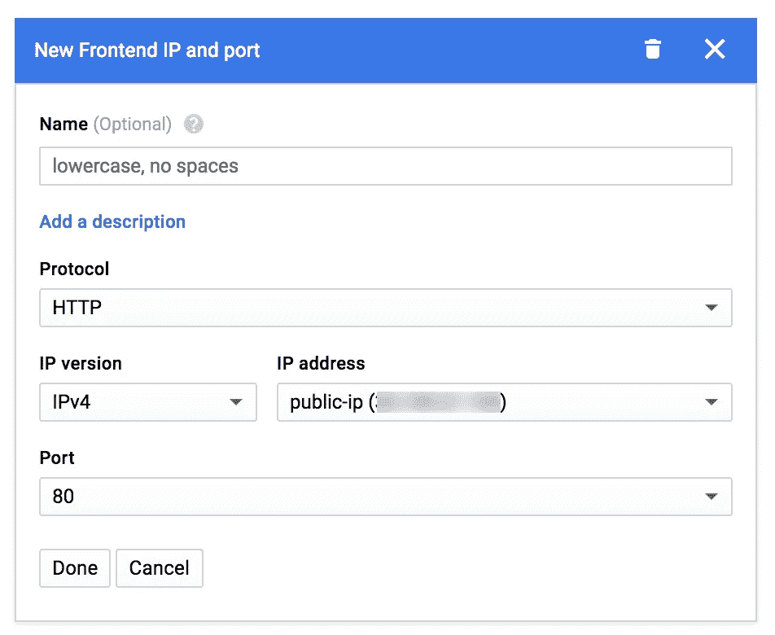

# 扩展的虚拟机:第 4 部分。负载平衡器

> 原文：<https://medium.com/google-cloud/scaled-vm-part-4-load-balancer-c3e77df03a27?source=collection_archive---------1----------------------->

如何配置自动平衡器来处理“扩展的虚拟机”场景中的请求

在以前的文章中，我描述了如何在托管实例中配置虚拟主机。

在这篇文章中，我将描述如何配置负载平衡器来处理我们的虚拟机的请求。

[ [第一部分:简介](/@olostan/scaled-vm-part-1-just-scale-my-vm-9384eb67ccef)[[第二部分:FS/VM](/@olostan/scaled-vm-part-2-shared-fs-and-vm-instances-f90e362cc2f0)[[第三部分:Web](/@olostan/scaled-vm-part-3-web-hosting-9006705e83e8) ] [ [第四部分:负载平衡器](/@olostan/scaled-vm-part-4-load-balancer-c3e77df03a27) ] **[** [**快速演练**](/@olostan/scaled-vm-quick-walkthrough-f695c72dacc3) **]**

# 负载平衡器配置

现在我们知道我们的实例将提供来自共享文件系统的内容。但是我们需要单个 IP 来配置我们的 DNS。之后，在高负载的情况下，如果实例组的 autoscaler 决定扩展新的虚拟机来处理负载，负载平衡器应该通过我们的虚拟机来分配负载。

要设置这一点，您应该转到云控制台上的[负载平衡器](https://console.cloud.google.com/net-services/loadbalancing/loadBalancers/list)选项卡，并创建新的 HTTP(S)负载平衡器(您可以在此处直接按[来完成此操作)](https://console.cloud.google.com/net-services/loadbalancing/http/add)

输入名称后，您应该单击“后端配置”，然后单击“创建或选择后端服务”和“创建后端服务”:

在创建后端服务的过程中，您必须创建新的后端。在那里，您可以选择实例组:

此外，您需要创建“健康检查”。请**小心**选择 **HTTP** 作为协议进行检查:

创建健康检查后，您可以保存后端配置并继续**前端配置:**

这里非常重要的是创建**新的公共 IP 地址。**该地址将在 DNS 配置中用于访问您的可扩展设置。

最后，您应该会看到这样的内容:

如果你做了所有其他的事情，你应该能够使用公共 IP 访问你的系统。

在下一部分，我将描述如何添加最后一个缺失点——cloud SQL 作为托管 MySQL 的替代。