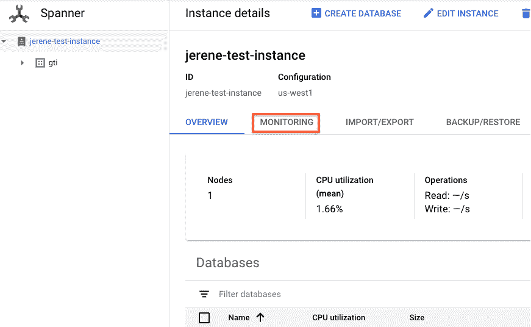
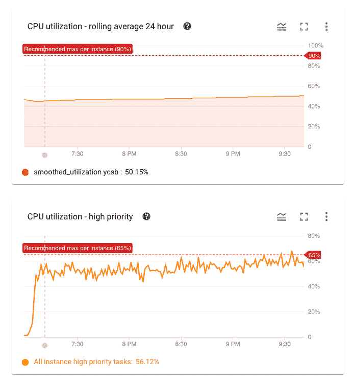

# 扩展云扳手实例

> 原文：<https://medium.com/google-cloud/scaling-cloud-spanner-instances-dec47675d1af?source=collection_archive---------1----------------------->

JOSHUA COLEMAN 在 [Unsplash](https://unsplash.com?utm_source=medium&utm_medium=referral) 上拍摄的照片

*Cloud Spanner 允许客户在没有任何维护窗口的情况下，毫不费力地按需扩展和缩减实例。在这篇博客中，我们解释了如何扩大和缩小规模，并提供了最佳实践的建议。*

# 按比例增加

云扳手随着您的成长而扩展。纵向扩展实例允许实例处理增加的流量和增加的数据大小，允许企业将时间集中在需要关注的事情上，并降低维护数据库的成本。

# 何时扩大规模

当您预计流量会增加时，最好在事件发生前扩大实例的规模。向上扩展就是增加实例中的节点数量(通常“向上扩展”是指向一个节点添加更多资源，在这篇博客中，我用它来表示增加节点数量，“向下扩展”是指减少节点数量)。虽然您可以一次性增加实例大小(没有必要将增加分成几个阶段)，但建议您为实例大小的每一倍安排 30 分钟的重新平衡时间。例如，如果您从 100 个节点开始，并且需要扩展到 1000 个节点，您可以对实例大小进行一次更改，但是您应该在活动开始前至少 2 个小时进行。在扩展过程中，尾部延迟可能会略有增加。因此，我们建议您在低流量时扩大(和缩小)实例。

如果您注意到您的 CPU 利用率高于推荐的阈值，那么是时候扩展您的实例了。要查看您的利用率:

**步骤 1** :转到云控制台- >扳手

**第 2 步**:单击您想要找出 CPU 利用率的实例

**步骤 3** :点击监控

在决定是否扩展实例时，您应该查看每个实例的 CPU 利用率，而不是每个数据库的利用率。(注意，选择了我的实例 jerene-test-instance，而不是我的数据库 gti)

**步骤 4** :查看您的 24 小时 CPU 利用率和 CPU 利用率(高优先级)的滚动平均值。确保两者都低于各自的红线。请注意，对于区域和多区域实例，这些值是不同的。

# 要扩大多少

您希望纵向扩展的节点数量将因您的使用情形而异。重要的是，首先要为典型的使用量建立一个基线。Cloud Spanner 线性扩展，因此您可以使用它来估计您将需要多少节点。例如，如果您有一个 15 个节点的实例，当前的 CPU 利用率为 80%,您希望将其降低到 60%,那么将您的实例向上扩展 5 个节点是一个很好的起点。

# 实例供应不足的问题

与基于使用情况的数据库不同，当您设置的限制低于当前流量时，这些数据库会拒绝查询，Cloud Spanner 允许请求完成，即使它超过了推荐的 CPU 阈值。但是，请求可能需要更长时间才能完成。在某些情况下，实例资源调配严重不足，这可能会超过请求截止日期，导致请求超时。因此，我们建议用户保持在您的实例类型(区域或多区域)的推荐阈值以下。

# 什么时候扩大规模没有好处

如果由于大量请求极其频繁地访问某个键(可以是基表键，也可以是索引键),导致读取或写入该键时的延迟增加，从而导致您遇到了[hot spot](https://cloud.google.com/spanner/docs/schema-design),那么扩展您的实例将无济于事。相反，考虑一下这里列出的一些替代方案。这是因为一个键只存在于一个节点(及其副本)上的一个分割中。添加更多节点不会改变这一点。因此，如果您在 CPU 利用率较低的情况下发现延迟增加(尤其是尾部延迟),也许应该考虑解决可能的热点问题。

# 分频

缩减实例将减少闲置资源的数量，并为客户节省大量成本。以下是缩小实例时需要注意的一些事项。

# 何时缩减规模

与向上扩展不同，向下扩展实例包括从为其提供服务的现有服务器上卸载数据库拆分，并将它们移动到实例中的不同服务器上。以前发送到这些服务器的流量将被重定向到托管这些数据库拆分的新服务器。因此，当规模缩小事件发生时，我们预计尾部延迟会增加。

# 缩减多少

与纵向扩展一样，因为 Cloud Spanner 是线性扩展的，所以您可以将可以向下扩展的节点数量作为基线工作负载的一个因素来估计。例如，如果您当前有 10 个节点，总体 CPU 利用率为 30%，如果您将其缩减到 5 个节点，则在大多数情况下，总体 CPU 利用率大约为 60%。与向上扩展不同，向下扩展时，建议您分阶段进行，以免干扰您的实时应用流量。缩小规模最好也在低流量时进行。工作负载延迟对缩减事件的响应不同，因此为了准确了解工作负载的响应方式，我们建议您在第一次缩减时最多将实例缩减 10%。如果影响在可接受的范围内，您可以逐渐增加正在缩减的节点的百分比。

# 缩小规模的频率

我们建议在缩小规模之间等待 30 分钟，或者至少等待 10 分钟。这允许数据库拆分在下一波缩减发生之前移动到新的服务器。我们不建议您每隔几分钟就扩大或缩小实例。还需要注意的是，Cloud Spanner 目前是按小时收费的，所以每小时多次缩放实例可能不会节省任何成本。

# 工具和自动化

# 自动缩放器

Cloud Spanner 的[开源生态系统](https://github.com/cloudspannerecosystem)有一个[自动缩放器](https://github.com/cloudspannerecosystem/autoscaler)，用户可以部署它来根据 CPU 利用率自动缩放实例。这个开源的自动缩放器现在[已经正式发布](https://cloud.google.com/architecture/autoscaling-cloud-spanner)。这是一个生态系统解决方案，而不是 Cloud Spanner 的原生功能。