# 将 Google App Engine 扩展到没有实例(或者只有 1 个)

> 原文：<https://medium.com/google-cloud/scaling-google-app-engine-to-no-instances-or-maybe-just-1-37be4e8d4230?source=collection_archive---------0----------------------->

不常使用的应用程序不需要 100%的时间都在运行，你也不应该为此付费。

如果你在 GAE 上部署[应用](/@mediocrity/from-idea-to-deployed-on-gcp-in-24hrs-927eaf8a5939)，你会开始注意到当你的应用运行时，你会为两个实例而不是一个实例花钱。本指南将介绍在*灵活*的环境中，不需要 100%的时间正常运行或有严格的可靠性/延迟限制的应用程序的单个实例。

# 环境:标准与灵活

在我们了解如何配置服务甚至成本数据之前，我们需要确保了解 GAE 提供的两种环境类型之间的差异。文档[在这里](https://cloud.google.com/appengine/docs/the-appengine-environments)概述了不同之处。有几个与成本相关的关键差异。

**灵活**:在灵活的环境中，您需要为使用 **vCPU** 、**内存**和**持久磁盘**付费。如果您的常规流量模式需要逐渐增加和减少**，通常会更具成本效益。**

****标准**:在标准环境中，您只需为您需要的东西付费(例如*实例小时*)，并且在没有流量时可以扩展到 **0 实例**。对于不总是需要流量的小型应用程序来说，这通常更具成本效益。**

**了解这一点后，您可以查看应用程序的 ***app.yaml*** 文件，了解它们被配置为使用哪种环境。如果没有指定 **env** 键，它将被部署到**标准**环境中。**

# **缩减灵活的环境**

**如果出于技术原因或选择(比如运行 Node.js 或 Ruby 的能力)或者因为需要 SSH 调试(真的吗？)或拥有后台进程的能力，您仍然可以配置服务的缩放参数。**

**如果您有一个没有指定任何缩放或资源参数的小型应用程序，这是一个很好的起点。**

**我们要研究的第一个参数是**自动缩放**参数。因为我们的例子有一个运行时 *nodejs* ，我们将继续。**

**有两个文档需要复习:1)[App Engine 概述](https://cloud.google.com/appengine/docs/flexible/nodejs/an-overview-of-app-engine#Instance_scaling)，2) [用 app.yaml 配置你的 App](https://cloud.google.com/appengine/docs/flexible/nodejs/configuring-your-app-with-app-yaml#automatic_scaling)。您可能已经打开了这些页面，或者之前已经阅读过，但它们是很好的参考资料。**

**如果您的应用程序不需要冗余或高可用性，您实际上可以将其缩减到一个**单个**实例。默认情况下，出于延迟和冗余/可靠性目的，GAE 将部署 **2 个实例**。**

**为了能够理解如何设置参数，例如 *max_num_instances* (来自上面的第二个文档)，您需要查看应用程序的实例指标，理解如果您扩展到 2 个实例(默认)以下，您将会受到**延迟**和**冗余/可靠性**的影响。**

**在 Google 云平台控制台中，在“应用引擎”下的“实例”下，选择您的服务。在您的服务下方的下拉列表中，您可以选择几个指标进行查看:**

**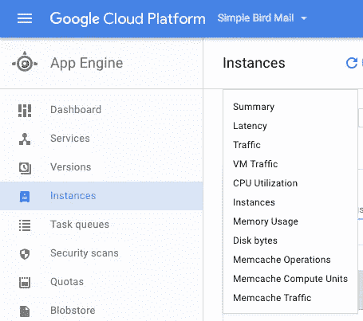**

**实例度量**

**将时间段设置得稍长一些，比如 14 天或 30 天，然后浏览指标。**

**在我的示例应用程序中，我可能会缩小到单个实例(因为它不需要低延迟或严格的可靠性)，我查看了摘要、流量、VM 流量、CPU 利用率、实例、内存使用和磁盘字节。**

**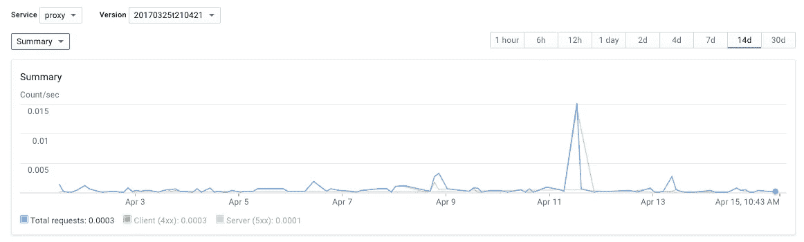**

**请求摘要**

**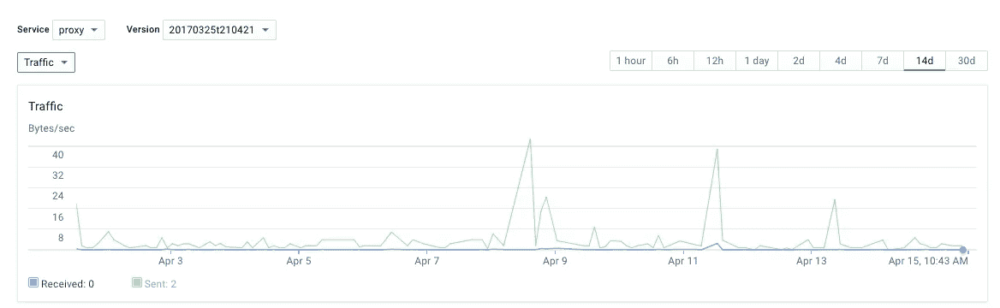**

**以字节/秒表示的流量**

**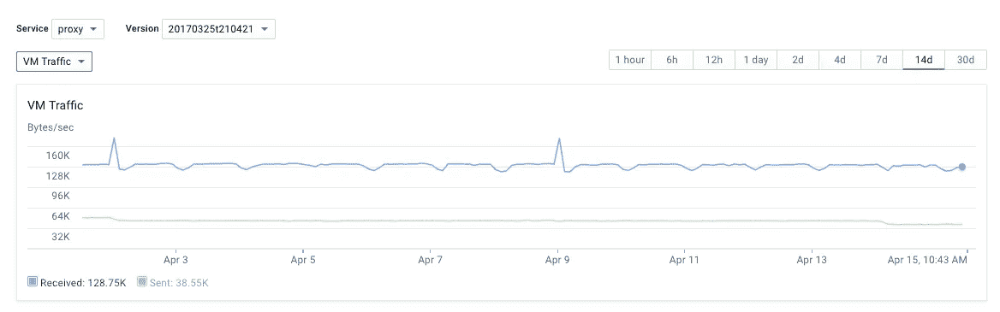**

**以字节/秒为单位的虚拟机流量**

**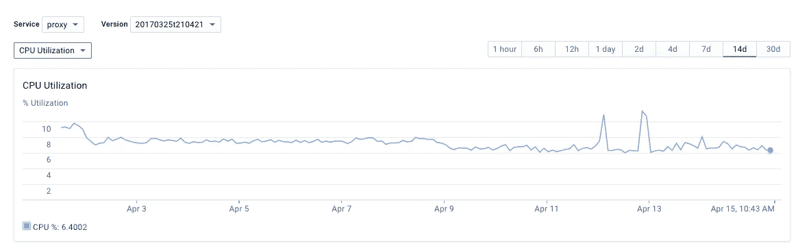**

**CPU 利用率百分比**

**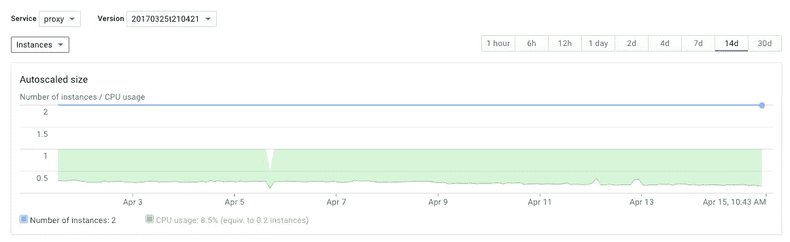**

**实例数量和 CPU 使用率**

**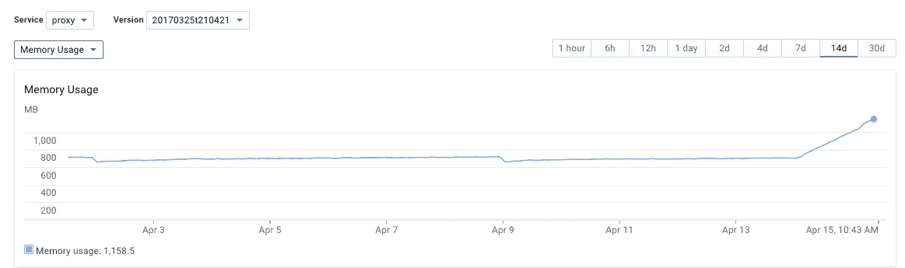**

**内存使用量(MB)**

**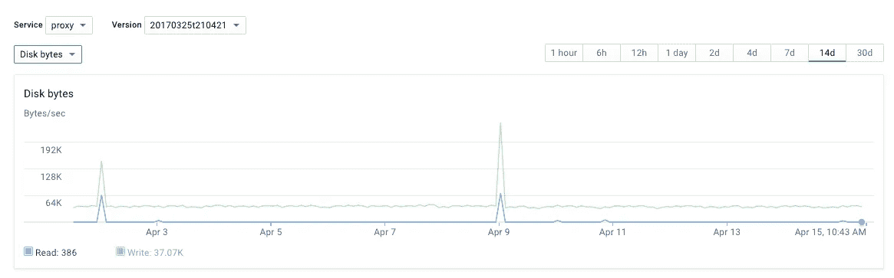**

**以字节/秒为单位的磁盘字节**

**从这些指标可以看出，这是一个相对较小的应用程序。我们不会自动扩展到超过 2 个实例的默认值，也不会将 CPU 利用率提高到 10%以上。**

**考虑到这一点，我很乐意将缺省值 2 以下的实例数量缩减为一个实例。对于这个特定的应用程序，我没有任何延迟或冗余/可靠性问题。**

**我们还可以使用这些指标来设置我们希望应用程序使用的**资源**规模。通过设置适当的资源规模，我们将与适当的机器类型相匹配。这方面的文档在之前链接的文档中向上滚动了一点点(或者这里的[是](https://cloud.google.com/appengine/docs/flexible/nodejs/configuring-your-app-with-app-yaml#resource-settings))。**

**有三个参数我们会重点设置: **cpu** 、 **memory_gb** 、 **disk_size_gb** 。在本例中，我们不需要关注卷的其他参数，因为我们没有装载任何卷。**

**默认情况下，您获得了 1 个 cpu 内核，我们将这样设置它，因为我们几乎没有达到 10%的 CPU 利用率。**

**默认情况下，你得到 **0.6 GB 的内存**。在链接的文档中有一个公式显示，您需要大约 0.4GB 的内存用于偷听到的内容，最少总共需要 0.9GB。他们的文档中的公式是**memory _ GB**=**CPU***[0.9–6.5]—0.4。这意味着我们可以为单核设置的绝对最小值是 0.5 GB，这就是我们将要做的。**

**默认情况下，您会得到 **10 GB 的磁盘**，因为这是最小值，所以我们将这样设置。**

**最小 GAE 资源设置的配置可能如下所示:**

**既然我们已经设置了资源和扩展参数，我们就可以重新部署应用程序了(假设对此很熟悉)。**

**假设您的应用程序重新部署成功，您可以开始在控制台和命令行中查看各种指标。我建议第一件事是确认您已经设置的配置，因为您已经更改了相当重要的参数。这可以通过如下的*应用版本描述*命令来完成:**

**注意*自动缩放*和*资源*键/值。这些应该与您设置的相匹配。**

**在 GCP 控制台中，您应该能够查看 App Engine > Dashboard 从 2 个实例减少到 1 个实例:**

**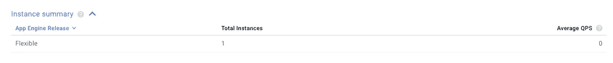**

**实例摘要**

**在“版本”和“实例”选项卡下，它也应该显示一个实例:**

**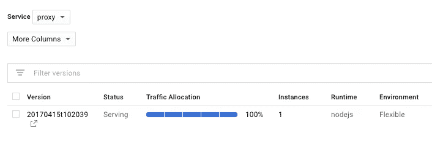**

**版本**

**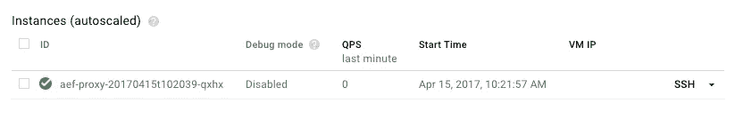**

**例子**

# **祝贺**

**如果您将灵活环境中的实例数量从**两个**减少到**一个**，那么您的 GAE 账单可能会减半。休息一下，喝杯咖啡，庆祝一下！**

**下一篇文章:如何分析你的 GCP 账单并通过可见性节省数十亿美元。**