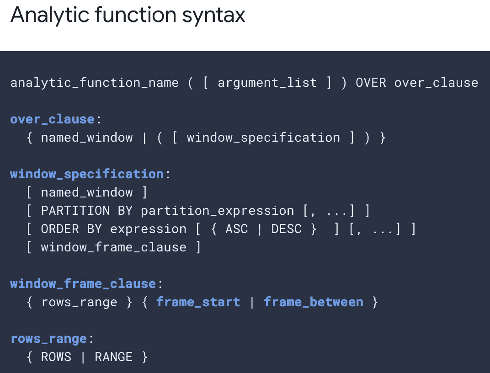
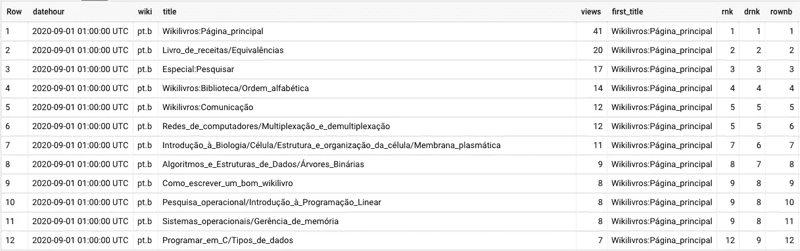
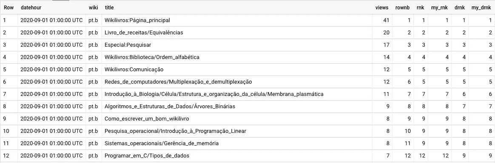
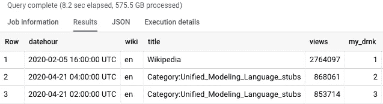

# 缩放 Google BigQuery 分析函数

> 原文：<https://medium.com/google-cloud/scaling-google-bigquery-analytical-functions-5fe6f098479e?source=collection_archive---------1----------------------->

[Google BigQuery](https://cloud.google.com/bigquery/) ，Google 的数据仓库解决方案，有很多功能和能力。

[分析函数](https://cloud.google.com/bigquery/docs/reference/standard-sql/analytic-function-concepts)计算一组行的值，并为每行的*返回一个结果。这不同于聚合函数，聚合函数为一组*行*返回单个结果。*

来源:[https://cloud . Google . com/big query/docs/reference/standard-SQL/analytic-function-concepts #语法](https://cloud.google.com/bigquery/docs/reference/standard-sql/analytic-function-concepts#syntax)

由于 BigQuery 的每个节点内存限制，这些强大的数据集函数可能会达到“资源超出异常”的错误。

我们将看看两个最常用的函数是 RANK()和 DENSE_RANK()，以及如何为这些函数使用更大的分区。

## **按日期分区**

通过按日期划分窗口功能，可以避免在单个节点上操作:

RANK() OVER(按日期分区，按公制 DESC 排序)

如果这对你来说还不够，你只能使用更快更简单的解析函数:ROW_NUMBER()和 LAG()，手动计算 RANK()和 DENSE_RANK()。

## 一个例子

我们将使用 Wikipedia*` BigQuery-public-data . Wikipedia . pageviews _ 2020 `*上的 big query 公共数据集来计算每小时查看最多的页面和 wiki 的排名。

带有 BigQuery 内置分析函数的示例查询

为了限制 BQ 测试的成本，我们可以扫描更少的数据，参见上面的 WHERE 条件。我们可以稍后删除此过滤器。

你可以在同一个窗口看到 RANK()、DENSE_RANK()和 ROW_NUMBER()是如何比较的。

使用 BigQuery 内置的分析函数查询结果

在我的例子中，对于由 *datehour、wiki* 标识的每个分区，我们可以仅使用 ROW_NUMBER()来计算 RANK():

RANK()备选项

我们可以只使用 ROW_NUMBER()来计算 DENSE_RANK():

DENSE_RANK()替代

您可以将这些结果与 BQ 的内置函数进行比较:

将 BQ 内置 RANK()和 DENSE_RANK()与手动计算的值进行比较的查询

## 它的伸缩性更好吗？

让我们使用带有 DENSE_RANK()函数的 wiki " *en* "语料库，尝试通过 *wiki* 对 2020 年全年进行分区:

这在 wiki“en”的大型 wiki 语料库上失败，但在较小的“pt.b”上仍然有效

这将失败，并显示“查询执行期间超出资源”错误。

使用替代的 DENSE_RANK():

我们可以为 *my_rnk* 和 *my_drnk* 子查询创建表，以加快处理速度。

# 结论

BigQuery 的分析功能是强大的工具，可以将困难且计算昂贵的查询简化为更简单的解决方案。

现在，当您的数据对于分析函数来说太大时，您可以用一种更加手动而不那么神奇的方式获得相同的结果，直到 BigQuery 将处理所有这些。