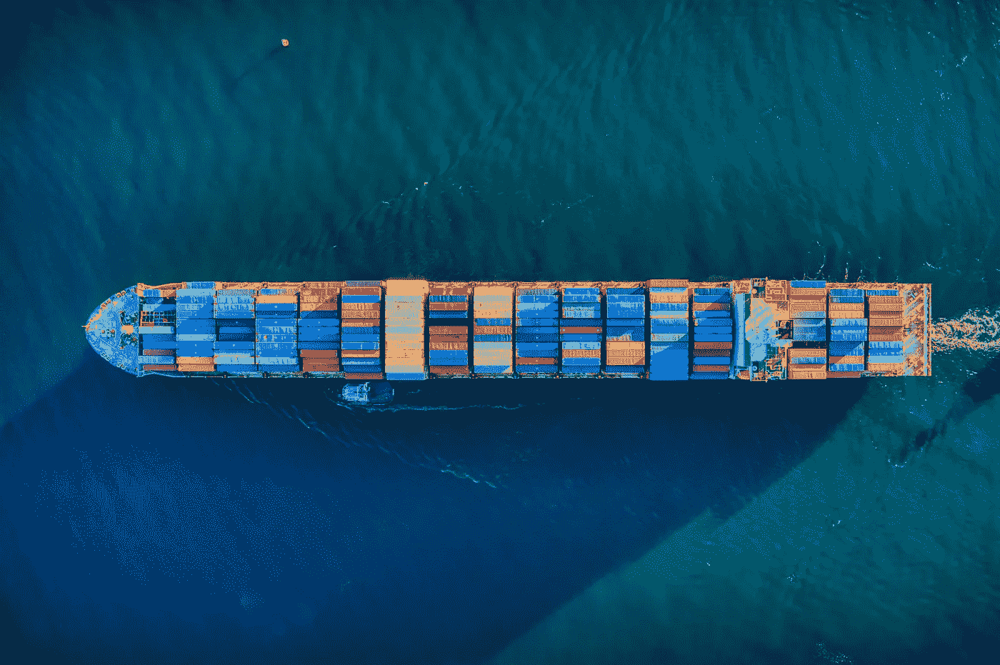
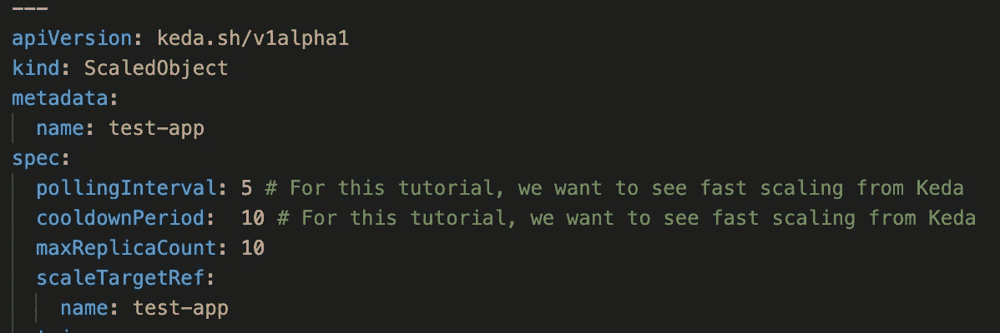
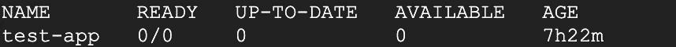
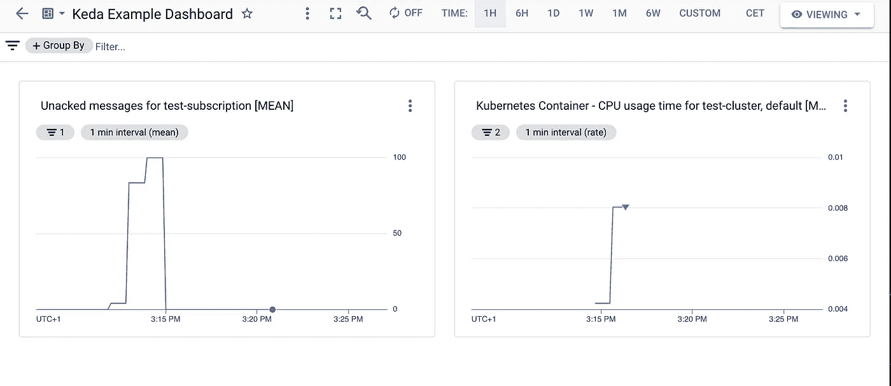

# 用 KEDA 和 GKE 自动驾驶仪调整到零

> 原文：<https://medium.com/google-cloud/scaling-to-zero-with-keda-and-gke-autopilot-36839f69b28b?source=collection_archive---------1----------------------->

GKE 自动驾驶仪是一项在云中运行工作负载的伟大技术。Google SREs 负责运营您的 Kubernetes 集群，而您可以专注于您的应用程序。当在 GKE 自动驾驶仪上构建事件驱动的应用程序时，你可能会体验到你运行了很多没有被充分利用的 pod。对于提供 HTTP API 或连接到发布/订阅的应用程序，您可以考虑使用云运行。但是如果您有一些其他的消息传递系统，那么动态扩展会变得更加困难。在这种情况下，如果您非常乐意从 1 扩展到无穷大，一种方法是水平 Pod 自动缩放。但是，如果您希望扩展到零，因为您的工作负载可能一天只处理几条消息，该怎么办呢？或者你有零星破裂？



在 [Unsplash](https://unsplash.com/s/photos/containers?utm_source=unsplash&utm_medium=referral&utm_content=creditCopyText) 上 [Venti Views](https://unsplash.com/@ventiviews?utm_source=unsplash&utm_medium=referral&utm_content=creditCopyText) 拍摄的照片

KEDA 是一个很好的工具。它类似于 HPA，但是有更多的选项可以根据队列中未确认消息的数量来调整大小。在本教程中，我们将设置一个简单的应用程序，使用来自发布/订阅的消息，并使用 KEDA 扩展 pod 的数量。(当然，对于发布/订阅，您可以使用云运行，但对于本教程，这是一个简单的设置)。

# 设置您的环境

接下来，您将设置环境，以便部署项目。

1.  [打开一个新的云 Shell 会话。](https://console.cloud.google.com/?cloudshell=true)
2.  *运行* `git clone [https://github.com/cgrotz/blog-examples](https://github.com/cgrotz/blog-examples).git`将源代码下载到您的云 shell。
3.  `cd ./keda-on-gke-autopilot`将目录切换到*教程*文件夹。
4.  设置所需的环境变量。将[REGION]替换为要在其中运行资源的区域，例如 europe-west1

```
export REGION=[REGION]
```

为了遵循本教程，您需要启用以下 API。

*   谷歌云 API
*   工件注册 API
*   Kubernetes 引擎 API
*   身份和访问管理(IAM) API
*   IAM 服务帐户凭据 API
*   云发布/订阅 API

您可以使用这个命令作为简写

```
gcloud services enable iam.googleapis.com
gcloud services enable compute.googleapis.com
gcloud services enable artifactregistry.googleapis.com
gcloud services enable container.googleapis.com 
gcloud services enable cloudapis.googleapis.com 
gcloud services enable iamcredentials.googleapis.com 
gcloud services enable pubsub.googleapis.com
```

# 用 KEDA 设置 GKE 自动驾驶仪

接下来，让我们创建一个 GKE 自动驾驶集群，并检索访问凭据。这可能需要一些时间，因此触发创建并获取一些咖啡:

```
gcloud container clusters create-auto test-cluster \
    --region $REGION \
    --project=$GOOGLE_CLOUD_PROJECT 
gcloud container clusters get-credentials test-cluster \
    --region $REGION \
    --project $GOOGLE_CLOUD_PROJECT
```

当 GKE 自动驾驶集群创建后，我们将把 KEDA 部署到集群中。

```
kubectl apply -f [https://github.com/kedacore/keda/releases/download/v2.5.0/keda-2.5.0.yaml](https://github.com/kedacore/keda/releases/download/v2.5.0/keda-2.5.0.yaml)
```

为了让 KEDA 跟踪发布/订阅队列中的未决消息，我们需要将 KEDA (keda-operator)的 Kubernetes 服务帐户(KSA)链接到一个拥有访问 Google 云监控权限的 Google 服务帐户(GSA)。

```
gcloud iam service-accounts create keda-operator --project $GOOGLE_CLOUD_PROJECT
```

授予云监控查看器访问 GSA next 的权限，并将服务帐户链接在一起。

```
gcloud projects add-iam-policy-binding $GOOGLE_CLOUD_PROJECT \
    --member "serviceAccount:keda-operator@$GOOGLE_CLOUD_PROJECT.iam.gserviceaccount.com" \
    --role "roles/monitoring.viewer"gcloud iam service-accounts add-iam-policy-binding keda-operator@$GOOGLE_CLOUD_PROJECT.iam.gserviceaccount.com \
    --role roles/iam.workloadIdentityUser \
    --member "serviceAccount:$GOOGLE_CLOUD_PROJECT.svc.id.goog[keda/keda-operator]" \
    --project $GOOGLE_CLOUD_PROJECTkubectl annotate serviceaccount keda-operator \
    --namespace keda \
    iam.gke.io/gcp-service-account=keda-operator@$GOOGLE_CLOUD_PROJECT.iam.gserviceaccount.com
```

# 部署演示应用程序

为了对 KEDA 进行测试，我们将部署一个简单的应用程序，它使用来自发布/订阅的消息并将它们记录到控制台。第一步是为容器映像创建一个工件注册库:

```
gcloud artifacts repositories create test-repo \
    --repository-format=docker \
    --location=$REGION \
    --project $GOOGLE_CLOUD_PROJECT
```

您需要为回购设置 Docker 凭据帮助器:

```
gcloud auth configure-docker $REGION-docker.pkg.dev
```

因为我们想要使用来自发布/订阅的消息，所以我们需要创建一个发布/订阅主题和订阅:

```
gcloud pubsub topics create test-topic --project $GOOGLE_CLOUD_PROJECT 
gcloud pubsub subscriptions create test-subscription --topic test-topic --project $GOOGLE_CLOUD_PROJECT
```

应用程序将需要一个服务帐户，该帐户有权使用来自发布/订阅的消息，并可用于工作负载标识:

```
kubectl create serviceaccount testapp --namespace defaultgcloud iam service-accounts create testapp --project $GOOGLE_CLOUD_PROJECTgcloud projects add-iam-policy-binding $GOOGLE_CLOUD_PROJECT \
    --member "serviceAccount:testapp@$GOOGLE_CLOUD_PROJECT.iam.gserviceaccount.com" \
    --role "roles/pubsub.subscriber"

gcloud iam service-accounts add-iam-policy-binding testapp@$GOOGLE_CLOUD_PROJECT.iam.gserviceaccount.com \
    --role roles/iam.workloadIdentityUser \
    --member "serviceAccount:$GOOGLE_CLOUD_PROJECT.svc.id.goog[default/testapp]" \
    --project $GOOGLE_CLOUD_PROJECT

kubectl annotate serviceaccount testapp \
    --namespace default \
    iam.gke.io/gcp-service-account=testapp@$GOOGLE_CLOUD_PROJECT.iam.gserviceaccount.com
```

部署应用程序之前的下一步是构建容器并将其推送到工件注册库:

```
docker build -t $REGION-docker.pkg.dev/$GOOGLE_CLOUD_PROJECT/test-repo/app:latest ./app
docker push $REGION-docker.pkg.dev/$GOOGLE_CLOUD_PROJECT/test-repo/app:latest
```

一切准备就绪，让我们部署应用程序:

```
envsubst < deployment.yaml | kubectl apply -f -
```

在本教程中，我们将缩放对象配置为快速缩放。



当您通过检查副本数量时，可以看到 KEDA 自动将副本数量缩减为零，因为订阅中当前没有等待处理的消息:

```
kubectl get deployments
```



在 GKE 的部署

# 发布一些消息

您可以通过重复使用 gcloud 来生成一些消息:

```
gcloud pubsub topics publish test-topic --message="Hello World" --project $GOOGLE_CLOUD_PROJECT
```

或者使用以下脚本一次生成 100 条消息:

```
./generate-message.sh
```

如果您再次检查部署，您应该看到 KEDA 增加了处理邮件所需的副本数量。您还可以部署这个漂亮的 Google Cloud Monitoring dashboard，它向您显示应用程序 pod 的 CPU 使用情况以及发布/订阅订阅中的未决消息。

```
gcloud monitoring dashboards create --config-from-file keda-tutorial-dashboard.yaml --project $GOOGLE_CLOUD_PROJECT --project $GOOGLE_CLOUD_PROJECT
```



就这样，现在您有了一个很好的消息消费者，它可以缩减到零。

如果您的工作负载是容错的，您可以做的一个优化是为您的部署启用 [Spot Pods](https://cloud.google.com/blog/products/containers-kubernetes/announcing-spot-pods-for-gke-autopilot) ，这样您可以从 GCP Spot 实例的低得多的价格中受益。为此，只需在`deployment.yaml`文件中的容器定义旁边添加以下内容。

```
nodeSelector:
  cloud.google.com/gke-spot: "true"
terminationGracePeriodSeconds: 25
```

`terminationGracePeriodSeconds`允许您在收到 SIGTERM 信号时优雅地关闭容器。