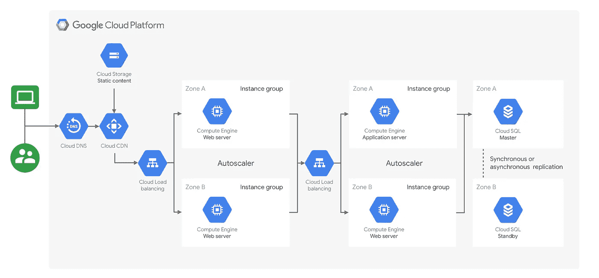
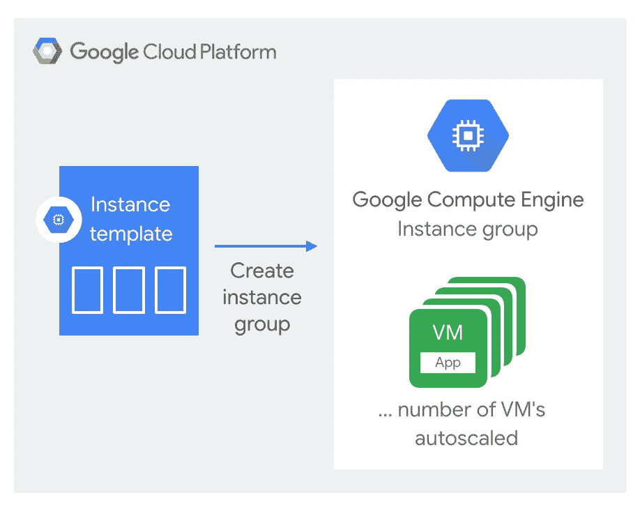
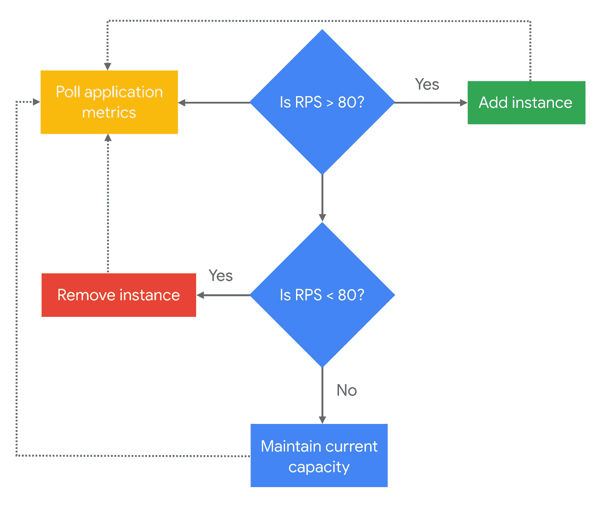
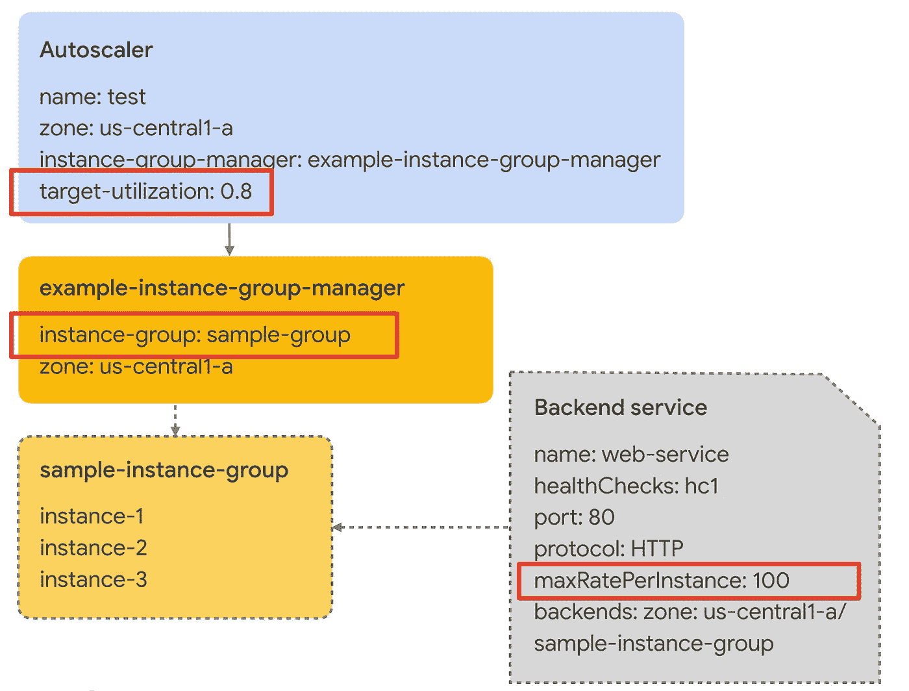
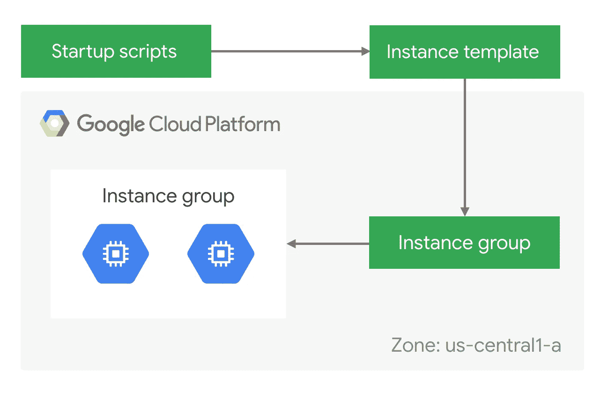
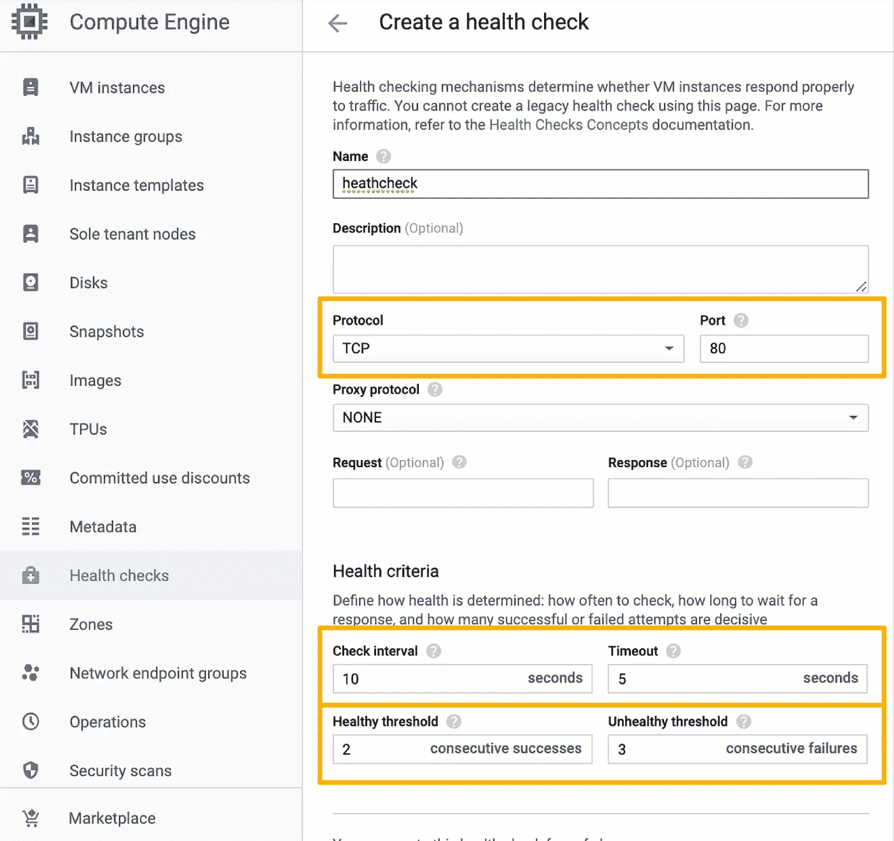

# 在谷歌计算引擎上扩展网络应用

> 原文：<https://medium.com/google-cloud/scaling-web-app-on-google-compute-engine-d21d6ce3e837?source=collection_archive---------0----------------------->

## 在云中烹饪

# 介绍

在这个迷你系列中，我们将介绍如何在谷歌云上创建网站。这是该系列的第五篇文章。

1.  [在谷歌云上托管网络应用:概述](/@pvergadia/hosting-web-applications-on-google-cloud-an-overview-46f5605eb3a6)
2.  [使用谷歌云存储在谷歌云上托管网络应用](/google-cloud/hosting-a-static-website-on-google-cloud-using-google-cloud-storage-ddebcdcc8d5b)
3.  [使用 Cloud Run 在 Google Cloud 上托管 web 应用](/google-cloud/hosting-a-website-on-google-cloud-using-cloud-run-a65343a98fce)
4.  [使用谷歌计算引擎部署网站的 5 个步骤](/@pvergadia/hosting-a-website-on-google-cloud-using-google-compute-engine-c6fe84d76f51)
5.  在 Google 计算引擎上扩展 Web 应用程序(本文)
6.  [案例研究](/faun/case-study-hosting-scalable-web-apps-on-google-cloud-c0bb675812c8)

在上一篇文章中，我们看到了一个使用 Google 计算引擎在 Google Cloud 上部署 web 应用程序和 web 服务器的示例架构。当您的网站变得受欢迎，用户从一百万增长到一百万时，这些实例通过使用实例模板随着请求的增加或减少而自动缩放。在本文中，让我们更深入地了解伸缩，并了解它是如何工作的。

使用 Google 计算引擎托管网站的示例架构

# 你会学到什么

*   通过五个简单的步骤，使用托管实例组创建网站。

# 先决条件

*   阅读[第一篇文章](/@pvergadia/hosting-web-applications-on-google-cloud-an-overview-46f5605eb3a6)，它涵盖了关于在 Google Cloud 上建立网站的高级概念。
*   查看之前关于使用谷歌计算引擎部署网站的 5 个步骤的文章。

# 看看这个视频

在 Google 计算引擎上扩展 Web 应用程序

# 什么是实例模板？

> 实例模板旨在创建具有相同配置的实例。

实例模板是一种资源，可用于创建虚拟机实例和托管实例组。实例模板定义机器类型、引导磁盘映像或容器映像、标签和其他实例属性。然后，您可以使用一个实例模板来创建一个[托管实例组](https://cloud.google.com/compute/docs/instance-groups/creating-groups-of-managed-instances)或者创建[单独的虚拟机实例](https://cloud.google.com/compute/docs/instances/create-vm-from-instance-template)。实例模板是保存虚拟机实例配置的一种便捷方式，因此您可以在以后使用它来创建新的虚拟机实例或虚拟机实例组。你可以在这里了解更多关于实例模板[的信息。](https://cloud.google.com/compute/docs/instance-templates/)

# 什么是托管实例组？

托管实例组(MIG)包含基于[实例模板](https://cloud.google.com/compute/docs/instance-templates)的相同实例。托管实例组通过主动保持实例可用(即处于`RUNNING`状态)来维护应用的高可用性。托管实例组支持[自动修复](https://cloud.google.com/compute/docs/instance-groups/autohealing-instances-in-migs)、[负载平衡](https://cloud.google.com/compute/docs/instance-groups/adding-an-instance-group-to-a-load-balancer)、[自动伸缩](https://cloud.google.com/compute/docs/autoscaler/)和[自动更新](https://cloud.google.com/compute/docs/instance-groups/rolling-out-updates-to-managed-instance-groups)。

# 自动缩放策略

> 自动缩放策略提供了一种根据需要添加或删除实例的方法。

自动缩放策略的影响是双重的:

*   您的用户在使用您的应用程序时会获得很好的体验，因为总是有足够的资源来满足需求。
*   您可以更好地控制成本，因为当需求低于指定阈值时，自动缩放会删除实例。

要创建自动缩放器，您必须指定自动缩放器用来确定何时缩放组的**自动缩放策略**和**目标利用率**级别。

您可以选择使用以下标准进行扩展，这可以基于利用率或每秒请求数:

*   平均 CPU 利用率
*   堆栈驱动程序监控指标
*   HTTP 负载平衡服务容量
*   网络负载平衡

自动缩放器根据策略持续收集使用信息，将实际利用率与您希望的目标利用率进行比较，并确定是否需要扩大或缩小组。

基于 CPU 利用率的自动扩展

例如，如果您基于 CPU 利用率进行扩展，您可以将您的目标利用率水平设置为 80%，autoscaler 将轮询 CPU 利用率并检查它是否> 80%，如果是，它会将新实例添加到实例组，如果 CPU 利用率< 80 then it removes an instance form the group, making sure the capacity is maintained.

# Autoscaling + Load Balancing

You can use autoscaling in conjunction with load balancing by setting up an autoscaler that scales based on the load of your instances.

For example, assume the load balancing serving capacity of a managed instance group is defined as 100 RPS per instance. If you create an autoscaler with the HTTP(S) load balancing policy and set it to maintain a target utilization level of 0.8 or 80%, the autoscaler will add or remove instances from the managed instance group to maintain 80% of the serving capacity, or 80 RPS per instance.

The architecture needs to automatically replace instances that have failed or have become unavailable. And when the new instance comes online it should:

*   Understand its role in the system
*   Configure itself automatically
*   Discover any of the dependencies
*   Start handling requests automatically

Automatically replacing instances

To replace a failed instance automatically, we can use several compute engine components together. You could create instance templates that use a public image and a startup script to prepare the instance after it starts running. But, we recommend that you use deterministic instance templates , which minimize risk and unexpected behavior from your instance templates.

Thanks to Managed Instance Groups, now we have a system that can replace unhealthy instances with new ones.

But, we still have a challenge, how are we going to know which instance to replace?

# Health Checks

In order to know which instance to replace, we need to define what is an unhealthy instance, and to do that, we use health checks! It is recommend that you use separate health checks for load balancing and for autohealing. Autohealing health checks are set up at the managed instance group level.

You create a health check that looks for a response on port 80 and that can tolerate some failure before it marks instances as unhealthy and causes them to be recreated.

In this example, an instance is marked as healthy if it returns successfully two times. It is marked as unhealthy if it returns unsuccessfully 3 consecutive times.

# Conclusion

You have learned some tricks to make a web architecture resilient by spinning up new instances and taking them down if computer resources fail or your traffic grows!

# Next steps

*   Follow this blog series on [Google Cloud Platform Medium](https://medium.com/google-cloud)。
*   关注[云烹饪](https://www.youtube.com/watch?v=pxp7uYUjH_M)视频系列，订阅谷歌云平台 YouTube 频道
*   想要更多的故事？查看我的[媒体](/@pvergadia/)，[在 twitter 上关注我](https://twitter.com/pvergadia)。
*   与我们一起享受这个系列的旅程，并了解更多关于 Google Cloud 的信息:)