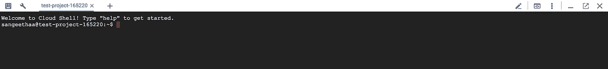

# 计划将 SFTP 镜像/同步到 GCS

> 原文：<https://medium.com/google-cloud/scheduled-mirror-sync-sftp-to-gcs-b167d0eb487a?source=collection_archive---------0----------------------->

# **语境**

应用程序通常需要松散耦合的文件共享系统。有时，数据文件需要在不共享存储基础架构的公司或公司内的团队之间共享。在这种情况下，SFTP 是常见的接口。

# **为什么要将文件同步到谷歌云存储？**

而 GCP 上的应用程序可以直接从 SFTP 服务器读取。但在某些情况下，将文件同步到 GCS 可能是首选方法。您考虑设置同步的原因:

*   应用程序的一致文件源
*   细粒度访问控制列表(ACL)
*   轻松的文件生命周期管理
*   减轻网络剥落

# 解决方案概述

*   GCS 用于在虚拟机上安装存储桶
*   安排 lftp 命令定期镜像文件
*   不需要编码，只使用工具。

# 我们开始吧

如果你还没有使用谷歌云，你可以前往 https://console.cloud.google.com 的[注册一个 300 美元起的免费账户。](https://console.cloud.google.com)

1.  打开云壳。



2.创建一个具有唯一名称的新存储桶。

```
gcs_bucket=”sftp_bucket_”$(python -c “import uuid; print str(uuid.uuid4())”)
gsutil mb gs://$gcs_bucket
```

3.创建新的虚拟机实例

VM 实例可以通过 UI 或 gcloud 命令创建，如下所示。
在 UI 中，将访问范围更改为访问范围- >存储- >满
或者从云外壳执行以下命令。

```
gcloud compute instances create sftp-test --zone=us-central1-c --machine-type=n1-standard-1 --subnet=default  --scopes=[https://www.googleapis.com/auth/cloud-platform](https://www.googleapis.com/auth/cloud-platform) --image-family=ubuntu-1604-lts --image-project=ubuntu-os-cloud --boot-disk-size=10GB --boot-disk-type=pd-standard --boot-disk-device-name=sftp-test
```

上述命令将在默认网络和子网中创建虚拟机。

4.SSH 进入虚拟机

在 SSH 的云 shell 中键入以下命令

```
gcloud compute ssh sftp-test
```

5.在虚拟机上安装 lftp

Lftp 工具是文件下载的瑞士军刀，它与包括 sftp 在内的许多协议一起工作。

```
sudo apt-get install lftp
```

6.在虚拟机上安装 gcsfuse

```
export GCSFUSE_REPO=gcsfuse-`lsb_release -c -s`
echo "deb http://packages.cloud.google.com/apt $GCSFUSE_REPO main" | sudo tee /etc/apt/sources.list.d/gcsfuse.list
curl https://packages.cloud.google.com/apt/doc/apt-key.gpg | sudo apt-key add -sudo apt-get update
sudo apt-get install gcsfuse
```

7.在虚拟机上装载存储桶

```
mkdir ~*/gcsBucket*
gcsfuse *<replace-by-bucket-name>* ~*/gcsBucket*
```

将<replace-by-bucket-name>替换为桶名(在步骤 2 中创建)。不要使用 gs://</replace-by-bucket-name>

8.计划 lftp 命令

假设 sftp 使用用户名和密码进行身份验证。如下创建脚本。

```
crontab -e
```

这将打开一个文件来调度 cron 作业。

```
0 0 * * * lftp sftp://*<username>*:*<password>*@*<sftp-server-ip/domain>*  -e "set sftp:auto-confirm yes;  mirror --verbose */path/on/sftp* ~/gcsBucket ;  bye"
```

上述作业安排在每天 00:00(基于虚拟机时区，通常为 UTC)。
将<用户名>替换为 sftp 用户名
将<密码>替换为 sftp 密码
将< sftp-server-ip/domain >替换为 sftp url/ip
将/path/on/sftp 替换为 sftp 服务器上的路径