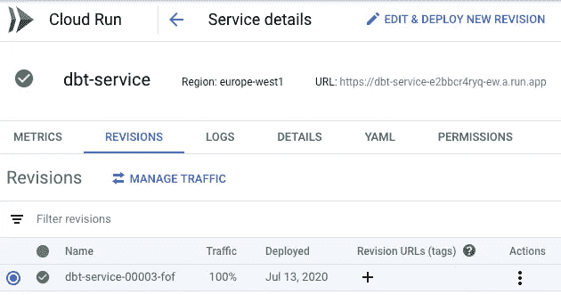
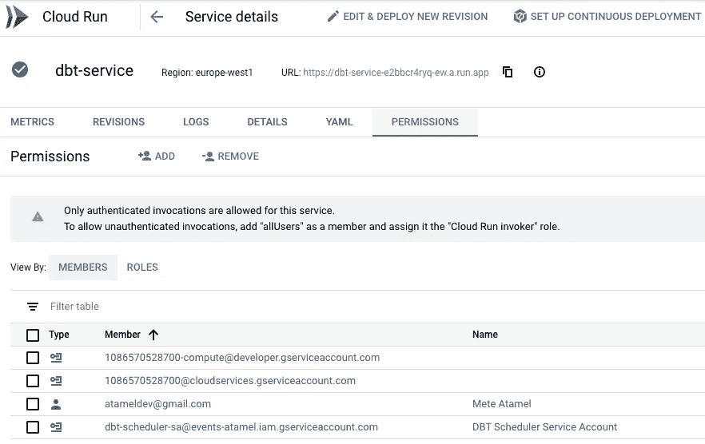
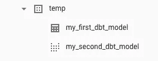

# 预定的无服务器 dbt + BigQuery 服务

> 原文：<https://medium.com/google-cloud/scheduled-serverless-dbt-bigquery-service-8cdca03ff238?source=collection_archive---------0----------------------->

我的同事 [Felipe Hoffa](https://twitter.com/felipehoffa) 最近发表了一篇名为[开始使用 BigQuery 和 dbt，简单的方法](/@hoffa/get-started-with-bigquery-and-dbt-the-easy-way-36b9d9735e35)的博客文章。更具体地说，他展示了如何在 Google Cloud Shell 中安装 [dbt](https://getdbt.com/) ，配置它并手动运行它以在 BigQuery 中创建临时数据集。这对于测试 dbt + BigQuery 非常有用，但是如何在生产中运行这种设置呢？

[dbt 文档](https://docs.getdbt.com/docs/running-a-dbt-project/running-dbt-in-production/)指出**在生产中运行 dbt 仅仅意味着设置一个系统来按计划运行 dbt 作业，而不是从命令行手动运行 dbt 命令。**

云壳只是云中的临时虚拟机，不适合生产工作负载。一个显而易见的解决方案是创建一个专用的 VM，安装 dbt，并在该 VM 上有某种 cron 作业来按计划运行 dbt。这是可行的，但是谁愿意维护虚拟机呢？更不用说，即使 dbt 没有运行，你也需要为每秒的 VM 付费。太浪费了。我们可以做得更好。

更好的解决方案是使用[云运行](https://cloud.google.com/run)。云运行是完全托管的，无需设置或维护虚拟机。它的定价模型是基于请求时间的，只有当 dbt 服务运行时你才会被收费。

在这篇博客文章中，我想向您展示如何获取 Felipe 的样本，并通过按计划将它作为无服务器云运行服务来运行，使其更适合生产。

# 挑战

将 dbt 作为云运行服务运行面临一些挑战，即:

1.  dbt 主要是一个命令行工具，而 Cloud Run 需要 HTTP 请求。如何从云运行服务调用 dbt 命令？
2.  云运行运行容器。如何在容器中运行 dbt？
3.  如何用 BigQuery 认证 dbt？OAuth 适用于最终用户，但对于运行在云中的服务，它可能不是正确的解决方案。

让我们按这个顺序来解决它们。

# 从云运行运行 shell 命令

Cloud Run 有一个关于如何从部署到 Cloud Run 的 HTTP 服务器运行 shell 命令的例子。它包括建立一个基于 Go 的 HTTP 服务器，该服务器在收到 GET 请求时简单地调用一个 shell 脚本。你可以在 [invoke.go](https://github.com/meteatamel/cloudrun-tutorial/blob/master/dbt/invoke.go) 中查看详情。

在我们的例子中，shell 脚本 [script.sh](https://github.com/meteatamel/cloudrun-tutorial/blob/master/dbt/script.sh) 简单地用概要文件文件夹调用 dbt:

```
#!/bin/sh dbt run --profiles-dir .
```

# dbt 的容器图像

dbt 有一些您可以依赖的[基础映像](https://hub.docker.com/r/fishtownanalytics/dbt/tags)(尽管文档几乎不存在)。在容器中，我们希望包含带有`script.sh`的 HTTP 服务器。我们还想包括 dbt 运行时。这是一个示例 [Dockerfile](https://github.com/meteatamel/cloudrun-tutorial/blob/master/dbt/Dockerfile) 的工作原理:

```
FROM golang:1.13 as builder
WORKDIR /app
COPY invoke.go ./
RUN CGO_ENABLED=0 GOOS=linux go build -v -o serverFROM fishtownanalytics/dbt:0.17.0
USER root
WORKDIR /dbt
COPY --from=builder /app/server ./
COPY script.sh ./
COPY dbt_project ./ENTRYPOINT "./server"
```

使用`gcloud`构建容器:

```
export SERVICE_NAME=dbt-servicegcloud builds submit \
  --tag gcr.io/$(gcloud config get-value project)/${SERVICE_NAME}
```

# 证明

默认情况下，Cloud Run 使用计算引擎默认服务帐户，该帐户应该能够进行 BigQuery 调用。但是，最佳实践是通过分配具有更多受限 IAM 角色的专用服务帐户，为您的云运行服务分配更细粒度的权限。

在我们的例子中，云运行服务将只与 BigQuery 对话，所以让我们创建一个具有`bigquery.admin`角色的服务帐户。您可能希望在生产中使用更细粒度的角色:

```
export SERVICE_ACCOUNT=dbt-sagcloud iam service-accounts create ${SERVICE_ACCOUNT} \
   --display-name "DBT BigQuery Service Account"gcloud projects add-iam-policy-binding \
  $(gcloud config get-value project) \
  --member=serviceAccount:${SERVICE_ACCOUNT}@$(gcloud config get-value project).iam.gserviceaccount.com \
  --role=roles/bigquery.admin
```

我们将在部署云运行服务时使用此服务帐户。

# 部署云运行服务

现在我们已经组装好了所有的组件，使用之前创建的服务帐户和`no-allow-unauthenticated`标记将它部署到 Cloud Run，使其成为私有服务:

```
gcloud run deploy ${SERVICE_NAME} \
    --image gcr.io/$(gcloud config get-value project)/${SERVICE_NAME} \
    --service-account ${SERVICE_ACCOUNT}@$(gcloud config get-value project).iam.gserviceaccount.com \
    --no-allow-unauthenticated
```

几秒钟后，您应该看到服务已部署并正在运行:



您还应该看到服务是私有的:



# 行程安排

最后一步是按计划调用云运行服务。您可以使用云调度程序来实现这一点。

首先，确保启用了云调度器 API:

```
gcloud services enable cloudscheduler.googleapis.com
```

使用`run.invoker`角色为云调度程序创建服务帐户:

```
export SERVICE_ACCOUNT=dbt-scheduler-sagcloud iam service-accounts create ${SERVICE_ACCOUNT} \
   --display-name "DBT Scheduler Service Account"
gcloud run services add-iam-policy-binding ${SERVICE_NAME} \
   --member=serviceAccount:${SERVICE_ACCOUNT}@$(gcloud config get-value project).iam.gserviceaccount.com \
   --role=roles/run.invoker
```

使用服务帐户创建云调度程序作业，以每 5 分钟调用一次云运行服务:

```
export SERVICE_URL="$(gcloud run services list --platform managed --filter=${SERVICE_NAME} --format='value(URL)')"gcloud scheduler jobs create http ${SERVICE_NAME}-job --schedule "*/5 * * * *" \
   --http-method=GET \
   --uri=${SERVICE_URL} \
   --oidc-service-account-email=${SERVICE_ACCOUNT}@$(gcloud config get-value project).iam.gserviceaccount.com \
   --oidc-token-audience=${SERVICE_URL}
```

要测试是否调用了服务并创建了临时 BigQuery 数据集，您可以手动触发作业:

```
gcloud scheduler jobs run ${SERVICE_NAME}-job
```

您应该看到在 BigQuery 控制台中创建了一个`temp`数据集:



就是这样。希望这篇博文能让你了解如何一起使用 dbt + BigQuery + Cloud Run。这是一个非常简单的 dbt 工作，但是同样的设置可以用于更复杂的场景。你可以查看我的[云运行教程](https://github.com/meteatamel/cloudrun-tutorial)和它的[预定云运行 dbt 服务的 BigQuery](https://github.com/meteatamel/cloudrun-tutorial/blob/master/docs/scheduled-dbt-service-bigquery.md) 部分，了解这篇文章的所有代码。

你可以在 Twitter [@meteatamel](https://twitter.com/meteatamel) 上联系我，或者阅读我以前在 [medium/@meteatamel](/@meteatamel) 上的帖子。

*最初发布于*[*https://atamel . dev*](https://atamel.dev/posts/2020/07-29_scheduled_serverless_dbt_with_bigquery/)*。*