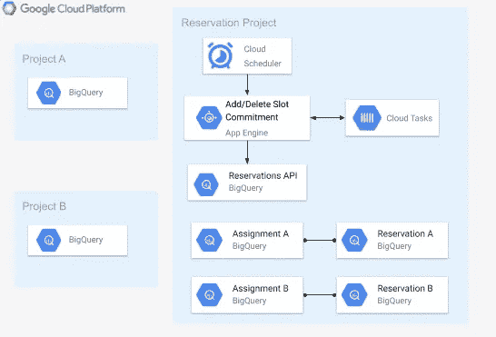

# 调度 BigQuery 槽

> 原文：<https://medium.com/google-cloud/scheduling-bigquery-slots-2a2beba42711?source=collection_archive---------1----------------------->

## 根据计划可靠地添加和删除短期时隙容量

跟进[早先关于通过客户端库创建和分配 Flex Slots 承诺的帖子](/google-cloud/optimize-bigquery-costs-with-flex-slots-e06ec5e4aa90)。已经在利用[统一费率定价](https://cloud.google.com/bigquery/pricing#flat_rate_pricing)的用户经常询问他们如何能够自动化[弹性时段](https://cloud.google.com/blog/products/data-analytics/introducing-bigquery-flex-slots)的购买以实现短期容量增加。

对于使用统一费率定价的组织来说，在关键的工作时间内，时隙调度是一种简单的增加容量的方法，同时确保了充分理解的成本上限。

对于其他常见的用例，如在复杂的 ELT 工作中减轻性能约束；相反，组织应该考虑在像 [Cloud Composer](https://cloud.google.com/composer) 这样的系统中，调用预订 API 来购买和删除承诺，作为作业编排的一部分。

这里有一个快速教程，不仅可以安排购买插槽承诺，还可以确保这些资源被干净地删除。

## 体系结构

*本指南描述了从本*[*GitHub repo*](https://github.com/pdunn/bq-slot-scheduler)*部署 App Engine 代码，这比云函数版本的代码*在部署和安全方面都更简单

架构非常简单。[云调度器](https://cloud.google.com/scheduler)用于调用 App Engine 中的添加容量端点，该端点购买承诺并使用[云任务](https://cloud.google.com/tasks)来调度容量的移除。然后，云任务将触发 App Engine 中的删除容量端点来删除指定的承诺。



## 理解代码

示例代码添加了额外的插槽，这些插槽将在管理项目中的预先存在的保留中自动共享。对于更高级的应用，代码可以很容易地调整现有[预留](https://cloud.google.com/bigquery/docs/reference/reservations/rest/v1/projects.locations.reservations)的时隙容量，或者修改甚至修改[分配](https://cloud.google.com/bigquery/docs/reference/reservations/rest/v1/projects.locations.reservations.assignments#resource:-assignment)。

**增加容量**

`add_capacity_request()`函数解析 json 有效负载，购买所需数量的承诺，如果成功创建了承诺，调度一个任务删除它。

app-engine-sched/main.py 中添加容量功能的摘录

add `add_capacity()`函数购买实际的承诺。该功能包括一个额外的检查来限制`add_capacity_request()`可以购买的总项目级别。如果`/add_capacity`端点被意外触发多次，或者团队管理员直接在控制台上购物。

app-engine-sched/main.py 中添加容量功能的摘录

添加容量执行流程的最后一部分是安排一个云任务来删除购买的承诺。该函数创建一个云任务，它将在指定的分钟数后调用该应用程序的`/del_capacity`端点。

app-engine-sched/main.py 中添加容量功能的摘录

**删除容量**

`delete_capacity_request()`功能比添加容量执行流程简单得多。json 负载被解析为完全限定的提交名，删除调用被执行。该函数没有其他副作用，只能影响指定的提交。

从 app-engine-sched/main.py 中删除容量函数

## 配置资源

*设置说明使用 gcloud CLI，但也可以使用 Terraform 或部署管理器。*

来自预订管理项目中的云外壳。

将目录克隆并更改到存储库中。

```
git clone [https://github.com/pdunn/bq-slot-scheduler.git](https://github.com/pdunn/bq-slot-scheduler.git)
cd bq-slot-scheduler/app-engine-sched/
```

在选定的 GCP 地区创建应用引擎环境，并创建云任务队列。

```
gcloud app create --region='us-central1'
gcloud tasks queues create commit-delete-queue
```

部署应用程序并[设置防火墙](https://cloud.google.com/appengine/docs/standard/python3/creating-firewalls#allowing_requests_from_your_services)以阻止外部访问。

```
#update app.yaml with project and queue name
vi app.yaml
gcloud app deploy
gcloud app firewall-rules update default --action=DENY
```

授予 app engine 服务帐户购买和删除槽承诺的权限。

```
SERV_ACCT=`gcloud iam service-accounts list --format="value(email)" | grep appspot.gserviceaccount.com`gcloud projects add-iam-policy-binding $DEVSHELL_PROJECT_ID \
--member="serviceAccount:${SERV_ACCT}" \
--role='roles/bigquery.resourceAdmin'
```

最后，配置云调度程序作业，以便在需要时增加容量。示例配置在星期一上午 9 点运行，并在 BigQuery US 地区部署 100 个额外的插槽，持续 3 个小时。

```
gcloud scheduler jobs create app-engine add-slots \
--schedule='* 9 * * 1' \
--http-method='POST' \
--relative-url='/add_capacity' \
--message-body='{"region":"US", "extra_slots":100, "minutes":180}'
```

## **结论**

如果您已经遵循了这些步骤，那么您应该有一个基本的调度系统来临时向您的管理项目添加插槽。

此外，本教程中使用的组件在 Google Cloud 控制台中有图形界面，可用于监控和调整应用程序的行为。