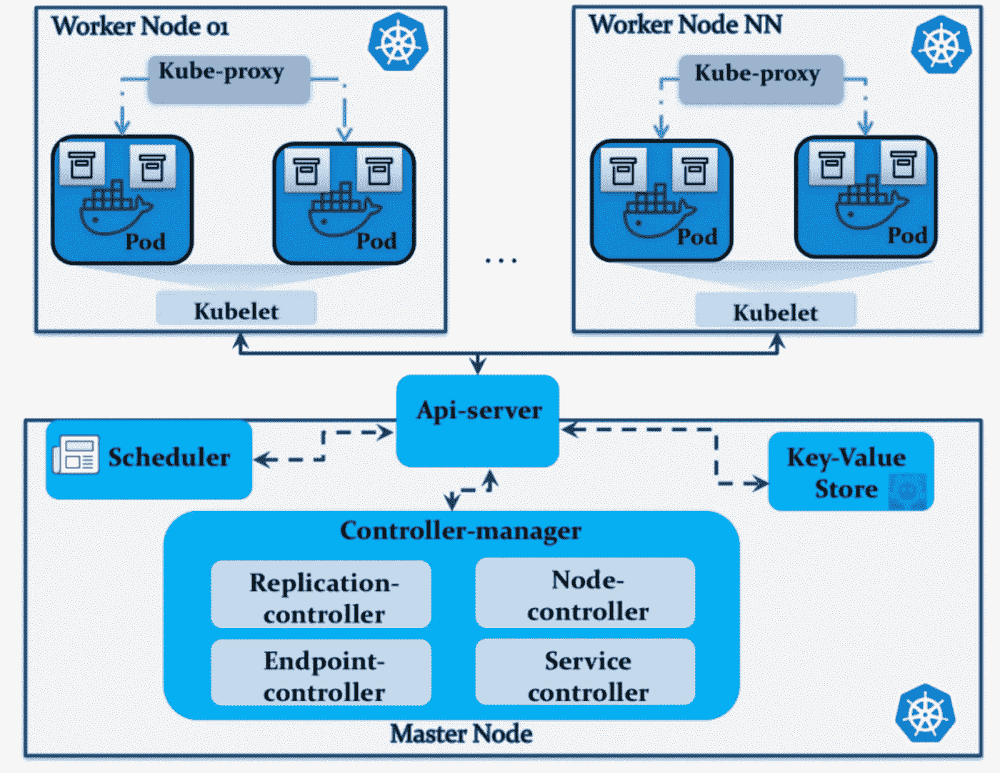
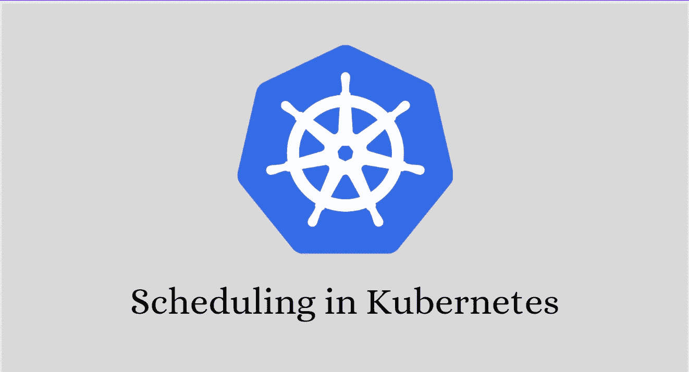
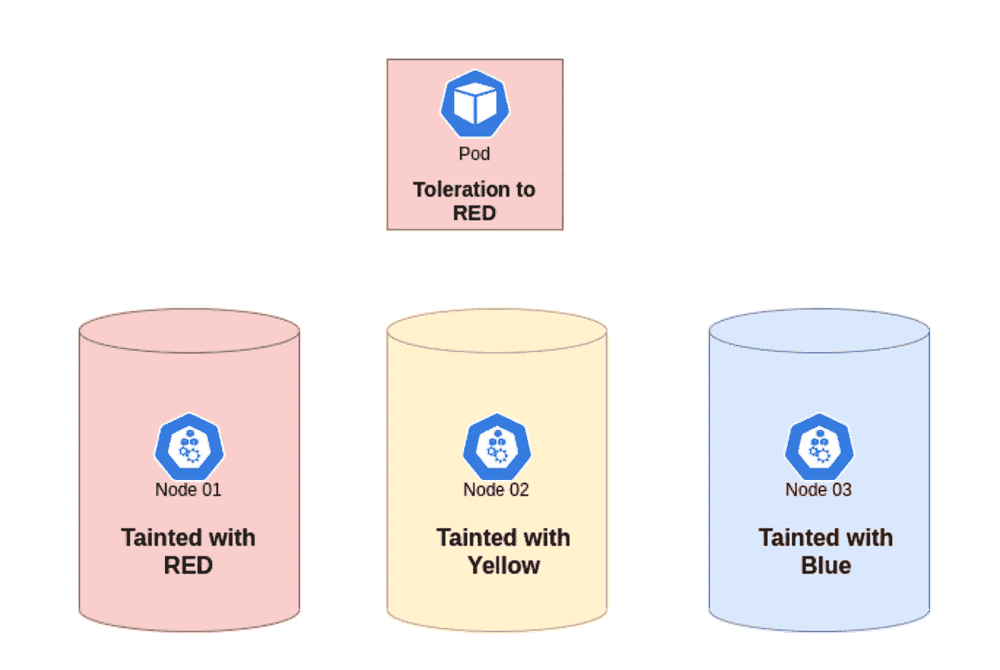
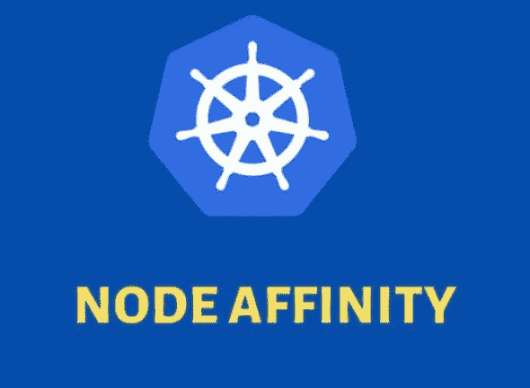

# kubernetes 的日程安排

> 原文：<https://medium.com/google-cloud/scheduling-in-kubernetes-9bc96c9008d8?source=collection_archive---------2----------------------->

Kubernetes 中的调度流程是如何工作的？？

## 介绍🚩🚩

各位读者好👋:)
我已经写了一段时间关于 Kubernetes 及其对象的基础知识。我觉得基础知识已经讲得很好了，现在是时候转向更高级的 Kubernetes 主题了。
其中一个话题是关于 Kubernetes 的排班流程。

***所以在本文中，我们将试着了解一下*** :

*   什么是调度程序？？
*   如何在 Kubernetes 中手动安排 pods？？
*   Kubernetes 的污染和容忍的概念。
*   Kubernetes 中节点亲和性的概念。

> **所以没有任何进一步的拖延，让我们开始吧:)】**

## 什么是调度程序？？🤔🤔



Kubernetes 集群架构

总的来说，调度器是一个帮助调度不同事情的组件。
**在 Kubernetes 的世界里，**调度器基本上是一个组件，它存在于集群的主节点中，被称为 **kube-scheduler** 。

一个 **kube-scheduler** 是一个控制平面组件，它将 pod 分配给节点。调度器根据约束和可用资源来确定哪些节点是调度队列中存在的每个 Pod 的有效放置。然后，调度器对每个有效节点进行排序，并将 Pod 绑定到合适的节点。

简单地说，Kubernetes 中的调度程序决定哪个 pod 将在哪个节点上运行。 ***(仅决定，不将 pod 放在该节点上)*** 对于该过程，它考虑 pod 的资源需求，如 CPU 或内存需求，以及节点的健康状况，然后决定将 pod 调度到哪里。

*** *注意:** *在同一个集群中也可以使用多个不同的调度器*

> 我们刚刚学习了**“Kubernetes 中的 kube-scheduler 是什么？?"但是问题来了，我们不能绕过这个 kube 调度程序，在我们想要的任何节点上以我们自己的方式手动调度 pod 吗？？**
> 
> 是的，我们可以手动安排它们。让我们在下一节中找出答案:))

## 如何在 Kubernetes 中手动安排 Pods？？🤔🤔



我们可以在我们想要的任何节点上手动安排我们的 pod。让我们看看它究竟是如何发生的。

每个 POD 都有一个名为`nodeName`的字段，默认情况下没有设置，kube-scheduler 会自行设置。因此，如果需要手动安排一个 pod，那么他们只需要在 spec 部分下的 pod 定义文件中设置`nodeName`属性。

> *** *注意:**上述方法仅在 pod 仍未创建时有效。如果 pod 已经创建并运行，那么这个方法就不起作用。

下面是一个 Pod 配置文件的示例，在这种情况下，需要在名为“node02”的节点上手动调度 Pod

> 看看下面文件中的`nodeName: node02` 属性。

```
apiVersion: v1
kind: Pod
metadata:
 name: nginx
 labels:
  name: nginx
spec:
 containers:
 - name: nginx
   image: nginx
   ports:
   - containerPort: 8080
 nodeName: node02
```

每当用户在 Pod 的配置文件中指定`nodeName`属性时。kube-scheduler 会检测到它，并接受用户的选择，在指定的节点中调度 Pod，而不是自己调度 Pod。简单:)

> 我们刚刚学习了 Kubernetes 中的**手动调度。但是出现的一个问题是，当我们使用 kube-scheduler 时，我们能不能不根据我们的需要，就像不根据 kube-scheduler 一样，来进行整个过程？？**
> 
> **是的，我们甚至可以在使用 kube-scheduler 来调度 pod 时指定我们的规则。**让我们在下一节中找出答案:)

## **Kubernetes**中的污点和宽容



库伯内特斯的污点和宽容

假设您是 Kubernetes 集群的管理员。现在你的工作是确保有时在一个特定的节点上只有一种特定的 Pod 应该被调度。如何才能实现这一点？？
库伯内特家族中**污点和宽容的概念由此而来。**

**让我们通过使用一些真实世界的实体来尝试理解整个概念:**

*   有三个节点“生产节点”、“开发节点”和“测试节点”
*   现在，管理员的职责是确保只有“生产单元”应该被安排在“生产节点”上，而不是其他。
*   因此，为了确保上述事情正确，管理员可以在“生产节点”上喷洒一个污点。
*   在给节点喷上污点之后，管理员接下来可以在“生产单元”上喷上对该污点的容忍。

> 简单来说，**污点就像一种驱蚊剂。如果我们在任何节点上喷洒污点，它将不允许任何 Pod 在其上被调度。
> **除非豆荚对喷在自己身上的**污点**有耐受性**。**

**可使用以下命令**指定“生产节点”上的污点:

```
kubectl taint nodes production-node app=red:NoSchedule
```

有 3 种污染效果

*   `NoSchedule`:表示不能容忍污点的 Pod 不能在污点节点上调度。
*   `PreferNoSchedule`:表示不能容忍污点的 Pod 不能被调度到污点节点上。但是如果没有其他选择，那么它可以被安排在受污染的节点上。
*   `NoExecute`:这意味着如果一个节点被感染，而一些吊舱正在其上运行。不能容忍这种污染的正在运行的 pod 将被逐出节点。

**可使用以下配置文件指定“生产舱”的容差:**

```
apiVersion: v1
kind: Pod
metadata:
 name: production-pod
spec:
 containers:
 - name: nginx-container
   image: nginx
 tolerations:
 - key: "app"
   operator: "Equal"
   value: "red"
   effect: "NoSchedule"
```

> 我们刚刚了解到库伯内特斯的**污染和宽容。
> 使用上述概念只能确保哪种类型的 pod 不能在节点上被调度。
> 
> 不保证一个 Pod 只被调度在某个节点上。
> 例如:有两个节点“红染”和“正常”。具有“红色耐受性”的 Pod 可以安排在两者上。我们该如何处理这种情况？？**让我们来了解一下:)

## Kubernetes 中的节点关联性



假设您是 Kubernetes 集群的管理员。现在，您的工作是确保您的 Pod 只在特定类型的节点上进行调度。
我们如何实现这一目标？？这里出现了 Kubernetes 中的**节点关联性的概念。**

**让我们试着理解当我们在 Kubernetes 中使用节点关联时会发生什么。**

*   管理员可以确保**标记**所有**节点**。标签例子可以是“大”、“中”、“小”等等。
*   然后，在创建 Pod 时，他们可以指定节点关联性规则，以指定他们希望调度该 Pod 的位置。

**一个 Pod 上的节点相似性规则必须在一个标记为中等的节点上进行调度，如下图所示**:

```
apiVersion: v1
kind: Pod
metadata:
 name: medium-pod
spec:
 containers:
 - name: data-processor
   image: data-processor
 affinity:
   nodeAffinity:
     requiredDuringSchedulingIgnoredDuringExecution:
        nodeSelectorTerms:
        - matchExpressions:
          - key: size
            operator: In
            values: 
            - Large
            - Medium
```

**有四种不同类型的节点关联类型**

**可用**

*   requiredduringschedulingignoredduringeexecution
*   schedulingignoredduringeexecution 期间首选

**计划好的**

*   在执行过程中需要
*   schedulingrequiredduringeexecution 期间首选

> 这样，通过使用**节点亲和规则**。实际上，我们可以让 pod 仅在特定类型的节点上进行调度。简单:)

## 接下来呢？👀 👀


> 非常感谢你来到这里！这是本文的结尾。
> 但我们只是触及了 K8s 生态系统的表面:)】
> 还有很多，这将是一次有趣的旅程，我们将一起学习许多很酷的东西。
> 
> 鼓掌，跟我来🙈如果你喜欢我的作品，并希望在未来更多地阅读我的作品:)

如果你对这篇文章有任何疑问，或者想聊聊天，请随时联系我的社交媒体账号

*推特—*[*https://twitter.com/ChindaVibhor*](https://twitter.com/ChindaVibhor)

*LinkedIn—*[*https://www.linkedin.com/in/vibhor-chinda-465927169/*](https://www.linkedin.com/in/vibhor-chinda-465927169/)

## 相关文章

[](/google-cloud/deploying-a-local-kubernetes-cluster-using-minikube-abe94a2c7583) [## 使用 Minikube 部署本地 Kubernetes 集群🚢 🚢

### 如何使用 Minikube 设置本地 Kubernetes 集群？？

medium.com](/google-cloud/deploying-a-local-kubernetes-cluster-using-minikube-abe94a2c7583) [](/google-cloud/kubectl-commands-101-bbeec4c83e45) [## Kubectl 命令 101📝📝

### 开始 k8s 之旅必须知道的基本 kubectl 命令

medium.com](/google-cloud/kubectl-commands-101-bbeec4c83e45) 

我仍然会继续发表新的文章，涵盖我正在探索的一系列主题。

那都是乡亲们！！涂鸦:))