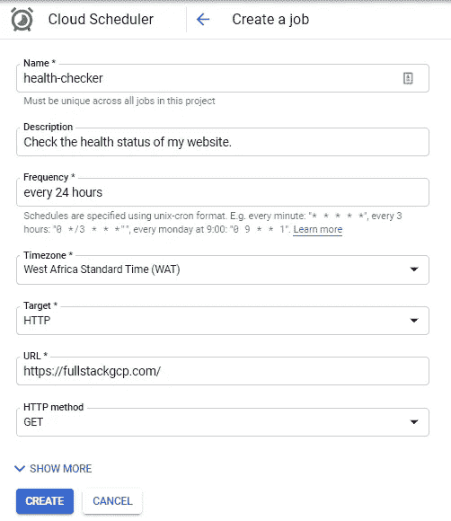

# 使用云调度程序调度周期性作业⏰

> 原文：<https://medium.com/google-cloud/scheduling-periodic-jobs-with-cloud-scheduler-259c6f8cd303?source=collection_archive---------3----------------------->

> 云调度程序是一个完全托管的企业级 cron 作业调度程序。它允许您安排几乎任何作业，包括批处理、大数据作业、云基础架构操作等。

自动化重复发生的任务无疑是每个软件开发人员的核心。谷歌云平台有一个工具，允许用户在保持通常的 unix-cron 格式的同时调度作业。
Cloud Scheduler 可以被称为 *Cronjob as a Service* 工具，它完全由谷歌云平台管理，因此您不需要管理调度程序的底层基础设施。

Cloud Scheduler 可用于多种用例，例如向 HTTP/S 端点发出请求、调用发布/订阅主题、进行数据库更新和推送通知、触发 CI/CD 管道、调度图像上传和发送电子邮件等任务，甚至调用云功能。
在本文中，我们将简单地使用 Cloud Scheduler 向 HTTP 端点发出简单的请求。

# 设置云调度程序

访问[云调度器](https://console.cloud.google.com/cloudscheduler)并点击 *➕创建作业*

*   输入作业名称
*   设置*频率*:每 24 小时
*   *目标*:选择 HTTP
*   设置 *URL* :(使用您的应用程序或功能 URL)
*   *HTTP 方法*:选择 GET

*您可以更改上面的值以适应您的使用情况。*

我写了一个工具，利用云调度器来保持无服务器服务的热度。

如果你在使用云调度程序时遇到 HTTP 头问题或其他问题，请随意查看[约翰·汉利的](https://twitter.com/NeoPrimeAws)关于[堆栈溢出的回答。](https://stackoverflow.com/search?q=user:8016720+[google-cloud-scheduler)

Cloud Scheduler 还可以与 Firebase Cloud Functions 一起使用，后者可以自动配置 Cloud Scheduler，以及一个发布/订阅主题，后者可以调用您使用 Firebase SDK 的 Cloud Functions 定义的函数。[阅读更多](https://firebase.google.com/docs/functions/schedule-functions)

此外，Stackdriver 与 Cloud Scheduler 集成，提供了*强大的日志记录*，以提高作业执行和性能的透明度。

# 定价

云调度器简单，按使用付费；在那里你为每月消耗的工作数量付费。谷歌云还慷慨地允许你每月创造 3 个免费工作，而你只为其他人每月 0.10 美元/工作

# 令人敬畏的资源

📖[云调度器文档](https://cloud.google.com/scheduler/docs/quickstart)
🔥[fireship](https://fireship.io/lessons/cloud-functions-scheduled-time-trigger/)t5】🕶️[谷歌云平台的预定云功能](https://github.com/GoogleCloudPlatform/awesome-google-cloud)