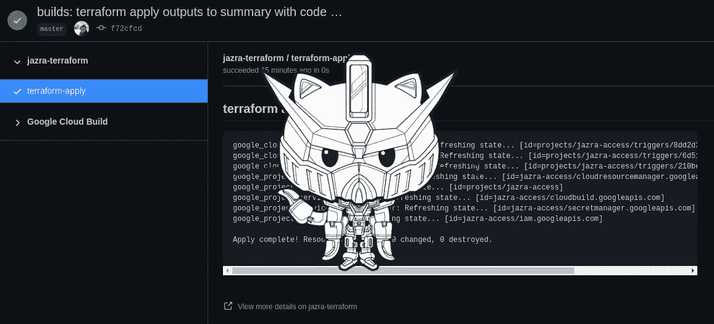
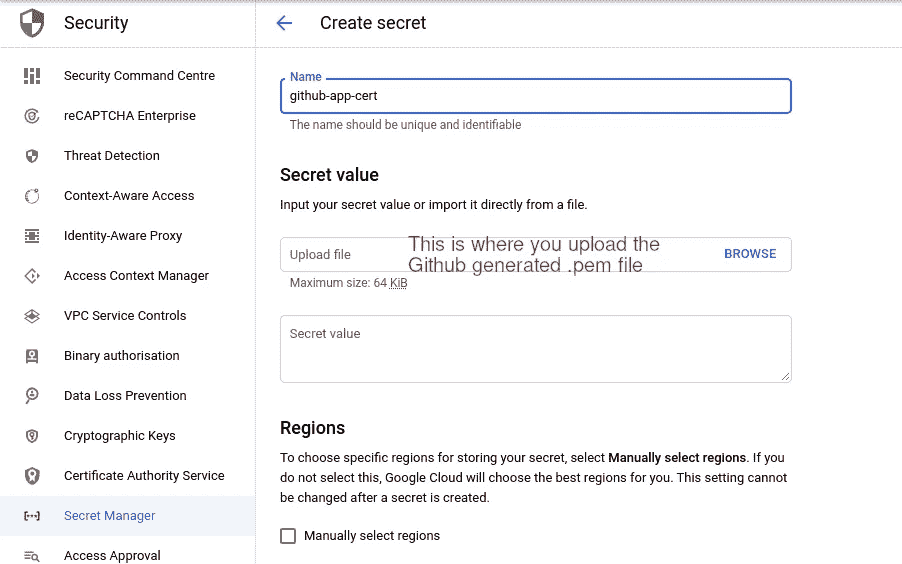
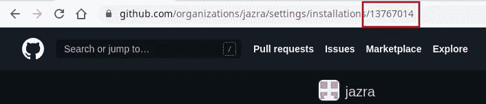
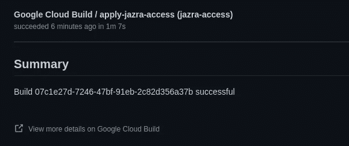
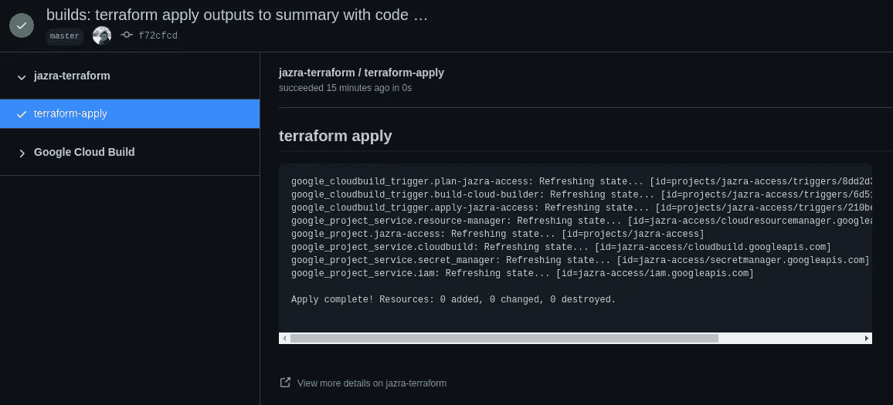

# 在 Google Cloud Build 中使用 Github Octokit 编写脚本

> 原文：<https://medium.com/google-cloud/scripting-with-github-octokit-in-google-cloud-build-583f9fe421fe?source=collection_archive---------2----------------------->

不久前，我写了如何通过谷歌云构建在拉式请求中发布 [Terraform 计划。如果你在寻找最简单的方式在 PR 中发表评论，这仍然是首选方式。](/google-cloud/terraform-plan-in-pull-requests-with-gcp-cloud-build-603790a2b734)

[](/google-cloud/terraform-plan-in-pull-requests-with-gcp-cloud-build-603790a2b734) [## 使用 GCP 云构建的拉式请求中的平台计划

### 运行 terraform 计划，并通过 Google Cloud Build 向您的 Github Pull 请求提交评论

medium.com](/google-cloud/terraform-plan-in-pull-requests-with-gcp-cloud-build-603790a2b734) 

但是说实话。在组织内部使用个人访问令牌？我敢打赌，在你点击“生成”按钮 3 秒钟后，你会有一个可怕的安全官员跟着你。

解决方案:**一个私人 Github App** 。使用 Github 应用程序会带来很多亮点:

*   每个 [API](https://docs.github.com/en/free-pro-team@latest/rest/reference) 的权限都是细粒度的。例如，你只能允许应用程序的*拉请求*API，而不是给它完全的`repo`访问权限
*   你可以通过官方支持的 [Octokit](https://octokit.github.io/rest.js/v18/) 直接使用 API
*   您可以选择应用程序应该可以访问哪些存储库
*   Github 应用程序通过一个. pem 证书来保护，Octokit 创建短期令牌(security++)

还有一点:**你可以用 JavaScript** 来编写这个构建器的脚本！



# 安装构建器

**编辑**:投稿已经合并。更新了以下安装步骤( [PR#472](https://github.com/GoogleCloudPlatform/cloud-builders-community/pull/472) ):

```
git clone https://github.com/GoogleCloudPlatform/cloud-builders-community.git
cd cloud-builders-community/octokit
gcloud builds submit --config=cloudbuild.yaml .
```

# 要求

在我们继续之前，请确保您具备以下条件:

*   Github 应用程序(个人或组织内)。使用[正式文件](https://docs.github.com/en/free-pro-team@latest/developers/apps/creating-a-github-app)创建新的正式文件
*   为 Github 应用程序生成的证书。[砸碎 Github 里的一些按钮](https://docs.github.com/en/free-pro-team@latest/developers/apps/authenticating-with-github-apps)
*   在 Github 应用程序中选择访问您的工作存储库(否则您将无法访问它)

# 在 GCP 境内保护证书

首先，一旦你生成了*。pem* 文件，打开你的秘密管理器，创建一个新的秘密。使用*上传文件*功能或打开文件并将其内容复制到*秘密值中。*其他一切都可以保持默认，除非你想调整它。



在秘密管理器中创建秘密

# 准备构建器

设置非常简单。构建器**自动认证你提供的 Github App** 。你需要:

*   **App ID** —转到 Github App 的*常规*标签，你会在*关于*部分下看到 ID
*   **安装 ID** —打开您的用户或组织的设置(无论您在哪里安装了 Github App)，*已安装 Github App>“配置”(在您的 App 上)。* 安装 ID 可以作为您浏览器 URL 的最后一个路由段找到



在配置过程中，可以在浏览器 URL 中找到安装 ID

有很多用例需要涵盖，从直接从 Github 获得更多元数据到在一次构建中创建自定义检查。您可能想要报告**对运行在一个构建中的不同类型的测试或模块的粒度检查**。

*现在的云构建不支持默认创建自定义构建* *摘要*，所以您的默认构建摘要很可能如下所示:



Github 中的云构建摘要

**让我们用`terraform apply`做一个我们自己的**(如果你想知道，Github CLI 没有办法做到这一点)。

# 编写 Octokit 构建器的脚本

在乐趣开始之前，**请阅读此**:

>构建器使用 **eval()** 来运行您的脚本。确保您没有运行公共 PRs 的构建器，也没有使用不可信的来源

`cloudbuild.yaml`将如下图所示。第一步应用 terraform(例如，当合并到 master 中时，或者在手动调用时)。第二步是将这张支票发送给 Github，并使其在摘要中可用。

```
steps:
  - name: 'gcr.io/$PROJECT_ID/terraform'
    entrypoint: 'bash'
    args: [
        '-c',
        'terraform init && terraform apply -auto-approve -no-color | tee apply.txt'
    ]
  - name: 'gcr.io/$PROJECT_ID/octokit'
    env:
      - "APP_ID=<app-id>"
      - "INSTALLATION_ID=<installation-id>"
      - "INSTALLATION_PK=sm://<link-to-your-secret>"
    args:
      - |-
        const applyContent = fs.readFileSync('./apply.txt', 'utf-8', 'r+');

        await octokit.checks.create({
          owner: '$_GITHUB_USER',
          repo: '$REPO_NAME',
          name: 'terraform-apply',
          head_sha: '$COMMIT_SHA',
          conclusion: 'success',
          output: {
            title: 'terraform apply',
            summary: `\`\`\`\n$${applyContent}\n\`\`\``
          }
        });
substitutions:
  _GITHUB_USER: <your-user-or-org>
```

**讲道理的评论:**

*   该脚本在一个`async`函数中执行，所以您想在承诺上使用`await`。(如果您不这样做，该步骤可能会退出，不会执行您的承诺)
*   您可以直接使用`fs`模块(已经包含了)并将`octokit`作为一个初始化的、经过验证的 [Octokit/rest](https://octokit.github.io/rest.js/v18#usage) 对象
*   如果需要，您可以从 Node.js 核心库中`require`任何东西

**一旦您将配置**提交到您的存储库中并调用它。您将很快在存储库中看到您的提交的构建，其摘要如下图所示:



构建通过后的 Github 构建摘要

# 使用文件进行最小化设置

如果您不喜欢内联脚本，您可以使用这个代码片段从一个文件运行您的脚本。**构建器检查文件存在的第一个参数**。

这种方法在两种主要情况下是最好的:

*   该脚本很大，您不希望它膨胀构建脚本
*   您想要多次重复相同的脚本

可以使用`env`变量对该脚本进行参数化。

*>你不能把任何标志或者进一步的参数传入脚本*。

```
steps:
  - name: 'gcr.io/$PROJECT_ID/octokit'
    env:
      - "APP_ID=<app-id>"
      - "INSTALLATION_ID=<installation-id>"
      - "INSTALLATION_PK=sm://<link-to-your-secret>"
    args:
      - script.js
```

# 奖励:在 PRs 上运行地形计划

如果你来自我之前的关于 Github CLI builder 的文章，我会留下一个片段，使用 Octokit 的方法创建一个新的 PR 评论。请记住:

*   确保你正在运行`gcr.io/$PROJECT_ID/octokit`
*   添加必要的`env`变量

```
const planContent = fs.readFileSync('./plan.txt', 'utf-8', 'r+');

await octokit.pulls.createReview({
  owner: '$_GITHUB_USER',
  repo: '$REPO_NAME',
  pull_number: '$_PR_NUMBER',
  event: 'COMMENT',
  body: `<details>
    <summary>Terraform Plan Results</summary>

  \`\`\`
  $${planContent}
  \`\`\`
  </details>`
});
```

**就是这样，乡亲们！**在云构建中享受全新的 Github 脚本体验。

PS:是的，builder 可以用在任何容器-原生 CI 中(甚至 Jenkins)。你只需要找到安全注射*的方法。来自 Github 的 pem* 文件。

如果你有任何问题，打我的推特给我