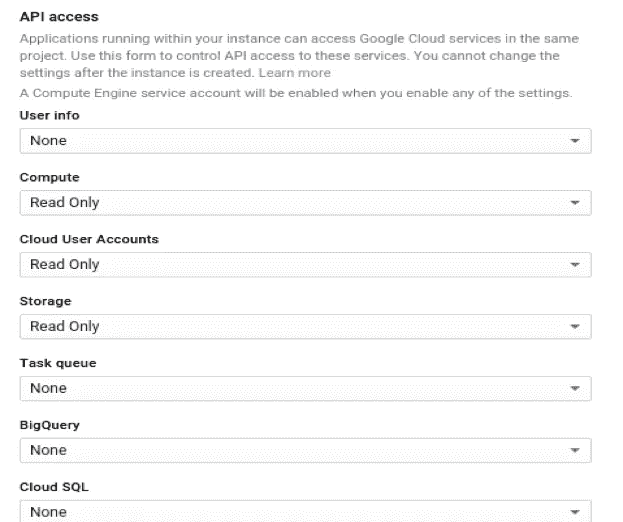
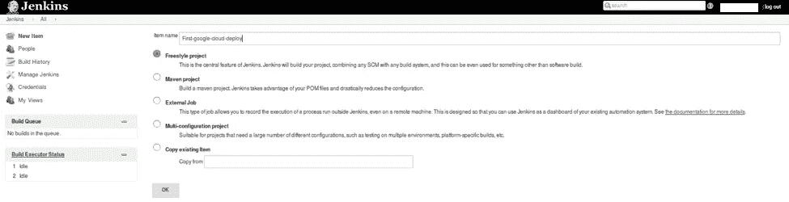
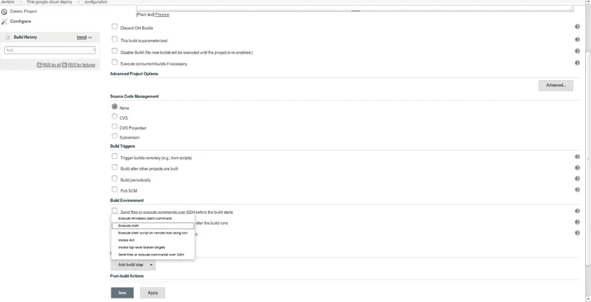
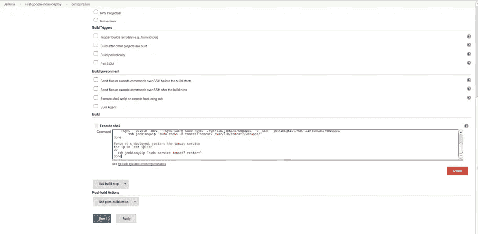
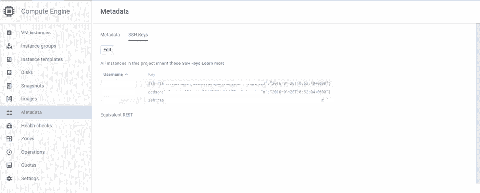

# 在自动扩展的实例组中无缝部署服务器。

> 原文：<https://medium.com/google-cloud/seamless-deployments-for-servers-in-an-autoscaler-group-of-instances-8b5cedc0aa5b?source=collection_archive---------0----------------------->

由 Powerupcloud 的高级云架构师 Roger 撰写。原载于 2016 年 2 月 1 日[*【blog.powerupcloud.com】*](http://blog.powerupcloud.com/2016/02/01/google-compute-engine-jenkins-deployments-for-autoscaler-servers/)*。*

如何无缝地部署到负载均衡器后面的一堆 web 服务器和自动缩放器的一部分？部署过程应该提取[实例组](https://cloud.google.com/compute/docs/instance-groups/)中的服务器列表，以确保由于扩展而出现的新实例也运行相同版本的代码。以下是解释设置小型 Jenkins 服务器和配置部署的步骤。本教程假设部署到 tomcat。

## 启动 Jenkins 服务器

登录控制台，为 Jenkins 启动一个小实例。确保使用 compute-ReadOnly 启用 API 访问。这使得在该实例上运行的应用程序可以与 API 交互，并获取有关实例组、列表 IP 等的信息。



## 安装詹金斯

```
apt-get update wget -q -O - [http://pkg.jenkins-ci.org/debian/jenkins-ci.org.key](http://pkg.jenkins-ci.org/debian/jenkins-ci.org.key) | apt-key add - echo deb [http://pkg.jenkins-ci.org/debian](http://pkg.jenkins-ci.org/debian) binary/ > /etc/apt/sources.list.d/jenkins.list apt-get update apt-get install jenkins
```

有时您可能会看到类似于*Jenkins E:Sub-process/usr/bin/dpkg 返回了一个错误代码(1)* 的异常，这可以使用 *sudo apt-get -f install* 来修复。对于其余的 jenkins 在 Ubuntu 上的设置，你可以遵循这个指南[。](https://wiki.jenkins-ci.org/display/JENKINS/Installing+Jenkins+on+Ubuntu)

在詹金斯创建第一个工作，去自由式项目，并给出一个参考名称，然后单击确定。



从“添加构建”步骤中选择执行外壳选项。



传递下面的脚本并点击保存选项。下面的脚本使用了 google cloud 命令行实用程序 gcloud。详情请查看评论。



单击 Save，build 就可以部署了！

## 先决条件

为 Jenkins 添加 ssh 密钥以登录到应用服务器实例，这可以使用计算引擎部分下的元数据从 google cloud 控制台完成。



Jenkins 服务器应该启用 api 访问，如本文开头所述。

部署时，服务器的 FTP 位置应该包含所有 WAR 文件和现有的 WAR，这样就不会与正在运行的文件冲突。

希望这有用。部署愉快！:)