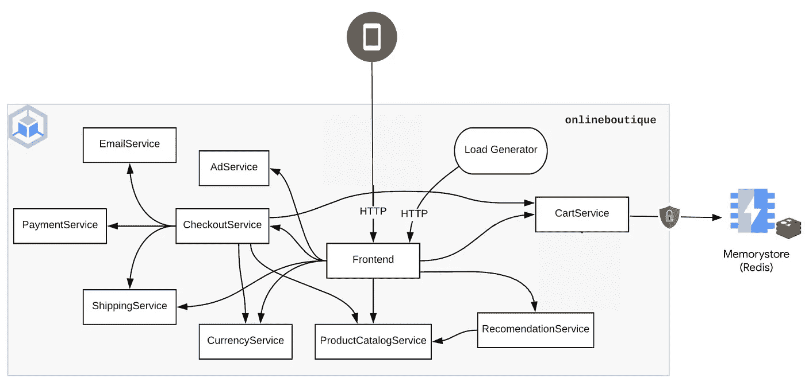

# 无缝加密从服务网格中的任何应用到 Memorystore (Redis)的流量

> 原文：<https://medium.com/google-cloud/seamlessly-encrypt-traffic-from-any-apps-in-your-mesh-to-memorystore-redis-64b71969318d?source=collection_archive---------0----------------------->

*2022 年 12 月 16 日更新，通过其* [*掌舵图*](/google-cloud/246119e46d53) *部署线上精品。*



使用 Memorystore (Redis)的在线精品示例应用程序架构

Anthos Service Mesh (ASM)是一个托管的 Istio 实现，可以[改善您的 Kubernetes 集群和应用的安全状况](https://cloud.google.com/service-mesh/docs/security/anthos-service-mesh-security-best-practices)。Istio 的目标是在没有任何配置的情况下为用户带来尽可能多的价值。除此之外，ASM 还简化了控制平面和数据平面的所有管理，以及与监控和日志记录的集成。毫无疑问，您网格中的应用将受益于流量加密、日志记录、追踪等高级功能。而无需更新应用程序的代码。

在本教程中，我们将看到通过利用 Istio/ASM 来加密从在线精品示例应用程序到 Memorystore (Redis)的流量是多么容易和无缝。为此，借助 Istio 配置，我们将在`cartservice`应用上设置 TLS 发起。

> 当 Istio 代理(边车或出口网关)被配置为接受未加密的内部 HTTP 连接，加密请求，然后将它们转发到使用简单或双向 TLS 保护的 HTTPS 服务器时，就会发生 TLS 发起。这与 TLS 终止相反，在 TLS 终止中，入口代理接受传入的 TLS 连接，解密 TLS，并将未加密的请求传递给内部网格服务。

# 目标

*   创建一个 Google Kubernetes 引擎(GKE)集群
*   使用集群内 redis 数据库部署在线精品示例应用程序
*   提供仅允许传输加密的 Memorystore (Redis)实例
*   将`cartservice`应用连接到 Memorystore (Redis)实例
*   在此集群上启用托管 Anthos 服务网格(ASM)
*   配置从`cartservice`应用程序到 Memorystore (Redis)实例的 TLS 发起
*   验证`cartservice`应用程序是否通过 TLS 与 Memorystore (Redis)实例成功通信

# 设置您的环境

这假设您已经创建了一个 Google Cloud 项目，我们将在这里提供本教程所需的所有资源。

初始化本教程中使用的通用变量:

```
PROJECT_ID=FIXME-WITH-YOUR-EXISTING_PROJECT-ID
REGION=us-east4
ZONE=us-east4-a
PROJECT_NUMBER=$(gcloud projects describe ${PROJECT_ID} --format='get(projectNumber)')
```

为了避免在整个教程中重复命令中的`--project`，让我们设置当前项目:

```
gcloud config set project ${PROJECT_ID}
```

# 启用所需的 API

```
gcloud services enable \
    redis.googleapis.com \
    mesh.googleapis.com
```

# 创建 GKE 集群

```
CLUSTER=redis-tls-tutorial
gcloud container clusters create ${CLUSTER} \
    --zone ${ZONE} \
    --machine-type=e2-standard-4 \
    --num-nodes 4 \
    --workload-pool ${PROJECT_ID}.svc.id.goog \
    --labels mesh_id=proj-${PROJECT_NUMBER} \
    --network default
```

# 部署在线精品示例应用程序

默认情况下，使用集群内 Redis 数据库部署在线精品示例应用程序:

```
NAMESPACE=onlineboutique
helm upgrade onlineboutique oci://us-docker.pkg.dev/online-boutique-ci/charts/onlineboutique \
    --install \
    --create-namespace \
    -n ${NAMESPACE}
```

所有应用程序成功部署后，您可以点击以下链接导航至在线精品网站:

```
echo -n "http://" && kubectl get svc frontend-external -n ${NAMESPACE} -o json | jq -r '.status.loadBalancer.ingress[0].ip'
```

# 提供仅允许传输加密的 Memorystore (Redis)实例

```
REDIS_NAME=redis-tls-tutorial
gcloud redis instances create ${REDIS_NAME} \
    --size 1 \
    --region ${REGION} \
    --zone ${ZONE} \
    --redis-version redis_6_x \
    --network default \
    --transit-encryption-mode SERVER_AUTHENTICATION
```

注意事项:

*   您可以从位于同一区域的 GKE 集群连接到 Memorystore (Redis)实例，并使用与您的实例相同的网络。
*   如果未启用 VPC 本地/IP 别名，则无法从 GKE 集群连接到 Memorystore (Redis)实例。
*   传输加密仅在创建 Memorystore (Redis)实例时可用。证书授权有效期为 10 年，[每 5 年轮换一次](https://cloud.google.com/memorystore/docs/redis/in-transit-encryption#certificate_authority_rotation)。

等待 Memorystore (Redis)实例成功预配，并获取刚刚预配的 Memorystore (Redis)实例的连接信息，我们将在以下部分需要这些信息:

```
REDIS_IP=$(gcloud redis instances describe ${REDIS_NAME} \
    --region ${REGION} \
    --format 'get(host)')
REDIS_PORT=$(gcloud redis instances describe ${REDIS_NAME} \
    --region ${REGION} \
    --format 'get(port)')
```

# 将在线精品示例应用程序连接到 Memorystore (Redis)实例

通过 Helm 图表更新在线精品店部署:

```
helm upgrade onlineboutique oci://us-docker.pkg.dev/online-boutique-ci/charts/onlineboutique \
    --install \
    --create-namespace \
    -n ${NAMESPACE} \
    --set cartDatabase.inClusterRedis.create=false \
    --set cartDatabase.connectionString=${REDIS_IP}:${REDIS_PORT}
```

这一部署将:

*   更新`cartservice`的环境变量以指向 Memorystore (Redis)实例；
*   移除不再需要的默认集群内`redis`数据库。

点击以下链接，浏览在线精品店网站:

```
echo -n "http://" && kubectl get svc frontend-external -n ${NAMESPACE} -o json | jq -r '.status.loadBalancer.ingress[0].ip'
```

此时，您应该有一个`HTTP Status: 500 Internal Server Error`页面。这是意料之中的，因为我们还没有在`cartservice`和 Memorystore (Redis)实例之间建立 TLS 通信。在接下来的部分中，我们将利用 ASM 和 Istio 来完成这一部分并解决问题！

# 在此集群上安装受管 ASM

将您的集群注册到一个[舰队](https://cloud.google.com/anthos/fleet-management/docs/fleet-concepts):

```
gcloud container fleet memberships register ${CLUSTER} \
    --gke-cluster ${ZONE}/${CLUSTER} \
    --enable-workload-identity
```

在您的[车队中启用 ASM](https://cloud.google.com/anthos/fleet-management/docs/fleet-concepts):

```
gcloud container fleet mesh enable
```

启用 ASM 自动控制平面管理，让 Google 应用 ASM 的推荐配置:

```
gcloud container fleet mesh update \
    --management automatic \
    --memberships ${CLUSTER}
```

# 配置从网格到内存存储(Redis)实例的 TLS 源

获取 Memorystore (Redis)实例的证书颁发机构:

```
REDIS_CERT=$(gcloud redis instances describe ${REDIS_NAME} \
    --region ${REGION} \
    --format 'get(serverCaCerts[0].cert)')
```

通过 Helm 图表更新在线精品店部署:

```
helm upgrade onlineboutique oci://us-docker.pkg.dev/online-boutique-ci/charts/onlineboutique \
    --install \
    --create-namespace \
    -n ${NAMESPACE} \
    --set cartDatabase.inClusterRedis.create=false \
    --set cartDatabase.connectionString=${REDIS_IP}:${REDIS_PORT} \
    --set cartDatabase.externalRedisTlsOrigination.enable=true \
    --set cartDatabase.externalRedisTlsOrigination.certificate="${REDIS_CERT}" \
    --set cartDatabase.externalRedisTlsOrigination.endpointAddress=${REDIS_IP} \
    --set cartDatabase.externalRedisTlsOrigination.endpointPort=${REDIS_PORT}
```

这一部署将:

*   注释`cartservice`部署通过其`istio-proxy`边车挂载`redis-cert`秘密；
*   部署一个`ServiceEntry`来注册 Mesh 中的 Memorystore (Redis)实例，作为具有私有 IP 地址和端口的外部端点；
*   部署一个`DestinationRule`来配置到这个 Memorystore (Redis)实例的传出连接，其中 TLS 处于`SIMPLE`模式(而不是`MUTUAL`)并带有相关的证书颁发机构。

给在线精品店`Namespace`贴上标签，在其应用中注入 Istio/ASM sidecar 代理:

```
kubectl label namespace ${NAMESPACE} istio-injection=enabled
```

等待 ASM 在集群上正确安装。运行以下命令，直到看到值为`REVISION_READY`的字段`servicemesh.controlPlaneManagement.details[].code`:

```
gcloud container fleet mesh describe
```

重启`cartservice`应用程序，以注入我们之前刚刚部署的 Istio/ASM 边车代理和配置:

```
kubectl rollout restart deployment cartservice \
    -n ${NAMESPACE}
```

*作为旁注，自从* [*在线精品 v0.38.0*](https://github.com/GoogleCloudPlatform/microservices-demo/releases/tag/v0.3.8) *之后，* `[*cartservice*](https://github.com/GoogleCloudPlatform/microservices-demo/pull/838)` [*app 得到了修复*](https://github.com/GoogleCloudPlatform/microservices-demo/pull/838) *允许让这个 TLS 发起正常工作。*

点击以下链接，浏览在线精品店网站:

```
echo -n "http://" && kubectl get svc frontend-external -n ${NAMESPACE} -o json | jq -r '.status.loadBalancer.ingress[0].ip'
```

就是这样！您现在应该看到在线精品网站再次成功运行，现在只通过 TLS 连接到 Memorystore (Redis)实例。恭喜你。

# 清理

为了避免向您的 Google Cloud 帐户收取费用，您可以删除本教程中使用的资源。

从[舰队中注销 GKE 集群](https://cloud.google.com/anthos/fleet-management/docs/fleet-concepts):

```
gcloud container fleet memberships unregister ${CLUSTER} \
    --project=${PROJECT_ID} \
    --gke-cluster=${ZONE}/${CLUSTER}
```

删除 GKE 群集:

```
gcloud container clusters delete ${CLUSTER} \
    --zone ${ZONE}
```

删除 Memorystore (Redis)实例:

```
gcloud redis instances delete ${REDIS_NAME}
```

# 下一步是什么

*   在 YouTube 上观看这一集 [ASM 值超过 Istio OSS](https://youtu.be/C1y_Ix3ws68) 集。
*   了解更多关于 ASM 安全最佳实践的信息。
*   在 YouTube 上观看这一集[与 GKE 和 ASM 一起构建零信任网络](https://youtu.be/D_TBDp9tK9w)
*   了解有关如何通过 ASM 和 Anthos 配置管理来[增强应用安全性的更多信息。](https://cloud.google.com/service-mesh/docs/strengthen-app-security)

*原帖*[*Mathieu-Benoit . github . io*](https://mathieu-benoit.github.io/)*。*