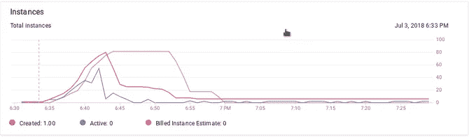

# 在谷歌云平台上搜索—应用引擎和搜索 API

> 原文：<https://medium.com/google-cloud/search-on-google-cloud-platform-app-engine-and-search-api-31cda6917bbf?source=collection_archive---------2----------------------->

我有几次遇到“在谷歌云平台上搜索”的话题，也就是人们问如何以不同的方式实现搜索的问题。不确定这是不是谷歌云测试或考试的一部分，但这是一个有趣的话题，GCP 提供了不同的方法来做这件事，所以我决定就这个话题做系列报道。所以在每篇文章中，我都想描述一种实现方式，以及代码解释和负载测试。

任务描述是这样的:“假设你是 eshop，你想实现你的产品描述功能的自动完成，所以当用户在搜索框中键入一些词，他们会得到包含这些词的产品。你如何在 GCP 上实现可伸缩性、快速性等……”

文本搜索本身是一个主要话题，它提供了不同的功能和方法，我不认为自己是一个专家，所以如果我遗漏了什么，请原谅我。

为了获得 Best Buy 在 github repository 上拥有的一些真实数据，其中包含大约 50000 种产品的数据。为了真正模拟我在 Kaggle 数据集[https://www.kaggle.com/c/acm-sf-chapter-hackathon-big/data](https://www.kaggle.com/c/acm-sf-chapter-hackathon-big/data)上发现的大 eshop(需要注册才能获得产品文件。)包含了超过百万的产品，这已经是一个很有趣的数字了。我写了一个小脚本来提取所有必要的信息，因为它是 xml 格式的，并且在多个文件中。我不会得到所有的数据，因为每个产品大约有 70 个字段。

所有代码都在 github.com[https://github.com/zdenulo/gcp-search](https://github.com/zdenulo/gcp-search)上，并且是用 Python 3 写的(有些代码只在 Python 2 中运行，就像这种情况)。

# 一般建筑

为了实现功能，我们需要一些输入字段前端输入文本将被搜索，然后显示结果。为此，我将使用 jQuery 自动完成库，该库通过输入查询向服务器发出请求，然后自动显示结果。

接下来，我们将需要一些后端服务器，我将使用谷歌应用引擎(GAE)(标准和灵活的，主要是灵活的)，因为它很容易部署和自动伸缩。

当然，我们还需要一些存储空间，用于存储产品的数据，以供搜索之用，这是本系列的全部精髓。事实是，电子商店有更复杂的数据库架构，但我在这里简化了，因为我们只对搜索功能感兴趣。通常情况下，你会有常用的东西(与产品相关的属性)存储在数据库中的某个地方，只有在搜索引擎和参考之间的搜索(产品名称)的东西。

# 提取信息。

从 Kaggle 网站下载 product_data.tar.gz 并解包后，运行脚本 extract_product_data.py 会将多个 xml 文件中的部分信息提取到一个 csv 文件中。每个产品有十几个字段，但我只保存了几个，也许我不会使用所有这些。显然，产品名称是最重要的。Csv 文件不包括在存储库中，因为它大约有 260MB 大:)。

# 前端

前端简单明了。

```
<!DOCTYPE html>
<html lang="en">
<head>
    <meta charset="UTF-8">
    <title>Autocomplete</title>
    <link rel="stylesheet" href="//code.jquery.com/ui/1.12.1/themes/base/jquery-ui.css">
    <script src="https://code.jquery.com/jquery-1.12.4.js"></script>
    <script src="https://code.jquery.com/ui/1.12.1/jquery-ui.js"></script>
    <script>
        $(function() {
            $("#search").autocomplete({
                source: function (request, response) {
                    $.ajax({
                        dataType: "json",
                        url: "/search",
                        data: {query: request.term},
                        success: function (data) {
                            response(data);
                        }
                    })
                },
                minLength: 2
            });
        });
    </script>
<body>
<div class="ui-widget">
    <form>
        <input type="text" id="search" size="55" >
    </form>
</div>

</body>
</html>
```

基本上就像我之前写的那样，我使用 jQuery 自动完成库，它只需很少的设置就可以自动查询/搜索 url，发送输入的查询并呈现接收到的结果。

# 搜索 API

正如我在开头所写的，我将使用的第一个服务/产品是搜索 API，它集成在谷歌应用引擎标准中。

搜索 API 的一些高级概述:

*   没有设置。喜欢的连单线，价值什么的都没有…惊艳:)。在应用程序的代码中，你需要用名字定义索引对象，基本上你需要为插入、查询等打包代码。
*   API 包含在 GAE 标准 SDK 中。不幸的是，搜索 API 不能在 GAE 标准之外使用(甚至不够灵活)。如果您想在 GAE 标准上创建应用程序并使用搜索 API，应该考虑到这一点。
*   我听说有计划将搜索 API 作为独立服务在 GAE 之外提供，但我不知道什么时候能实现。
*   每天有 0.25GB 存储数据、1000 次搜索查询和 0.01GB 添加到索引的数据的免费配额。
*   定价如下:10，0 00 次查询成本为 0.5 美元，存储成本为 0.18 美元/GB，数据索引成本为 2 美元/GB。
*   根据你的情况和预算，它可能有点贵，使用 memcache 服务来缓存结果，你可以减少搜索查询的数量。
*   关于伸缩性，每分钟最多有 100 分钟的查询执行时间(我承认我不明白这是什么意思)
*   数据需要保存在结构化文档中(有几种字段类型，如文本、数字、日期、地理、HTML、Atom)。文档可以包含多个字段。一个文档最多可以有 1MB。
*   文件需要存储在“索引”，每个项目可以有多个索引。对索引执行搜索查询。
*   您可以为文档提供 id，也可以自动生成。使用文档 id，您可以更新文档的字段值。
*   单个索引可以有 10GB 的最大大小，可以通过向 GCP 提交请求增加到 200GB，每个项目/应用程序可以有无限的索引。
*   每分钟添加的最大文档数为 15000(每秒 250)，但一次最多可插入 200 个文档(一个请求)。这对我们大约 100 万的产品上传有一定的时间影响。

## 搜索 API 查询

有许多有趣的搜索功能:

*   查询多个字段(使用布尔运算符)
*   地理查询，即根据纬度和经度在某个半径范围内搜索文档。当然，文档需要有 Geo 字段才能工作。
*   如果你有文本“google”的文档，搜索查询是“goo ”,它会返回结果，但是如果你搜索“ogl ”,它不会。
*   您可以从结果中创建片段，结果是包含查询字符串和周围文本的文本。
*   分面搜索—搜索查询可以返回子类别和文档数量，这可用于进一步细化搜索。
*   可以根据不同的属性对查询结果进行排序，比如搜索词频率。

# GAE 网络应用

我使用 App Engine，因为这是使用搜索 API 的唯一方法，但除此之外，它是轻量级的，易于部署，自动伸缩。

web 应用程序的代码在文件夹 [gae_search_api/webapp](https://github.com/zdenulo/gcp-search/tree/master/gae_search_api/webapp) 中。如前所述，应用程序运行在 GAE 标准(Python 2)上，我将解释最重要的部分。

py 包含了 SearchEngine 类，我将用它来包装所有与搜索相关的操作。

[search_api.py](https://github.com/zdenulo/gcp-search/blob/master/gae_search_api/webapp/search_api.py) 包含使用 Search API 实现 SearchEngine 类，这里是完整代码。

```
from search_base import SearchEngine

from google.appengine.api import search

class SearchAPI(SearchEngine):
    """GAE Search API implementation, can be used only withing GAE"""

    def __init__(self, client=None):
        self.client = search.Index('products')  # setting Index

    def search(self, query):
        """Making search with SearchAPI and returning result"""
        try:
            search_results = self.client.search(query)
            results = search_results.results
            output = []
            for item in results:
                out = {
                    'value': item.field('name').value,
                    'label': item.field('name').value,
                    'sku': item.field('sku').value
                }
                output.append(out)
        except Exception:
            output = []
        return output

    def insert(self, item):
        """Inserts document in the Search Index"""
        doc = search.Document(
            fields=[
                search.TextField(name='name', value=item['name']),
                search.TextField(name='sku', value=item['sku']),
            ]
        )
        self.client.put(doc)

    def insert_bulk(self, items):
        docs = []
        for item in items:
            doc = search.Document(
                fields=[
                    search.TextField(name='name', value=item['name']),
                    search.TextField(name='sku', value=item['sku']),
                ]
            )
            docs.append(doc)
        self.client.put(docs)

    def delete_all(self):
        while True:
            document_ids = [
                document.doc_id
                for document
                in self.client.get_range(ids_only=True)]

            # If no IDs were returned, we've deleted everything.
            if not document_ids:
                break

            # Delete the documents for the given IDs
            self.client.delete(document_ids)
```

没有太多要解释的，除了我只插入了两个产品字段 name 和 sku，我在文档中使用它们作为文本字段

Web 应用程序(文件 [main.py](https://github.com/zdenulo/gcp-search/blob/master/gae_search_api/webapp/main.py) )是用 Flask 编写的，它实现了一些通用的 URL，比如保存产品数据(因为我们只能在 GAE 应用程序中使用搜索 API)、搜索和删除，当然还有自动完成的 html 页面。

```
import logging

from flask import Flask, render_template, request
from flask.json import jsonify

from google.appengine.ext import deferred

from search_api import SearchAPI

app = Flask(__name__)

search_client = SearchAPI()

@app.route('/')
def index():
    return render_template('index.html')

@app.route('/search')
def search():
    """based on user query it executes search and returns list of item in json"""
    query = request.args.get('query', '')
    results = search_client.search(query)
    return jsonify(results)

@app.route('/upload', methods=['POST'])
def upload():
    """gets list of products and saves into search index"""
    json_data = request.get_json()
    search_client.insert(json_data)
    return 'ok'

@app.route('/upload_bulk', methods=['POST'])
def upload_bulk():
    """gets list of products and saves into search index"""
    json_data = request.get_json()
    logging.info("received {} items".format(len(json_data)))
    search_client.insert_bulk(json_data)
    return 'ok'

@app.route('/delete')
def delete():
    """deletes all items in search"""
    deferred.defer(search_client.delete_all)
    return 'ok'
```

要上传 GAE web 应用，你需要安装 [Cloud SDK](https://cloud.google.com/sdk/) 。在应用程序上传之前，您需要首先在本地安装一些库(这些库将随应用程序一起上传)。

在 webapp 文件夹中执行命令:

```
>pip install -r requirements.txt -t lib
```

在文件夹 [load_data](https://github.com/zdenulo/gcp-search/tree/master/gae_search_api/load_data) 中，有脚本 [upload.py](https://github.com/zdenulo/gcp-search/blob/master/gae_search_api/load_data/upload.py) 从 csv 文件中读取数据并向 GAE 应用程序发出请求。我们被限制为每个请求插入 200 个文档，因为我正在进行批量导入，每秒 250 个文档，所以我在一个请求中发送 200 个产品，并稍作停顿。我不记得上传所有数据花了多长时间，但是大概 3 个小时或者更久。我估计每生上传一次是没问题的。

现在，如果您上传了应用程序和数据，您可以尝试在应用程序的 url 上搜索:


Search API 返回包含单词“mouse”的产品名称的 20 个结果(默认数量)。它支持分页，即继续获得更多的结果，可以作为额外的功能实现。此外，这将是一个伟大的分面搜索的情况下，允许细化搜索结果。也许在其他文章中，我可以创建分面搜索的例子。

# 负载测试

当然，在你的 webapp 上作为单个用户玩没有问题，看看搜索如何对多个用户做出反应会很有趣。这就是为什么我将使用分布式负载测试使用 kubernetes 和负载测试框架 [Locust](https://locust.io/) 基于本文[https://cloud . Google . com/solutions/distributed-load-testing-using-Kubernetes](https://cloud.google.com/solutions/distributed-load-testing-using-kubernetes)本文中引用的 Github 库已经过时(Kubernetes 版本)，所以我使用的是这个[https://Github . com/fawaz-MOH/distributed-load-testing-using-Kubernetes](https://github.com/fawaz-moh/distributed-load-testing-using-kubernetes)。

在负载测试文件夹中是设置负载测试所需的一切。这也是几个步骤的努力，我将尝试简单地解释如何设置它。首先，我们将创建 Docker 映像，它将包含用于负载测试的 Locuts 文件(我不会详细介绍)。然后，我们将在 Google Kubernetes 引擎上创建 Kubernetes 集群，部署 Docker 映像并启动负载测试，该测试将发出请求并统计响应时间。一步一步的过程在负载测试文件夹中的自述文件中有解释，所以我在这里不再赘述。

我用蝗虫框架所做的是，我从产品名称中解析单词，并使用它们进行搜索查询。Locust 配置允许设置孵化率(每秒添加的用户数)和最终用户数。所以每个用户都在 1 到 5 秒内发出请求。

群集默认有 3 个 n1-standard-1 虚拟机类型的节点，我使用 preemptible 来节省资金:)。这允许设置 12 个将发出请求的从设备。这里有一些图表和统计数据。

这是每秒请求数的图表，因为它最终显示为大约 630 RPS，这是一个不错的负载。整个负载测试持续了大约 10 分钟。


平均响应时间各不相同，您可以看到，由于创建新的实例来服务请求，开始时响应时间会更长。用户数量呈线性增长。


统计数据也很有趣，在 286119 个请求中，只有 3 个错误，平均响应时间为 57 毫秒，平均 181 毫秒。


这也是 GAE 仪表板的屏幕截图，其中显示了一段时间内的实例数量。



最后摘录日志。


这个负载测试的目的是演示搜索 API 如何扩展到一个用户以上的负载，并与 App Engine 一起毫无问题地处理。这场比赛花了我 16 美元。

官方文档[https://cloud . Google . com/app engine/docs/standard/python/search/](https://cloud.google.com/appengine/docs/standard/python/search/)中有更详细透彻的描述和示例。

总之，Search API 具有强大的搜索功能，不需要任何配置就可以很容易地直接在代码中使用它。不利之处可能是(视情况而定)较高的价格，并锁定在 GAE 标准之下。

在下一篇文章中，我们将看看云数据存储，看看我们如何使用它来进行文本搜索查询。

我正在发布关于 https://www.gcpweekly.com/[谷歌云平台](https://www.gcpweekly.com/)的每周简讯。如果您想在每周一收到与 GCP 相关的新闻和文章，请订阅