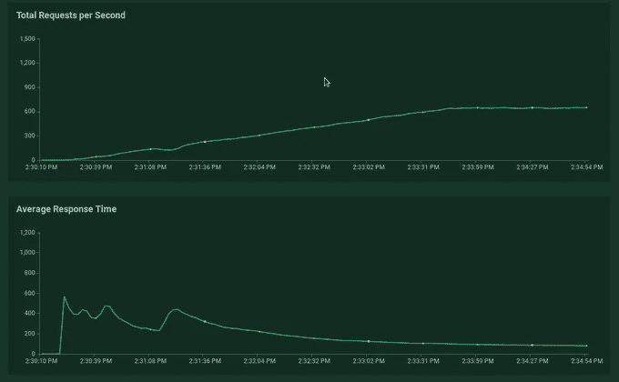

# 搜索谷歌云平台—云数据存储

> 原文：<https://medium.com/google-cloud/search-on-google-cloud-platform-cloud-datastore-615c14cb1bb?source=collection_archive---------2----------------------->

在之前的[文章](/google-cloud/search-on-google-cloud-platform-app-engine-and-search-api-31cda6917bbf)中，我描述了如何使用谷歌云平台产品实现搜索功能(针对 eshop 或类似产品)的简化解决方案，即使用作为谷歌应用引擎标准一部分的搜索 API。在本文中，我将描述使用云数据存储作为存储的解决方案。大多数介绍性的解释都写在以前的文章中，因此我在这里只着重描述搜索功能的实现。

提醒一下，任务描述是这样的:“假设你是 eshop，你想实现你的产品描述功能的自动完成，所以当用户在搜索框中键入一些词，他们会得到包含这些词的产品。你如何在 GCP 上实现可伸缩性、快速性等……”

这个例子和之前的例子都在 [Github](https://github.com/zdenulo/gcp-search/tree/master/cloud_datastore) 上。

# 云数据存储

云数据存储是 NoSQL 数据库，于 2008 年作为谷歌应用引擎的一部分首次推出，随后于 2013 年作为独立产品在谷歌云上推出。因为它是 NoSQL，这意味着它是可伸缩的，但是与 SQL 数据库相比有一些限制。与文本搜索最显著相关的事实是，不可能进行“LIKE”或正则表达式查询，这种查询进行部分文本匹配，并适合我们的文本搜索。这意味着，如果你想查询和做文本搜索，它需要完全匹配。这意味着将需要一些定制和手工工作来准备可搜索的数据。

数据存储的一些属性:

*   NoSQL 暗示了一些限制:
*   对于您想要执行的每个查询，都需要有索引
*   支持交易
*   基本上没有存储的限制
*   付费使用模式:50k 读取 0.06 美元，20k 写入 0.18 美元，20k 删除 0.02 美元，存储 0.18 美元每 1GB，每日免费配额。
*   有用于本地开发的模拟器
*   有一些编程语言的客户端库可供访问，或者可以从 Google App Engine Standard 访问。

## 模型

我再次使用谷歌应用引擎标准与 Python。正如我提到的，数据存储 API 是 GAE SDK 的一部分，即它的使用非常简单，特别是与 NDB 库(还有官方的 python 客户端库[https://Google cloud platform . github . io/Google-cloud-python/latest/Datastore/client . html](https://googlecloudplatform.github.io/google-cloud-python/latest/datastore/client.html)，可以在任何地方使用)。所以我创建的数据库模型看起来像这样:

```
class Product(ndb.Model):
    """Datastore model representing product"""
    partial_strings = ndb.StringProperty(repeated=True)
    product_name = ndb.StringProperty()
    price = ndb.FloatProperty()
    url = ndb.StringProperty()
    type = ndb.StringProperty()

    def _pre_put_hook(self):
        """before save, parse product name into strings"""
        if self.product_name:
            product_name_lst = regex_replace.sub(' ', self.product_name.lower()).split(' ')
            product_name_lst = [x for x in product_name_lst if x and len(x) > 2]
            self.partial_strings = product_name_lst

    @classmethod
    def search(cls, text_query):
        words = text_query.lower().split(' ')
        words = [w for w in words if w]
        query = cls.query()
        for word in words:
            query = query.filter(cls.partial_strings == word)
        return query.fetch(20)

    @classmethod
    def create(cls, item):
        """Create object"""
        key = ndb.Key(cls, int(item['sku']))
        obj = cls(key=key, price=float(item['price']), product_name=item['name'], url=item['url'], type=item['type'])
        return obj
```

我添加了一些额外的字段，如价格、类型、url…就像我在数据存储中编写的文本搜索需要额外的定制才能正常工作，因此步骤如下:

*   在 pre_put_hook 方法(在保存实例之前执行)中，我执行基本的文本拆分。我用空格分割产品名称，并删除长度小于 2 的单词，因为我不想查询这些单词。我将这个单词列表设置为变量 partial_strings。数据存储允许包含对象列表的字段，并且这些字段可以根据列表中的内容进行查询。
*   在创建方法中，我使用 sku 作为实体的 id (key)。
*   在搜索方法中，我将文本拆分成单词，并动态创建数据库查询和过滤器来获取实体。因此，对于文本“鼠标键盘”，数据库查询将如下所示:product . query(Product.partial_strings ==“鼠标”，product . partial _ strings = =“键盘”)，并将返回名称中同时包含单词“鼠标”和“键盘”(或其他一些单词)的产品。现在的做法是匹配精确的单词。当然，只需几行代码，就可以对产品名称中的单词进行标记，以便匹配部分单词。类似这样的事情是可行的:
*   name = " mouse keyboard " partial _ strings =[]for word in name . split('):for I in range(3，len(word)+1):partial _ strings . append(word[0:I])print partial _ strings[' mou '，' mous '，' mouse '，' key '，' keyb '，' keybo '，' keyboa '，' keyboar '，' keyboard']
*   因此，现在它也可以匹配文本“牟”，即允许更敏感的搜索。

关于后端和数据上传，一切都或多或少与前一篇文章相同。从 csv 文件上传 1.2M 行花了 2.5 个小时，我用与搜索 API 类似的方式做了这件事，尽管对于数据存储没有关于操作频率的限制。如果我使用并发请求，速度可能会更快，但是这次我没有考虑这个问题。


# 负载测试

使用与上例相同的配置，每秒 10 个用户的孵化率需要几分钟才能达到 2000 个用户，并且仍然可以在最大用户数下运行几分钟。它发出了大约 165，000 个请求，平均时间为 69 毫秒，中位数为 38 毫秒。总体数据存储看起来比存储 API 更快。这可能与数据存储区的获取时间与其检索的对象数量有关的事实有关，如果它不检索任何或很少对象，它可能会更快。经过测试后，我意识到在上传过程中，我删除了字母数字字符，并在负载测试中使用这些字符作为输入，在这些情况下，它不会返回结果。当然，在这种情况下，一些缓存可以加快响应速度。


显示每秒总数和平均响应时间发展的图表。



和用户数量。


日志


通过测试的谷歌应用引擎实例数。


这项测试的总成本约为 4 美元。所有都与数据存储相关，1.89 美元的 107 万次写操作和 2.13 美元的 360 万次读操作，App Engine 是免费的，负载测试 Kubernetes Cluster I 不算在内。

总之:数据存储是文本搜索的可行选择，尽管它的文本搜索能力有限，但它更容易与其他可能的数据库模型集成。

我正在发布关于谷歌云平台[https://www.gcpweekly.com/](https://www.gcpweekly.com/)的每周简讯。如果您想在每周一收到与 GCP 相关的新闻和文章，请订阅