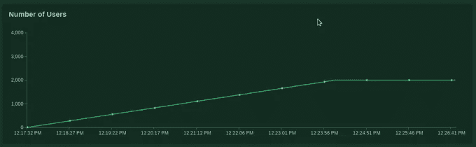
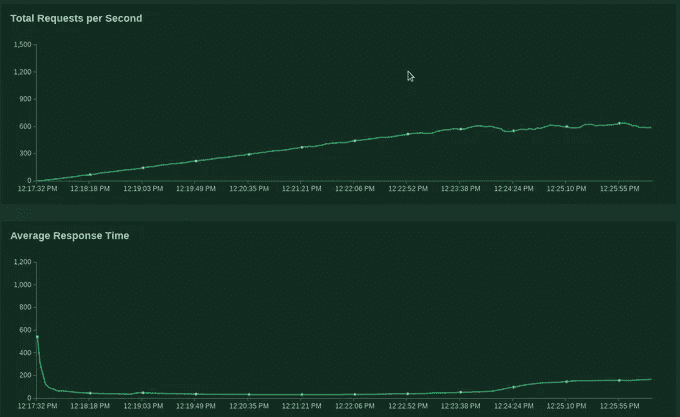
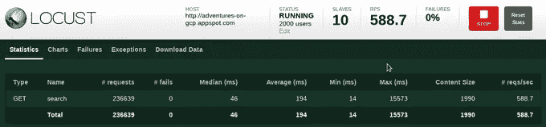
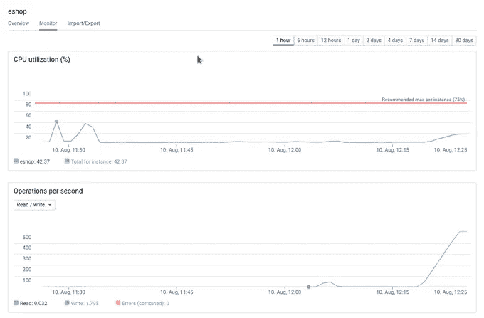
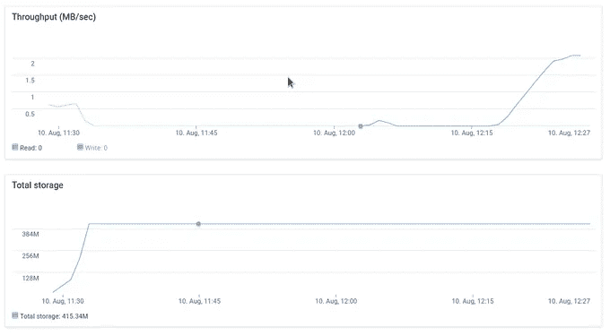
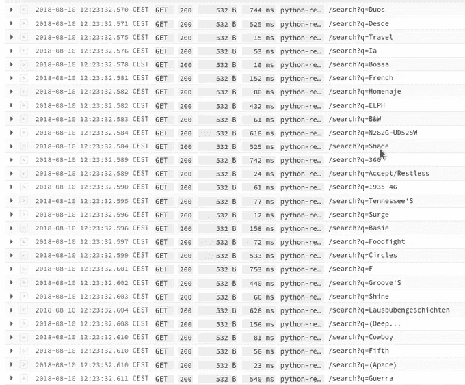

# 谷歌云平台搜索—扳手

> 原文：<https://medium.com/google-cloud/search-on-google-cloud-platform-spanner-1583dba9f54?source=collection_archive---------2----------------------->

第四篇关于 Google Cloud 主题搜索的文章是关于 [Cloud Spanner。](https://cloud.google.com/spanner/)想法是在谷歌云平台上探索各种不同的产品，以及如何使用它们来实现虚拟商店的搜索功能。到目前为止，系列文章致力于:

*   [应用引擎和搜索 API](/google-cloud/search-on-google-cloud-platform-app-engine-and-search-api-31cda6917bbf) (包含大部分信息和细节，其他文章不再赘述)
*   [云数据存储](/google-cloud/search-on-google-cloud-platform-cloud-datastore-615c14cb1bb)
*   [云 SQL](/google-cloud/search-on-google-cloud-platform-cloud-sql-65a0f75b3af8)

这个(和上一个)例子的所有代码都在 Github 库[这里](https://github.com/zdenulo/gcp-search/tree/master/spanner/webapp)。

重复最重要的信息(在第一篇文章中有详细描述)。目标是创建搜索(自动完成)功能使用类似网站的电子商店谷歌云平台。我使用谷歌应用引擎灵活的网络服务器与烧瓶框架渲染主页和处理搜索请求，这种情况下云扳手作为数据库，我将存储产品信息以及执行查询。我省略了几个步骤的描述，因为在以前的文章中已经详细描述过了。

# 云扳手

云扳手是托管 SQL 数据库。与其他 SQL 数据库不同，Spanner 是直接在 Google 中开发的，它有一些非常独特的属性，这使得它非常特别:

*   水平可伸缩
*   强一致性
*   处理
*   高可用性
*   一个节点最多可提供 10，000 QPS 的读取或 2，000 QPS 的写入。
*   价格约为每小时每节点 1 美元，每月每 GB 0.3 美元，这意味着每个节点的起始价格为每月 720 美元
*   对于生产使用和 SLA 涵盖的情况，建议至少使用 3 个节点。
*   有针对特定编程语言的客户端库来使用 Spanner

我不会详细介绍所有这些属性，很少有有趣的技术论文更深入地解释 Spanner 是如何设计和如何工作的:[谷歌的全球分布式数据库](https://ai.google/research/pubs/pub39966)， [Spanner，TrueTime 和 CAP 定理](https://ai.google/research/pubs/pub45855)。

# 数据库模型

所有与数据库相关的都在文件 spanner_search.py 中，内容在这里:

```
from google.cloud import spanner

from db_settings import SPANNER_INSTANCE_ID

DATABASE_ID = 'eshop'

class SpannerSearch():

    def __init__(self):
        client = spanner.Client()
        self.instance = client.instance(SPANNER_INSTANCE_ID)
        database = self.instance.database(DATABASE_ID)
        self.client = database

    def init_schema(self):
        """Creates database for instance and table for products"""
        database = self.instance.database(DATABASE_ID, ddl_statements=[
            """CREATE TABLE Products (
            Sku INT64 NOT NULL,
            ProductName STRING(1024) NOT NULL,
            ProductNameCase STRING(1024) NOT NULL,
            Price FLOAT64,
            SalePrice FLOAT64,            
            Available STRING(64),
            Url STRING(1024)            
            ) PRIMARY KEY (Sku)
            """
        ])
        operation = database.create()
        operation.result()

    def insert_bulk(self, input_data):
        """input is list of dictionaries. fields are sensitive to position in list"""
        values = []
        for item in input_data:
            values.append((int(item['sku']), item['name'], item['name'].upper(), float(item['price']), float(item['sale_price']), item['available'], item['url']),)

        with self.client.batch() as batch:
            batch.insert(
                table='products',
                columns=('Sku', 'ProductName', 'ProductNameCase', 'Price', 'SalePrice', 'Available', 'Url'),
                values=values
            )

    def search(self, query):
        """does search on table with LIKE operator. Number of returned results is set with LIMIT"""
        db_query = """SELECT * FROM products WHERE ProductNameCase LIKE '%{}%' LIMIT 20""".format(query.upper())
        output = []
        with self.client.snapshot() as snapshot:
            results = snapshot.execute_sql(db_query)
            for row in results:
                out = {
                    'value': row[1],
                    'label': row[1]
                }
                output.append(out)
        return output

    def delete_all(self):
        """deletes database (and table)"""
        self.client.drop()
```

我用的是 Python 官方的 Spanner 客户端库。表的创建是通过 DDL 语句完成的。Spanner 目前没有全文功能，例如 PostgreSQL，所以我尝试使用当前的可能性。一个是使用 REGEX like 匹配，第二个是使用 like 操作符。

# 数据库设置

我使用来自 [Google Cloud SDK](https://cloud.google.com/sdk/) 的 gcloud CLI 来执行命令。首先，我将创建一个带有 1 个节点的扳手实例，并选择区域。

```
gcloud spanner instances create myspanner --config=regional-us-central1 --nodes=1 --description="Test instance"
Creating instance...done.
```

通过执行脚本 upload_products.py，数据将从 csv 文件上传到 Spanner 数据库。从我的本地计算机上传 120 万行花了 6 分钟，这是非常好的时间。我在分批上传，每次插入包含 2000 个项目。

# 负载测试

我像在以前的文章中一样，使用运行在 Google Kubernetes 集群上的[蝗虫](https://locust.io/)框架进行常规负载测试。如何在 [Github 库](https://github.com/zdenulo/gcp-search/tree/master/load-testing)中设置集群和部署的分步过程。出于负载测试的目的，我将 GAE Flex 实例的最小数量设置为 10(带自动缩放)，因为它们需要时间加速。我以每秒 5 个用户的孵化率运行了 2000 个用户。以下是蝗虫用户界面的截图:



从表中可以看出，它总共发出了大约 236000 个请求，平均响应时间为 46 毫秒，平均响应时间为 194 毫秒。

Spanner 还提供了一些监控图表。



可以看到，在每秒大约 550 个请求的最大负载下(对应于 Spanner 的读取操作图)，这个节点实例的 CPU 利用率大约为 20%(图表右侧)。

这是来自 GAE 的原木样品。



# 结论

Cloud Spanner 绝不是 pet 项目的数据库，而是一个严肃的业务，这反映在价格以及多区域支持和水平扩展等功能上。目前 Spanner 不支持全文搜索，所以根据具体情况，使用 LIKE 运算符就足够了。