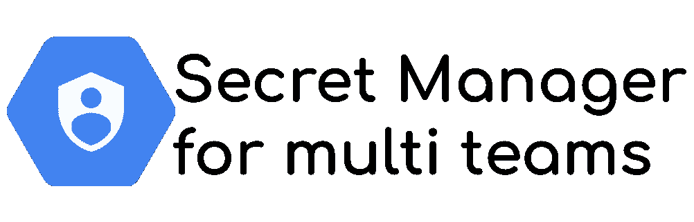
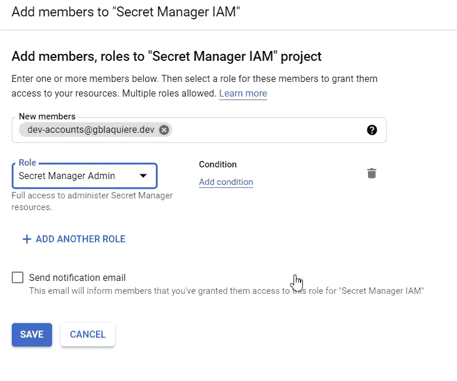
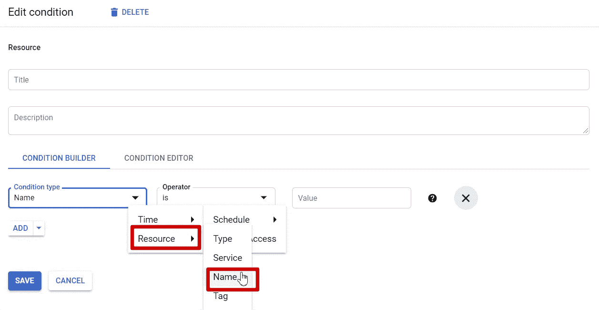
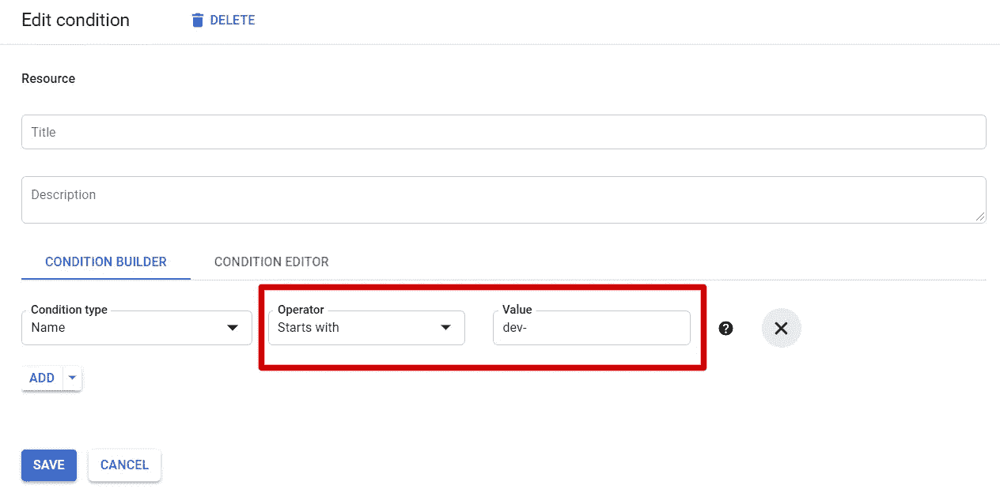
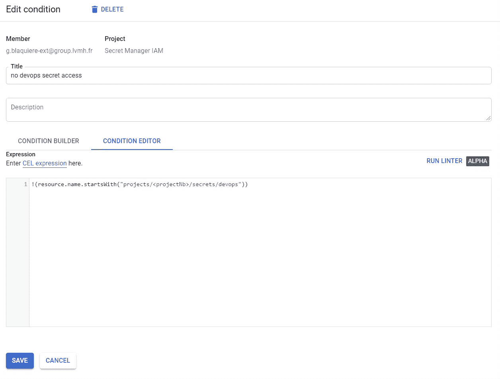

# 秘密经理:保护您的秘密免受内部威胁

> 原文：<https://medium.com/google-cloud/secret-manager-protect-your-secrets-from-inside-threats-e2486f8e9bab?source=collection_archive---------0----------------------->



秘密是**保护**的终极武器:密码、API 密钥、私钥、根证书……秘密有几种类型，但**都需要保持安全和私密**。在 Google Cloud 上，Secret Manager 服务通过 IAM 对秘密进行加密和保护来帮助实现这个**。**

# IAM 秘密保护

开箱即用，Secret Manager 提供了一个细粒度的策略来**授予对单个机密的访问权**以执行最小特权原则。像这样，只有**需要访问某些秘密的帐户(用户帐户，或服务帐户)才允许**访问它们，但是它们**不能访问其他秘密，**即使在同一个项目中。
*对于访问者角色(读取机密)来说是如此，但对于创建新的机密版本来说也是如此。*

Seth Vargo 已经发布了一个关于这个话题的视频。

然而，当**几组用户需要管理秘密**时，困难就开始了。假设:

*   DevOps 团队管理证书资源、数据库以及与它们相关的机密。
*   开发团队使用 API 密钥来访问第三方服务，并需要保证这个秘密的安全。

所有的项目都很长，**有些秘密不再存在，必须由每个团队在他们的范围内创造。并且**因为秘密不再存在**，你**不能授予我对它们的角色**并获得之前描述的最小特权。**

因此**团队在项目级别有一个秘密管理者角色**，因此**可以查看和删除项目**中的任何秘密！

> 当两个团队从事同一个项目时，如何实现最小特权原则？

有解决方案，比如“*创建一个新项目*”或者“*让 DevOps 团队完成所有的秘密创建*”。
有，但是还有**另一种方式:** [**IAM 条件**](https://cloud.google.com/iam/docs/conditions-overview) **。**

# 秘密管理器的 IAM 条件

IAM 服务有一个名为“条件”的特性。显而易见，只有在满足条件时，才能**授予角色。**

为了在我们的用例中应用它，有 2 个需求

*   用户帐户(或组)**没有遗留角色**(查看者、所有者、编辑者)。IAM 条件不能应用于传统角色。
*   每组用户**使用一个命名约定，并为所有秘密**加上相同的前缀值。*例如，* `*devops-*` *用于 devops 团队，* `*dev-*` *用于 dev 团队。*

然后，使用 IAM 条件来配置访问。

*   devops 账户只能访问`devops-`前缀的秘密
*   开发者账户只能访问前缀为`dev-`的秘密

转到 IAM 页面，单击“添加”按钮。对于开发团队，你可以拥有它



点击`Add condition`。选择`Resource`->-`Name`类型的条件



然后是操作符`Starts with`，最后是秘密前缀



## **！！！停下来。！！**

**不行**。几个原因

*   该值必须是具有此模式的机密的完全限定名

```
projects/<projectNb>/secrets/dev-
```

*注意* ***项目号是必需的*** *，不是项目 ID！！*

*   该规则意味着“*当机密的全名以…* 开头时，您拥有机密管理员的管理角色”。但是，当**你想创建一个秘密**的时候，**秘密名称已经不存在了**，你要创建它！*所以你也需要没有秘密存在时的角色*

## 更正 IAM 条件表达式

要解决这个问题，你需要表达相反的意思:

*   **开发者账号无权访问** `**devops-**`前缀的秘密

为此，您需要转到`condition Editor`选项卡，并输入该条件

```
!(resource.name.startsWith("projects/<projectNb>/secrets/devops-"))
```



命名条件，保存它并验证 IAM 角色。

如果您喜欢 CLI，您可以这样做

```
gcloud projects add-iam-policy-binding <projectId> \
  --condition=expression='!(resource.name.startsWith("projects/<pojectNb>/secrets/devops"))',\
title='no devops secret access' \
  --role=roles/secretmanager.admin \
  --member=group:[dev-accounts@gblaquiere.](mailto:devops-accounts@gblaquiere.com)dev
```

现在，**开发者账户没有权限访问 devops 秘密**，条件是 devops 团队正确命名秘密。
和**开发者账号也可以创建新的秘密**

# 随时保护您的秘密

有了秘密管理器，你的**秘密是安全的，你可以信任这项服务。**

然而，你需要聪明地配置你在项目中的角色和权限，以防止秘密泄露和安全漏洞，甚至是从内部。

**IAM condition 是实现此用例的一种优雅方式**,**可以做得更多！**