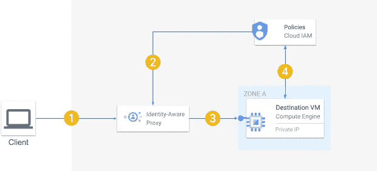

# 安全访问 Google 云中的虚拟机

> 原文：<https://medium.com/google-cloud/secure-access-to-your-vms-in-google-cloud-ada97449c793?source=collection_archive---------0----------------------->

安全访问远程机器的要求之一是方便用户管理虚拟机访问矩阵，并降低解决方案和运营成本。对于托管在谷歌云上的虚拟机来说，这很容易做到。在这篇文章中，我构建了一个基于操作系统登录和 IAP 隧道的工作解决方案的示例，并回顾了关于该技术和最佳实践的几个重要焦点。

# 通常是怎么做的。

数据中心和云提供商的大多数现有解决方案使用三种结构之一:

*   到目标主机的 SSH / RDP 加密连接
*   到堡垒主机的 SSH / RDP 加密连接，该主机充当到目的主机的跳转位置
*   用户连接以访问目标主机的虚拟桌面供应商解决方案

这些结构几乎没有缺点。基于 SSH 的解决方案需要昂贵的(在金钱和精力上)SSH 密钥管理，并且存在将用于执行操作的用户的主账户绑定 SSH 密钥的问题。基于 RDP 的解决方案通常需要建立 VPN 连接，这种连接的运营成本很高，对于最终用户来说很难使用。供应商解决方案从来都不便宜。

# 它是如何在谷歌云中完成的。

Google Cloud 允许用户使用 [IAP 隧道](https://cloud.google.com/iap/docs/using-tcp-forwarding)连接到未暴露于互联网的虚拟机，而无需 VPN 连接。这允许消除对 VPN 连接的需求，同时保持虚拟机群不被外部攻击利用。使用 Google Cloud，您可以在每个用户的基础上隐式管理 SSH 密钥，而不会将它们暴露给最终用户，从而降低与密钥管理或密钥丢失相关的风险。它还允许您将对虚拟机实例的访问权分配给主要用户。这个功能被称为[操作系统登录](https://cloud.google.com/compute/docs/oslogin)，可以为单个虚拟机实例启用，也可以为项目或组织中的所有虚拟机实例启用。操作系统登录的使用利用了 Google Cloud IAM 服务，并简化了用户到虚拟机的管理矩阵。使用 IAP 隧道和操作系统登录不会带来额外的成本。

像所有事情一样，这个解决方案也有局限性。操作系统登录仅适用于 SSH 连接。它不能用于 RDP。这对于现代版本的 Windows 来说应该不成问题，因为它们都内置了 SSH 支持。但是，不可能与 GUI 建立连接。在这种情况下，你可以利用其他谷歌云解决方案，如 [RDP](https://cloud.google.com/compute/docs/instances/connecting-to-windows) 或[虚拟桌面](https://cloud.google.com/solutions/virtual-desktops)。

# 少说多做。

有大量文章提供了演示 IAP 隧道和操作系统登录的代码示例。以下示例的不同之处仅在于使用了最新的 Cloud SDK 命令，并且很可能是极简的。

要运行它，你必须在 GCP 项目上拥有**角色/编辑**角色或类似的权限集，并拥有默认的 VPC，并且在你的客户端机器上安装 Cloud SDK[。这些说明是为装有 Linux 操作系统的客户机提供的。让它们在 Windows 上运行应该很容易。](https://cloud.google.com/sdk/docs/install)

1.  通过定义区域、项目 id 和虚拟机实例名称来设置配置环境:

```
# VM_NAME=sample-destination-host; \
ZONE=us-central1-a; \
PROJECT_ID=<your project id>; \
USER_ID=$(gcloud config list account --format "value(core.account)")
```

如果您想使用这个例子来授权另一个 Google 帐户连接到目的主机，那么将该用户的电子邮件地址作为 USER_ID 的值。

2.使用云 SDK 进行身份验证。同一用户将用于配置示例和连接到目标主机:

```
# gcloud auth login
```

3.确保启用了所有相关的 API:

```
# gcloud services enable compute.googleapi.com \
    iap.googleapis.com \
    --project $PROJECT_ID
```

4.创建示例目标主机:

```
# gcloud compute instances create $VM_NAME \
    --network default \
    --metadata enable-oslogin=TRUE \
    --role roles/compute.osAdminLogin \
    --zone $ZONE \
    --project $PROJECT_ID
```

当前授权的用户被授予虚拟机实例上的**角色/compute.osAdminLogin** 角色。可以授予 **roles/compute.osLogin** 角色，该角色授予 VM 实例上的管理员权限。

6.允许用户在项目中创建 SSH(端口 22) IAP 隧道:

```
# gcloud projects add-iam-policy-binding $PROJECT_ID \
    --member user:$USER_ID \
    --role roles/iap.tunnelResourceAccessor \
    --condition \
      'title=allow-ssh-only,expression=destination.port==22'
```

目前，Cloud SDK [不支持](https://cloud.google.com/iap/docs/using-tcp-forwarding)为单个虚拟机实例定义 IAM 策略。只能在云控制台中完成。该示例为项目中的用户定义了策略。

7.配置防火墙规则以允许从 IAP 到默认 VPC 网络的 SSH 连接。

```
# gcloud compute firewall-rules create allow-ssh-ingress-from-iap \
    --network default \
    --direction INGRESS \
    --action allow \
    --rules tcp:22 \
    --source-ranges 35.235.240.0/20 \
    --project $PROJECT_ID
```

现在可以使用当前用户凭据连接到实例:

```
# gcloud compute ssh --tunnel-through-iap \
    “projects/$PROJECT_ID/zones/$ZONE/instances/$VM_NAME”
```

如果您想要使用不同的 Google 帐户连接到目标主机，则在执行上述命令之前，您必须针对 Cloud SDK 重新进行身份验证。

# 对我们所做的和最佳实践的深入审查。

当您调用“gcloud compute ssh”时，会发生以下情况:



1.客户机上的 Cloud SDK 通过 IAP 创建 TCP 隧道，到达目标虚拟机上的端口 22。

2.IAP 验证用户(客户端上 Cloud SDK 中的当前活动凭据)是否有权建立到目标虚拟机的 IAP 隧道。

3.建立了到目标虚拟机的 SSH 连接。

4.目标虚拟机上的操作系统登录代理验证用户是否有权登录。此外，如果虚拟机具有附加的[服务帐户](https://cloud.google.com/compute/docs/access/create-enable-service-accounts-for-instances)，则验证用户在虚拟机上具有服务帐户用户角色。

IAP 隧道权限可以在项目或虚拟机实例级别授予。可以使用[分层防火墙策略](https://cloud.google.com/vpc/docs/firewall-policies)在组织、文件夹或项目级别定义防火墙规则。类似地，您可以[在实例或项目级别强制操作系统登录](https://cloud.google.com/compute/docs/instances/managing-instance-access)，或者将其定义为[组织策略](https://cloud.google.com/compute/docs/oslogin/manage-oslogin-in-an-org#set-org-policy)，以便在您组织的整个虚拟机群中强制实施。

在项目或组织级别上授予 IAP 隧道和操作系统登录权限使用 Google 服务帐户可以实现对特定虚拟机的细粒度访问控制。如果用户未被授予与虚拟机实例关联的服务帐户的服务帐户用户角色，则无法登录该实例。除非在创建时明确配置，否则虚拟机实例将拥有一个默认的计算引擎服务帐户。该帐户自动为每个项目提供，看起来像 123456789-compute@developer.gserviceaccount.com。使用这个帐户被认为是一种不好的做法。[推荐的实践](https://cloud.google.com/compute/docs/access/create-enable-service-accounts-for-instances#best_practices)是为虚拟机实例提供专用的服务帐户。

# 总结…

*   使用[操作系统登录](https://cloud.google.com/compute/docs/oslogin)消除了管理 SSH 密钥的负担，并缓解了密钥丢失的潜在安全问题。但是，它不能与 RDP 等连接方法一起使用。
*   使用 [IAP 隧道](https://cloud.google.com/iap/docs/using-tcp-forwarding)允许将整个虚拟机群保持在私有网络地址空间中，并避免暴露虚拟机以供来自互联网的访问。
*   遵循使用专用服务帐户的[最佳实践](https://cloud.google.com/compute/docs/access/create-enable-service-accounts-for-instances#best_practices)和[组织政策](https://cloud.google.com/resource-manager/docs/organization-policy/org-policy-constraints)提供现成的解决方案，用于管理您组织中的用户对 Google Cloud 中托管的整个虚拟机群的安全访问。
*   该解决方案不会产生任何额外成本。
*   所有操作都会自动记录到云日志中，以便进一步审核，包括启动虚拟机连接的主体的身份。可以定义警报策略来通知意外或异常的连接。