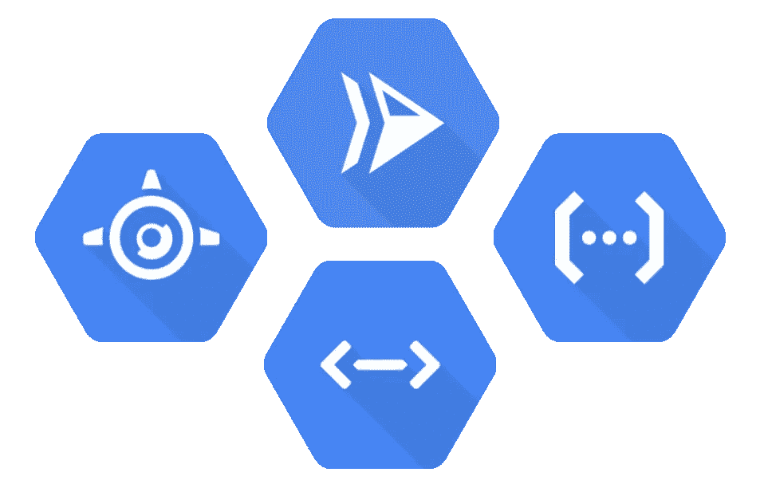
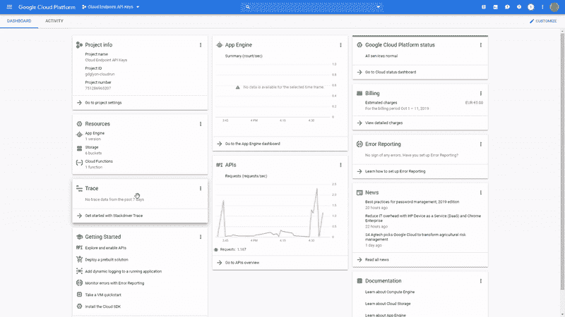
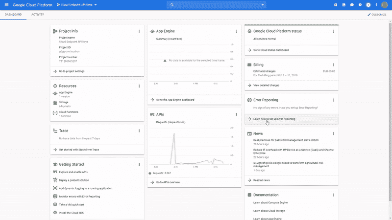
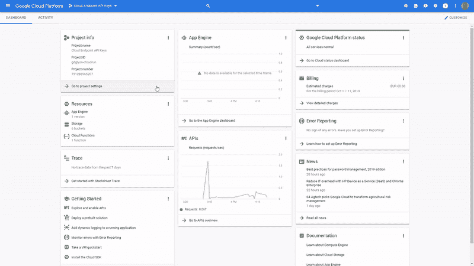
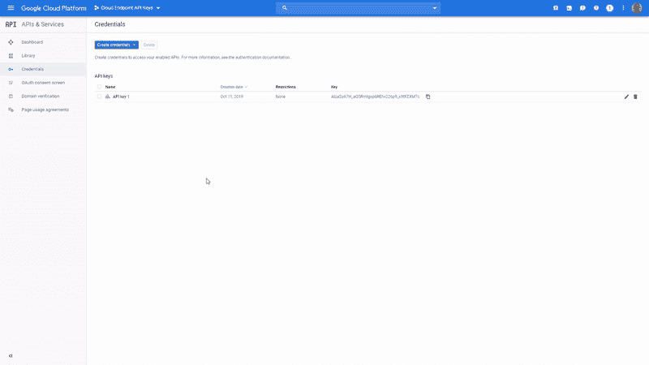
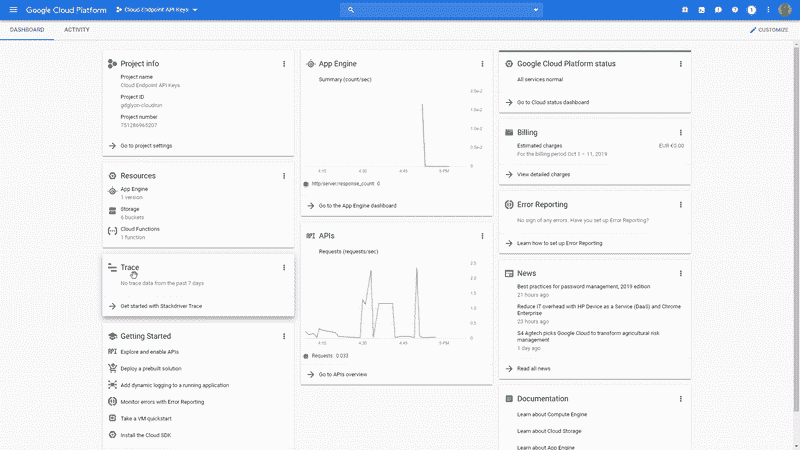
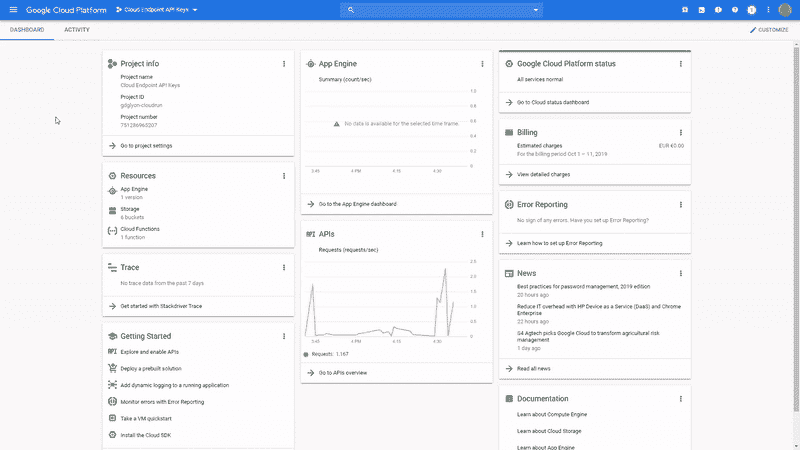

# 使用 API 密钥和云端点保护云运行、云功能和应用引擎

> 原文：<https://medium.com/google-cloud/secure-cloud-run-cloud-functions-and-app-engine-with-api-key-73c57bededd1?source=collection_archive---------0----------------------->



安全性是当前的主要挑战之一，云提供商提供了不同的解决方案来加强安全性。 **Google Cloud 提议通过 IAM 角色和应用于账户的权限来保护产品**；技术(服务帐户)或个人(电子邮件、群组或域范围)。

因此，当您在私有模式下部署云运行或云功能时，或者当您将 App Engine 与 IAP 一起使用时，需要**载体授权令牌来进行认证，并检查认证帐户上允许的角色和权限**。

[**OAuth 2.0**](https://oauth.net/2/) **是轻量级和使用简单性**(在请求头添加令牌)**和可接受的安全风险**(令牌生命周期短，限制了*中间人*攻击的风险)之间的最佳权衡之一。

但是，大概一个月一次，在栈溢出上看到这类问题:

> 用 API Key 可以达到云跑吗？
> 
> 如何用 API 密匙保护我的函数？

如果 **API 密钥没有被提议**用于保护 API 端点，那是因为其**更高的安全风险**。事实上，API 密匙的生命周期并不短，它的循环意味着客户端和服务器之间的同步。顺便说一下，这种长生命周期[增加了*中间人*攻击](https://cloud.google.com/endpoints/docs/openapi/authentication-method#api_keys)和[的风险，不建议使用 API 密钥来保护 API 访问](https://cloud.google.com/docs/authentication/api-keys)。

然而，**对于某些用例，与“无安全性”或基本 HTTP 认证相比，API 密钥是一种平衡的安全解决方案**。但是，如前所述，**谷歌云本身并不支持这种类型的认证**。对了，我们还要用一个附加层:[云端点](https://cloud.google.com/endpoints/)，也叫[可扩展服务代理(ESP)现在是开源产品](https://github.com/cloudendpoints/esp)。

# 云端点

云端点与应用引擎一起存在了许多年，但最近，谷歌云决定**从应用引擎中提取服务，并让任何人利用它**。

[几种部署模式都是可能的](https://cloud.google.com/endpoints/docs/openapi/tutorials)，我选择使用[云运行模式](https://cloud.google.com/endpoints/docs/openapi/get-started-cloud-run)。尽管有教程的描述，你不需要有几个项目，我的**部署例子更简单一些，并尽量避免所有常见的陷阱**。

首先，为托管端点服务的云运行服务创建一个服务帐户(*我将把它命名为云运行端点网关*)，并允许它作为部署端点容器所需的角色，创建一个具有正确角色的服务帐户*(用您的项目 ID 更改<PROJECT _ ID>)*

```
gcloud beta iam service-accounts create endpoint-id
gcloud projects add-iam-policy-binding <PROJECT_ID> \
  --role=roles/servicemanagement.configEditor --member \
  serviceAccount:endpoint-id@<PROJECT_ID>.iam.gserviceaccount.com
```

并在云运行上部署端点容器*(我将服务命名为* `*endpoint*` *)*

```
gcloud beta run deploy endpoint \
 --image="[gcr.io/endpoints-release/endpoint-runtime-serverless:1](gcr.io/endpoints-release/endpoints-runtime-serverless:1)" \
 --allow-unauthenticated --region us-central1 --platform managed \
 --service-account \
 [endpoint-id@<PROJECT_ID>.iam.gserviceaccount.com](mailto:endpoint-identity@gbl-imt-homerider-basguillaueb.iam.gserviceaccount.com)
```

*获取表单* `*https://endpoint-<hash>-uc.a.run.app*` *提供的 URL。我们以后会用到它，不用* `*https://*` *作为* `*ENDPOINTS_SERVICE_NAME*`

现在，您的云运行端点网关正在运行。我们必须部署安全的应用程序并定义路线

# 部署安全服务

为了在各种情况下测试云端点，让我们在云运行(私有模式)、云功能(私有模式)和应用引擎(受 IAP 保护)上部署服务

## 源代码

在开始部署服务之前，打开云外壳并克隆 [GitHub 库](https://github.com/guillaumeblaquiere/apikey-endpoint)

```
git clone [https://github.com/guillaumeblaquiere/apikey-endpoint.git](https://github.com/guillaumeblaquiere/apikey-endpoint.git)
cd apikey-endpoint
```

剩下的部署将在这个目录`apikey-endpoint`中完成

你可以看一下 Go 代码。这是一个简单的[*web server*](https://github.com/guillaumeblaquiere/apikey-endpoint/blob/master/Server.go)*与* `[*/hello*](https://github.com/guillaumeblaquiere/apikey-endpoint/blob/master/function/function.go)` [*GET API，如果在查询参数中提供了*](https://github.com/guillaumeblaquiere/apikey-endpoint/blob/master/function/function.go) `[*name*](https://github.com/guillaumeblaquiere/apikey-endpoint/blob/master/function/function.go)` *，以及它运行的平台(平台在环境变量中提供)*

## [云润](https://cloud.google.com/run/docs/)

**默认情况下，云运行部署在** [**私有模式下**](https://cloud.google.com/run/docs/securing/managing-access) ，这意味着未经认证的用户，或者角色为`roles/run.invoker`、**的已认证用户不能调用** *(或者具有所需权限的另一个角色)*

部署服务有两个步骤。首先，构建容器*(用您的项目 ID 更改<项目 ID >)。*

```
gcloud builds submit --tag gcr.io/<PROJECT_ID>/apikey-endpoint
```

然后在私有模式下部署容器:`— no-allow-unauthenticated`

```
gcloud beta run deploy apikey-endpoint --no-allow-unauthenticated \
    --image gcr.io/<PROJECT_ID>/apikey-endpoint \
    --region us-central1 --platform managed
```

将提供的网址保存在某个地方。我们以后会需要它。你试着对它执行一个 `*curl*` *来验证，如果没有认证，服务是不可访问的*

## [云功能](https://cloud.google.com/functions/docs/)

**默认情况下，云功能也部署在** [**私有模式下**，](https://cloud.google.com/functions/docs/securing/managing-access#controlling_access_on_a_function)这意味着未经认证的用户，或者角色为`roles/cloudfunctions.invoker`，**的已认证用户不能调用** *功能(或者具有所需权限的另一个角色)。*

该部署仅获取`function`源目录中的文件。

```
gcloud beta functions deploy apikey-endpoint --trigger-http \
   --runtime go112 --source function --entry-point HelloWorld \
   --region us-central1--no-allow-unauthenticated \
   --set-env-vars=ENV="Cloud Functions"
```

将提供的网址保存在某个地方。我们以后会需要它。您尝试对其执行 `*curl*` *来验证，如果没有认证，服务是不可访问的*

## [App 引擎标准](https://cloud.google.com/appengine/docs/standard/go112/)

**App 引擎默认为公共**。然而，Google Cloud 已经添加了一个名为 [**的安全层**](https://cloud.google.com/iap/docs/managing-access) **(或 IAP)** ，它不允许未经认证的用户或没有角色`roles/iap.httpsResourceAccessor` *(或具有所需权限的另一个角色)的已认证用户访问服务。*

有两个步骤。首先，部署应用引擎标准*(如果需要，激活应用引擎 API。明智地选择你的区域，你不能改变！)*

```
gcloud app deploy
```

把提供的网址放在某个地方。我们以后会需要它。

然后，**激活 App 引擎上的 IAP**。这没有命令行，但是你可以通过 GUI[来完成。](https://cloud.google.com/iap/docs/app-engine-quickstart#enabling_iap)

转到`Security`并选择`Identity-Aware Proxy`。用您的应用程序名称填写同意页面，并返回到上一个选项卡。这里，将滑块放在右侧*(忽略错误标志)*，点击`Turn on`确认警告信息。



*您尝试在上执行* `*curl*` *来验证，如果没有身份验证，服务是不可访问的。*

# 将云端点与服务联系起来

现在，我们必须向云端点服务声明在哪里以及如何获得服务。为此，您必须定义一个 OpenAPI v2.0 格式的 YAML 文件。有一些工具可以解决这个问题并加速开发。

看文件`[endpoint.yaml](https://github.com/guillaumeblaquiere/apikey-endpoint/blob/master/endpoint.yaml)`。你可以定义一个`paths`列表的入口点和要到达的后端。

首先创建文件头:

```
swagger: '2.0'
info:
  title: Cloud Endpoints with API Keys
  description: Sample API on Cloud Endpoints with a Cloud Run, Cloud Function and App Engine with IAP backend
  version: 1.0.0
host: endpoint-<hash>-uc.a.run.app
schemes:
  - https
```

`host`是您的云运行端点网关的`ENDPOINTS_SERVICE_NAME`的值。`title`是您的 API 在`API & Services` 部分的名称。

## 云运行

**对于云运行，建议使用** `**APPEND_PATH_TO_ADDRESS**`。此参数配置云端点，用于将路径`/hello`复制到`address`的末端，并执行“主机重写”。

```
/hello:
  get:
    summary: Greet a user from Cloud Run
    operationId: hello_cloud_run
    x-google-backend:
      address: https://apikey-endpoint-<hash>-uc.a.run.app
      path_translation: APPEND_PATH_TO_ADDRESS
```

## 应用引擎

对于 App Engine，我们也可以使用“主机重写”。但是路径`/hello`将是双精度的。因此，**我们不指定任何** `**path_translation**` **来执行 URL 重写** *(用您的项目 ID 更改<项目 ID>)*

```
/hello-gae:
  get:
    summary: Greet a user from App Engine
    operationId: hello_gae
    x-google-backend:
      address: https://apikey-endpoint-dot-<PROJECT_ID>.appspot.com/hello
```

## 云函数

对于云函数，为了保持与其他名称的一致性，我们也没有指定任何用于执行 URL 重写的`path_translation`*(用您的项目 ID*更改< PROJECT_ID >

```
/hello-gcf:
  get:
    summary: Greet a user from Function
    operationId: hello_cloud_function
    x-google-backend:
      address: https://us-central1-<PROJECT_ID>.cloudfunctions.net/apikey-endpoint
```

# 使用 API 键

前进是完成了，但是现在没有安全。**激活和使用 API 密钥进行认证需要几个动作**。

## 在云端点中添加 API 密钥安全性

[**API 密匙安全**](https://cloud.google.com/endpoints/docs/openapi/restricting-api-access-with-api-keys) **是全局添加还是在每个** `**path**`上添加，就像我的例子。

```
security:
    - api_key: []
```

对于测试，您可以用`x-google-allow: all`替换它，以禁用安全性。

并且**在文件**的末尾添加安全定义

```
securityDefinitions:
  api_key:
    type: "apiKey"
    name: "key"
    in: "query"
```

## 部署云端点服务

现在，`endpoint.yaml`已经完全定义好了，让我们将它部署到云端点服务上

```
gcloud endpoints services deploy endpoint.yaml
```

现在，云端点服务已经存在。为了向云运行端点网关表明这一点，我们必须用一个环境变量来更新它，该变量用值`ENDPOINTS_SERVICE_NAME`来指定这个名称。

```
gcloud beta run services update endpoint \
--set-env-vars ENDPOINTS_SERVICE_NAME=endpoint-<hash>-uc.a.run.app \
--region us-central1 --platform managed
```

## 激活您的 API

通过在云端点上部署配置，创建了一个新的 API 服务。现在，您必须在项目中激活它。您可以通过命令行来完成此操作:

```
gcloud services enable endpoint-<hash>-uc.a.run.app
```

API 服务名称是您的云运行端点网关的名称`ENDPOINTS_SERVICE_NAME`

您也可以通过 GUI 激活服务。进入谷歌云控制台，进入`API & Services`，选择`Library` *。*然后，搜索您的 API 名称(*带有 API 关键字*的云端点，如果您没有更改`endpoint.yaml`文件中的`title`的话)并激活它。



## 创建 API 密钥

为了访问服务，你必须使用一个 API 密匙。为此，您必须在谷歌云控制台中创建一个。

转到`API & Services`并选择`Credentials`。点击`Create credentials` 并选择`API Key` *。*



由于 API 密钥的安全级别较低，**最佳实践是限制密钥**。

编辑密匙(点击铅笔)，在`API restrictions` *、*下点击`Restrict key`，在下拉列表中，只检查您的 API 名称(如果您没有在`endpoint.yaml`文件的`title`中更改，则检查带有 API 密匙的*云端点)*



*保存创建并授权的 API Key 的键值，我们以后会用到。*

# 云运行端点网关授权

让我们总结一下我们所拥有的。

*   **我们在云运行、云功能和 App Engine 上有 3 个服务**。这些服务都是安全的，需要 IAM 角色来访问它们。
*   我们还有一个**云运行端点网关，与云端点服务**相链接。在这个服务上，已经部署了**将请求路由到每个服务**所需的配置，并且它**需要每个路径入口点中的有效 API 键**。

> 但是，云运行端点网关如何能够到达每个安全的服务呢？

为此，我们必须授予云运行端点网关服务帐户所需的授权

## 云运行

如前所述，通过认证用户可以使用`roles/run.invoker`访问私有云运行的服务。因此，让我们将这个角色授予云运行端点网关服务帐户。

```
gcloud projects add-iam-policy-binding <PROJECT_ID> \
  --role=roles/run.invoker --member \
  serviceAccount:endpoint-id@<PROJECT_ID>.iam.gserviceaccount.com
```

## 云函数

与云运行一样，如前所述，通过认证的用户可以使用`roles/cloudfunctions.invoker`访问私有云功能服务。因此，让我们将这个角色授予云运行端点网关服务帐户*(用您的项目 ID 更改<项目 ID>)*。

```
gcloud projects add-iam-policy-binding <PROJECT_ID> \
  --role=roles/cloudfunctions.invoker --member \
  serviceAccount:endpoint-id@<PROJECT_ID>.iam.gserviceaccount.com
```

## 应用引擎

IAP 保护的 App Engine 略有不同。当然，角色`roles/iap.httpsResourceAccessor`已经被授予云运行端点网关服务账户*(用你的项目 ID*改变<项目 ID >)。

```
gcloud projects add-iam-policy-binding <PROJECT_ID> \
   --role=roles/iap.httpsResourceAccessor --member \ 
   serviceAccount:endpoint-id@<PROJECT_ID>.iam.gserviceaccount.com
```

您也可以通过 GUI 执行这种授权

*   转到`Security`并选择`Identity-Aware Proxy`。
*   在右侧面板上选择您的应用引擎(如果没有，点击`Show info panel`)
*   点击`Add Member`。
*   粘贴你的`endpoint-id@<PROJECT_ID>.iam.gserviceaccount.com`邮箱账号，选择`Cloud-IAP`->-



此外， **IAP 还检查 JWT 令牌**的正确受众。为此，我们必须更新`endpoint.yaml`文件，以便在执行路由时向云端点服务指示正确的受众。*(用您的项目 ID 更改<项目 ID >，并设置正确的* `*jwt_audience*` *)*

```
x-google-backend:
  address: https://apikey-endpoint-dot-<PROJECT_ID>.appspot.com/hello
  jwt_audience: <PROJECT_NUMBER>-<HASH>.apps.googleusercontent.com
```

`jwt_audience`是 IAP 客户端 ID。您可以通过转到`API & Services`并选择`Credentials`找到它。在这里，查看`OAuth 2.0 client IDs`并寻找`IAP-App-Engine-app`行并复制`Client ID`



并将`endpoint.yaml`文件重新部署到云端点服务

```
gcloud endpoints services deploy endpoint.yaml
```

# 验证云端点路由

最后，**所有的设置都完成了**。取回您的 API 密钥的密钥值，并尝试**请求云运行端点网关 URL** 并验证路由是否按预期工作

```
curl https://endpoint-<hash>-uc.a.run.app/hello?key=<API KEY>
curl https://endpoint-<hash>-uc.a.run.app/hello-gcf?key=<API KEY>
curl https://endpoint-<hash>-uc.a.run.app/hello-gae?key=<API KEY>
```

# API 密钥的云端点等等！

即使谷歌云服务本身不支持 **API 密钥，出于安全原因，即使**不推荐这种认证模式**，如果您的用例需要，也可以**使用无服务器产品:云端点**来解决它们。**

我只是**展示了云端点功能**的一小部分，我将它用作 API 网关，用于**提取认证和路由**到不同的服务。并且**你不局限于谷歌云服务 API**。您还可以使用它在内部或其他云提供商上路由您的请求。

但是，**云端点可以做得更多**。可以；

*   设置一个**自定义域**。
*   将它部署在一个**虚拟机上，云功能上，GKE 和 Kubernetes 上。**
*   您可以定义**配额和费率限制。**
*   集成**其他认证方式如 Auth0 或 FirebaseAuth** (而且是 Google Cloud decideration[云身份平台](https://cloud.google.com/identity-platform/docs/))。
*   **共享一个开发者门户**，在那里你的 API 被描述，开发者可以测试它。
*   进行 **API 版本控制，恢复以前的 API 版本**并查看版本**之间的差异**。
*   …

如果你寻找更高级的功能，像**计费和监控，**[**API gee**](https://cloud.google.com/apigee/)**是更好的解决方案**。

但是，如果你正在寻找一个强大的免费 API 网关解决方案，那么 Cloud Endpoint 正适合你。我们试试吧！