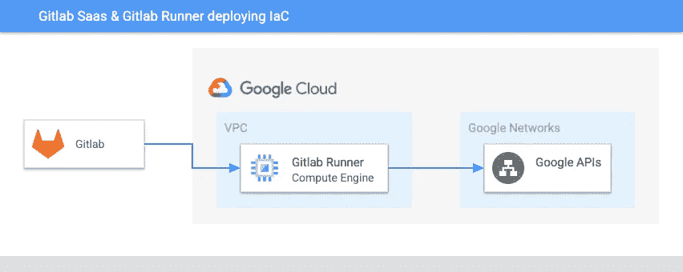

# 从 Gitlab 到 Google 云平台的安全部署

> 原文：<https://medium.com/google-cloud/secure-deployments-from-gitlab-to-google-cloud-platform-81cc507ead3e?source=collection_archive---------1----------------------->

是时候坦白了:每当你为你的谷歌云平台服务账户生成密钥并上传到 Gitlab 用于你的 Gitlab CI 管道时，你会感到内疚吗？晚上，您是否会因为将所有服务帐户密钥以纯文本的形式放在 CI 变量中而失眠？你会开玩笑说黑客会不可避免地泄露你的密钥，也许会浪费数千美元用你雇主的钱挖掘加密货币吗？

如果你现在这样做，只需要一个 Gitlab 权限配置错误，你的密钥就有暴露的风险。那你就真的有麻烦了。使用手动生成的密钥不会带来风险，它违反了服务帐户[最佳实践](https://cloud.google.com/iam/docs/best-practices-for-using-and-managing-service-accounts)的核心隐含原则之一:如无必要，不要使用手动生成的密钥！这是一个如此令人沮丧和明显的问题。一定有更好的方法来使用来自 Gitlab 的经过认证的 Google APIs。

我发现，当我赶时间时，总是最难做正确的事情，在我与谷歌云的许多客户合作的过程中，我总是试图以极大的紧迫感让管道运行起来——当时间非常宝贵时——在我的项目中，我最负担不起技术债务的时候！怎样才能用最少的力气做正确的事？

我如何让 Gitlab CI pipelines 访问谷歌凭证*而不*下载和上传手动生成的服务帐户密钥？

# 跑自己的跑步者

[Gitlab Runner](https://docs.gitlab.com/runner/) 是一个配合 Gitlab CI/CD 运行管道作业的应用程序，可以安装在自己的基础设施上。这意味着我们可以在任何 GCP 环境中将 Gitlab Runner 安装到我们控制下的实例中。通过安装到 Google 计算引擎实例，我们可以将用户管理的服务帐户与该实例相关联。安排到该主机的 Gitlab Runner 作业将自动采用与该主机关联的 GCP 服务帐户凭据，而无需手动生成、下载和上传服务帐户密钥。

在您自己的环境中使用自托管 runner 的另一个好处是，您可以将 runner 放在您的 GCP 环境的网络上或附近，使 jobs 能够直接连接到在您的私有 VPC 中运行的服务。当[集群控制平面被配置为完全私有](https://cloud.google.com/kubernetes-engine/docs/how-to/private-clusters)时，这对于将工作负载部署到 Google Kubernetes 引擎特别有用。通常，为了连接到完全私有的集群，用户必须创建并连接到一个 bastion 实例，该实例由[代理](https://cloud.google.com/architecture/creating-kubernetes-engine-private-clusters-with-net-proxies)流量通过您的私有网络到达控制平面端点。然而，当您的 Gitlab Runner 在您的 VPC 上时，您可以直接从您的 Gitlab CI 工作中连接—没有代理，没有偏头痛，没有压力。

我们不局限于只在 GCE 实例上安装 Gitlab Runner 它可以运行在任何通用计算环境上，包括 GKE。

# 简单的方法

也许将 Gitlab Runner 集成到您的环境中最简单的方法是在运行[容器优化操作系统](https://cloud.google.com/container-optimized-os/docs/concepts/features-and-benefits)的 GCE 实例上使用 Runner 的 [Docker 执行器](https://docs.gitlab.com/runner/executors/docker.html)。使用启动脚本安装并[注册](https://docs.gitlab.com/runner/#runner-registration)Gitlab runner，它连接到 [Gitlab](https://gitlab.com/) 的托管 SaaS 平台，或者可选地连接到运行在内部或另一个云平台中的自托管 git lab。



示例:自托管 Gitlab Runner 将基础设施部署为代码

在上图中，我们看到了最简单的示例架构，使用 Gitlab Runner 将基础架构作为代码部署到 Google 云平台。当*代码*(如*基础设施中的代码*)在 Gitlab 的 SaaS 平台上由 GCP 外部托管时，当一个运行者被注册时，它接受来自 Gitlab SaaS 的 CI 作业。在这种情况下，像 Terraform 这样将基础设施部署为代码的作业将从与 runner 实例相关联的服务帐户继承其 Google 身份。该服务帐户拥有在 GCP 部署其基础架构所需的 IAM 权限。无需手动生成、下载凭据或向 CI 作业公开凭据，GCP 只是通过其元数据服务器向实例公开一个短期令牌。


部署到 GKE 的自托管 Gitlab Runner

Gitlab CI 的另一个非常常见的用例是将 Kubernetes 工作负载部署到私有 GKE 集群，如上图所示。与前面的例子相反，这个架构的 Gitlab runner 与我们部署的目标集群相邻，具体来说，它位于同一个 VPC 中。这是必需的，因为创建 GKE 集群时，GCP 会在集群节点所在的*您的 VPC* 和集群私有端点所在的 GCP 服务提供商网络之间建立 VPC 对等连接。这在上图中用蓝色虚线表示。当集群是私有的时，它们的端点只能从对等连接的*端访问，在你的私有 VPC 上，通过这个对等连接进入服务提供商网络。因此，当我们将 runner 放在与 GKE 集群相同的 VPC 上时，我们可以利用这个对等连接直接连接到集群的端点，以使用其 API 来部署我们的工作负载。*

# 示例代码

以下启动脚本旨在用于默认安装了 Docker 的映像，[，如容器优化的 OS](https://cloud.google.com/container-optimized-os/docs/concepts/features-and-benefits) 。唯一必须提供的数据是 [Gitlab Runner 注册令牌](https://cloud.google.com/container-optimized-os/docs/concepts/features-and-benefits)，它可以注册为与*您的所有*组和项目共享，或者最小化为一个项目。

Gitlab Runner 注册启动脚本

为了反映云资源部署的现代标准，让我们用一些我们可以模板化的东西使其更受支持，并用 Terraform 作为基础设施作为代码进行部署。下面是 Terraform 代码片段。

Gitlab Runner 启动脚本的 Terraform 模板文件资源

使用 Terraform，我们可以自动创建具有最基本功能的 Gitlab Runners。在上面的 Terraform 资源片段中，我们创建了一个可重用的启动脚本模板，我们可以在创建 runner 实例时引用它。下面，我们使用上面的启动脚本模板创建一个带有一个节点的[托管实例组](https://cloud.google.com/compute/docs/instance-groups#managed_instance_groups)，以确保至少有一个 Gitlab Runner 实例始终运行以接受 CI/CD 作业:

Gitlab Runner 管理 Terraform 的实例组资源定义

**注意:注意第 17–21 行**中的服务帐户块。这是 Gitlab Runner jobs 将用来访问 Google APIs 的服务帐户。在上面的例子中——如果没有设置这个块——实例使用[计算默认服务帐户](https://cloud.google.com/compute/docs/access/service-accounts#default_service_account),该帐户被设计为具有高度特权，并且可能根本不代表您希望分配给 Gitlab Runner 作业的 IAM 权限。请确保使用 IAM 权限创建您自己的服务帐户，其访问权限不超过执行 CI/CD 任务所需的范围。

# 按环境隔离访问

到目前为止，我们已经了解了如何利用托管在 GCE 上的 Gitlab 运行程序，通过使用单个 GCE 实例运行 Gitlab CI 作业，给予 Gitlab CI 访问 GCP 的特权，而无需显式地创建、下载、然后上传服务凭证到 Gitlab。很简单。

但是，我们如何快速调整我们刚刚学到的知识，以支持对 GCP 的更细粒度的访问，例如支持部署到单个环境中(如生产环境),而不同时*和*授予 IAM 对所有其他环境的访问权限？

我们可以利用的一个有用的特性是 Gitlab [CI tags](https://docs.gitlab.com/ee/ci/yaml/#tags) ，它允许我们指定一个或者几个与 Gitlab Runner 实例相对应的标签。这确保了带有给定标签的作业——例如`prod`—只在特定的运行程序上运行。

下面是一个来自`[.gitlab-ci.yml](https://docs.gitlab.com/ee/ci/yaml/)`管道文件的示例块，演示了如何指定一个构建标签:

```
build-app:
 stage: build
 tags:
   - prod
```

但是我们注册的 Gitlab 跑者怎么会知道自己负责跑的是哪些标签呢？这一点很重要:当我们向 Gitlab 注册跑步者时，我们必须指定这一点。请注意第 6 行和第 7 行中添加的关于标记的命令行参数:

支持 CI 标签的 Gitlab Runner 注册

# 发展这一战略

虽然使用 Google Compute Engine 托管 Gitlab runners 是一种合理的方法，但它也有一些明显的缺点。例如，这种策略不支持自动扩展，也不支持零扩展以节省成本。如果实例耗尽了计算资源，您的构建作业将不可避免地受到资源争用和速度减慢的影响。相反，如果没有构建作业可用，runner 实例将继续永久运行，在没有活动计算工作支持的情况下增加计算费用。最后，可能也是最值得注意的，需要根据所需的*隔离部署身份*创建一个实例、运行者注册和服务帐户。例如，如果您需要对许多部署进行隔离，在每个部署的基础上授予对 GCP 的最低特权访问，那么为每个部署创建一个 GCE 实例可能不太合理。

工程师要做什么？

在我的下一篇博客文章中，我们将讨论如何将我们所了解的关于定制 Gitlab 运行程序的知识与 [Google Kubernetes 引擎](https://cloud.google.com/kubernetes-engine/docs/concepts/kubernetes-engine-overview)和[Workload Identity Federation](https://cloud.google.com/kubernetes-engine/docs/how-to/workload-identity)相结合，这使得在 GKE 命名空间中运行的工作负载能够访问 GCP 身份，类似于 Google Compute Engine 上的工作负载获得访问权限的方式。这使人们能够利用 Kubernetes 和 GKE(向上和向下)中可用的所有扩展解决方案，同时使跑步者能够使用最少数量的 IAM 特权访问身份，使用相对便宜和轻量级的东西——Kubernetes 名称空间——而不是更笨重和昂贵的东西——计算实例。