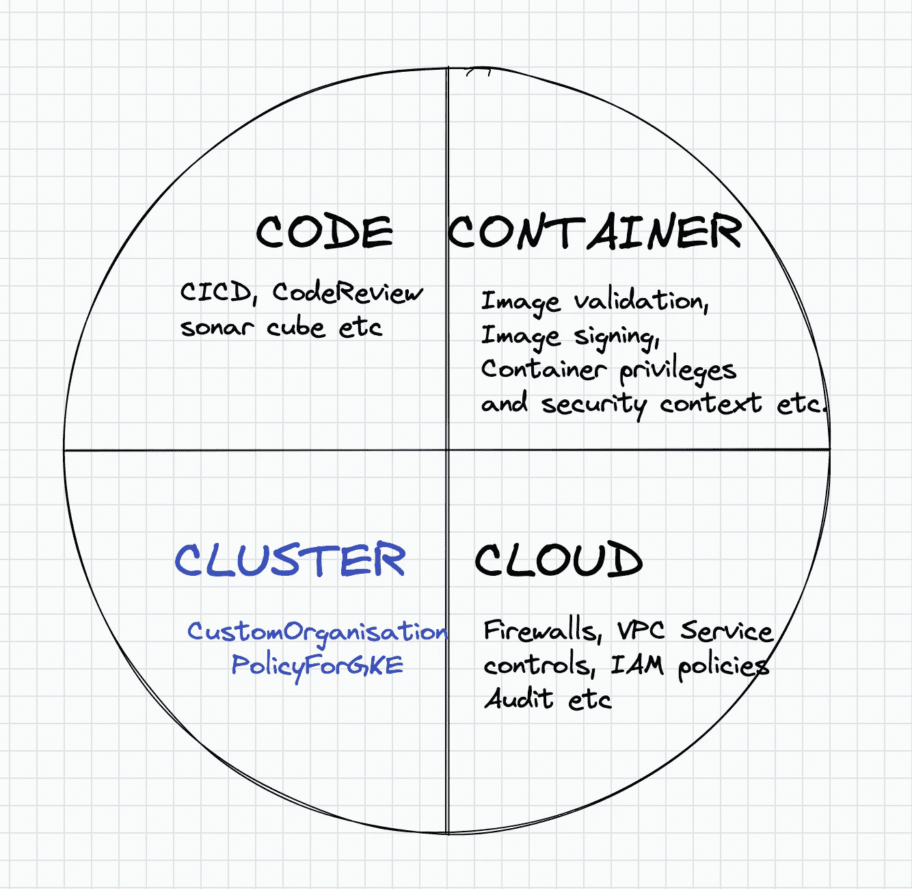
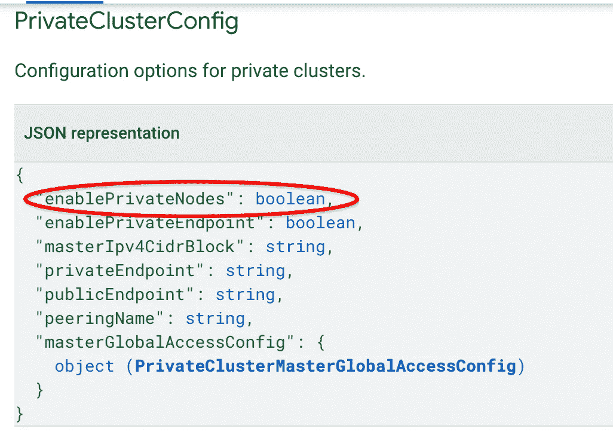
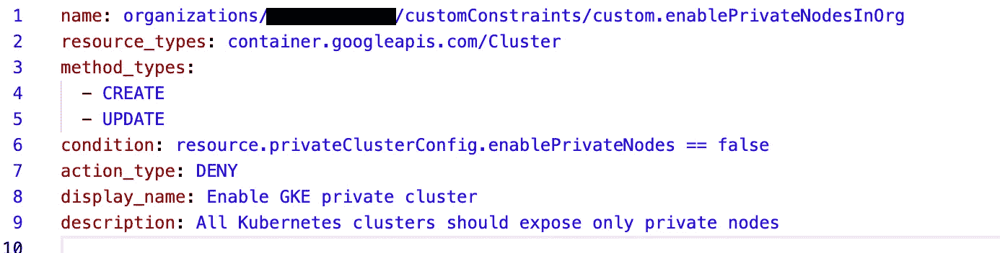
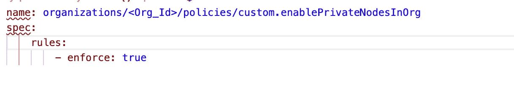

# 使用 GCP 的自定义组织策略保护 GKE 集群

> 原文：<https://medium.com/google-cloud/secure-gke-clusters-with-custom-organization-policies-in-gcp-27dad3d8ce6e?source=collection_archive---------0----------------------->

企业正朝着将应用程序部署为容器的方向发展，kubernetes 是一个流行的编排工具，用于管理和部署基于容器的工作负载。谷歌云提供了谷歌 kubernetes 引擎，又名 GKE，一个创建和管理 Kubernetes 集群的平台。从安全角度来看，基于 kubernetes 的应用程序可以分为四个方面:1 .代码，2。集装箱 3。集群和 4。云。

下图显示了在公共云环境中运行的 Kubernetes 应用程序的不同安全层面。在本帖中，我们将深入探讨如何通过“GKE 的自定义组织策略功能”来加强 GKE Kubernetes 集群(集群平面)的安全性。

# 介绍

组织政策在 GCP 环境中提供安全实践的集中控制和实施。目前有 70 多种内置的[组织政策](https://cloud.google.com/resource-manager/docs/organization-policy/org-policy-constraints)可用。GCP 计划通过自定义组织策略扩展这一功能，使管理员能够扩展默认策略。“GKE 定制组织策略”使管理员能够在 GKE 集群资源上实施安全策略和最佳实践。该功能目前正在**公开预览，**使组织能够保护“集群平面”，并在创建和管理 GKE 集群时实施最佳实践。使用此功能，您可以创建自定义策略来限制 GKE 集群的属性，并在组织、文件夹或项目级别应用策略约束。

# GKE 的自定义组织策略

GKE 的组织策略使组织策略管理员能够指定 GKE 集群资源属性的约束。这些限制可以在 GKE 集群上实施最佳实践和策略，并从 GKE 集群的角度进一步加强安全态势。约束的一些例子可以是

1.  GKE 群集应该始终是私有的，并且只公开私有端点。
2.  应为 GKE 集群定义维护时段。
3.  无法禁用群集的自动升级。
4.  启用工作负荷标识池。

# GKE 组织政策示例

让我们考虑这样一个用例，组织策略管理员希望确保组织中创建的所有 GKE 集群都是私有的。这实质上意味着为集群创建的任何 VM 工作节点都不应该公开公共 IP 地址。

为了实施该策略，组织管理员必须确保在 GKE 集群内私有端点属性始终设置为真。为了找出 GKE 集群的确切属性名，管理员可以通过查看 GKE 集群 REST API[链接](https://cloud.google.com/kubernetes-engine/docs/reference/rest/v1/projects.locations.clusters#resource:-cluster)的资源定义来查看 GKE 集群对象。

PrivateClusterConfig 实体包含属性“enablePrivateNodes ”,以确保从该群集创建的任何节点只包含私有 IP，而不会创建节点的公共 Ip。

这意味着，当创建或更新集群时，在 GKE 集群上实施的约束应该检查条件中的属性“privateclusterconfig . enableprivatenodes”。

可以按如下方式创建 GKE 集群的约束条件

**constraint-priv-node . YAML**

上面的 yaml 文件创建了一个 org 策略约束，并评估“条件”enablePrivateNodes 是否设置为 false。action_type 设置为 DENY，因此如果在 enablePrivateNode 属性设置为 false 的情况下创建 GKE 集群，它将被拒绝。或者，我们也可以评估策略应该只在条件中 enablePrivateNode 设置为 true 时才允许(action_type ),否则应该会失败。method_types 指定在创建和修改 GKE 集群的过程中都应该实施该策略。上述约束中的条件基于[通用表达式语言](https://cloud.google.com/resource-manager/docs/organization-policy/creating-managing-custom-constraints#common_expression_language)

可以通过下面的命令创建组织策略约束。

> g cloud org-policies set-custom-constraint constraint-priv-node . YAML

要实施约束，请创建如下所示的策略 yaml。

**policy-priv-cluster.yaml**

在上面的 yaml 中，我们已经指定了该策略应该在组织级别执行，因此它将应用于跨组织的不同项目创建的所有 GKE 集群。或者，我们也可以在策略名称中指定 projects/ <project_id>,这将只对指定项目中的 GKE 集群实施该策略。</project_id>

通过输入以下命令应用上述策略。

> g cloud org-policies set-policy policy-priv-cluster . YAML

**测试策略约束**

使用以下命令创建一个 GKE 集群。默认情况下，集群的 enablePrivateNodes 属性为 false，因此在下面的命令中，集群工作节点将公开公共 ip，这是我们在上面创建的组织策略约束所禁止的

> `gcloud container clusters create gke-test \
> --project=<PROJECT_ID> \
> --zone=<COMPUTE_ZONE> \
> --num-nodes=1`

使用公共节点创建集群时，会引发以下错误

> 错误:(g cloud . container . clusters . create)response ERROR:code = 400，message =操作被自定义组织策略拒绝:[" custom constraints/custom . enableprivatenodesorg ":"所有新群集必须是 priv 群集。"" custom constraints/custom . enableprivatenodesorg ":"所有 Kubernetes 集群应该只公开私有节点"]。

通过显式启用私有节点并为 Kubernetes 主平面通信指定 CIDR 范围来创建私有集群。由于 private nodes 设置为 true，因此满足了组织策略约束，并成功创建了群集。

> gcloud 容器集群创建 gke-test—project =<project_id>—zone =<zone>—num-nodes = 1—enable-IP-alias—enable-private-nodes—master-IP v4-CIDR = 10 . 1 . 1 . 7/28</zone></project_id>

# 结论

组织策略使管理员能够对在 GCP 环境中创建的资源实施安全控制和最佳实践。借助“GKE 定制组织策略”，管理员现在可以在 GKE 集群上实施安全性和最佳实践。这些策略在正确配置的情况下将极大地帮助保护 Kubernetes 资源的集群平面。

# 参考

[*为 GKE* 定制组织策略](https://cloud.google.com/kubernetes-engine/docs/how-to/custom-org-policies#create-constraint)

[*GCP 的组织政策*](https://cloud.google.com/resource-manager/docs/organization-policy/org-policy-constraints)

[*GKE 集群对象和属性*](https://cloud.google.com/kubernetes-engine/docs/reference/rest/v1/projects.locations.clusters#resource:-cluster)