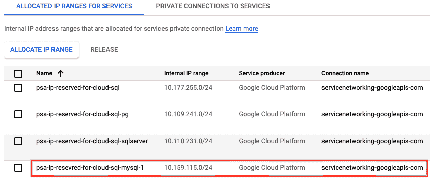
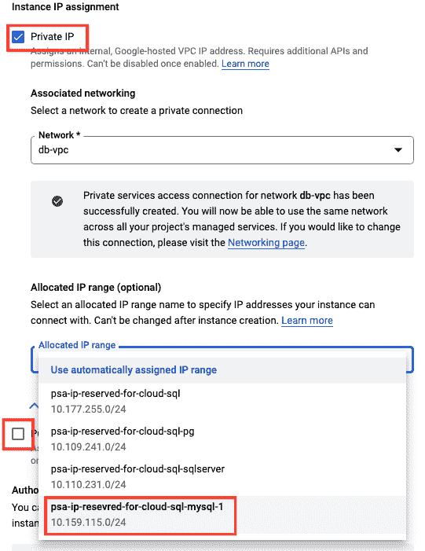
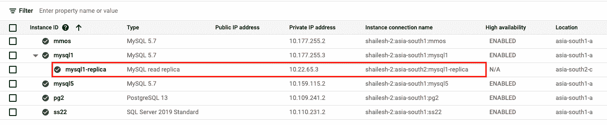

# 使用私有 IP 保护 Google Cloud SQL 实例:疑难解答

> 原文：<https://medium.com/google-cloud/secure-google-cloud-sql-instances-using-private-ip-gotchas-troubleshooting-f7cf6dfe1bbb?source=collection_archive---------0----------------------->

```
**Disclaimer:** *Views, thoughts, and opinions expressed in the blog belong solely to the author, and not necessarily to the author’s employer, organisation, committee or other group or individual.*
```

[云 SQL](https://cloud.google.com/sql/) 是 Google Cloud 针对 MySQL、PostgreSQL 和 SQL Server 的全托管关系数据库服务。如果您计划使用私有 IP 部署云 SQL 实例和/或打算了解更多关于使用私有 IP 配置云 SQL 实例的注意事项，那么这篇博客是为您准备的。关于在云 SQL 服务上配置私有 IP 的[官方文档](https://cloud.google.com/sql/docs/sqlserver/configure-private-ip)准确地涵盖了大多数方面，然而这篇博客解释了在计划使用私有 IP 在一个或多个区域部署云 SQL 实例时必须考虑的不同场景。此博客还有助于构建网络设计的前瞻性方法，这是任何工作负载的关键基础。

**范围:**blog 的范围适用于所有风格的云 SQL，如 MySQL、PostgreSQL 和 SQL server，因为所有引擎的行为都独立于底层网络。虽然本博客提供了 Cloud SQL MySQL 的工件，但是您可以使用 Cloud SQL PostgreSQL 和 SQL server 的概念和场景。

**先决条件:**作为这篇博客的先决条件，你应该了解云 SQL 服务和[虚拟私有云(VPC)](https://cloud.google.com/vpc) 如何在谷歌云平台(GCP)上工作。如果您没有 GCP 访问权限，请从这里开始。

**假设:**以下是本博客考虑的假设。

1.  目的是在孟买地区部署具有 HA(高可用性)配置的云 SQL MySQL 实例，并在德里地区部署跨地区读取副本。
2.  主实例可能需要也可能不需要读取复制副本或跨区域复制副本实例。
3.  假设网络配置只有专用 IP，不应该使用互联网进行通信。如果您已经熟悉 VPC 配置部分，请随意忽略它。

# **关于概念思维的简短说明**

GCP 在谷歌提供的 VPC 及其各自的子网中管理云 SQL 服务。客户 VPC 和谷歌管理的 VPC 是两个不同的组成部分，当谈到利用托管服务，如 GCP 上的云 SQL。谷歌在 VPC 启动并管理云 SQL 实例，被称为服务提供商 VPC 或子网。当客户创建云 SQL 实例时，Google 托管的 VPC 及其各自的子网 IP 范围配置应该已经就绪。如果没有此云，SQL 创建操作将失败，并出现错误“**无法创建子网。在分配的 IP 范围内找不到空闲块。请为此服务提供商分配新的范围。求助令牌:…** "

根据这个先决条件 VPC 和子网配置，创建活动将继承云 SQL DB 实例的 IP 地址。这种配置应该作为每个地区的云 SQL 的每种类型的 DB 引擎(MySQL、PostgreSQL、SQL Server)的先决条件来完成。这被称为每个所需区域中相应云 SQL DB 引擎的私有服务访问(PSA)配置。例如，如果计划在孟买和德里地区为 MySQL 和 PostgreSQL 部署云 SQL 实例，则需要 4 个 PSA 配置。孟买和德里地区的 MySQL 和 PostgreSQL 各一个。PSA 配置就绪后，GCP 将自动在客户和服务提供商 VPC 子网之间建立 VPC 对等。在您创建云 SQL 实例之前，我们需要确保 PSA 已经建立。我们将在随后的部分中逐步完成创建 PSA 的步骤。这些概念在[官方文档](https://cloud.google.com/sql/docs/sqlserver/configure-private-services-access)中有很好的解释，所以在此排除那些内容。我强烈建议在继续之前阅读这些文档。


起搏分析仪配置

根据这些概念和前提条件，在相应的区域和 VPC 必须有至少“/24”CIDR 范围大小的自由 CIDR IP 范围。在撰写这篇博客时，根据文档，“/24”CIDR 范围大小只能容纳不超过 50 个云 SQL 实例。请参考[此处的](https://cloud.google.com/sql/docs/sqlserver/private-ip#allocated_range_size)了解更多关于 IP CIDR 块大小和每个块支持的最大实例数量的详细信息。请注意，如果您要提供 IP CIDR 范围，请确保它不会与当前使用的 VPC 中的任何其他范围重叠，不会跨越其所有子网。本博客将在后续章节中更详细地解释这一场景。

现在让我们用 VPC 配置来构建基础。我们将按顺序做以下事情，以确保我们有适当的基础来重现场景:

1.  我不使用“默认”VPC，因为大多数组织不使用它，作为一种最佳实践。
2.  在 Mumbai 地区创建 VPC，并为其分配一个子网，我们计划在这个子网中部署数据库实例。稍后，当我们再次讨论这些场景时，让我们创建其他子网。
3.  我们还将确保从数据库实例到客户端虚拟机的所有连接都保持私有，仅使用私有 IP 地址，我们将从客户端虚拟机测试到数据库的连接。因此，我们还将安装 NAT(在各自的区域安装路由器)连接到我们的 VPC，这样我们就可以安装 MySQL 客户端。只有这部分是外部的，但通过设计保持安全。

下面是这个博客中使用的 VPC 配置。


确保根据您的要求设置防火墙规则，并为每个区域创建 NAT 和路由器，以便私有虚拟机能够从外部网络下载所需的补丁或软件包。


既然网络基础已经准备好，让我们逐一演练每个场景:

1.  在孟买地区使用一个 CIDR IP 范围为“/24”大小的 PSA(私有服务访问)创建云 SQL MySQL 实例。
2.  使用现有 IP 范围为 PostgreSQL 和 SQL server 创建带有专用 IP 配置的云 SQL 实例，然后修复它。
3.  在没有或耗尽了 PSA IP CIDR 范围的区域中创建云 SQL 实例。
4.  当我们在与主服务器相同的区域中创建云 SQL 读取副本时的考虑事项。
5.  创建跨区域读取副本时的注意事项。

# **使用私有 IP 配置和创建云 SQL MySQL 实例**

让我们在孟买地区创建一个云 SQL MySQL 实例，在这里我们已经在 VPC 下定义了一个子网。由于我们不想在云 SQL 实例中使用公共 IP，我们应该使用 [PSA 配置](https://cloud.google.com/sql/docs/sqlserver/private-ip#allocated_ip_address_ranges)来定义其私有 IP 范围。一旦在使用预先存在的 PSA 配置创建云 SQL 实例期间分配了私有 IP，为云 SQL 实例分配的 IP 就变成静态的。文档显示，使用一个“/24”大小的 CIDR 范围创建的 PSA 可以安全地容纳 50 个云 SQL MySQL 实例。对于 SQL server 和 PostgreSQL 实例，创建单独的 PSA 配置或 IP 范围。每个地区的每个 DB 引擎都需要单独的 IP 范围。50 个实例的上限是安全的，因为每个实例都为 HA、维护等配置保留了多个私有 IP。

**从起搏分析仪配置开始**

进入 VPC 控制台，选择 VPC 并打开“*私人服务连接*选项卡。在子选项卡“为服务分配的 IP 范围”下，单击“分配 IP 范围”并给出如下所示的 IP 范围。您可以选择自定义选项来指定您定义的范围，但为简单起见，自动选项用于 CIDR 范围块大小为 24。


请注意，IP 范围被命名为“psa-ip-reserved-for-cloud-sql”只是为了给出一个有意义的名称。请忽略“描述”。同样，您可以定义适合您的组织的命名约定。点击“分配”后，请查看以下回答:


通过此操作，GCP 创建了一个具有指定 IP 范围的 VPC 子网，现在是时候使用 VPC 对等连接 Google 定义的 VPC 和客户(您的)定义的 VPC 了。当在下一个选项卡中创建连接时，这将在后台自动完成。

在您连接之前，请检查我们有多少 VPC 对等网络，如下所示，目前一个也没有:


要在服务提供商和客户 VPC 之间创建专用连接，请转到“ ***专用服务连接*** ”选项卡，然后转到子选项卡“ ***专用服务连接*** ”，并选择下面 VPC 控制台中的“ ***创建连接*** ”。


选择上一步创建的 IP 范围，点击“**连接**


创建后，用连接名验证“ ***分配的分配*** ”名称。


请注意分配的 IP 范围为“10.177.255.0/24”，因此在创建实例时，任何后续的云 SQL 实例都将被分配一个此范围内的私有 IP。创建连接后，将出现 VPC 对等，这是作为连接创建的一部分创建的，请参见 VPC 对等控制台上的以下屏幕截图:


创建云 SQL MySQL 实例，并在连接配置中选择私有 IP，如下所示。选择孟买作为地区。


在“ ***自定义实例*** ”部分下，取消选中“ ***公共 IP*** ”，选择“ ***私有 IP*** ”，从网络下拉列表中选择 VPC 名称“ *db-vpc* ，从“*分配的 IP 范围*中选择 PSA 范围选项


单击创建实例开始创建数据库实例。

同时，云 SQL MySQL 实例正在创建过程中，让我们快速检查一下，如果我尝试在与私有 IP 配置相同的 CIDR 范围内为 SQL server 和 PostgreSQL 创建云 SQL 会怎样。让我们这样做，我得到了下面的错误，并看到控制台与 MySQL 实例上分配的 IP 地址和 SQL Server 和 PostgreSQL 上的错误标记。请验证孟买地区的云 SQL MySQL 实例私有 IP，如果它从现有范围获取相同的 IP，并且下面的截图确认了这一点。


请检查以下导致 PostgreSQL 和 SQL server 实例创建失败的错误:

```
**Failed to create subnetwork. Couldn’t find free blocks in allocated IP ranges. *Please allocate new ranges for this service provider. Help Token......***
```

**修复错误** —要修复此错误，请按照我们之前为 MySQL 实例创建的相同过程，为孟买地区的每个数据库引擎创建单独的 IP 范围。最后，我们应该会看到 VPC 专用服务连接配置中的数据库引擎各有 3 个条目，如下所示，其中我使用有意义的命名约定创建了另外 2 个 IP 范围，表示一个用于 PostgreSQL，另一个用于 SQL Server。验证 IP 范围，并在列中看到这些范围仍然不是 VPC 对等的一部分:


要添加上述两个新的 IP CIDR 范围作为 PCA 配置和 VPC 对等的一部分，请转到“服务的专用连接”选项卡，并单击“*服务联网-googleapis-com* ”上的链接，更新如下所示的新 IP 范围，然后单击更新。


此步骤将为现有的 PCA 分配新的 IP 范围，作为服务网络的一部分验证 IP 范围，如下所示:


另外，在“为服务分配的 IP 范围”选项卡中验证，如下所示:


接下来，通过创建第一个云 SQL PostgreSQL 来验证这些配置，在随后的屏幕截图中选择下面的配置，然后是云 SQL SQL Server:


对于云 SQL SQLserver


数据库实例创建完成后，根据我们在创建这些实例时分配 IP 的方式来验证分配的私有 IP。


**如果现有 PSA 私有 IP CIDR 范围达到 it 极限，如何处理？**

如果现有的 PSA 私有 IP CIDR 范围达到其极限，那么在相应的区域使用额外的私有 IP CIDR 范围创建数据库实例，在我们的例子中，该区域是孟买。下面我们来看看如何添加额外的私有 IP 范围。与添加新 IP 范围和更新服务网络之前的步骤相似，如下面“私有服务连接”选项卡中 VPC 的屏幕截图所示:


然后将此 IP 范围添加到现有服务网络，如下所示:


更新后，这将出现在部分服务网络中:

也在分配的 IP 范围选项卡中验证，如下所示:



如果在现有服务网络中添加或删除 IP 范围时出现错误，请使用“强制”选项，了解更多信息[或从命令行使用强制选项来删除或添加 IP 范围。](https://cloud.google.com/sql/docs/troubleshooting#creating-instances)

```
gcloud services vpc-peerings update \
service=servicenetworking.googleapis.com \
-ranges=OLD_RESERVED_RANGE_NAME,NEW_RESERVED_RANGE_NAME \
-network=VPC_NETWORK \
-project=PROJECT_ID \
-force
```

现在，通过在孟买地区使用以下网络连接选项创建一个云 SQL MySQL DB 实例来测试上述配置:



在下面创建的数据库实例列表的屏幕截图中验证分配的 IP:


还有几个故障排除场景，您应该记住:

1.  如果区域与主实例相同，读取复制副本将从主实例继承专用 IP。**从起搏分析仪配置的角度来看，这种情况不需要采取任何措施。**
2.  当您添加跨区域复制副本时，请确保读取复制副本区域应该具有配置有空专用 IP 范围的专用服务访问(PSA ),或者预定区域应该已经具有带有专用 IP 的相同类型的数据库实例，并且在 IP CIDR 范围内有额外的空间。例如，如下面的屏幕截图所示，我已经添加了一个 IP 范围，我将在德里地区创建一个跨地区副本，因此它已经为其选择了新分配的 IP。


跨区域读取复制副本创建如下，IP 从新创建的 PSA IP CIDR 范围分配:



3.您可能会遇到错误“*无法创建子网。在分配的 IP 范围内找不到空闲块。请为此服务提供商分配新的范围。*"创建数据库实例时，在以下任何情况下:

```
a) On Private IP option only, creating DB instance or cross region read replica in a region without PSA configuration.b) Private Service Connect IP range is exhausted or if its IP range overlapped with another existing part of the VPC network, check you may have one or more subnets with overlapped IP range.
```

# **小窍门**

接下来，以下是你可以有效跟踪它的方法。

1.  使用下面的 *gcloud* 命令列出每个区域的对等路由:

```
**gcloud compute networks peerings list-routes servicenetworking-googleapis-com — network=db-vpc — region=asia-south1 — direction=INCOMING**
```


2.您还可以使用[云库存 API 或控制台](https://cloud.google.com/asset-inventory/docs/overview)使用 IAM 控制台跟踪相同的内容，并选择“资产库存”。


然后选择其中一个 IP 范围来查看它的详细元数据。参考[这篇](/google-cloud/using-gcp-cloud-asset-inventory-export-to-keep-track-of-your-gcp-resources-over-time-20fb6fa63c68)博客，了解如何创建数据管道来做更多的事情。


3.使用下面的 *gcloud* 命令列出用于 PSA 配置的 IP 范围:

```
**gcloud compute addresses list — global — filter=”purpose=VPC_PEERING”**
```


**成本考虑:**如果您不使用 Google Cloud [免费层](https://cloud.google.com/free)或者您的使用超出了免费层，您将产生启动云 SQL 实例、NAT 路由器和网络出口费用的成本，请使用 [GCP 定价计算器](https://cloud.google.com/products/calculator)进行估算。

**行动要求:**尝试这些场景以了解私有服务访问行为，在使用私有 IP 启动或规划生产云 SQL 实例之前，必须了解这些行为。参考 GCP 社区指南第[页](https://cloud.google.com/support/docs/community)获得更多帮助。

**干杯！！**