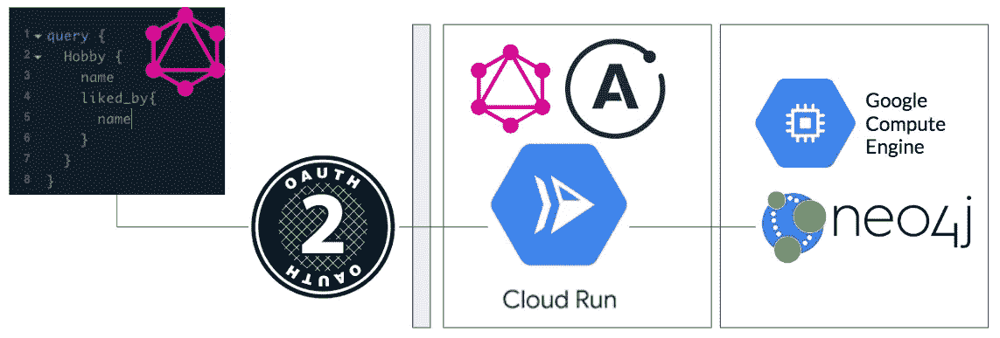
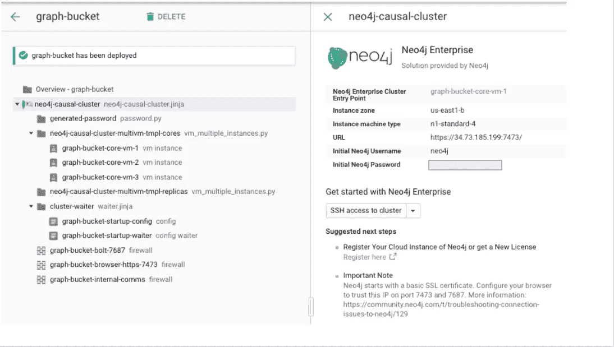
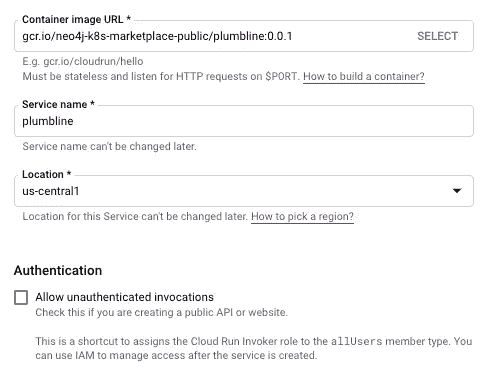
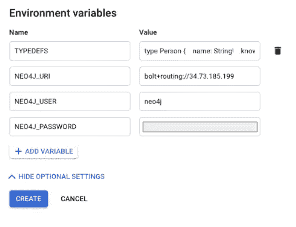
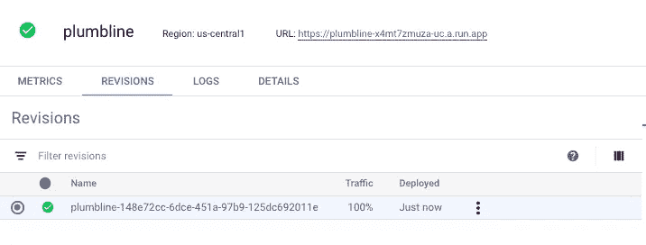
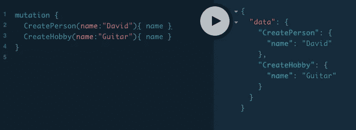
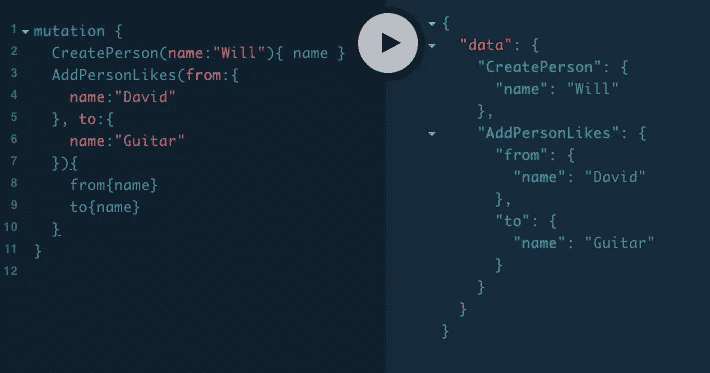
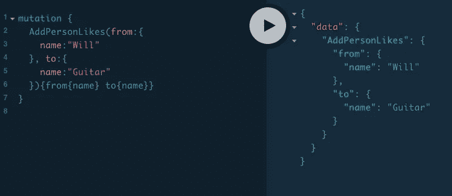
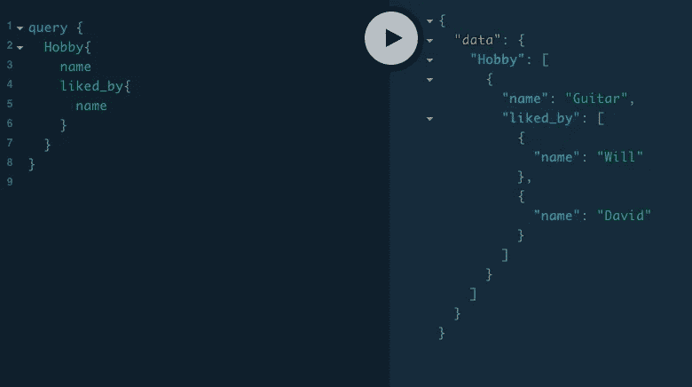
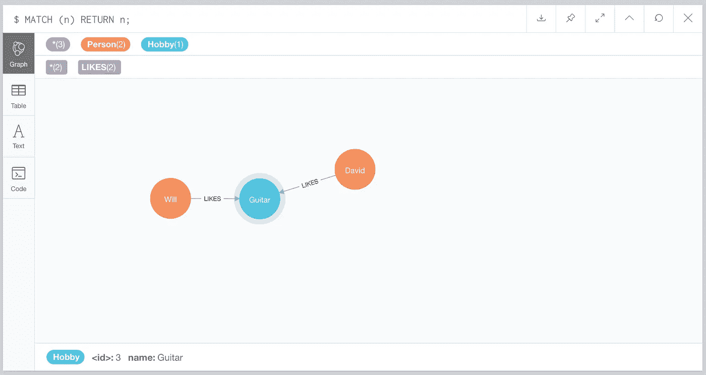

# 利用云运行和大堆栈在几分钟内保护 GraphQL APIs

> 原文：<https://medium.com/google-cloud/secure-graphql-apis-in-minutes-with-google-cloud-run-and-grand-stack-97d050dbc744?source=collection_archive---------1----------------------->

Google Cloud 最近在下一届' 19 大会上宣布了 [Cloud Run](https://cloud.google.com/run/) ，我想踢踢轮胎。Cloud Run 让您轻松运行无状态容器，Google 为您管理基础设施和扩展。您可以以类似于 Google Cloud 函数的方式使用它们，除了您可以带来任何您喜欢的运行时，因为您正在部署 Docker 容器。

我想我应该尝试将 Cloud Run 作为 GraphQL 应用程序的无服务器后端，结果证明这非常简单！



云作为 GraphQL API 的无服务器后端运行

上图显示了我们将要设置的内容。从模式开始，我们想建立一个 GraphQL 微服务。用户发出查询，由运行在 Cloud Run 上的无服务器后端处理。后端使用 Neo4j 数据库来存储数据。整个设置由 OAuth2 层保护。

> **graph QL 是什么？**它是一种 API 的查询语言，也是一个用现有数据完成这些查询的运行时。GraphQL 为 API 中的数据提供了完整且易于理解的描述，使客户能够准确地要求他们需要的东西，使 API 更容易随时间发展，并支持强大的开发工具。(GraphQL.org)

我保证，这将会相对简单，因为谷歌将会为我们做很多事情。我们开始吧！

# 第一步:制作数据库

我们需要一个地方来存放我们的数据。我在 GCP 市场推出了 [Neo4j 企业](https://console.cloud.google.com/marketplace/details/neo4j-public/neo4j-enterprise-causal-cluster?q=neo4j&id=551c0a32-fb3c-4c83-a362-595cf28649cd)。因为 Neo4j 是一个本地图形数据库，它特别适合支持 GraphQL APIs，遵循 [GRAND Stack](https://grandstack.io/) 模式。

建立数据库只需要填写一些值，并将其启动到您选择的 GCP 项目中。[关于如何做到这一点的文档可以在这里找到](https://neo4j.com/developer/neo4j-google-cloud-launcher/)。几分钟后，我的部署完成，我有了数据库的端点 URL、用户名和密码。



Neo4j 集群准备就绪！

*关于 Kubernetes* 的说明:Neo4j 也[可用于 GKE](https://console.cloud.google.com/marketplace/details/neo4j-public/causal-cluster-k8s) ，当然，如果我们愿意，云运行允许我们将容器部署到现有集群中。这是一个很好的选择，但是为了简化设置，我们今天将使用虚拟机，这样我们就不需要创建和配置 GKE 集群。

# 步骤 2:创建云运行服务

让我们转到[云运行控制台](https://console.cloud.google.com/run)，点击“创建服务”按钮。



创建云运行服务

我正在使用一个我为此构建的小型实用容器，名为 [Plumbline](https://github.com/moxious/plumbline) 。这个容器基本上只是一个简单 node.js 程序的 Dockerfile 包装器，该程序使用 [neo4j-graphql-js](https://github.com/neo4j-graphql/neo4j-graphql-js) 连接到 neo4j。这段代码管理 GraphQL 层，并将用户查询翻译成 Neo4j 使用的底层数据库查询语言(Cypher)。我们正在部署的容器图像 URL 是我的公共版本，`gcr.io/neo4j-k8s-marketplace-public/plumbline:0.0.1`，但是当然您可以自己从源代码构建它，或者使用任何其他容器。

我们只需要一个 GraphQL typedefs 列表和一些新数据库的连接信息就可以工作了。Neo4j-graphql-js 处理所有其他事情，包括自动向我们的模式添加访问器和赋值器。

> Neo4j-graphql-js 非常方便，因为它让我们专注于编写一个简单的领域模型，并且大部分样板文件可以自动处理。

这里有一小组 GraphQL typedefs。我们将从一个完全空白的图表开始，并希望按照这个模型创建我们的信息:

```
type Person {
   name: String!
   knows: [Person] @relation(name: "KNOWS", direction: "OUT")
   likes: [Hobby] @relation(name: "LIKES", direction: "OUT")
}type Hobby {
   name: String!
   liked_by: [Person] @relation(name: "LIKES", direction: "IN")
}
```

够简单；我们已经命名了可以认识其他人的人，也可以有自己喜欢的爱好的人。这个简单的图表可以帮助我们推荐谁介绍谁，因为我们有共同的兴趣！

那些`@relation`指令是 neo4j-graphql-js 关于如何存储相关信息的提示。我们的“Person”项将是图中的节点，我们将在 Neo4j 中存储“KNOWS”关系来处理这些关系。如果你想知道所有这些是如何工作的全部细节，请参考 neo4j-graphql-js 文档。

# 步骤 3:配置服务来提供 GraphQL API

接下来，在我们的“创建服务”屏幕中，我们需要设置环境变量，这些变量最初隐藏在“显示可选设置”按钮后面。



定义必要的环境变量

这让我们的容器知道如何连接到我们的数据库，以及应该使用哪组 typedefs 来创建 GraphQL API。

然后点击创建！片刻之后:



我们的工作部署！

# 认证和授权

由于我们创建了一个数据库，并且我们准备好读写数据，向世界公开这样一个 API 并不是一个好主意。如果我们愿意，云运行允许我们公开暴露端点，但是我们没有选择这个选项。

Cloud Run 的默认设置是，你可以免费获得一个 OAuth2 层，它由你的 Google Cloud 项目所拥有的相同权限提供支持。通过使用常规 gcloud 命令生成 OAuth2“承载令牌”,您可以对我们刚刚创建的端点进行身份验证。

这非常方便，因为它使我们不必在 docker 容器本身中有额外的认证逻辑！谷歌还提供了文档，说明你的容器如何使用这个令牌来获取用户 T2 的信息。

如果您想知道如何获得允许您对端点进行身份验证的令牌，就像这样:

```
export TOKEN=$(gcloud config config-helper --format 'value(credential.id_token)' --force-auth-refresh)
```

# 步骤 4:使用我们的新 API！

为了简单起见，您可以使用`curl`来使用我们的新 API，它有一个 HTTPS 端点。为了工作， **curl 需要发送不记名令牌来授权我们的新服务**，还需要设置一些额外的头。

这里有一个关于我们如何使用 API 的 curl 示例:

```
curl $ENDPOINT -H 'Content-Type: application/json' -H 'Accept: application/json' -H "Authorization: Bearer $TOKEN" --data-binary '{"query":"mutation {\n  CreatePerson(name:\"Will\"){\n    name\n  }\n}\n"}'
```

实际上，将 GraphQL 查询格式化为 curl 的 JSON 很快就会过时，所以我使用了一个 [Apollo Launchpad](https://launchpad.graphql.com/new) 来发布我的查询。如果你在家里尝试这样做，你需要确保你的启动板，无论你在哪里运行它，都包括这个不记名令牌，否则你会得到未经授权的错误。

让我们创造一个人和一个爱好。这些变异函数是由上面提到的 neo4j-graphql-js 提供的，并且是自动生成的，与我们漂亮的 GraphQL typedefs 一起使用。



创造一个人和一个爱好

我们再创造一个人，“威尔”，断言大卫喜欢吉他。



创造另一个人，并声称大卫喜欢吉他

威尔也喜欢吉他。



威尔也喜欢吉他！

最后，我们有了一个简单的图表，我们可以使用一个常规的 GraphQL 查询来检查我们的数据是否在那里:



对我们刚刚存储的数据的 GraphQL 查询

在 Neo4j 浏览器端的后端，我们可以看到同样的情况，使用的是 Cypher。



Neo4j 浏览器反映了我们通过 GraphQL 创建的相同图形

# 结论

云运行是部署易于管理和使用的无服务器后端的好方法。在 Google Marketplace 上结合 neo4j-graphql-js 和 neo4j，您可以非常快速地建立一个完整的 GraphQL API，并将其作为一个微服务，作为更大解决方案的一部分。

从这里，我们可以:

1.  使用我们的后端 API，构建一个 React 应用程序来匹配基于共同兴趣的人
2.  让其他微服务根据需要调用这个服务，以便为更大的应用程序提供图形存储