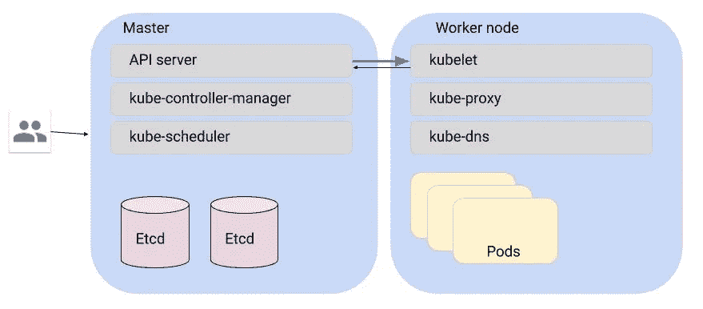
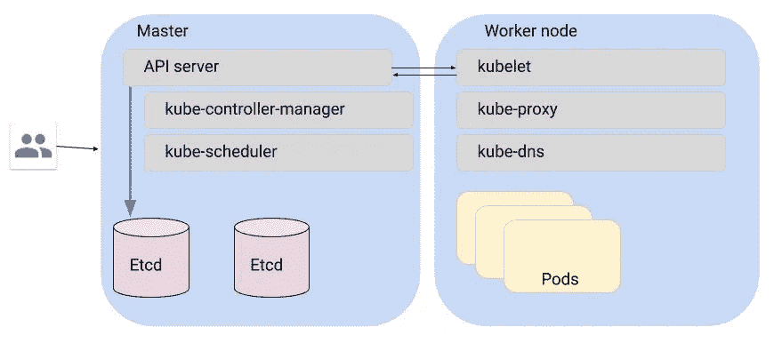
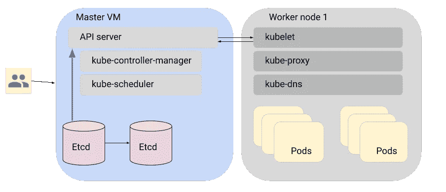
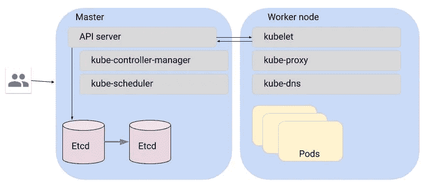
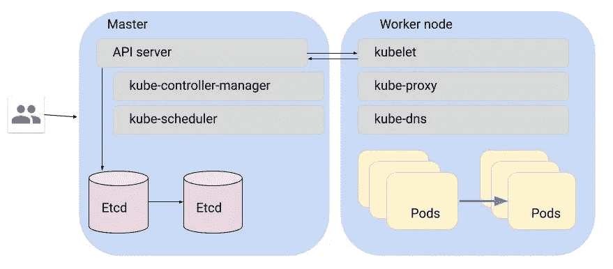

# 确保 Kubernetes 网络安全的 9 个步骤

> 原文：<https://medium.com/google-cloud/secure-kubernetes-internal-networking-5f2556f7efde?source=collection_archive---------1----------------------->

为集群内的安全通信配置 Kubernetes 安全性可能会非常混乱。朱莉娅·埃文斯在她的博客上写道:

> 各种 Kubernetes 组件有很多不同的地方，您可以在那里放置证书/证书授权。当我们建立一个集群时，我感觉有 100 亿个不同的命令行参数用于证书、密钥和认证机构，我不明白它们是如何组合在一起的。

# 那么，集群中存在哪些与此讨论相关的组件呢？

Kubernetes 集群组件包括一个主节点，它具有以下组件:

*   Kube api 服务器——负责集群的整体功能并与用户交互。这基本上是您的集群的控制中心
*   etcd —存储您的 kubernetes 证书并维护集群的状态。
*   kube-scheduler——负责与 pod 相关的调度决策
*   kube-控制器-管理器-管理所有控制器

工作节点:

*   kube let——负责确保工作负载按照它们应该运行的方式运行
*   kube dns——负责为您的 kubernetes 服务设置 DNS 地址之类的东西
*   kube-proxy——负责为服务路由配置网络组件，如 iptables
*   pod 和容器—您的实际工作负载


我们将看到不同的部分如何相互通信是安全的。

# 那么，我应该关注哪些沟通呢？

在上述所有组件中，API 服务、kubelet 和 etcd 是最关键的组件。比方说，pod 需要一个证书，它会与 kubelet 对话，然后 kubelet 会与 API 服务器通信，以访问存储在 etcd 中的证书。

与主服务器的所有通信都通过 API 服务器进行。类似地，与 worker 节点的所有通信都通过 kubelet 进行。Etcd 保存了集群的所有重要信息。所以任何与 etcd 通讯的东西都要好好保护。

所以让我们一个一个地挑选案例。

**案例 API 服务器与 kubelet 的通信**



API 服务器与 kubelet 进行通信，比如获取日志，从用户那里获取配置，并与 kubelet 进行通信，使之成为现实。

默认情况下，从 API 服务器到 kubelet 的通信是通过未经认证的 TLS 进行的。这使得在不受信任的网络上运行集群变得不安全，因为这种通信容易受到中间人攻击。如果你在你的私人网络上运行，这种行为应该是可以接受的。但是，如果您愿意，可以使用标志“kubelet-certificate-authority”来验证 kubelet 的服务器证书。注意 SSH 隧道已被弃用，因此不再是推荐的解决方案。

**案例 2:从 kubelet 到 API 服务器的通信**


这种情况会发生在诸如当一个新节点联机并且该节点需要一个新的证书来与 API 服务器通信的情况下。API 服务器有一个 Kubernetes API，它允许获取由您可以控制的 CA 签名的 TLS 证书。

请求使用相互 TLS，API 服务器监听端口 443。因此默认情况下，主服务器可以在不受信任的网络上运行。

这里需要注意的另一点是，您需要为您的 kubelet 证书设置证书轮换。默认情况下，它们的有效期为 1 年。

```
kubeadm alpha certs check-expiration
```

kubelet 旋转证书的命令是- rotate-certificates

**案例 3:用户/管理员与 API 服务器的通信**


管理员与各种实例上的 API 服务器进行交互，以管理集群。

此通信的身份验证方法取决于您的需求。有几个选项，例如:

*   静态用户名密码。
*   认证代理
*   x509 客户端证书
*   OAuth 令牌

**案例 4a:从 API 服务器到 etcd 的通信**



这可能发生在特定节点或 pod 向 ku elet 请求证书的情况下，ku elet 向 API 服务器发出请求，然后 API 服务器从 etcd 获取该请求。

与 etcd 的通信通过本地主机的端口 80 进行，没有经过身份验证或加密。您应该为这部分通信设置 TLS，通过指定标志“etcd-certfile”来验证 etcd 实例与 etcd 服务器的身份。

相反，API 服务器监听安全的 HTTPS 端口 443。

**案例 4b:从 etcd 到 API 服务器的通信**



API 服务器监听安全的 HTTPS 端口 443。

**案例 etcd 的两个实例之间的通信**



Etcd 实例相互通信以保持状态同步。

etcd 的实例已经通过相互 TLS 进行通信，因此这部分集群在不受信任的网络上运行也应该是安全的。

**案例 6:两个吊舱之间**



如您所知，不同或相同节点中的 pod 可以无缝地相互通信而不会停滞，这是 Kubernetes 网络的基本原则之一。所以这是另一个重要的交流途径。

目前，这种通信没有加密，也没有认证。有一些方法可以使它更加安全，例如使用一些网络策略提供商，如 [Tigera 的 Calico](https://www.tigera.io/tigera-products/calico/) 或 [Cilium](https://cilium.io/blog/2018/09/19/kubernetes-network-policies/) 来保护服务到服务的流量。至少，强烈建议根据您的应用程序使用一些网络策略提供程序。

您还可以使用类似于 [Istio](https://istio.io/) 的服务网格来为服务之间的流量实施相互 TLS。使用一个完整的服务网格来执行服务到服务通信之间的相互 TLS 可能看起来是一个巨大的要求，因此可以使用一个网络策略提供商来提供相同的服务，而不需要在每个 pod 前使用代理。

这里要推荐的一个明显的东西是 Pod 安全策略。我将在另一篇博文中详细阐述这个问题。

这种沟通途径非常重要，可能需要一整篇文章。

**案例 7:从 pod 到 API 服务器**

这种类型的通信是通过普通的 HTTP 完成的，但实际上这种类型的通信甚至不应该直接发生。

**案例 8:其他组件如 kubescheduler，kube-controller-manager 与 API 服务器对话。**

这发生在本地主机上，您也可以在这里设置安全通信。使用

```
--secure-port
```

用于保护从 kube 控制器管理器到 API 服务器的通信。默认情况下，它使用端口 10259，并使用 HTTPS 身份验证。您还可以设置选项和许多其他选项:

```
--tls-version-min
```

从 Kubernetes 1.13 开始，安全端口 10259 可以用于从 kube-scheduler 到 api 服务器的安全连接。

**情况 9:两个节点之间**

如果希望确保节点到节点的通信也使用证书，可以使用相同的证书签名 API。

# 结论

在表格中为您总结所有这些信息:

如果你发现以上有任何错误，我们很乐意纠正它们，或者如果你有任何反馈，我们很乐意听到更多！