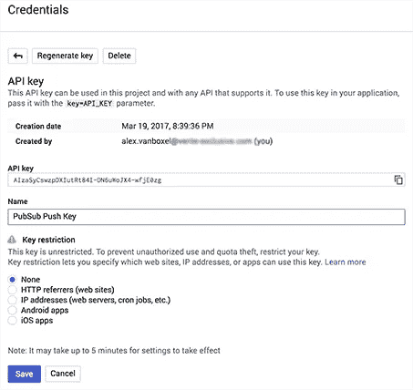
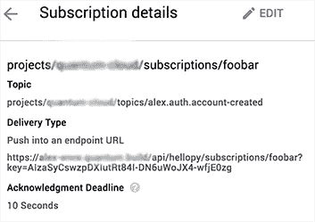

# 通过云端点保护云发布订阅推送

> 原文：<https://medium.com/google-cloud/secure-pubsub-push-with-cloud-endpoints-6a1adc36db9f?source=collection_archive---------0----------------------->

Google Cloud PubSub 是一项完全托管的实时消息和流媒体服务。到目前为止，它是我们大数据管道中最可靠的组件之一。但是不太明显的是，您可以在微服务架构中将它作为一种在整个系统中传播更改的方式。

虽然大数据管道一般都是高吞吐量的，**变化传播**可能会不那么喋喋不休。对于这些场景，PubSub 有一个很好的特性叫做**推送订阅**。推订阅不需要在拉模型中编写专门的代码来从订阅中提取消息，而是让 PubSub 在 HTTP 端点上发布消息。

# 发布订阅推送

PubSub 推送订阅功能消除了很多复杂性。不需要考虑确认，只需要确保您能够足够快地处理消息并返回 204。当你的服务跟不上的时候，PubSub 会确保消息继续发送或退回。需要注意的是，一次只推送一条消息，但是这对于低吞吐量的场景来说是可以的。记住:你不必写任何特殊的代码。



在云控制台中创建新的 API 密钥

但是，总有但是……安全性呢？ [PubSub FAQ](https://cloud.google.com/pubsub/docs/faq#security) 提示只接受带有密钥的消息。但是这意味着要编写额外的代码。秘密密钥也意味着管理和旋转你的密钥，再次额外的代码。除非…

如果您可以再次将键处理从代码中移除，会怎么样？你可以，通过使用云端点。

# 端点

[云端点](https://cloud.google.com/endpoints/)是一个代理，你可以把它放在你的微服务前面，它可以处理你的认证、监控、记录和跟踪。它还支持 API 键，易于使用。您唯一需要为您的端点编写的是一个 OpenAPI 文件(以前称为 swagger)。该文件需要使用

> gcloud 服务管理部署 openapi.yaml

在下面的例子中，我们有一个我们想要保护的**/API/hellopy/subscriptions/foobar**推送端点。简单地通过添加带有 api_key 定义的安全定义，*端点* *代理*将处理所有的*密钥验证*。

```
**swagger:** "2.0"
**...
paths:** ...
  **"/api/hellopy/subscriptions/foobar":
    post:
      description:** "PubSub push."
      **operationId:** "pubsub_foobar"
      **produces:** - "application/json"
      **responses:
        204:
          description:** "Ack"
      **security:** - **api_key:** []
...
**securityDefinitions:
  api_key:
    type:** "apiKey"
    **name:** "key"
    **in:** "query"
```

在云项目中你需要在 API 管理器中创建一个凭证 **API key** 。然后，该密钥可以用作订阅 url 中的查询参数。就是这样。



在 URL 中使用 API 键

现在，您可以通过在主题上推送一些消息来开始测试您的端点。一定要留意日志，看看你的消息是否传来。

除了*零代码解决方案，*你还可以通过在 *API 管理器*中按下**重新生成密钥**来旋转密钥。API 管理器给你 24 小时的宽限期，在此期间你有时间更新你的订阅中的密钥，在此期间它将继续接受原来的密钥。

# 结论

现在，这是我保护 PubSub 推送端点的首选方式。我当然喜欢无代码方法，因为你应该**抵制编写自己的安全处理**代码。你可以自动完成这个过程，包括钥匙旋转。但是我们遗漏了一些 API。通过 API 更新订阅很容易，*但是我们这里缺少一个创建和旋转密钥的 API*(Google 你在听吗？).

除了缺少用于维护您的密钥的 API 之外，您现在有了一个保护您的 PubSub 推送订阅的好方法，而无需编写一行代码。

## 谷歌的愿望清单:

*   添加用于管理 API 密钥的 API
*   发布 PubSub 可以发布的已知 IP 范围列表

## 参考

*   [PubSub 订阅指南](https://cloud.google.com/pubsub/docs/subscriber):阅读如何在 Google Cloud PubSub 中配置您的订阅
*   [PubSub 安全常见问题解答](https://cloud.google.com/pubsub/docs/faq#security):push URL 中使用 tokes 的建议
*   [容器引擎的云端点](https://cloud.google.com/endpoints/docs/quickstart-container-engine):在 Kubernetes 上使用端点的快速入门
*   [凭证支持](https://support.google.com/googleapi/answer/6158857?hl=en):如何在凭证屏幕中创建 API 密钥