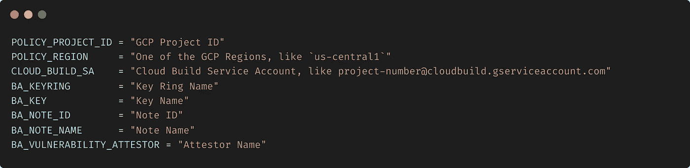
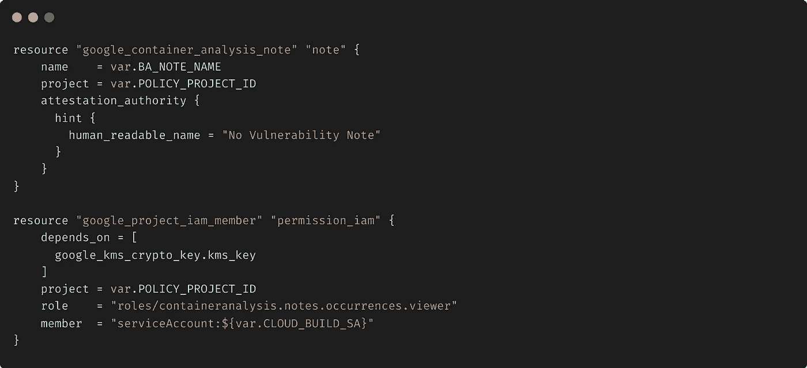

# 无服务器世界中的安全软件供应链(S3C)

> 原文：<https://medium.com/google-cloud/secure-software-supply-chain-s3c-in-serverless-world-64e316a9faca?source=collection_archive---------0----------------------->

# 云运行的二进制授权

## TL；dr(跳转到代码之前)

建立一个安全的软件供应链是一个相对较新的话题。[新的合规性和法规要求](https://www.whitehouse.gov/briefing-room/presidential-actions/2021/05/12/executive-order-on-improving-the-nations-cybersecurity/)将促使组织从不同的角度思考软件安全性。许多最近的黑客一次又一次地向我们表明，简单地将代码保存在私有存储库中、进行定期存储库扫描和运行时扫描的传统方法在未来将是不够的。

这篇博客试图定义什么是安全软件供应链，为什么它很重要，构建它的关键挑战是什么，并且演示了一种在 Google Cloud 中使用云运行、云构建和二进制授权来构建 S3C 的无操作方法。

[源代码库](https://github.com/kapsay/SecureSoftwareSupplyChain)

# 让我们开始…

安全性是您从任何云提供商选择的云采用框架和运营模式的主要支柱。这绝对是谷歌云的一个重要支柱。对于组织来说，在具备所有安全措施和合规性控制的情况下大规模采用云可能是一项艰巨的任务。其中一个主要原因是，现代威胁会攻击“堆栈”的许多层。当我说堆栈时，它包括为您的用户和/或应用程序提供服务所涉及的所有组件。

现代软件架构和软件交付也变得非常复杂，在开发、构建和发布链中添加了一些工具。很多时候，安全工具和策略是作为这个链中的外部实体引入的。

众所周知，安全性是一个非常深入和广泛的主题，我们不可能在一篇文章(甚至一本书)中解决每个安全方面的问题，所以让我们在这里重点关注这个安全软件供应链，即 S3C，并详细探讨它。

# 什么是安全软件供应链(又称 S3C)

因此，首先让我们尝试定义软件供应链和一些可能通过它引入的漏洞。

在高层次上，我们可能都知道食品供应链是如何运作的。举一个例子；鸡蛋。鸡蛋是在大型家禽养殖场生产的，在端上你的早餐盘子之前，它们要经历一段旅程。下图试图展示这段旅程。

代码也有类似的旅程。它必须经过几个步骤才能开始为生产中的流量提供服务。虽然每个人的构建-发布管道是不同的，但是这张图片显示了软件发布管道中使用的一些通用步骤。

现在，这里有一个基本的安全漏洞。如何确保只有“批准的”和“预期的”软件才能部署在目标环境中？在鸡蛋供应链的例子中；你将如何确保一些恶意的演员没有把“坏鸡蛋”放在杂货店的货架上，而你最终买了那些坏鸡蛋？正如你所猜测的，货架上的一个坏鸡蛋会对这家食品连锁店的顾客产生严重的健康影响。同样，什么可以防止恶意行为者(内部或外部)在软件供应链中注入会给组织带来重大安全问题的不良依赖？

如今，许多这样的安全漏洞在一些主要的软件平台中频繁出现，并影响着任何规模的组织。软件供应链断裂的影响是如此之大，以至于在最近的[“关于改善国家网络安全的行政命令”](https://www.whitehouse.gov/briefing-room/presidential-actions/2021/05/12/executive-order-on-improving-the-nations-cybersecurity/)中，联邦政府加入了关于“增强软件供应链安全”的专门章节(第 4 节)

第 4.e.3 节特别呼吁使用自动化工具或类似的过程来维护可信的源代码供应链，从而确保代码的完整性。

这是我们传统上对软件安全性的看法的一个根本性的改变，在软件交付中，这主要是一个事后的想法。

由此引入的另一个主要挑战是在软件供应链中引入许多工具+这些工具的操作+集成这些工具的努力。对于软件开发者和企业来说；这是一个额外的开销，因为软件开发人员只想开发代码，而企业希望尽快使用它。所以保持正确的平衡很有挑战性。

因此，组织的基本问题是:

1.  如何构建一个 S3C，用一个策略(作为代码)来驱动在运行时部署或不部署代码的决策？
2.  如何确保软件在没有太多摩擦的情况下，以最快的速度构建和发布？
3.  构建这种 S3C 的新工具会带来新的运营开销吗？如何做到无服务器贴身？
4.  当你的软件/代码托管平台是无服务器的(像 Cloud Run)时，S3C 是如何工作的？

# 构建 S3C 的解决方案很少

*   一个答案可能是在部署之前进行一些手动检查和验证。嗯，同意，但是我们都知道随着快速开发和频繁部署，手动进行这样的验证而不影响速度几乎是不可能的。这不是第二个问题的好答案。
*   另一个选择是引入第三方工具，在运行前验证和证明你的软件。通常这些工具会带来大量的操作开销。例如，您需要在某个地方安装这些工具，用新版本升级它们，监控它们以确保它们启动并运行，等等..这不是上面问题 3 的好答案。

有没有更好的解决办法？救援二进制授权来了。

# 什么是二进制授权和架构

那么，现在让我们详细探讨一下什么是二进制授权。二进制授权是 Google Cloud 中的一项托管服务，有助于构建部署时安全控制，以确保只有可信/批准的容器映像才能部署在运行时环境中，如 Google Kubernetes Engine (GKE)或 Cloud Run。

作为一项完全托管的服务，采用二进制授权不需要建立任何基础设施或组建运营团队。只需在项目中启用二进制授权 API，就可以开始了。这解决了第三个问题。

使用二进制授权的 S3C 有 4 个主要组件:

1.  策略—定义为控制容器映像部署的代码的一组规则。策略中的规则提供了映像在部署之前必须满足的特定标准。如果策略要求在部署前进行证明，则在允许部署关联的映像之前，您还必须设置可以验证证明的证明者。
2.  KMS —用于生成签名和验证图像时使用的公钥和私钥。
3.  签名者—使用通过 KMS 生成的私钥对唯一的图像描述符(图像摘要)进行签名。这将生成一个“签名”,稍后(在部署时)通过二进制授权对其进行验证，以确保部署了签名的映像。
4.  证明者—具有与签名者用来签署容器映像摘要和创建证明的私钥相对应的公钥。

二进制授权使用策略、签名者和证明者来验证映像，并决定是在目标运行时部署该映像还是拒绝部署。

这是一个展示二进制授权工作的架构。

该架构展示了二进制授权如何强制执行策略，以确保如果映像/代码中存在任何关键漏洞，则映像不会部署在云运行中。为了实现这一点，当没有发现严重的漏洞时，在漏洞扫描(Google 容器注册表中的内置特性)之后对图像进行签名。

可能还有其他场景(如上所述)，您希望确保映像在通过 QA 检查时得到部署(这取决于您来定义 QA 检查的真正含义)。仅供参考；在我们下面的演示中，QA 意味着映像中没有严重的漏洞。

在任何情况下，如果一个恶意的参与者试图在云运行中部署一个未经定义的供应链签名的映像，那么二进制授权将不会让它进入。

这种架构的最大好处之一是职责分离清晰，例如:

1.  **安全团队** —在 YAML 编写二进制授权策略。如果需要的话，允许例外，这也是因为 YAML 政策的改变。
2.  **基金会/基础设施团队** —使用 GCP 项目创建流程来实施二进制授权策略。这主要是在 Terraform 中完成的，下面将详细解释。
3.  **构建&发布团队** —创建构建和发布脚本，可能在使用 cloudbuild.yaml 的云构建中，以执行标准，如映像漏洞扫描、其他 QA 检查等。
4.  **开发者**——不能改变#1、#2 或#3，这将允许完全专注于发货代码。

# 无服务器运行速度非常快

无服务器本身是一个很大的话题，但在这篇文章中，我们将重点关注无服务器模型的 3 个主要组成部分:

*   无运营(消费者无需维护任何后端组件即可使用平台，即无需基础架构供应、修补、更新等。)
*   现收现付(只为你使用的东西付费。不为任何空闲时间付费)
*   需求弹性(随着需求的增加或减少，扩大/缩小平台)

虽然无服务器通常与像云运行这样的代码托管平台相关联，但从根本上说，它远远超出了它。演示中使用的架构和所有服务都是无服务的。云运行、云构建、云 KMS、二进制授权服务、谷歌容器注册、容器扫描 API，属于无服务器保护伞(“无运营”、“按需付费”和“按需弹性”)。那么，如果您决定在您的环境中实施此演示，您将调配、维护和支持多少台服务器呢？零！！！

# 示范

# 第一阶段—设置

角色—安全和基础/基础架构团队

[储存库](https://github.com/kapsay/SecureSoftwareSupplyChain/s3c-demo)

**先决条件:**

1.  在您的 Google Cloud 项目中启用以下 API:

*   [二进制授权](https://cloud.google.com/binary-authorization) API
*   [云构建](https://cloud.google.com/build) API
*   [云密钥管理服务(KMS)](https://cloud.google.com/kms/docs/resource-hierarchy) API
*   [容器分析](https://cloud.google.com/container-registry/docs/container-analysis) API
*   云资源仓库 API(如果你把你的源代码放在那里的话)

2.在项目中设置“允许的二进制授权策略(云运行)”组织策略，如[https://Cloud . Google . com/Binary-Authorization/docs/Run/required-binauthz-Cloud-Run](https://cloud.google.com/binary-authorization/docs/run/requiring-binauthz-cloud-run)中所述

3.让我们来看一下我们将在代码中使用的变量:

现在，让我们浏览一下 Terraform 代码

第一步。使用云 KMS 创建钥匙圈和密钥

第二步。创建一个容器分析注释，它是描述一个软件的元数据。容器分析 API(graf eas API 的一个实现)存储、查询和检索注释。分配云构建服务帐户角色以检索/查看注释。

第三步。创建一个证明者，该证明者使用在步骤 2 中创建的注释来证明容器映像工件。我们将其命名为“无漏洞证明者”，并使用 KMS 公钥(在步骤 1 中创建)来验证由该证明者签名的证明。

第四步。创建要在项目中实施的策略。您可以使用[政策参考指南](https://cloud.google.com/binary-authorization/docs/policy-yaml-reference)以任何方式定制该政策

第五步。分配二进制授权证明者的云构建服务帐户查看者权限以及签名和验证权限。

第六步。授予 Cloud Build service 帐户查看和附加注释(上面创建的)到容器映像的权限。我没有看到它的 Terraform 模块，所以我调用了 API 来做这件事。调用 API 的脚本存储在 notePermission.sh 中，由 Terraform 调用(只是为了将整个流程的 terraform 状态保持在一个地方)

`notePermission.sh`

这是设置项目中的所有组件以使用二进制授权所需的所有代码。现在，您可以使用云构建触发器来初始化、规划、显示和应用此地形。下面是执行这些步骤的示例 cloudbuild.yaml。

一个 Terraform 应用成功完成，您可以使用云控制台查看所有组件。

# 第二阶段—验证

角色——构建和发布团队

[储存库](https://github.com/kapsay/SecureSoftwareSupplyChain/s3c-scanner)

设置完成后，让我们进入映像验证、证明和部署阶段。

这一步的目标是

1.  列出指定图像的标签和摘要
2.  列出给定映像的容器分析数据，并查看其中是否存在任何已识别的“关键漏洞”:

*   如果未发现严重漏洞，则使用在第一阶段中创建的证明者对该映像进行签名
*   如果发现了严重漏洞，则不要在图像上签名，并显示一个指向这些漏洞所在位置的 GCR 链接

# 第三阶段—部署

角色—开发人员

如果您尝试部署一个没有经过上述过程签名的映像，您将会得到一个错误:

`Service update rejected by Binary Authorization policy: Container image '<image path>' is not authorized by policy. Image '<image path>' denied by attestor projects/<project name>/attestors/<attestor name>: No attestations found that were valid and signed by a key trusted by the attestor`

将已签名的映像部署到云运行会很顺利。

# 结论

谷歌内部长期以来一直支持 S3C，并为谷歌云客户构建了几个基于开源的工具，不仅可以构建 S3C，还可以确保客户不会承担任何不必要的运营开销。这些工具旨在解决职责分离的问题。S3C 是/将会是软件如何交付和保护的一个重要方面，本文中讨论的技术将有助于采用。