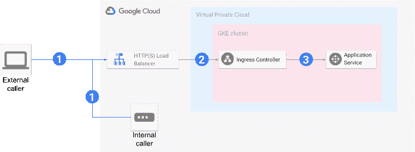
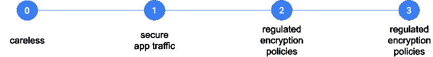

# 保护通往 GKE 的交通

> 原文：<https://medium.com/google-cloud/secure-traffic-with-gke-how-many-times-to-encrypt-61a4d607b5c9?source=collection_archive---------0----------------------->

## 传输中的数据要加密多少次？

*剧透:本文没有代码示例*😊

保护应用程序流量，也称为传输中的数据加密或应用程序通信加密，是一项标准的安全实践，几乎总是任何多层应用程序的一项要求。一种常见的做法是使用 SSL / TLS 协议。实施应声明支持的协议的版本和密码。

云原生应用通常部署在 Kubernetes 上，像谷歌云(GCP)中的 [GKE](https://cloud.google.com/kubernetes-engine/docs/concepts/kubernetes-engine-overview) 。虽然对传输中的数据进行加密的想法很简单，但它的实施和操作可能需要相当大的投资。了解云提供商如何保护传输中的数据可能会有所帮助。了解这些细节并采用特定云提供商的最佳实践可以节省开发和维护工作，并提高应用程序的运行效率。这篇文章回顾了谷歌云中的数据传输保护，以及如何将其应用于 GKE 上运行的应用程序。

# 传输中的加密

所有云提供商都声称会以某种方式保护传输中的数据。细节取决于应用的网络拓扑和云提供商的网络实施。谷歌云通过对用户不易察觉的加密来保护传输中的数据。这个过程在[白皮书](https://cloud.google.com/security/overview/whitepaper#securing_data_in_transit)和[公开文档](https://cloud.google.com/security/encryption-in-transit)中有描述。实质上，在谷歌控制的物理边界内开始并发送到谷歌控制的另一个*物理边界的每个通信都是加密的(使用 TLS 协议),无论目的地是哪里，也无论通信是使用谷歌专用网络还是网络提供商基础设施。这意味着从互联网上的客户端到 GCP 内部的虚拟机的直接连接必须由应用程序加密。*

# 公开托管在 GKE 上的应用程序

传输中的数据加密如何影响托管在 GKE 的应用程序服务？这取决于服务是如何公开以供访问的。公开托管在 GKE 的服务有两种主要方法:

*   *Via proxy* (入口或特使)该方法主要用于公开使用 HTTP(S)或 gRPC 通信协议进行通信的服务。代理(入口控制器或特使)只是运行在 GKE 集群上的另一个应用程序。代理通常暴露在 [L7 HTTP(S)负载均衡器](https://cloud.google.com/load-balancing/docs/https)的后面。
*   *直接访问*使用集群的节点 IP 和端口元组公开服务。与代理一样，节点 IP 可以直接访问或“隐藏”在 [TCP/UDP 负载平衡器](https://cloud.google.com/load-balancing/docs/network)之后。

当使用代理时，从客户端到服务的数据通过 3 个连接发送:(1)从客户端到 Google L7 LB 的连接，然后(2)从 LB 到 GKE 集群中的入口控制器，以及(3)从控制器到运行应用服务的 Kubernetes pods 之一。这是因为 Google L7 LB 和 ingress controller 都作为反向代理[工作](https://en.wikipedia.org/wiki/Reverse_proxy)。

根据定义，Google Cloud 不加密 connection 1 通信(蓝色箭头)。即使呼叫者“在 GCP 境内”,通信也会被路由到 Google 负载平衡器的公共 IP 地址，而不是传输中默认保护的对象。连接 2(灰色箭头)总是被 Google 加密，即使您配置 LB 通过 HTTPS/SSL 与后端服务通信。只有当入口控制器和应用服务在不同的[可用性区域](https://cloud.google.com/kubernetes-engine/docs/concepts/types-of-clusters#multi-zonal_clusters)中运行时，连接 3 才会被隐式加密，因为不同的可用性区域总是位于不同的物理位置。

对于直接访问，在互联网上的客户端和 GCP 的虚拟机之间建立连接。它与上图中的连接 1 相匹配。正如上一段所解释的，Google 不会隐式加密这些连接。加密必须由应用程序来实现。

# 什么时候加密？

抛开粗心的选项不谈，有两种主要的方法:

*   保护应用流量免受 [MitM](https://en.wikipedia.org/wiki/Man-in-the-middle_attack) 攻击
*   遵循受监管的加密策略

对于受管制的应用，除了加密所有连接别无选择。否则，只对连接 1 进行加密就足够了，云提供商(在这种情况下是 Google)需要努力加密云内传输的流量。

# 放弃

以上是谷歌云平台中流量加密原理的概述。本文不是安全指南。如果你需要，考虑打电话给 GCP 的专业服务中心。