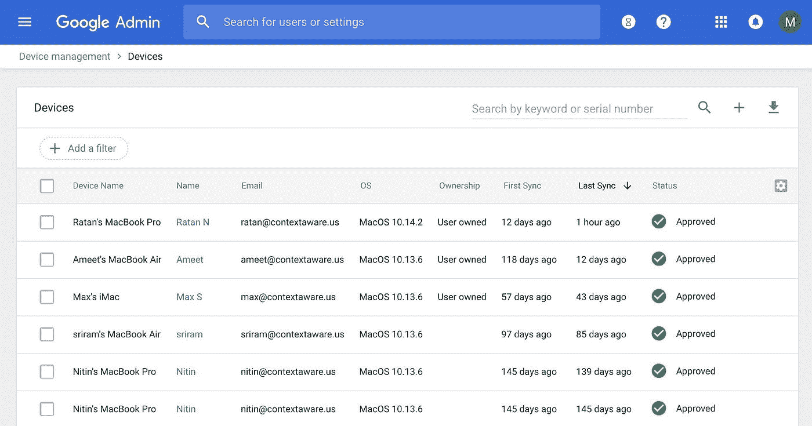

# 保护您和他们的设备:自带设备和设备管理

> 原文：<https://medium.com/google-cloud/secure-your-devices-and-theirs-byod-and-device-management-27e6360c1e34?source=collection_archive---------2----------------------->

为了做出正确的访问决策，您需要收集员工将使用的所有设备的相关数据。

在我的[上一篇文章](/google-cloud/what-is-beyondcorp-what-is-identity-aware-proxy-de525d9b3f90)中，我们探讨了从边界安全到环境感知安全的转变，现在我们将深入探讨该环境的设备方面。保护设备的方法有很多种(包括完全忽略设备安全性……哎呀),许多公司选择了某种形式的自带设备(BYOD)策略。

这些政策允许公司减少员工的硬件支出，并为人们使用他们喜欢的电脑或平板电脑提供灵活性。但是，保护企业数据和应用程序的挑战要求您转变对信任和衡量的看法。

# 这些设备有多健康？

尽管自带设备很方便，但一个大的开放性问题仍然存在:你如何知道这些设备是安全的？许多人可能有恶意软件，未打补丁的操作系统，后门或自定义 Minecraft 模块。现在他们正在查看你的公司数据。呀！


> **这些设备的维护和安全完全取决于它们的所有者。**

这对你最精明的员工来说可能行得通，但公司的其他人不知道如何维护一个安全的设备。当您允许这些设备进入您的网络和应用程序时，这可能不是您信任的最佳位置。当您的员工使用笔记本电脑访问内部客户关系工具或代码库时，您可能会遇到一些劫持者，他们会收集每一步的按键或屏幕截图。可能是为了好玩，可能是为了赚钱；没关系，我们需要阻止他们。

> 自带设备本身是不够的。
> 
> 您需要一种方法来检查设备的健康状况。

# 虚拟设备

许多公司通过部署广泛的虚拟桌面基础架构(VDI)来应对这一挑战，然后强制所有连接都通过 VPN。虽然这种*感觉*更安全，但它确实制造了额外的瓶颈，同时仍然为攻击者留下了获得他们想要的东西的主要途径。当被入侵的计算机连接到虚拟桌面时，连接可能是安全的，但仍然允许恶意屏幕阅读器或远程控制漏洞查看关键数据。


如果我们不能信任您的员工使用的设备，我们就根本不能信任他们的连接。因此，我们必须将信任建立在对这两个基础的回答之上:

> **信任人，信任设备。**

对这个人的信任来自正确的认证，最好是有一个[防钓鱼的第二因素。](https://cloud.google.com/titan-security-key/)我将在以后的文章中讨论这个问题。但是设备呢？你必须观察，然后执行，所以从收集数据开始

# 设备观察

Slager Bank & Trust 的安全团队需要一个更好的解决方案，因为他们知道自带设备无法独立工作。因此，IT 团队求助于谷歌，并开始了解谷歌的[端点验证](https://support.google.com/a/answer/9007320)服务。现在，通过安装在每个 BYOD 设备上的 Chrome 扩展或本机应用程序，Slager 平台管理团队可以**收集数据并检查员工设备的状态，使用这些信息来做出关于访问和权限的明智决策。**



一旦您为您的域打开端点验证(从 admin.google.com 开始，转到设备管理，然后设置，然后端点同步)，您就可以开始收集有关 Chrome OS、macOS 和 Windows 设备的信息，向您显示以下信息:

*   符合设备管理策略
*   用户名和电子邮件
*   同步状态
*   密码状态
*   加密状态
*   设备 ID、序列号、类型、操作系统等

这为安全和 IT 团队提供了有关设备的信息，这是第一个关键步骤。接下来，他们使用[访问上下文管理器](https://cloud.google.com/access-context-manager/docs/)来围绕访问他们在 GCP 运行的每个应用程序或资源所需的标准制定策略。为每台设备(无论是自带设备还是公司发放的设备)设置端点验证意味着 Slager IT 和安全团队现在可以了解设备状态。

这种可见性使他们能够根据自己的设备安全策略实施访问。他们有一个完整的设备列表，他们将安全工作的重点放在操作系统版本和加密状态上，以最大限度地降低数据丢失的风险。让我们看看他们制定的一些政策，以及原因。

# 访问策略和条件

凭借对设备的了解，以及就理想的访问策略(包括法律和合规团队以及其他领导)进行的一些长时间的讨论，Slager IT 团队可以制定他们的策略和限制。他们想从一个简单的测试开始，所以他们开始限制只能访问装有最新操作系统的 Chrome OS 设备的客户票务系统:

```
- devicePolicy:
    osConstraints:
      - osType: DESKTOP_CHROME_OS
        minimumVersion: 70.0.3538
```

利用 IP 范围、URL 等等，策略可以很容易地变得更加复杂和微妙。未来，他们计划使用这些条件来控制对特定项目、资源类别(例如存储)或特定类型的云资产(例如计算实例)的访问。如果您不符合访问标准，您将获得以下其中一项:


那是一杯“不”

# 把所有的放在一起

一旦他们制定了政策，员工的设备都向端点验证报告，Slager Bank & Trust 团队就打开了开关，开始进行更广泛的测试。为了扩大使用范围，他们决定限制对其案例管理工具的访问，要求 Chrome 操作系统设备安装最新版本的操作系统。他们的员工看不到成功，应用程序只是工作(在这种情况下，只显示 Hello，World)。


你好，野生世界

这有助于他们防止客户数据丢失到受损的 Windows 笔记本电脑上。现在，他们已经免受操作系统漏洞的影响，可以转而专注于确保运营和应用程序的安全。但这是另一篇文章的主题。

今天你可以使用这些工具，通过[安装端点验证](https://support.google.com/a/answer/9007320)客户端，然后[创建一些你自己的访问级别](https://cloud.google.com/access-context-manager/docs/create-access-level)。