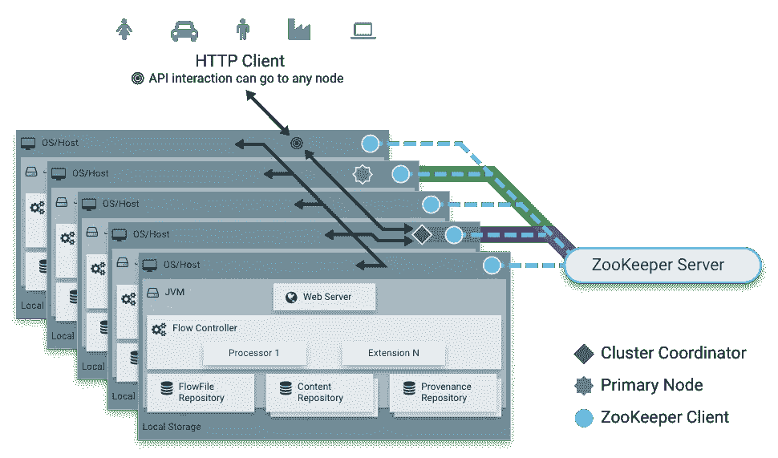
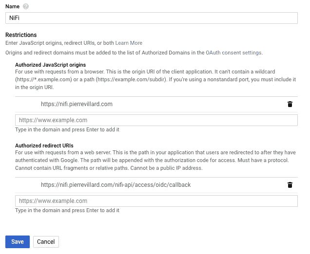
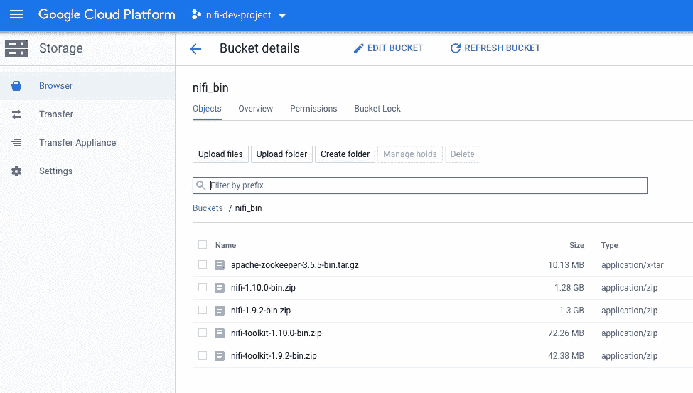
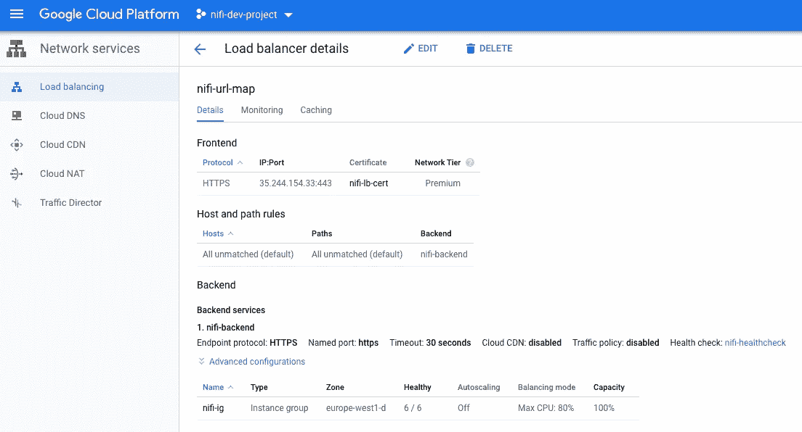
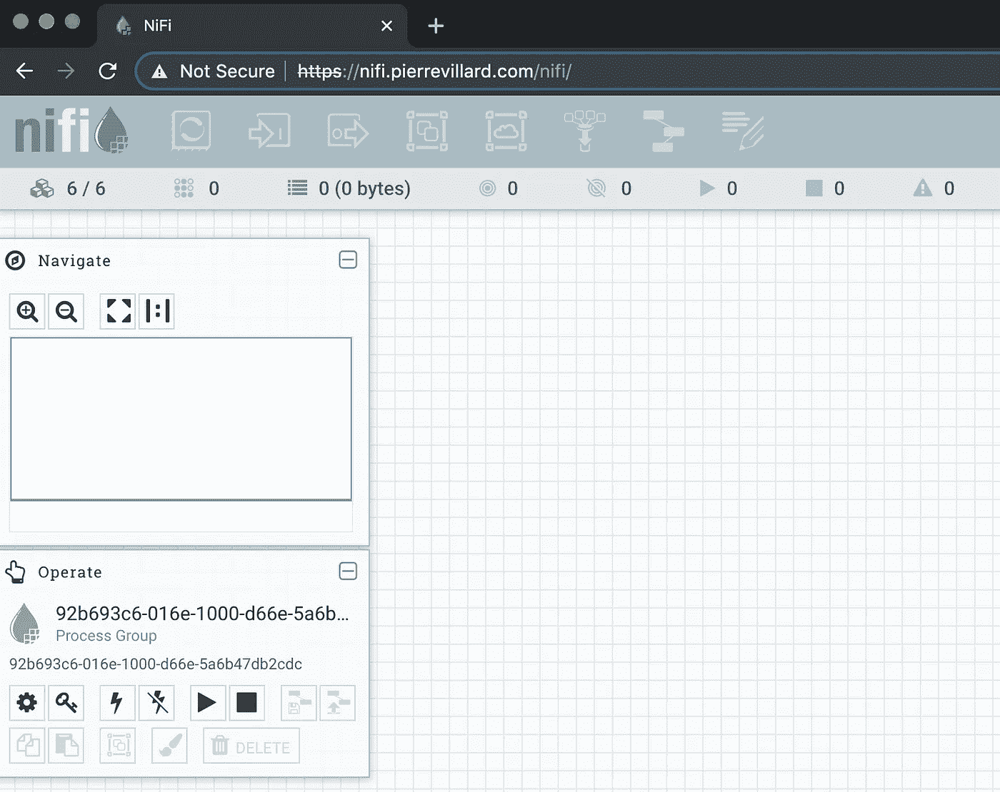
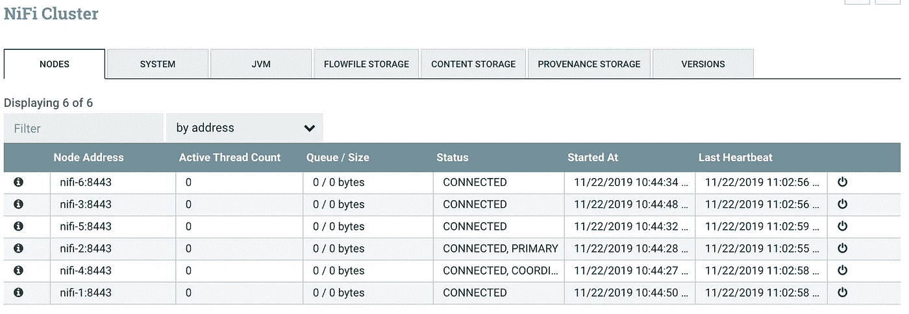

# Google 云平台上使用 Terraform 的安全 NiFi 集群

> 原文：<https://medium.com/google-cloud/secured-nifi-cluster-with-terraform-on-the-google-cloud-platform-58c0ca6624d7?source=collection_archive---------0----------------------->

这个故事是上一个故事的后续，上一个故事是关于在 Google 云平台上使用 Terraform 部署一个安全的 NiFi 实例，配置 OIDC。这次是关于部署一个安全的 NiFi 集群。

在这个故事中，我们将使用 Terraform 快速:

*   **部署一个 NiFi CA 服务器**作为生成 TLS 证书的便捷方式
*   **部署一个外部 ZooKeeper 实例**来管理集群协调和跨节点的状态
*   **部署集群在一起的 X 个安全的 NiFi 实例**
*   **配置 NiFi 使用 OpenID connect** 进行认证
*   **在 NiFi 集群前配置一个具有客户端 IP 关联的 HTTPS 负载平衡器**

*注意*——我假设你有自己的域名([你可以通过谷歌](https://domains.google/)获得一个)。它将用于将一个域映射到 NiFi 集群公开的 web 接口。在这篇文章中，我使用我自己的域名:pierrevillard.com，并将 nifi.pierrevillard.com 映射到我的 NiFi 集群。

*免责声明* —以下步骤不应用于生产部署，它绝对可以帮助您入门，但我只是使用以下步骤来启动一个安全的集群(没有人们期望的生产设置配置，如集群化 Zookeeper、存储库磁盘等)。

**如果不想看故事，想直接进入代码，** [**就在这里**](https://github.com/pvillard31/nifi-gcp-terraform/tree/master/gcp-cluster-secured-nifi-oidc) **！**

**什么是 Terraform？**

Terraform 是一个安全有效地构建、改变和版本化基础设施的工具。Terraform 可以管理现有的和受欢迎的服务提供商以及定制的内部解决方案。

配置文件描述了运行单个应用程序或整个数据中心所需组件的平台化。Terraform 生成一个执行计划，描述它将做什么来达到期望的状态，然后执行它来构建所描述的基础设施。随着配置的变化，Terraform 能够确定发生了什么变化，并创建可以应用的增量执行计划。

Terraform 可以管理的基础设施包括低级组件，如计算实例、存储和网络，以及高级组件，如 DNS 条目、SaaS 功能等。

**什么是 NiFi？**

[Apache NiFi](https://nifi.apache.org/) 是一个易于使用、功能强大且可靠的数据处理和分发系统。Apache NiFi 支持强大且可伸缩的数据路由、转换和系统中介逻辑的有向图。简而言之，Apache NiFi 是一个收集和移动数据、处理数据、清理数据并将其与其他系统集成的优秀工具。一旦需要引入数据，您就会希望使用 Apache NiFi。

**为什么是动物园管理员？**

Apache NiFi 集群

最好的方法是[参考文档](https://nifi.apache.org/docs/nifi-docs/html/administration-guide.html#clustering)，但是，简而言之……NiFi 采用零主集群范例。集群中的每个节点对数据执行相同的任务，但是每个节点对不同的数据集进行操作。其中一个节点被自动选为(通过 Apache ZooKeeper)集群协调器。然后，群集中的所有节点将向该节点发送心跳/状态信息，该节点负责断开在一段时间内未报告任何心跳状态的节点。此外，当新节点选择加入集群时，该新节点必须首先连接到当前选择的集群协调器，以便获得最新的流。

# OAuth 凭据

第一步是创建 OAuth 凭证(此时，无法使用 Terraform 完成)。

*   进入你的 GCP 项目，APIs &服务，凭证。
*   单击创建凭据，OAuth 客户端 ID。选择 Web 应用程序。
*   起个“倪飞”之类的名字。对于授权的 JavaScript 源，使用您自己的域。我用的是:[https://nifi.pierrevillard.com](https://nifi.pierrevillard.com:8443./)。对于授权重定向 URIs，我使用的是:[https://nifi . pierre villard . com/nifi-API/access/oidc/callback](https://nifi.pierrevillard.com:8443/nifi-api/access/oidc/callback)。请适应你自己的领域。
*   单击创建

创建 OAuth 凭据

一旦创建了凭证，您将获得一个客户端 ID 和一个客户端机密，您将在 Terraform 变量中需要它们。

通过创建凭证，您的域将自动添加到 OAuth 同意屏幕配置中的“授权域”列表中。它通过确保 OAuth 身份验证仅来自授权域来保护您和您的用户。

# 在 Google 云存储中下载 NiFi 二进制文件

在您的 GCP 项目中，在 Google 云存储中创建一个 bucket。我们将使用 bucket 来存储 Apache NiFi 和 ZooKeeper 二进制文件(而不是在每次部署时直接从 Apache 存储库中下载)，并且作为一种检索我们将用于 HTTPS 负载平衡器的证书的方式。

注意——你需要 Apache ZooKeeper 3.5.5+。

您可以使用以下链接下载二进制文件:

*   [阿帕奇尼菲](https://nifi.apache.org/download.html)
*   [阿帕奇动物园管理员](https://zookeeper.apache.org/releases.html#download)

它看起来是这样的:

Google 云存储中的内容

*注意——您需要使用 NiFi 工具包版本 1.9.2*

# 使用 Terraform 部署 NiFi

一旦您完成了上述先决条件，安装您的 NiFi 集群将只需要几分钟。在 GCP 项目中打开 Google Cloud 控制台，运行:

部署脚本

如果您执行上述命令，您将被提示以下信息。但是，如果不想被提示，可以直接用自己的值更新 *variables.tf* 文件来部署一切。

要更新的变量:

*   **项目** // GCP 项目 ID
*   **nifi-admin** //将成为 nifi 初始管理员的用户的 Google 邮件地址
*   **san** //将用于访问 NiFi 的 DNS 映射的 FQDN。例如:nifi.example.com
*   **proxyhost** // FQDN:将用于访问 NiFi 的端口。例如:nifi.example.com:8443
*   **ca_token** //用于防止 NiFi CA 客户端和 NiFi CA 服务器之间 MITM 的令牌(长度必须至少为 16 个字节)
*   **oauth_clientid** // OAuth 客户端 id
*   **oauth_secret** // OAuth 客户端机密
*   **instance_count** //要创建的 NiFi 实例数
*   **nifi_bucket** //包含二进制文件的 Google 云存储桶

下面是我这边的样子(更新完 *variables.tf* 文件之后):

部署脚本的执行

# 说明

第一步是在单个虚拟机上部署 NiFi 工具包，以运行 CA 服务器，该服务器用于为节点和负载平衡器生成证书。一旦部署了 CA 服务器，就会为负载平衡器生成一个证书，并将其推送到 Google 云存储桶。

您启动的脚本正在等待，直到负载平衡器证书文件在 GCS 上可用。一旦文件可用，就在本地检索文件以执行 Terraform 模板的剩余部分。它将在集群前面部署 ZooKeeper 实例以及 NiFi 实例和负载平衡器。NiFi 实例上的所有配置都已完成。一旦脚本执行完成，证书文件将被删除(本地和 GCS 上)。

# 大约 5 分钟后…

负载平衡器已创建，您可以检索负载平衡器的公共 IP:

检索 HTTPS 负载平衡器的外部公共 IP

现在，您可以更新域的 DNS 记录，以添加类型 A 的 DNS 记录，将 nifi.pierrevillard.com 重定向到负载平衡器 IP。

我现在可以使用[https://nifi.pierrevillard.com](https://nifi.pierrevillard.com)访问 NiFi 集群，并使用我在部署期间配置的管理员帐户电子邮件地址在集群上进行身份验证。

这是我的 6 节点安全 NiFi 集群启动和运行情况:

6 节点安全 NiFi 集群

6 个节点，包括选出的主节点和协调节点

我现在可以更新授权并添加其他用户/组。

*注意——您可以使用 Google 证书而不是 CA 服务器生成的证书来删除关于不受信任的证书颁发机构的警告。*

# 清洁

要销毁您创建的所有资源，您只需运行:

**地形破坏-自动批准**

像往常一样，感谢阅读，随时提问或评论这篇文章。更多关于 NiFi 的帖子可以在[https://www.pierrevillard.com/](https://www.pierrevillard.com/)找到。

