# 通过 Okta 安全认证 GKE/安托斯集群

> 原文：<https://medium.com/google-cloud/securely-authenticate-the-gke-anthos-cluster-with-okta-f475153fddf9?source=collection_archive---------0----------------------->


## Okta 是什么？

Okta 是一个安全的解决方案，为应用程序增加了认证和授权。它将保护我们的应用程序，而没有任何安全风险和部署开销。

## 目标

用 Okta 保护 Anthos 集群，这样未经验证的用户就不能访问您的集群。

首先，在 AWS 上部署 Anthos 集群，对于通过 Okta 的认证和授权，请遵循以下步骤。

# 为 SSM 创造角色和政策

SSM 是一个会话管理器，帮助管理或登录一个交互式点击浏览器的 EC2 实例。创建密钥并使用密钥登录不是最佳做法，这就是为什么使用 SSM，下面是 SSM 所需的权限。

1.  导航到 AWS 控制台。
2.  创建具有下列权限的策略。

```
{
    "Version": "2012-10-17",
    "Statement": [
        {
            "Effect": "Allow",
            "Action": [
                "ssmmessages:CreateDataChannel",
                "ssmmessages:OpenControlChannel",
                "ssmmessages:CreateControlChannel",
                "ssmmessages:OpenDataChannel",
                "ssm:UpdateInstanceInformation",
                "ssm:StartSession",
                "ssm:TerminateSession",
                "ssm:ResumeSession",
                "ssm:DescribeSessions",
                "ssm:GetConnectionStatus"
            ],
            "Resource": "*",
            "Condition": {
                "StringEquals": {
                    "aws:RequestedRegion": [
                        "us-east-1",
                        "us-east-2"
                    ],
                    "aws:PrincipalAccount": "xxxxx"
                }
            }
        }
    ]
}
```

3.创建一个角色，并将上面创建的策略添加到其中。

# 正在创建 EC2 实例

作为最佳实践，要通过 Okta 访问 AWS Anthos 集群，我们需要创建一个 EC2 实例，下面是创建实例的步骤

1.  导航到 AWS 控制台。
2.  在创建 Anthos 集群的公共子网所在的同一个 VPC 中创建一个 Amazon Linux EC2 实例。
3.  附加上面为 SSM 访问权限创建的角色。
4.  使用您的本地 IP 为端口`[PORT]`(使用大于 1024 的`[PORT]`)创建入站规则，以便通过 Okta 对集群进行身份验证。
5.  在实例内部安装 gcloud 和 kubectl。

# 创建重定向 URL

## 谷歌云重定向 URL

Cloud SDK 安装在每个开发人员的本地机器上，包括`gcloud` CLI。用于重定向 URL 的端口号应大于 1024:

`http://instance_publicIP:[PORT]/authorization-code/callback`

用大于 1024 的端口号替换 ***【端口】*** 。

当您配置 Google provider 时，将`[http://instance_publicIP:[PORT]/authorization-code/callback](http://instance_publicIP:[PORT]/authorization-code/callback/)`指定为您的重定向 URL 之一。

## 云控制台重定向 URL

云控制台的重定向 URL 是:

`https://console.cloud.google.com/kubernetes/oidc`

当您配置 OIDC 提供商时，请将`https://console.cloud.google.com/kubernetes/oidc`指定为您的重定向 URL 之一。

# 创建 Okta 应用程序

*使用商务邮箱 id*[***【https://www.okta.com/free-trial/】***](https://www.okta.com/free-trial/)**在* ***Okta*** *上创建账户，并以管理员用户身份登录**

1.  *在管理控制台中，进入**应用程序、**，然后选择**应用程序**。*
2.  *点击**创建应用集成**。*
3.  *要创建 OIDC 应用集成，选择**OIDC-OpenID 连接**和**网络应用**，然后点击下一步。*

*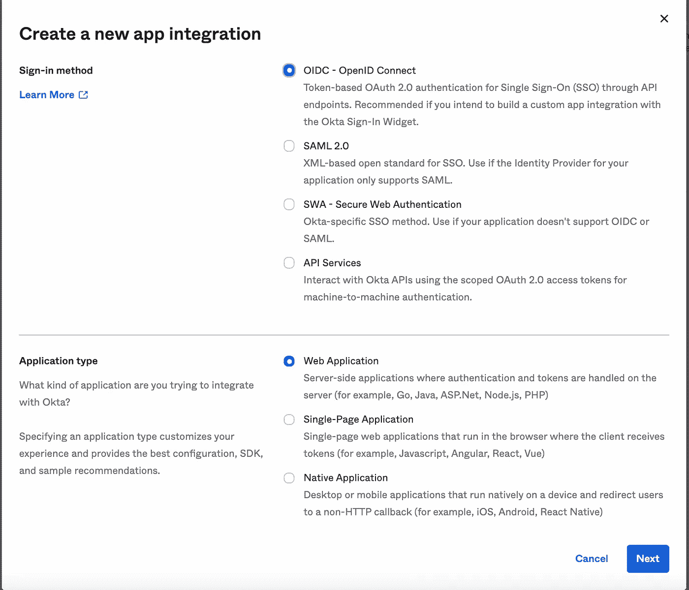*

## *配置初始设置*

*在**通用设置**中:*

1.  ***应用程序名称:**指定应用程序的名称。*
2.  ***应用程序徽标:**这是一个可选字段，您可以在其中为您的应用程序添加徽标。*
3.  *在**中配置 OpenID 连接**:*
4.  ***登录重定向 URIs** :添加您的两个重定向 URL，回想一下您在上面创建了一个用于`gcloud` CLI 的重定向 URL 和一个用于云控制台的重定向 URL。
    **登录重定向 URIs** 是 Okta 为用户的登录请求发送认证响应和 ID 令牌的地方。*
5.  ***注销重定向 URIs** (可选):在您的应用程序联系 Okta 关闭用户会话后，Okta 会将用户重定向到这些 URIs 之一。*
6.  *点击**保存**。这将创建集成，并打开设置页面来配置附加选项。*
7.  *保存客户端 ID，客户端密码会给你，以后会用到。*

*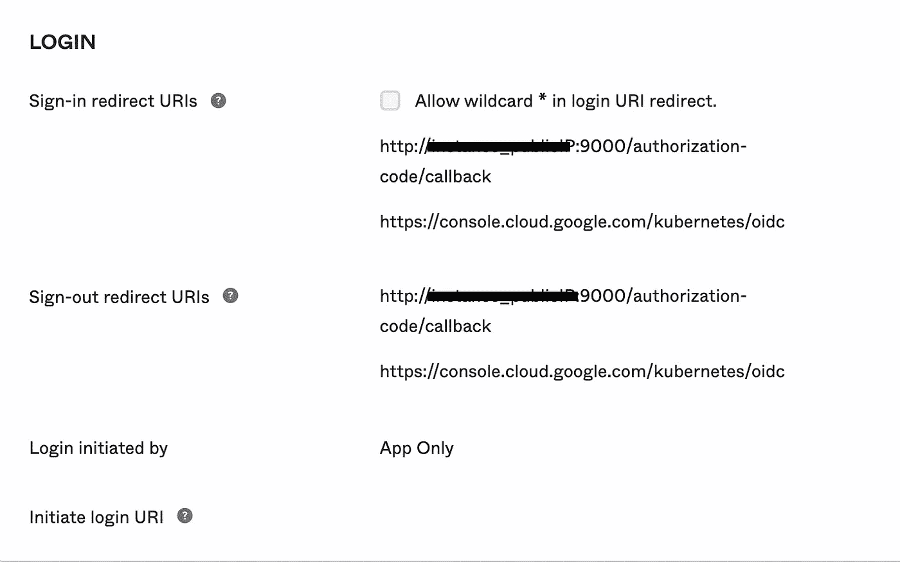*

## *启用刷新令牌*

1.  *在管理控制台中，转到**应用程序、**和**，然后选择**应用程序**。***
2.  *选择您在上面创建的 OpenID Connect 客户端应用程序。*
3.  *导航到**通用**选项卡，点击**通用设置**部分的**编辑**。*
4.  *定位到授权类型。*
5.  *选择**刷新令牌**。*
6.  *点击**保存**。*

*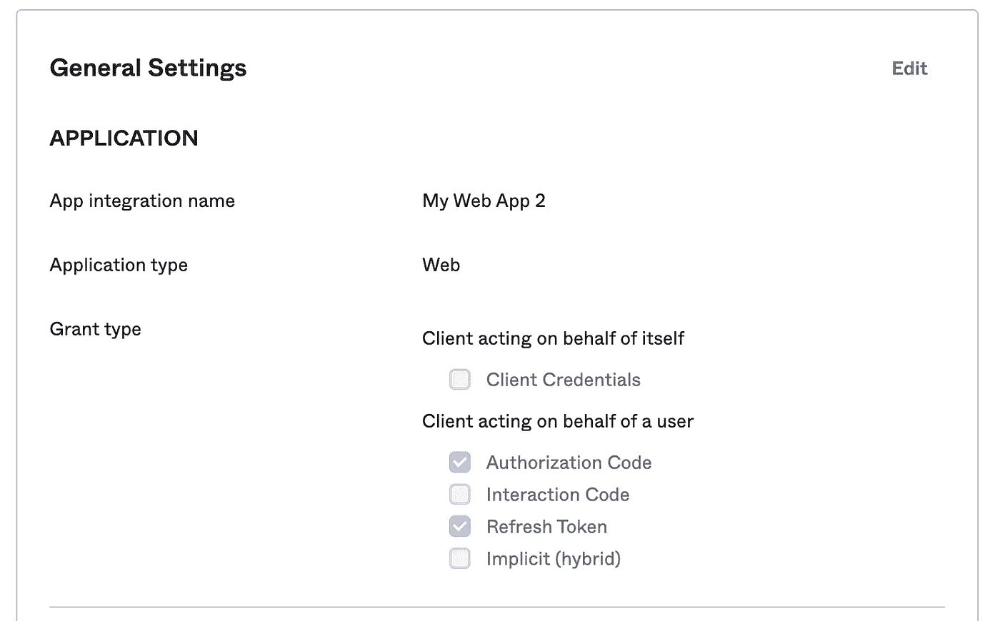*

## *添加组声明*

1.  *在管理控制台中，转到**应用程序、**和**，然后选择**应用程序**。***
2.  *选择您在上面创建的 OpenID Connect 客户端应用程序。*
3.  *导航到选项卡上的**符号，并点击 **OpenID 连接 ID 令牌**部分中的**编辑**。***
4.  *在**组索赔类型**部分，选择**过滤器**。*
5.  *在 **Group claims filter** 部分，保留默认名称`groups`(如果该框为空，则添加它)，选择 **Matches regex，**并输入`.*`以返回所有用户组。*

*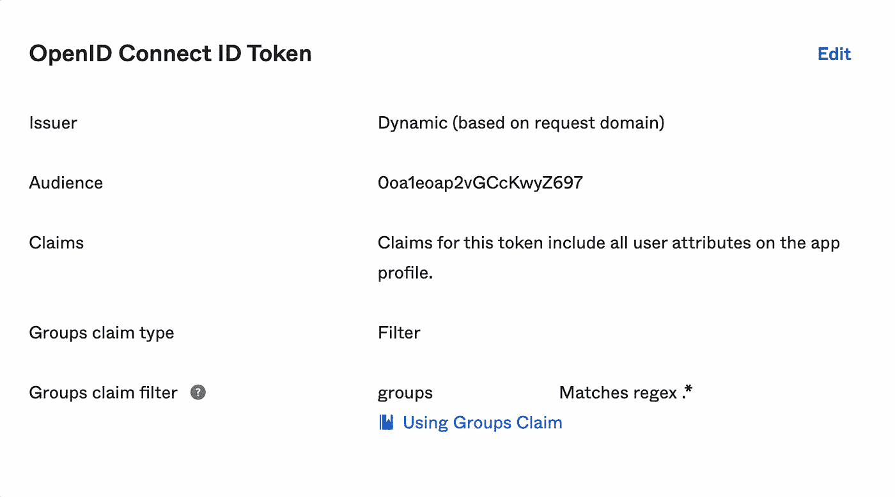*

# *添加人员*

## *启动向导*

1.  *在管理控制台中，转到**目录，**然后选择**人员**。*
2.  *点击**添加人员**。*
3.  *输入名字、姓氏和用户名作为电子邮件。*
4.  *点击**保存**或**保存并添加另一个**。*

# *创建 Okta 集团*

## *启动向导*

1.  *在管理控制台中，转到**目录，**然后选择**组**。*
2.  *点击**添加群组**。*
3.  *在**名称**字段中输入该组的名称。*
4.  ***描述**。这是一个可选字段，我们可以在其中输入组的描述。*
5.  *点击**保存**。*

*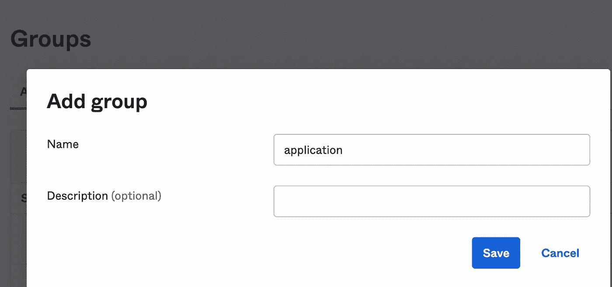*

## *将用户添加到组*

1.  *在管理控制台中，转到**目录，**然后选择**组**。*
2.  *选择您在上面创建的组。*
3.  *点击**分配人员**。*
4.  *在**搜索**字段中，输入该人的姓名。*
5.  *点击`+`将该人分配到该组。*
6.  *点击**保存**。*

*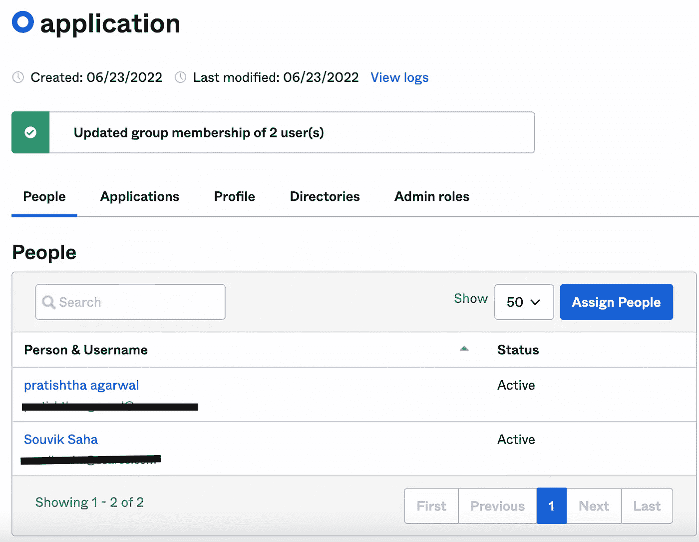*

## *将应用程序添加到组*

1.  *在管理控制台中，转到**目录，**然后选择**组***
2.  *选择您在上面创建的组。*
3.  *点击**应用、**和**和**，然后选择**分配应用**。*
4.  *请在**搜索**字段中输入我们之前创建的应用程序的名称。*
5.  *点击**分配**将应用分配到组中。*
6.  *点击**完成。***

*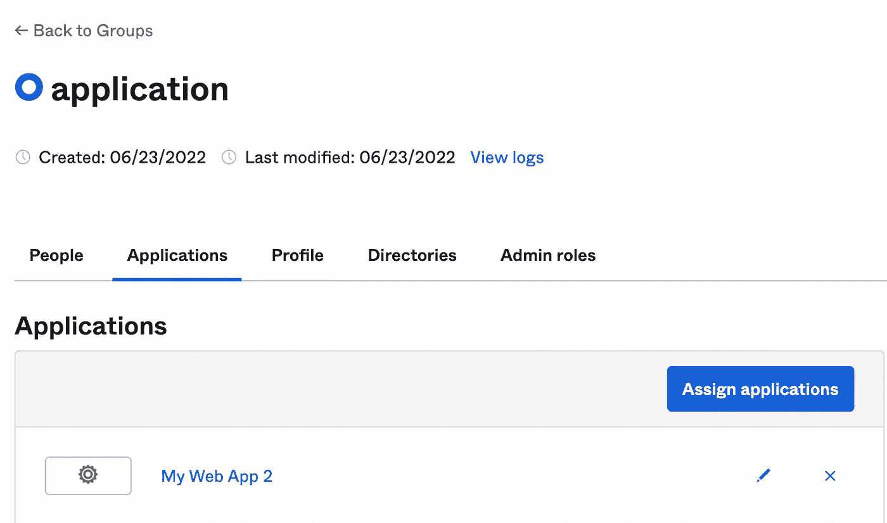*

# *配置授权服务器*

## *添加组范围*

1.  *在管理控制台中，转到**安全、**，然后选择 **API。***
2.  *选择您想要配置的授权服务器。示例:默认*
3.  *导航至**范围**选项卡。*
4.  *点击**添加范围**。*
5.  *输入名称作为**组**。*
6.  *输入显示短语作为**组**。*
7.  *可选。在描述字段中输入范围的描述。*
8.  *选择**包含在公共元数据中**。*
9.  *点击**创建**。*

*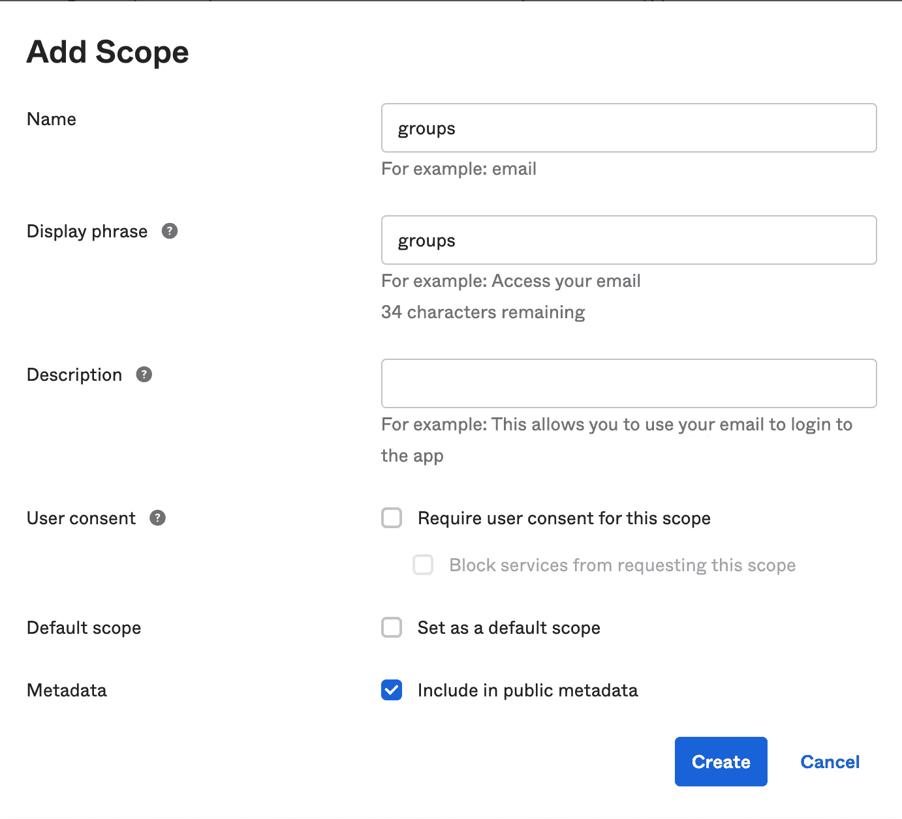*

## *添加组索赔*

1.  *在管理控制台中，转到**安全、**，然后选择 **API。***
2.  *选择您想要配置的授权服务器。示例:默认*
3.  *导航至**索赔**选项卡。*
4.  *点击**添加索赔**。*
5.  *输入名称作为**组**。*
6.  *配置声明设置:*
7.  ***包含在令牌类型**中:选择 **ID 令牌**为**总**。*
8.  ***值类型**:选择**组**。*
9.  ***过滤器**:选择**匹配正则表达式**，输入`.*`。*
10.  *选择**任何范围**为**包含在**字段中。*
11.  *点击**创建**。*

*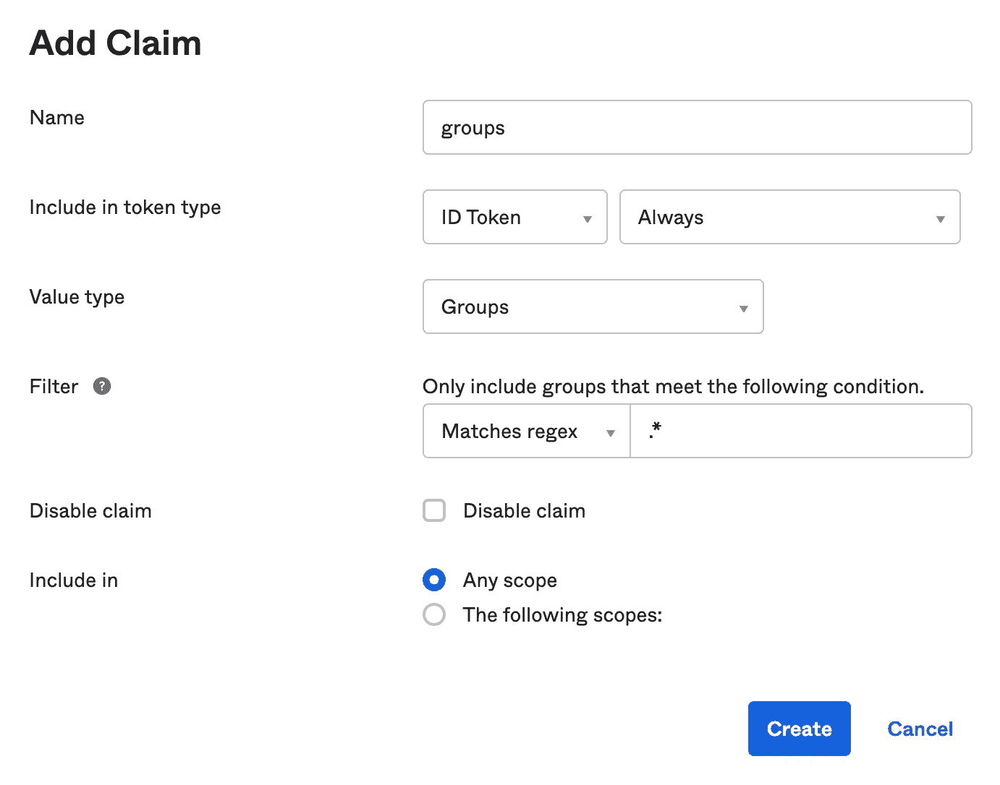*

***从 EC2 实例**连接到 Anthos 集群*

*`gcloud container hub memberships get-credentials cluster_name`*

***编辑配置文件***

*`kubectl --kubeconfig=KUBECONFIG_PATH edit ClientConfigs default -n kube-public`*

*将***KUBECONFIG _ PATH***替换为集群的 kube config 文件的路径，例如`$HOME/.kube/config`*

*文本编辑器加载集群的 ClientConfig 资源。如下所示，在文件中添加零件。不要修改任何已经写入的默认数据。*

# *配置您的集群*

```
*spec:
  authentication:
    - aws:
        region: XXXX
      name: oidc
      oidc:
        clientID: CLIENT_ID
        clientSecret: CLIENT_SECRET
        cloudConsoleRedirectURI: XXXX
        groupsClaim: groups
        issuerURI: ISSUER_URI
        kubectlRedirectURI: http://instance_publicIP:[PORT]/authorization-code/callback
        scopes: offline_access,email,profile,groups
        userClaim: email*
```

*带有`anthos-auth`组件的`gcloud`工具的更新版本*

*`$ gcloud components update`*

*`$ gcloud components install anthos-auth`*

*使用 gcloud anthos 创建配置*

*`$ gcloud anthos create-login-config --kubeconfig $HOME/.kube/config`*

*在 **Linux** 和 **macOS** 上，默认情况下，该文件位于`~/.kube/config`*

*这个命令生成一个包含配置信息的文件(kubectl-anthos-config.yaml)。*

***将配置文件复制到一个位置***

*`$ cp kubectl-anthos-config.yaml $HOME/.config/google/anthos/kubectl-anthos-config.yaml`*

## *登录配置默认目录*

*每个操作系统存储配置文件的默认位置如下:*

***Linux***

*`$HOME/.config/google/anthos/kubectl-anthos-config.yaml`，其中`$HOME`是用户的主目录。*

***macOS***

*`$HOME/Library/Preferences/google/anthos/kubectl-anthos-config.yaml`，其中`$HOME`是用户的主目录。*

***窗户***

*`%APPDATA%/google/anthos/kubectl-anthos-config.yaml`，其中`%APPDATA%`是用户的应用数据目录。*

# *为您的用户集群创建 RBAC 策略*

*定义一个`**Role**`。将下面的 YAML 复制到名为`**role.yaml**`的文件中*

```
*apiVersion: rbac.authorization.k8s.io/v1
kind: Role
metadata:
  namespace: role-test
  name: pod-reader
rules:
- apiGroups: [""]
  resources: ["pods", "services", "secrets", "nodes"]
  verbs: ["get", "watch", "list"]*
```

*定义一个`**RoleBinding**`。将下面的 YAML 复制到一个名为`**role-binding.yaml**`的文件中*

```
*apiVersion: rbac.authorization.k8s.io/v1
kind: RoleBinding
metadata:
  name: read-pods
  namespace: role-test
subjects:
- kind: Group
  name: XXXX    # "name" is case sensitive, name of the group which is created in okta console
  apiGroup: rbac.authorization.k8s.io
roleRef:
  kind: Role 
  name: pod-reader 
  apiGroup: rbac.authorization.k8s.io*
```

*使用`kubectl`将`**role.yaml**`和`**role-binding.yaml**`应用到您的集群*

# *鉴定*

*使用`gcloud Anthos auth login`通过您的登录配置验证您的集群。*

## *默认*

*`$ gcloud anthos auth login --cluster CLUSTER_NAME`*

*用完全限定的集群名替换 ***集群名*** 。比如`projects/my-gcp-project/locations/global/awsClusters/cluster_name`。*

## *可选参数*

*`gcloud Anthos auth login`支持以下可选参数:*

```
*gcloud anthos auth login --cluster CLUSTER_NAME \
--user USERNAME --login-config ANTHOS_CONFIG_YAML \
--login-config-cert LOGIN_CONFIG_CERT_PEM \
--kubeconfig=KUBECONFIG --dry-run*
```

*该命令将重定向到 Okta 登录页面，对用户进行身份验证，一旦身份验证成功，该特定用户将能够访问服务。因此，用户将有权通过 Okta 访问 Anthos 集群。*

*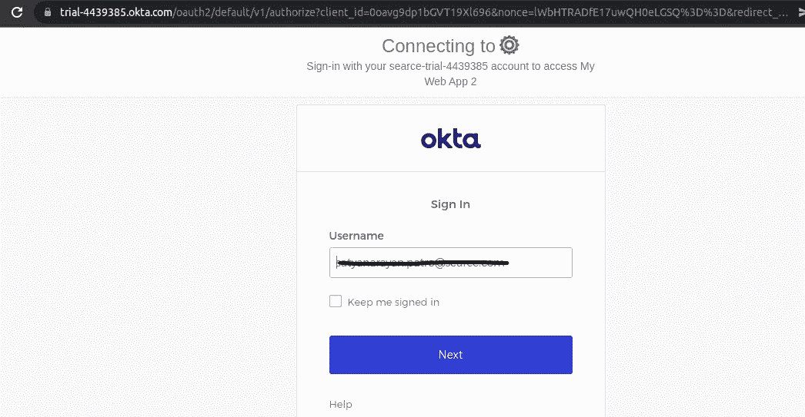**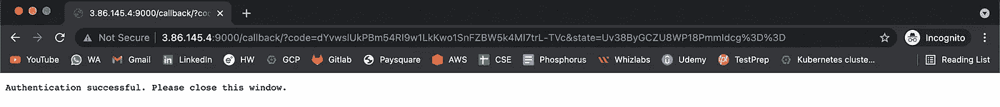**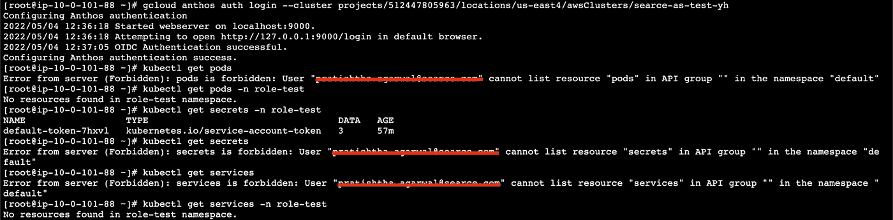*

# *登录配置示例*

```
*apiVersion: authentication.gke.io/v2alpha1
kind: ClientConfig
metadata:
  creationTimestamp: null
spec:
  authentication:
  - aws:
      region: XXXX
    name: oidc
    oidc:
      clientID: XXXX
      clientSecret: XXXX
      cloudConsoleRedirectURI: XXXX
      groupsClaim: groups
      issuerURI: XXXX
      kubectlRedirectURI: http://instance_publicIP:[PORT]/authorization-code/callback
      scopes: offline_access,email,profile,groups
      userClaim: email
  certificateAuthorityData: XXXX
  internalServer: ""
  name: projects/XXXX/locations/XXXX/awsClusters/XXXX
  server: https://gke-p5jkh55ausbq-cp-6047815259562bb2.elb.us-east-1.amazonaws.com
status: {}*
```

## ***通过 OKTA 在特定应用程序级别将 IP 列入白名单，以限制对 Anthos 集群的访问***

*仅供参考:Okta 的管理员用户将成功通过身份验证，即使他的 IP 地址没有被列入白名单。*

1.  *在管理控制台中，转到**安全，**然后选择**网络。***
2.  *点击 **LegacyIpZone** 编辑按钮。*
3.  *在网关 IP 中添加允许列表 IP。*

*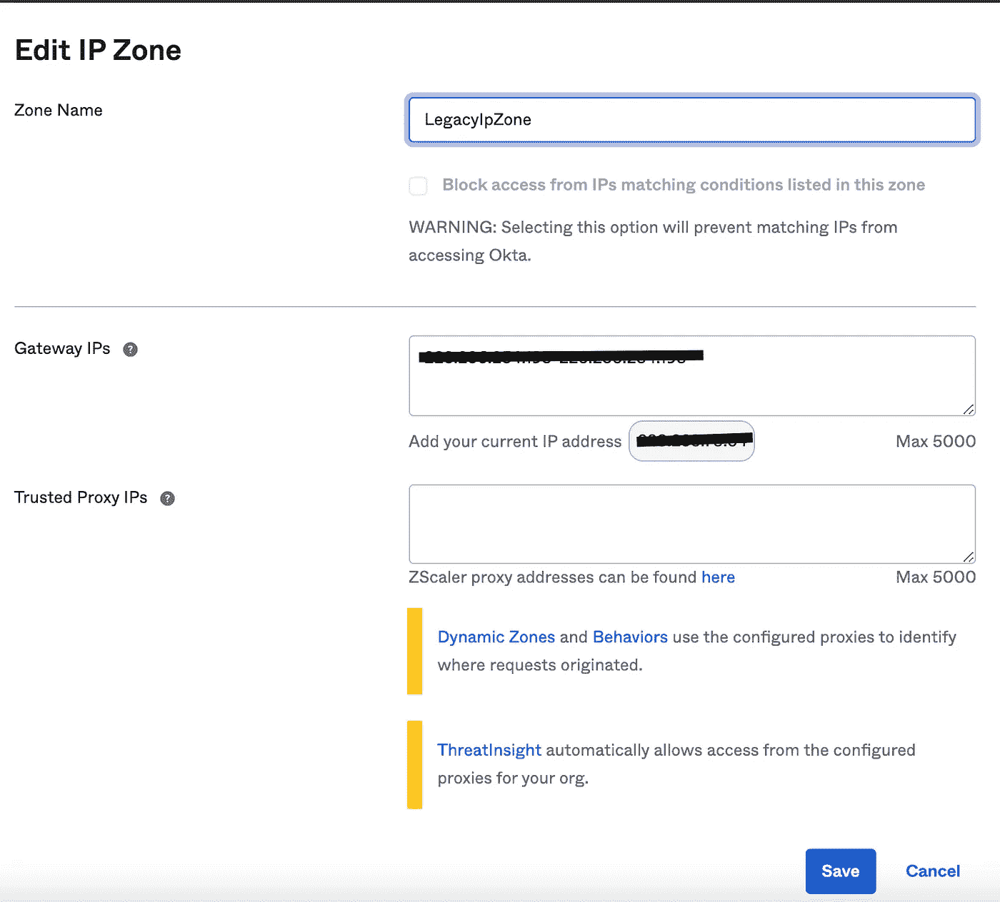*

1.  *在管理控制台中，转到**安全、**，然后选择**验证策略。***
2.  *仅供参考:在继续下一步之前，请确保应用程序已附加到默认策略。*

*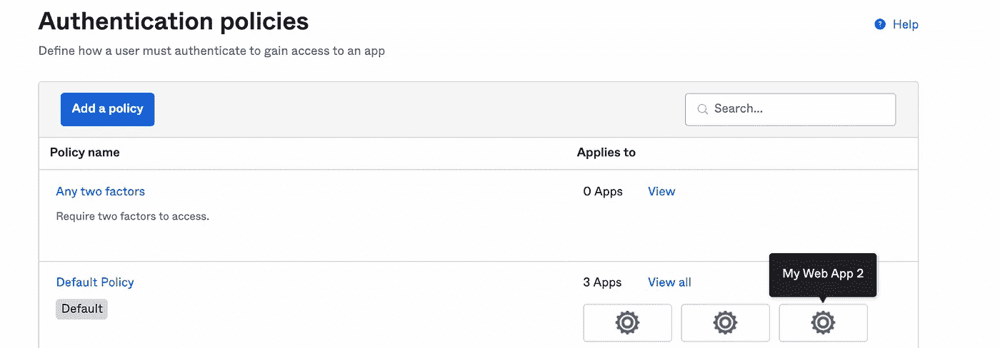*

*3.单击默认策略。*

*4.点击添加规则。*

*5.输入您的规则名称。*

*6.在以下任一区域中选择**:**，在网关 IPs 中选择**区域**。*

*7.在**访问**和**保存**中选择**认证成功后允许**单选按钮*

*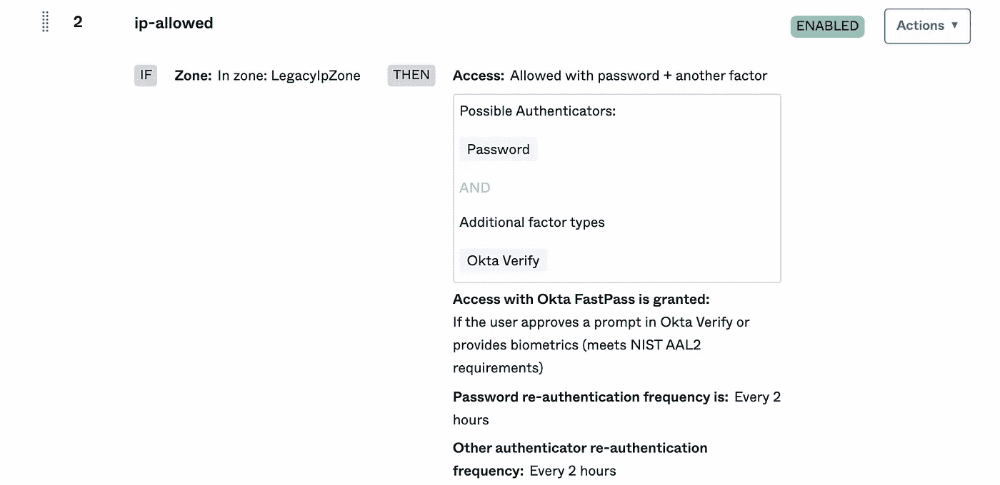*

*8.或者，我们可以拒绝 IP 并在相同的默认策略中创建一个规则。*

*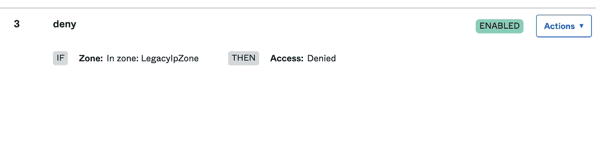*

*如果 IP 是 okta 用户的白名单，那么它将显示下面的成功响应*

*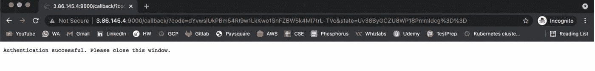**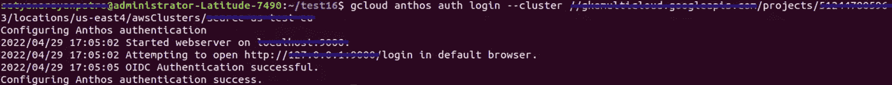*

*如果 IP 不在 okta 用户的白名单中，那么它将显示下面的不成功响应*

*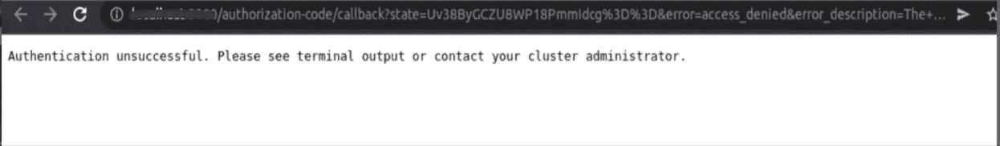**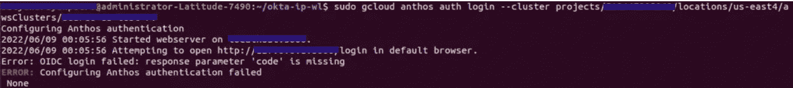*

## *感谢您的阅读:)*

*有问题吗？如果你有任何问题，我很乐意在评论中阅读。*

*在 LinkedIn 上关注我。*

## *快乐学习！！*