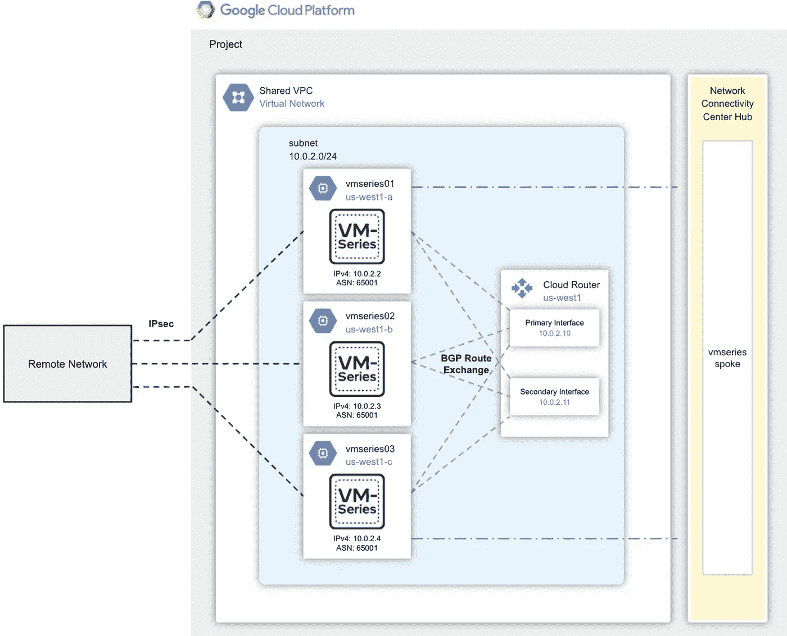
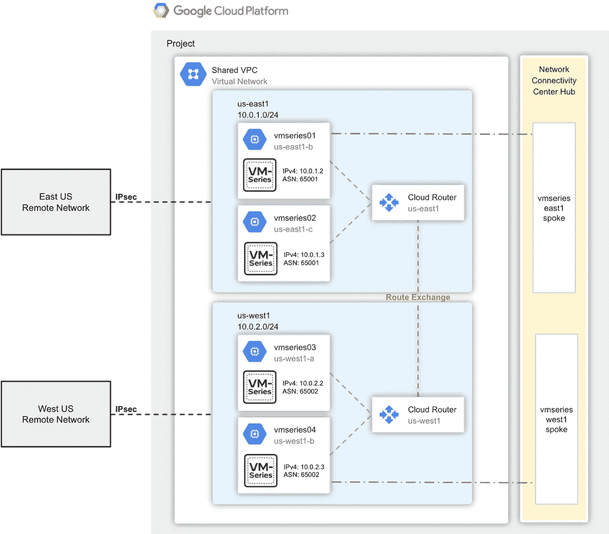

# 使用 Palo Alto VM 系列防火墙保护 GCP 的应用程序

> 原文：<https://medium.com/google-cloud/securing-applications-in-gcp-with-palo-alto-vm-series-firewall-68fd4f2eabc5?source=collection_archive---------1----------------------->

Palo Alto Networks VM 系列下一代 Google Cloud 防火墙是业界领先的虚拟化防火墙，通过下一代安全功能保护应用程序和数据，在应用程序级别提供卓越的可见性、精确控制和威胁预防。通过与 Google Cloud 的网络连接中心集成，VM 系列保护全球连接网络的能力得到了进一步增强。

网络连接中心允许您使用中心辐射式体系结构进行网络连接管理。有了这种架构，您可以在站点之间进行数据传输。Network Connectivity Center 还包括路由器设备功能，允许您使用第三方网络虚拟设备建立站点到站点或站点到云的连接。

# VM 系列+网络连接中心的工作原理

有几个组件用于将 VM 系列与 Network Connectivity Center 集成。

***网络连接中心—轴辐***

Network Connectivity Center 利用轴辐式模型为最终用户提供了一个管理各种网络间全球连接的单一位置。集线器是一种全球资源，它通过一个简单而独特的连接模型连接相连的辐条。网络连接中心 hub 在 VM 系列和所有其他连接的分支之间创建一个全网状网络模型。VM 系列作为路由器设备分支连接到集线器。

**谷歌云路由器 **

VM 系列通过与 VPC 的云路由器建立 BGP 对等关系来与网络连接中心集成。这种关系支持远程网络和谷歌云 VPC 架构路由之间的完整路由传播。

一旦在云路由器和 VM 系列之间建立了对等关系，来自远程网络、Google Cloud VPCs 和 VM 系列的路由就会被交换。如果 VM 系列防火墙部署在同一个分支内，集线器会向所有防火墙通告相同的前缀。这种行为为集线器到防火墙的流量启用了等价多路径(ECMP)。如果您更喜欢将流量隔离到专用防火墙，VM 系列应该放在具有不同 ASN 的独立分支中。

# 示例拓扑

VM 系列可用于保护从远程网络到 Google Cloud VPCs 的流量。通过与 Network Connectivity Center 的集成，实现了以下成果:

*   通过最佳路径选择保护远程流量到 Google Cloud。
*   传输中的数据加密。
*   全球 VPC 网络的安全远程通信。

## 拓扑 1:区域 VPC

在这种拓扑中，虚拟机系列防火墙部署在同一区域的不同分区中。防火墙作为单个辐条连接到网络连接中心集线器，并与 VPC 的云路由器建立 BGP 会话。在内部，IPsec 隧道在每个防火墙上创建并终止。往返于远程网络和 VPC 的路由通过 VM 系列和云路由器进行交换。VM 系列防火墙宣传相同的前缀和 MED 值，以利用谷歌云的 ECMP 功能。ECMP 的使用提供了分区分布式防火墙之间的冗余和负载分布。

## 拓扑 2:全局 VPC

该架构显示了分布在两个 Google 云区域的两个 VM 系列对(在同一个 VPC 中)。每个防火墙对都是连接到网络连接中心集线器的独立辐条。云路由器 BGP 与其各自的区域防火墙对对等。来自远程站点的路由通过云路由器通告给 VM 系列防火墙。云路由器本身交换路由以提供全网状连接。

