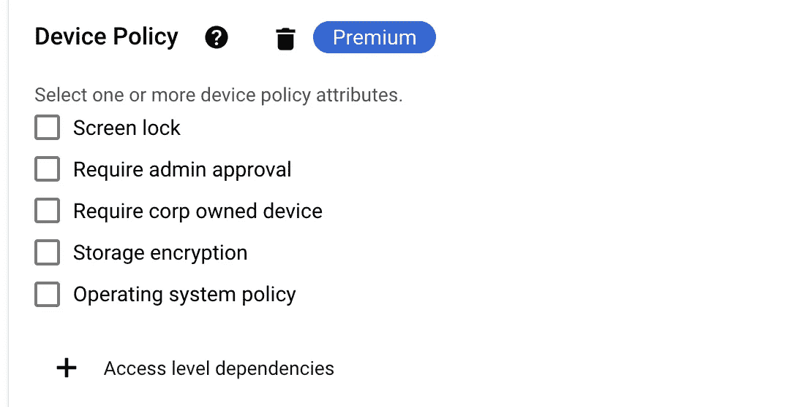

# 使用零信任保护 BeyondCorp Enterprise (BCE)的云应用

> 原文：<https://medium.com/google-cloud/securing-cloud-applications-with-beyondcorp-enterprise-bce-using-zero-trust-bb8e88b57f39?source=collection_archive---------2----------------------->

**BeyondCorp** Enterprise 是一个基于谷歌全球网络的零信任解决方案，它为客户提供对内部 web 应用程序、SaaS 应用程序和云资源的简单而安全的访问，并提供集成的威胁和数据保护。

BeyondCorp 在三个方面提供保护。它提供实时的端到端连续保护。

**访问保护—安全访问应用—**

BCE 使用户能够从世界上任何地方的任何设备安全地访问托管在云和内部的任何应用程序，而无需 VPN。

**威胁和数据保护-**

BeyondCorp Enterprise 可防止用户访问网络钓鱼或可疑网站，并对文件传输进行敏感检查，阻止对恶意内容的访问，防止故意渗透或意外数据丢失。并生成不安全活动的警报、日志和报告。

**应用程序保护-**

**应用程序保护**隔离用户，仅向他们提供所需应用程序的访问权限。这种级别的细分对客户很有吸引力，因为它可以防止客户网络中的横向移动。不像虚拟专用网。该解决方案不授予对网络的全面访问。BCE 为任何访问内部应用程序、SaaS 应用程序、云资源和私有数据的人提供无缝、安全的体验。它还管理前端 SSL，以确保加密，这是用于所有谷歌信任服务。

**BeyondCorp 企业组件:**

BeyondCorp 访问服务——在不同接入点实施环境感知访问。

1.  身份感知代理(web、TCP)
2.  云控制台/VPC SC
3.  应用程序/端点连接器
4.  谷歌工作空间

BeyondCorp Trust Services —基于身份、设备和活动的环境感知访问评估和分析。

1.  访问上下文管理器
2.  端点验证和分析
3.  基于证书的访问
4.  超越公司联盟

BeyondCorp 安全服务—基于内容的敏感数据、恶意内容或不安全/未经授权的 URL 分析。

1.  URL 过滤
2.  恶意软件防护
3.  数据和发现保护
4.  Chrome 集成

**GCP beyond corp 企业:**

BCE 通过访问上下文管理器配置提供额外的设备策略保护层。可以使用多个设备策略属性来控制访问。

BCE 的访问上下文管理器设备策略

欲了解更多关于 GCP 博扬企业的 hans-on lab，请访问 Qwiklab。