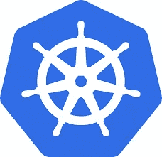

# 使用 Google 的容器优化操作系统和分布式容器映像保护容器

> 原文：<https://medium.com/google-cloud/securing-containers-with-googles-container-optimized-os-distroless-container-images-11449caba2ec?source=collection_archive---------0----------------------->



计算基础设施有许多层。对于许多现代的容器化云工作负载，您需要考虑用于运行 Kubernetes 工作节点的虚拟机映像，以及用作容器化应用程序基础的容器映像。

谷歌对这两者都有解决方案。容器优化操作系统是由 Google 维护的操作系统，专门设计用于在计算引擎虚拟机上运行 Docker 容器。“distrolles”Docker 镜像由 google 维护，其中仅包含应用程序及其运行时依赖项。结合起来，您将拥有一个强大而安全的云计算基础架构基准。

# 容器优化的操作系统

如果您运行 Google Kubernetes 引擎集群，您会发现默认的节点映像现在是带有 containerd (cos_containerd)的容器优化操作系统。[谷歌的文档](https://cloud.google.com/container-optimized-os/docs/concepts/features-and-benefits)称其提供了以下特性和优势:

*   开箱运行容器
*   较小的攻击面
*   默认情况下锁定
*   自动更新

基于 Chromium 的操作系统实现了这些承诺。它最小的操作系统占用意味着它被削减到只满足有效运行容器的基本需求。它优化了容器运行时的效率，同时通过不包含不必要的工具和包来减少攻击面。

它通过不可变的根文件系统、无状态配置、安全加固的内核、以安全为中心的默认值、加固的默认防火墙、高级实例访问支持，实现了“默认锁定”的承诺。它由谷歌构建，遵循其持续的漏洞扫描和响应，并经历了彻底的测试过程。

最后但同样重要的是，运行容器优化操作系统的 Google Kubernetes 引擎上的节点支持节点自动升级。这些节点可以自动安排升级，并顺利部署。无需额外努力即可确保最大的正常运行时间和安全性。

# 分发 Docker 图像

谷歌的容器优化操作系统对优化和安全性的设计关注也适用于谷歌容器工具项目[“distroles”镜像](https://github.com/GoogleContainerTools/distroless)。

> “发行版”映像只包含您的应用程序及其运行时依赖项。它们不包含包管理器、shells 或任何其他您期望在标准 Linux 发行版中找到的程序。

容器化的应用程序应该被设计成无状态和不可变的。如果这是真的，那么在容器上安装包管理器、shell 和许多其他标准程序和实用程序就没有什么价值了。在大多数情况下，所有这些工具所做的就是增加你的容器的攻击面！

通过删除不必要的软件包，Distroless images 大大降低了安全风险，同时也提高了运营效率。

让我们来看看 nodejs 应用程序的容器安全扫描结果。首先，我们将直接在 node:16 docker 映像上查看一个 nodejs 应用程序。然后，我们将它与同一个 nodejs 应用程序进行比较，但是增加了一个 docker 构建阶段，将它复制到 distroless 节点映像。

原始 Dockerfile 文件:

```
FROM node:16 AS build-env
COPY . /app
WORKDIR /appRUN npm ci CMD [“app.js”]
```

然后，我们可以使用 Docker 和 Snyk 构建并扫描该图像，查找漏洞。

```
docker build . -t node-example
snyk container test node-example
```

呀。扫描结果摘要看起来不太好。

```
Tested 412 dependencies for known issues, found 392 issues.
```

所以让我们来解决这个问题。让我们添加第二个 Docker 构建阶段，将构建的 nodejs 应用程序复制到一个 distroless 基础映像。

```
FROM node:16 AS build-env
COPY . /app
WORKDIR /appRUN npm ciFROM gcr.io/distroless/nodejs:16
COPY --from=build-env /app /app
WORKDIR /app
CMD ["app.js"]
```

然后再次构建和扫描。这些结果看起来好多了。

```
Tested 9 dependencies for known issues, found 10 issues.
```

# 分散安全优势

*   缩减攻击面
*   不再执行交互式外壳
*   可通过连署验证

# 分散运营优势

*   大幅缩小图像尺寸。“gcr . io/distro less/static-debian 11”小于标准“debian”容器映像大小的 2%。这可以大大减少 CI/CD 管道中的快速测试时间。
*   减少浪费在容器漏洞扫描误报上的时间。你的安全团队会感谢你的。

# 结论

通过在谷歌的容器优化操作系统上运行 distroless 容器，你将从它们的许多特性中受益。对于现代云原生应用程序来说，这些安全和操作特性是必不可少的。