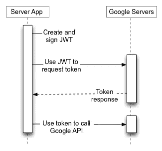

# 使用服务帐户保护 Google Cloud 功能以及如何在服务-服务通信中访问它。

> 原文：<https://medium.com/google-cloud/securing-google-cloud-functions-using-service-account-and-how-to-access-it-in-service-service-582b4b5f210?source=collection_archive---------0----------------------->

Google Cloud 的功能提供了一种机制来确保你的每个端点只被允许的用户使用，即删除 IAM 中的`allUsers`和`allAuthenticatedUsers`。对于服务到服务的通信，当您想要创建对 Google Cloud Functions 端点的请求时，可以使用服务帐户来生成令牌。Google OAuth 2.0 系统支持服务器到服务器的交互，例如 web 应用程序和 Google 服务之间的交互。对于这种情况，您需要一个服务帐户，它是属于您的应用程序的帐户，而不是属于单个最终用户的帐户。您的应用程序代表服务帐户调用 Google APIs，因此用户不直接参与。在应用程序获得访问令牌后，它在一个 [HTTP 授权请求头](https://developer.mozilla.org/docs/Web/HTTP/Headers/Authorization)中将令牌发送给 Google API。



服务器到服务器的通信。

Google 提供了各种客户端。在这种情况下，我使用的是 [Javascript](https://github.com/google/google-api-javascript-client) 。在使用您的服务帐户之前，请确保您已经为您的服务帐户添加了 [Google Cloud Functions IAM](https://cloud.google.com/functions/docs/reference/iam/roles) 中的`roles/cloudfunctions.invoker`角色。要获取 JWT 客户端的电子邮件和密钥，您可以使用您的服务帐户:

```
const fs = require('fs')const SERVICE_ACCOUNT_PATH = process.env.GOOGLE_APPLICATION_CREDENTIALSconst rawServiceAccountData = fs.readFileSync(SERVICE_ACCOUNT_PATH)const serviceAccount = JSON.parse(rawServiceAccountData)
```

在 caller 应用程序中，您可以添加以下代码，以便在每次想要创建对云函数端点的请求时获取令牌。

```
const { google } = require('googleapis')app.post('/<path>', function (req, res, next) {
 const ENDPOINT = <your-endpoint>
 const client = new google.auth.JWT({
   email: serviceAccount.client_email,
   key: serviceAccount.private_key,
 })
 client.fetchIdToken(ENDPOINT).then(idToken => {
    const options = {
     method: 'POST',
     uri: `${ENDPOINT}/<your-path>`,
     body: req.body,
     json: true
    }
   request(options).auth(null, null, true, idToken)
  .then(response => {
    res.send(response)
  })
  .catch (error => {
    console.log('[ERROR]', error.message)
    res.send("Not authorized.")
  })
 })
})
```

就这些，希望有帮助🙂。谢谢并祝你愉快。👋