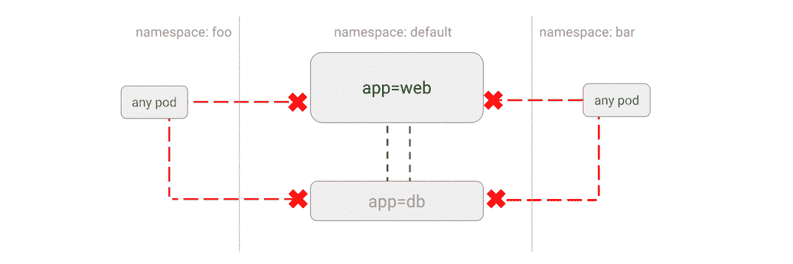

# 保护 Kubernetes 集群网络

> 原文：<https://medium.com/google-cloud/securing-kubernetes-cluster-networking-cec708b82510?source=collection_archive---------0----------------------->

网络策略是 Kubernetes 的一项新功能，用于配置允许分组之间以及与其他网络端点之间进行通信的方式。换句话说，它在 Kubernetes 集群上运行的 pod 之间创建了防火墙。本指南旨在解释 Kubernetes 网络政策的未成文部分。

这个特性在 Kubernetes 1.7 版本中已经变得稳定。在本指南中，我将解释网络策略在理论和实践中是如何工作的。你可以直接跳转到[kubernetes-Network policy-tutorial](https://github.com/ahmetb/kubernetes-networkpolicy-tutorial)知识库获取网络政策的例子或者阅读[文档](https://kubernetes.io/docs/concepts/services-networking/network-policies/)。

# 你能用网络策略做什么

默认情况下，Kubernetes 不会限制集群内部运行的 pod 之间的流量。这意味着任何 pod 都可以连接到任何其他 pod，因为没有防火墙控制群集内的流量。

网络策略为您提供了一种以声明方式配置允许哪些 pod 相互连接的方法。这些策略可以很详细:您可以指定允许哪些名称空间进行通信，或者更具体地说，您可以选择在哪些端口号上实施每个策略。

目前，您无法使用此功能对来自 pod 的传出(出口)流量实施策略。它在 Kubernetes 1.8 的路线图上。

与此同时， [Istio](https://istio.io/) 开源项目是一个替代方案，它支持 egress 策略和更多内容，有原生的 Kubernetes 支持。

# 为什么网络策略很酷

网络策略是 ACL(访问控制列表)在计算中使用了几十年的奇特说法。这是 Kubernetes 在 pod 之间进行 ACLs 的方式。就像任何其他 Kubernetes 资源一样，网络策略是通过声明性清单配置的。它们是您的应用程序的一部分，您可以在您的源代码库中修改它们，并将它们与您的应用程序一起部署到 Kubernetes。

**近乎实时地应用网络策略。**如果您在 pod 之间有打开的连接，应用阻止该连接的网络策略将导致连接立即终止。这种近乎实时的增益伴随着网络性能的小幅下降，请阅读[基准测试](http://blog.kubernetes.io/2016/09/high-performance-network-policies-kubernetes.html)了解更多信息。

# 示例使用案例

以下是网络策略的常见使用案例的简要列表。您可以在 GitHub 上的[kubernetes-network policy-tutorial](https://github.com/ahmetb/kubernetes-networkpolicy-tutorial)中找到更多带有示例清单的用例示例。

*   [拒绝应用程序的所有流量](https://github.com/ahmetb/kubernetes-networkpolicy-tutorial/blob/master/01-deny-all-traffic-to-an-application.md)


*   [限制应用程序的流量](https://github.com/ahmetb/kubernetes-networkpolicy-tutorial/blob/master/02-limit-traffic-to-an-application.md)


*   [拒绝名称空间中所有非白名单流量](https://github.com/ahmetb/kubernetes-networkpolicy-tutorial/blob/master/03-deny-all-non-whitelisted-traffic-in-the-namespace.md)


*   [拒绝来自其他名称空间的所有流量](https://github.com/ahmetb/kubernetes-networkpolicy-tutorial/blob/master/04-deny-traffic-from-other-namespaces.md)



*   [允许来自其他名称空间的流量](https://github.com/ahmetb/kubernetes-networkpolicy-tutorial/blob/master/06-allow-traffic-from-a-namespace.md)


*   [允许来自外部客户端的流量](https://github.com/ahmetb/kubernetes-networkpolicy-tutorial/blob/master/08-allow-external-traffic.md)


# 网络策略是如何实施的

网络策略实现不是 Kubernetes 的核心功能。尽管您可以向 Kubernetes 主服务器提交一个 NetworkPolicy 对象，但是如果您的网络插件没有实现网络策略，它将不会被执行。

请参见本页中支持网络策略的网络插件示例。支持策略的网络插件的一些例子是 [Calico](https://kubernetes.io/docs/tasks/administer-cluster/calico-network-policy/) 和 [Weave Net](https://kubernetes.io/docs/tasks/administer-cluster/weave-network-policy/) 。

[谷歌容器引擎(GKE)](https://cloud.google.com/container-engine) 通过在集群中预装 Calico 网络插件，为网络策略提供 alpha 支持。

网络策略适用于连接，而不是网络数据包。注意，连接允许双向传输网络数据包。例如，如果 Pod A 可以连接到 Pod B，则 Pod B 可以在同一连接上回复 Pod A。这并不意味着 Pod B 可以启动与 Pod A 的连接。

# 网络策略剖析

NetworkPolicy 只是 Kubernetes API 中的另一个对象。您可以为一个群集创建许多策略。网络策略有两个主要部分:

1.  **目标单元:**哪些单元的入口(传入)网络连接应由策略强制实施？这些窗格是根据它们的标签选择的。
2.  **入口规则:**哪些 pod 可以连接到目标 pod？这些窗格也是通过它们的标签或名称空间来选择的。

下面是一个更具体的网络策略清单示例:

```
kind: NetworkPolicy
apiVersion: networking.k8s.io/v1
metadata:
  name: api-allow
spec:
  podSelector:
    matchLabels:
      app: bookstore
      role: api
  ingress:
  - from:
      - podSelector:
          matchLabels:
            app: bookstore
  - from:
      - podSelector:
          matchLabels:
            app: inventory
```

这个示例策略允许带有`app=bookstore`或`app=inventory`标签的 pod 连接到带有`app=bookstore`和`role=api`标签的 pod。你可以把这理解为“让书店应用的微服务访问书店 API”。

# 如何评估网络策略

尽管网络策略的[设计文档](https://github.com/kubernetes/community/blob/b77ecdb66c2c77d1fc36b0b87e8caa5bca6aff88/contributors/design-proposals/network-policy.md#behavior)和 [API 参考](https://kubernetes.io/docs/api-reference/v1.7/#networkpolicyspec-v1-networking)可能看起来很复杂，但我还是设法将其分解为几个简单的规则:

*   如果网络策略选择了一个 pod，则发往该 pod 的流量将受到限制。
*   如果没有为 pod 定义网络策略，则所有命名空间中的所有 pod 都可以连接到该 pod。这意味着默认情况下，如果没有为特定的 pod 定义网络策略，则存在一个隐含的“允许全部”。
*   如果到 Pod A 的流量受到限制，而 Pod B 需要连接到 Pod A，则至少应该有一个选择 Pod A 的网络策略，该策略有一个选择 Pod B 的入口规则

当涉及到跨名称空间网络时，事情变得有点复杂。简而言之，它是这样工作的:

*   网络策略只能对与部署网络策略的 pod 位于同一命名空间的连接实施规则。
*   `podSelector`入口规则只能选择部署网络策略的同一命名空间中的 pod。
*   如果 Pod A 需要连接到另一个名称空间中的 Pod B，并且强制实施到 Pod B 的网络，则 Pod B 中需要有一个策略，该策略具有选择 Pod A 的`namespaceSelector`。

# 网络策略是真正的安全吗？

网络策略限制点对点网络，这是保护群集流量和应用程序的一部分。它们不是执行深度数据包检查的防火墙。

您不应该仅仅依靠网络策略来保护集群中各单元之间的流量。具有相互认证的 TLS(传输层安全性)等方法使您能够加密流量并在微服务之间进行认证。

看看[谷歌云安全白皮书](https://cloud.google.com/security/whitepaper#a_global_network_with_unique_security_benefits)(重点是我的):

> *深度防御描述了保护谷歌网络免受外部攻击的多层防御。只有满足我们安全要求的授权服务和协议才允许通过它；其他任何内容都会自动删除。* ***行业标准防火墙和访问控制列表(ACL)用于实施网络隔离。*** *所有流量都通过定制的 GFE (Google 前端)服务器进行路由，以检测和阻止恶意请求和分布式拒绝服务(DDoS)攻击。此外，GFE 服务器只允许与内部的受控服务器列表进行通信；* ***这种“默认拒绝”配置可防止 GFE 服务器访问非预期的资源。*** *[…]*
> 
> *数据在互联网上或网络内传输时，容易受到未经授权的访问。[……]前面提到的谷歌前端(GFE)服务器支持* ***强加密协议，如 TLS*** *以保护客户设备与谷歌的网络服务和 API 之间的连接。*

正如我前面所说的，像 Istio 和 linkerd 这样的服务网格项目在这个领域提供了有希望的进步。例如，Istio 可以使用 TLS 加密您的微服务之间的流量，并透明地实施网络策略，而无需更改您的应用程序代码。

# 了解更多信息

如果你有兴趣尝试网络策略，最简单的开始方式是[创建一个 GKE 集群](https://github.com/ahmetb/kubernetes-networkpolicy-tutorial/blob/master/00-create-cluster.md)。您还可以阅读:

感谢 Matthew DeLio 和 Daniel Nardo 审阅本文的草稿。

*原载于* [*ahmet.im*](https://ahmet.im/blog/kubernetes-network-policy/) *。如果你喜欢这篇文章，你可以在 Twitter 上关注我，或者通过电子邮件订阅我的博客(不超过一篇文章/月)。*

*学到了什么？点击“鼓掌”👏传播消息。*