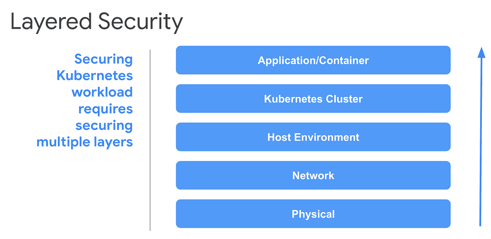
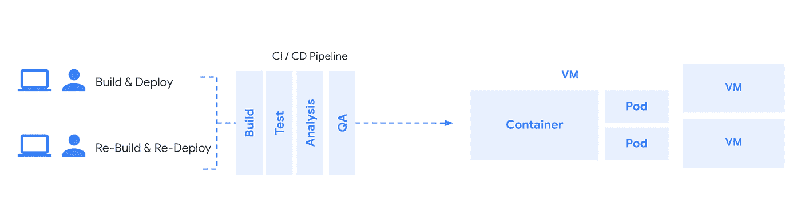
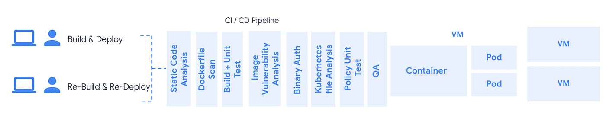
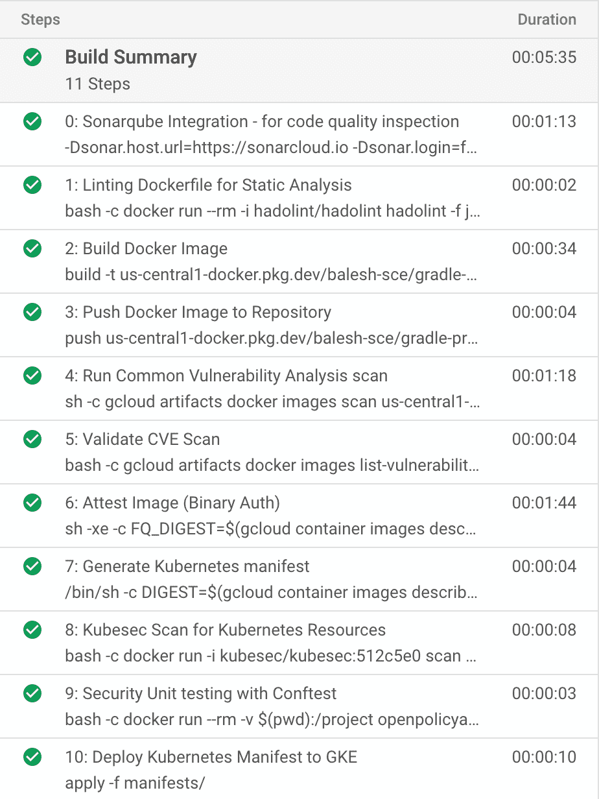
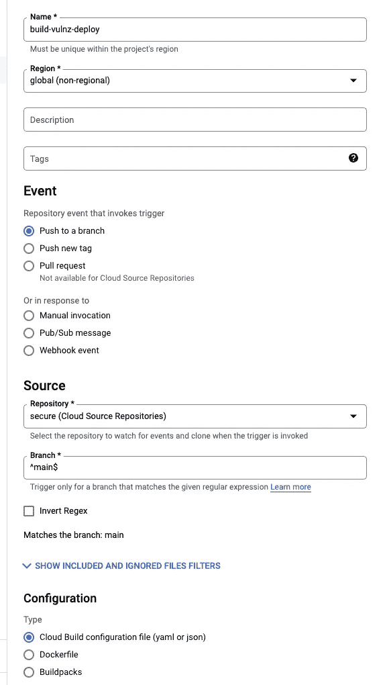
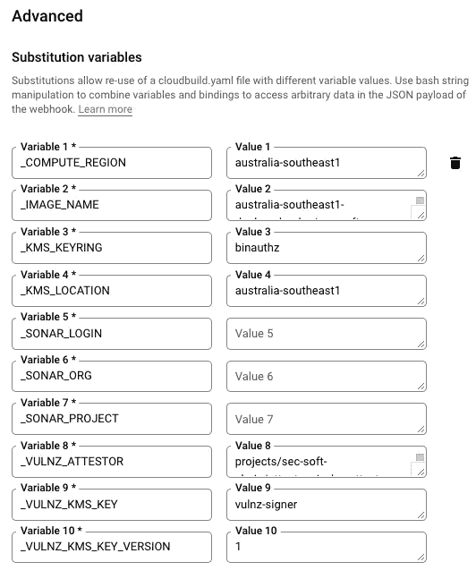
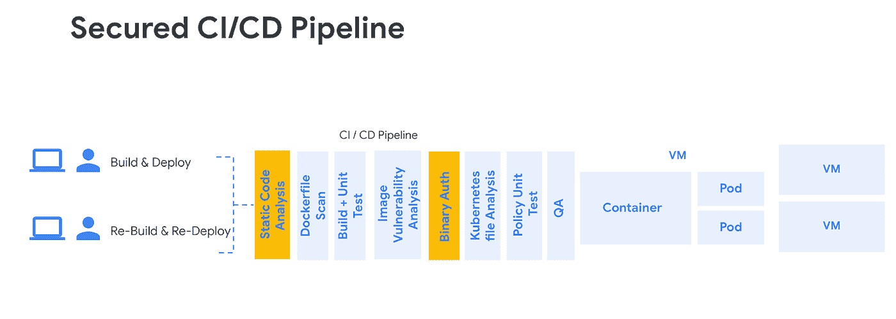
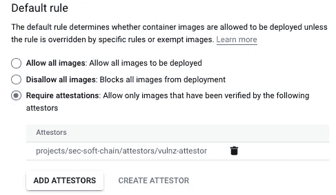

# 保护谷歌云上的软件供应链

> 原文：<https://medium.com/google-cloud/securing-software-supply-chain-on-google-cloud-b7b485fa023b?source=collection_archive---------1----------------------->

这最初是由 Balesh Kumar 写的，不幸的是，在我们有时间开源相关代码之前，他已经离开了我的团队。

# 介绍

本文档的目的是提供一个分步指南和相关工件，为容器化的工作负载设置一个安全的 CI/CD 管道。虽然整体生态系统安全性涉及多个层面，从保护底层物理基础设施到实际代码，但本文主要关注可在 CI/CD 管道中实现自动化的应用程序/容器安全性。



# 系统概况

在本演示中，我们使用一个简单的 java 应用程序(带有 Gradle build 工具),该应用程序通过 Dockerfile 进行容器化，CI/CD 管道通过 cloudbuild.yaml 进行配置。用于实施此 CI/CD 管道的其他技术/服务包括:

1.  [云源储存库](https://cloud.google.com/container-registry/docs)
2.  [神器登记处](https://cloud.google.com/artifact-registry/docs)
3.  [云构建](https://cloud.google.com/build/docs/concepts)
4.  [容器分析](https://cloud.google.com/container-analysis/docs/container-analysis)
5.  [二进制授权](https://cloud.google.com/binary-authorization/docs)
6.  [强力霉素](https://github.com/hadolint/hadolint)
7.  [库贝塞克](https://kubesec.io/)
8.  [测试](https://www.conftest.dev/)
9.  [声纳座](https://www.sonarqube.org/)

# 云构建步骤:

# 标准 CI/CD 管道

标准的 CI/CD 管道通常由 4-5 个阶段组成。例如，构建、测试、静态代码分析和 QA 阶段。这些阶段更侧重于开发人员，它只确保代码构建成功，它遵循一般的编码指南，并满足功能需求。



这些阶段中使用的工件如下:

*   应用代码
*   Dockerfile 文件
*   容器图像
*   Kubernetes 清单文件

所有这些人工制品都容易受到安全失误的影响。以下是它们可能引入的漏洞列表。

**申请代码**

*   SQL 注入
*   跨站点脚本
*   代码注入
*   没有“HttpOnly”标志的敏感 Cookies
*   还有更多

扫描工具:[声纳座](https://www.sonarqube.org/)

**Dockerfile**

*   增加攻击面不必要的库和包
*   易受攻击的非官方基础映像
*   没有标签的图像使应用程序不一致
*   还有更多

扫描工具: [Hadolint](https://github.com/hadolint/hadolint) ， [Confest](https://www.conftest.dev/)

**集装箱图像**

*   可能导致拒绝服务的缓冲区溢出
*   可能影响机密性的整数溢出
*   命令注入
*   还有更多

扫描工具:[容器分析](https://cloud.google.com/container-analysis/docs/container-analysis)

**Kubernetes 清单文件**

*   违反最小特权原则
*   可变文件系统增加了攻击面
*   对 CPU 和内存没有限制会通过资源耗尽导致 DOS
*   赋予容器不必要的能力会导致系统调用攻击面的增加

扫描工具: [Kubesec](https://kubesec.io/) ， [Confest](https://www.conftest.dev/)

# 安全的 CI/CD 管道

再努力一点，我们就可以处理上一节中讨论的所有漏洞。



# 演示范围和输出

本演示的 CI/CD 渠道由 11 个步骤组成，其中 7 个步骤旨在提高供应链的安全性。

构建步骤可以分为几类，如*静态代码分析*、*构建+推送*、*漏洞扫描+证明*和*生成 Kubernetes 清单+部署*。



云构建步骤

# 演示设置

首先创建一个项目，或将现有项目设置为默认项目:

```
gcloud projects create $PROJECT_ID –set-as-default
```

更改以下以**粗体**显示的变量，以匹配您的项目名称、地区和区域:

```
PROJECT_ID=**sec-soft-chain**
REGION=**australia-southeast1**
ZONE=**australia-southeast1-b**
```

然后运行这个脚本，脚本中的注释解释功能

```
# Enable the Required API’s
gcloud services enable container.googleapis.com
gcloud services enable artifactregistry.googleapis.com
gcloud services enable ondemandscanning.googleapis.com
gcloud services enable cloudkms.googleapis.com
gcloud services enable binaryauthorization.googleapis.com# Create a cluster for this demo, note these settings should not be used for a production cluster 
gcloud beta container - project $PROJECT_ID clusters create "software-secure-supply" - zone $ZONE - no-enable-basic-auth - cluster-version "1.22.8-gke.201" - release-channel "regular" - machine-type "e2-standard-4" - image-type "COS_CONTAINERD" - disk-type "pd-standard" - disk-size "100" - metadata disable-legacy-endpoints=true - scopes "[https://www.googleapis.com/auth/devstorage.read_only](https://www.googleapis.com/auth/devstorage.read_only)","[https://www.googleapis.com/auth/logging.write](https://www.googleapis.com/auth/logging.write)","[https://www.googleapis.com/auth/monitoring](https://www.googleapis.com/auth/monitoring)","[https://www.googleapis.com/auth/servicecontrol](https://www.googleapis.com/auth/servicecontrol)","[https://www.googleapis.com/auth/service.management.readonly](https://www.googleapis.com/auth/service.management.readonly)","[https://www.googleapis.com/auth/trace.append](https://www.googleapis.com/auth/trace.append)" - max-pods-per-node "110" - num-nodes "2" - logging=SYSTEM,WORKLOAD - monitoring=SYSTEM - enable-ip-alias - network "projects/$PROJECT_ID/global/networks/default" - subnetwork "projects/$PROJECT_ID/regions/$REGION/subnetworks/default" - no-enable-intra-node-visibility - default-max-pods-per-node "110" - no-enable-master-authorized-networks - addons HorizontalPodAutoscaling,HttpLoadBalancing,GcePersistentDiskCsiDriver - enable-autoupgrade - enable-autorepair - max-surge-upgrade 1 - max-unavailable-upgrade 1 - enable-shielded-nodes - node-locations $ZONE - enable-binauthz# Create an Artifact Repository
gcloud artifacts repositories create "${PROJECT_ID}-repo" - location=$REGION - repository-format=docker# Allow the Cloud Build Service Account to run scans
gcloud projects add-iam-policy-binding $PROJECT_ID - member=serviceAccount:$(gcloud projects describe $PROJECT_ID - format="value(projectNumber)")[@cloudbuild](http://twitter.com/cloudbuild).gserviceaccount.com - role=roles/ondemandscanning.admin# Allow the Cloud Build Service Account to deploy to GKE
gcloud projects add-iam-policy-binding $PROJECT_ID - member=serviceAccount:$(gcloud projects describe $PROJECT_ID - format="value(projectNumber)")[@cloudbuild](http://twitter.com/cloudbuild).gserviceaccount.com - role=roles/container.developer# Allow Cloud Build Service Account the permission to attest
gcloud projects add-iam-policy-binding $PROJECT_ID - member=serviceAccount:$(gcloud projects describe $PROJECT_ID - format="value(projectNumber)")[@cloudbuild](http://twitter.com/cloudbuild).gserviceaccount.com - role=roles/containeranalysis.notes.attacher
```

# 设置云源存储库

1.  将[演示库](https://github.com/GoogleCloudPlatform/cloud-build-software-delivery)克隆到您的本地机器上，并将其复制到您自己的[云资源](https://source.cloud.google.com/repo/create)库中

```
git clone [https://github.com/GoogleCloudPlatform/cloud-build-software-delivery](https://github.com/GoogleCloudPlatform/cloud-build-software-delivery)
```

2.将克隆的回购推送到您自己的[云资源](https://source.cloud.google.com/repo/create))存储库中:

```
# Create a repo called sec-soft-chain
gcloud source repos create sec-soft-chain# Configure credentials
gcloud init && git config — global credential.[https://source.developers.google.com.helper](https://source.developers.google.com.helper) gcloud.sh# Add your new repo as a remote repo called google
git remote add google [https://source.developers.google.com/p/$PROJECT_ID/r/sec-soft-chain](https://source.developers.google.com/p/$PROJECT_ID/r/sec-soft-chain)# Push code to the new repo called google
git push — all google
```

# 创建云构建触发器

1.  在云控制台中，转到[云构建触发器](https://console.cloud.google.com/cloud-build/triggers)
2.  启用 API(如果尚未启用)
3.  单击创建触发器
4.  在触发器设置窗口中，输入以下详细信息:

*   在名称字段中，输入 build-vulnz-deploy
*   对于事件，选择“推送到分支”
*   在存储库字段中，从菜单中选择您的存储库
*   在“分行”字段中，输入“^main$”
*   对于配置，选择云构建配置文件(yaml 或 json)
*   在 Location 中，选择 Repository，输入默认值/cloudbuild.yaml



云构建触发器

5.添加以下替代变量对:

*   _IMAGE_NAME 与来自云源存储库的图像
*   _COMPUTE_REGION 的值为 australia-southeast1(或您在开始时选择的区域)。
*   值为 binauthz 的 _ KMS _ 密钥环
*   _KMS_LOCATION，值为澳大利亚-东南部 1(或您在开始时选择的地区)。
*   值为 VULNZ-证明者的 _ VULNZ _ 证明者
*   值为 vulnz-signer 的 _VULNZ_KMS_KEY
*   _ VULNZ _ KMS _ 密钥 _ 版本，值为 1
*   _SONAR_LOGIN 目前可以为空
*   _SONAR_PROJECT 目前可以是空白的
*   _SONAR_ORG 目前可以为空



替代变量

6.单击创建。

**恭喜你！！！**

至此，您已经成功配置了 CI/CD 管道的大部分内容，不包括下面突出显示的两个阶段，您可以在此暂停，通过注释掉 cloudbuild.yaml 中的最后两个阶段来测试工作(第 17–24 行和第 62–78 行)。



强调 2 个步骤的安全 CI/CD 渠道

接下来，我们将配置:

1.  用于静态代码分析的 Sonarqube
2.  二元授权

# 配置 Sonarqube 立方体

## 修改 cloudbuild.yaml

repo 中的 Cloudbuild.yaml 文件需要一些更改，这些更改可以通过替换以下变量的每个实例来手动完成:

或者下面的脚本应该按照前面配置的变量来设置这些:giot

```
sed -i “s/<ZONE>/$ZONE/g” cloudbuild.yaml
sed -i “s/<REGION>/$REGION/g” cloudbuild.yaml
sed -i “s/<PROJECT_ID>/$PROJECT_ID/g” cloudbuild.yaml
sed -i “s/<REPO>/$PROJECT_ID-repo/g” cloudbuild.yaml
sed -i “s/<IMAGE>/image/g” cloudbuild.yaml
<PROJECT_ID>/<REPO>/<IMAGE>
“${PROJECT_ID}-repo”
$REGION-docker.pkg.dev/$PROJECT_ID/$PROJECT_ID-repo/
```

## 设置 Sonarqube

1.  克隆[sonar cube 云构建器](https://github.com/GoogleCloudPlatform/cloud-builders-community/tree/master/sonarqube)库
2.  通过运行以下命令创建自定义生成器:

```
git clone [https://github.com/GoogleCloudPlatform/cloud-builders-community](https://github.com/GoogleCloudPlatform/cloud-builders-community)
cd sonarqube
gcloud builds submit . — config=cloudbuild.yaml
```

3.配置 sonar cube(我们将在线配置 sonar cube，但是您也可以设置自己的 sonar cube 服务器并进行配置)。

使用您的 github 帐户登录到 [https://sonarcloud.io](https://sonarcloud.io/)

*   通过导航到帐户页面创建令牌，然后单击安全选项卡
*   接下来，我们需要使用“分析新项目”选项在 sonarcloud 中设置项目。注意:使用手动设置选项
*   记下您创建的令牌、项目密钥和组织名称
*   更新云构建触发变量:
*   _ 声纳 _ 组织
*   _ 声纳 _ 项目
*   _ 声纳 _ 登录

# 二元授权

注意:下面给出了从[该](https://cloud.google.com/architecture/binary-auth-with-cloud-build-and-gke)链接借用的简化动作列表

## 使用云构建构建并注册自定义构建步骤

1.  克隆 Google Cloud build 社区回购:

```
*git clone* [*https://github.com/GoogleCloudPlatform/gke-binary-auth-tools*](https://github.com/GoogleCloudPlatform/gke-binary-auth-tools) *~/binauthz-tools*
```

2.为云构建配置二进制授权签名器:
在使用之前，定制构建步骤的代码必须构建到一个容器中，并推送到云构建。为此，请运行以下命令:

```
*gcloud builds submit — project $PROJECT_ID — tag “gcr.io/$PROJECT_ID/cloudbuild-attestor” ~/binauthz-tools*
```

3.定制构建步骤被推送到您当前项目的 Google 容器注册表中，现在可以使用了

## 为签名证明创建云 KMS [非对称密钥](https://cloud.google.com/kms/docs/create-validate-signatures)。

1.  在云 Shell 中，创建一个名为 binauthz 的云 KMS 密匙环:

```
gcloud kms keyrings create “binauthz” \
 — project “${PROJECT_ID}” \
 — location “${REGION}”
```

1.  创建名为 vulnz-signer 的非对称云 KMS 密钥，该密钥将用于签署和验证漏洞扫描证明:

```
gcloud kms keys create “vulnz-signer” \
 — project “${PROJECT_ID}” \
 — location “${REGION}” \
 — keyring “binauthz” \
 — purpose “asymmetric-signing” \
 — default-algorithm “rsa-sign-pkcs1–4096-sha512”
```

## 创建一个名为 vulnz-note 的容器分析注释

```
curl “[https://containeranalysis.googleapis.com/v1/projects/${PROJECT_ID}/notes/?noteId=vulnz-note](https://containeranalysis.googleapis.com/v1/projects/${PROJECT_ID}/notes/?noteId=vulnz-note)" \
 — request “POST” \
 — header “Content-Type: application/json” \
 — header “Authorization: Bearer $(gcloud auth print-access-token)” \
 — header “X-Goog-User-Project: ${PROJECT_ID}” \
 — data-binary @- <<EOF
{
“name”: “projects/${PROJECT_ID}/notes/vulnz-note”,
“attestation”: {
“hint”: {
“human_readable_name”: “Vulnerability scan note”
}
}
}
EOF
```

## 在注释上授予 CloudBuild 服务帐户名权限

```
​​curl “[https://containeranalysis.googleapis.com/v1/projects/${PROJECT_ID}/notes/vulnz-note:setIamPolicy](https://containeranalysis.googleapis.com/v1/projects/${PROJECT_ID}/notes/vulnz-note:setIamPolicy)" \
 — request POST \
 — header “Content-Type: application/json” \
 — header “Authorization: Bearer $(gcloud auth print-access-token)” \
 — header “X-Goog-User-Project: ${PROJECT_ID}” \
 — data-binary @- <<EOF
{
“resource”: “projects/${PROJECT_ID}/notes/vulnz-note”,
“policy”: {
“bindings”: [
{
“role”: “roles/containeranalysis.notes.occurrences.viewer”,
“members”: [
“serviceAccount:${CLOUD_BUILD_SA_EMAIL}”
]
},
{
“role”: “roles/containeranalysis.notes.attacher”,
“members”: [
“serviceAccount:${CLOUD_BUILD_SA_EMAIL}”
]
}
]
}
}
EOF
```

## 创建漏洞扫描证明者:

```
gcloud container binauthz attestors create “vulnz-attestor” \
 — project “${PROJECT_ID}” \
 — attestation-authority-note-project “${PROJECT_ID}” \
 — attestation-authority-note “vulnz-note” \
 — description “Vulnerability scan attestor”
```

## 为证明者的签名密钥添加公钥:

```
gcloud beta container binauthz attestors public-keys add \
 — project “${PROJECT_ID}” \
 — attestor “vulnz-attestor” \
 — keyversion “1” \
 — keyversion-key “vulnz-signer” \
 — keyversion-keyring “binauthz” \
 — keyversion-location “${REGION}” \
 — keyversion-project “${PROJECT_ID}”
```

## 授予云构建服务帐户验证 vulnz-证明者所做证明的权限:

```
gcloud container binauthz attestors add-iam-policy-binding “vulnz-attestor” \
 — project “${PROJECT_ID}” \
 — member=serviceAccount:$(gcloud projects describe $PROJECT_ID — format=”value(projectNumber)”)[@cloudbuild](http://twitter.com/cloudbuild).gserviceaccount.com \
 — role “roles/binaryauthorization.attestorsViewer”
```

## 授予云构建服务帐户使用 vulnz-signer 密钥对对象进行签名的权限:

```
gcloud kms keys add-iam-policy-binding “vulnz-signer” \
 — project “${PROJECT_ID}” \
 — location “${REGION}” \
 — keyring “binauthz” \
 — member serviceAccount:$(gcloud projects describe $PROJECT_ID — format=”value(projectNumber)”)[@cloudbuild](http://twitter.com/cloudbuild).gserviceaccount.com \
 — role ‘roles/cloudkms.signerVerifier’
```

## 配置二进制授权默认策略，如下所示



二元授权策略

# 进一步的考虑

1.  专门构建的操作系统映像
2.  减少攻击面(限制/禁用端口/用户/服务/包)
3.  使用 AppArmor & Seccomp 进行内核强化
4.  行为分析/Falco
5.  管理秘密
6.  定期升级
7.  限制 API 服务器访问
8.  使用 RBAC 的最低权限访问
9.  小心使用服务帐户
10.  CIS 标杆管理
11.  安全仪表板
12.  安全进入集群
13.  网络策略
14.  审计

注意，这也贴在了我的[博客](https://www.aviato.consulting/blog/)和 [github](https://github.com/GoogleCloudPlatform/cloud-build-software-delivery) 自述中的说明上