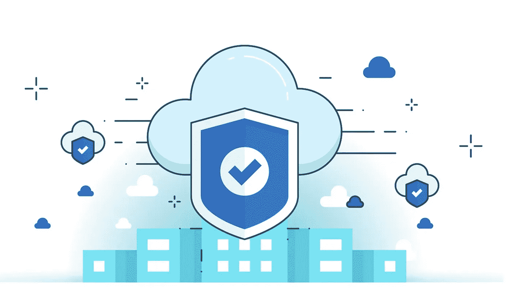
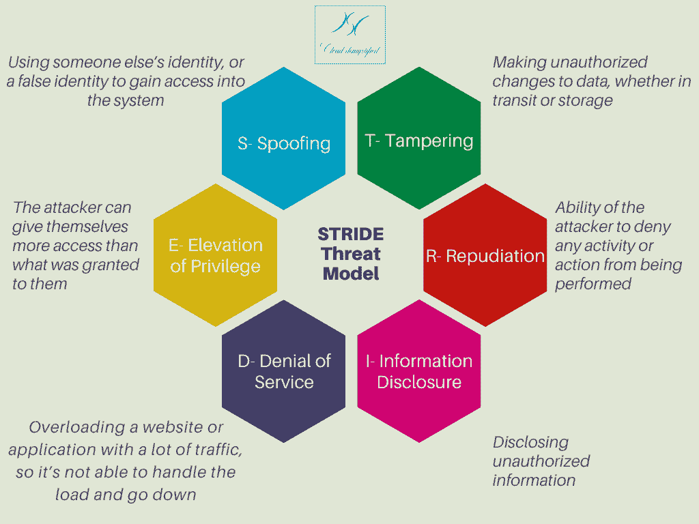
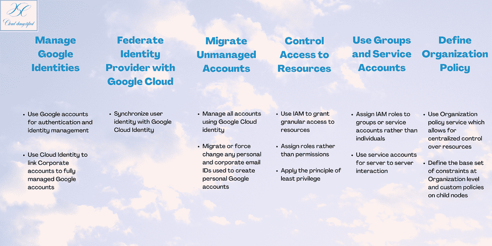
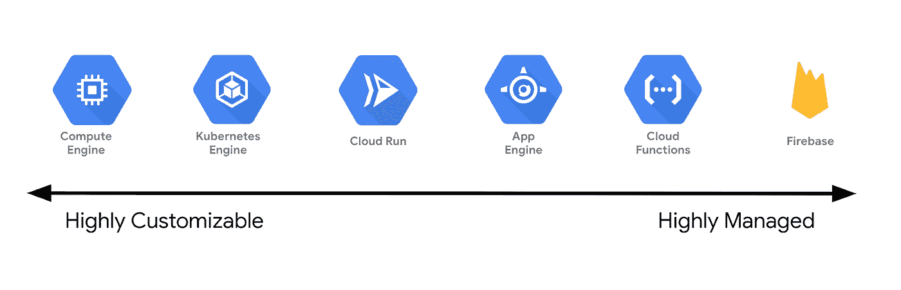
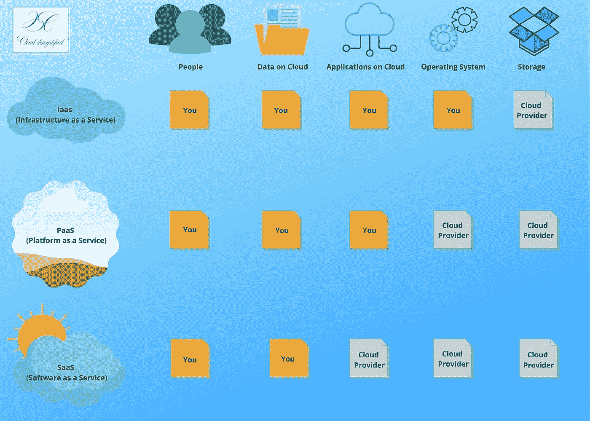
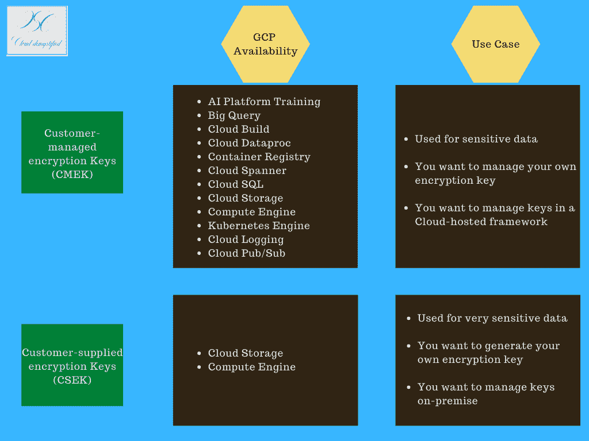
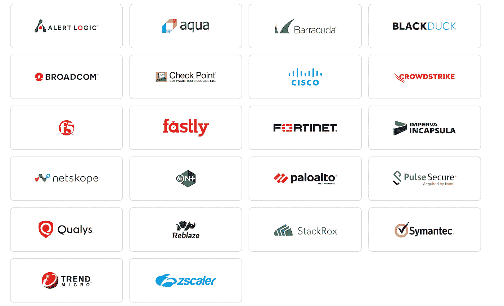
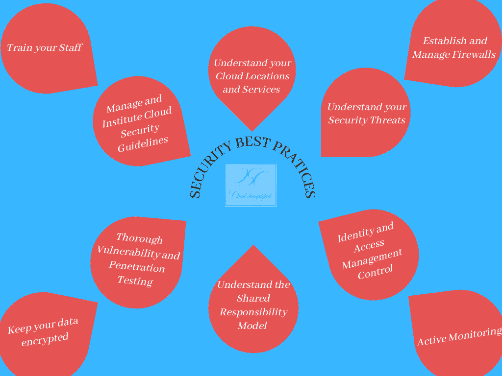

# 谷歌云平台上的安全最佳实践

> 原文：<https://medium.com/google-cloud/security-best-practices-on-google-cloud-platform-7510e882aeae?source=collection_archive---------0----------------------->

随着越来越多的人采用谷歌云技术，安全知识已经变得非常重要。了解保护 Google 云平台应用的技术、政策、流程和控制非常重要。云技术和安全性是密不可分的，因为网络安全威胁会入侵您的应用程序，并影响您业务的机密性、完整性和可用性。安全性是应用程序所有者和云提供商的共同责任，了解如何构建健壮的安全模型至关重要。

来源-[https://www . trend micro . com/vinfo/hk-en/security/news/virtual ization-and-cloud/cloud-security-key-concepts-threats-and-solutions](https://www.trendmicro.com/vinfo/hk-en/security/news/virtualization-and-cloud/cloud-security-key-concepts-threats-and-solutions)

# 1.了解您的云位置和服务

了解您的云位置和服务是确保应用程序安全的关键最佳实践。谷歌云服务和产品建立在核心基础设施之上，核心基础设施具有内置的安全功能，如访问控制、分段和数据控制。但是，您需要知道如何存储、加密和管理您的数据，以确保您的信息是安全的。

谷歌云有 VPCs，或虚拟私有云，这是一个按需共享资源池。VPC 相互隔离，可以通过 VPC 对等进行对话。您可以通过简单的防火墙规则来控制任何资源的所有网络入站、入站和出站流量。设计一个健壮的安全模型的第一步是了解你的应用程序是如何托管的，以及 Google 提供了哪些安全服务和产品。

谷歌的数据丢失防护 API 帮助你发现、分类和保护你的敏感数据。这是一项完全托管的服务，可检查您的结构化和非结构化数据，帮助您获得洞察力并降低数据应用程序的任何风险。

# 2.了解您的外部和内部安全威胁

了解并意识到您的内部和外部威胁有助于您保持主动并确保您的应用程序安全。危险可能存在于任何地方，了解您选择的任何安全模式对于主动采取行动以及有效应对这些威胁都是非常有用的。

例如，STRIDE 威胁模型可以帮助我们应对您的应用程序在 Google Cloud 上可能面临的所有威胁。STRIDE 代表欺骗、篡改、否认、拒绝服务和特权提升。下面的信息图解释了每一种威胁。

Google Cloud Armor 有助于保护您的应用程序免受拒绝服务攻击，并内置了针对 L3 和 L4 DDoS 攻击的安全性。在 Google Cloud 上的应用程序中利用这一点，可以帮助提供一个额外的安全层来抵御 STRIDE 模型中概述的任何威胁。

# 3.身份和访问管理控制

IAM 是由云提供商定义的策略和流程框架，旨在确保用户拥有适当的权限来访问云上的资源、应用和数据。IAM 有助于保护数据，防止不必要的威胁，并确保所有用户都有适当的访问权限来完成他们的工作。

谷歌云平台有许多服务和产品，通过理解、管理和控制访问来保护用户和应用。

Google Cloud 上的所有资源都是分层管理的，分为四个部分——组织、文件夹、项目和资源。例如，使用 Google Cloud 的公司是顶层节点，其次是文件夹、项目和资源。每个资源只有一个父资源，子资源继承父资源的策略。因此，默认情况下，在“组织”节点设置的策略会被该组织下的所有文件夹、项目和资源继承。资源管理器让你通过项目、文件夹和组织集中管理这些资源。

过滤掉不需要的用户的一个基本方法是建立一个健壮的身份验证框架，该框架只允许能够验证其身份的用户访问。谷歌认证器让你无需付出任何额外的努力就能做到。但是，云身份提供了额外的解决方案，通过高级保护和密码保险应用程序来保护您的帐户、设备和工作空间。您可以从各种解决方案中进行选择，如单点登录(一键访问应用程序)、多因素身份验证(使用两台或更多设备验证身份)和端点管理。

为了保护对应用程序的访问，可以使用识别身份的代理。您可以验证谁正在尝试访问您的应用程序，并相应地授予访问权限。这一举措有助于实现零信任模型以及集中式访问控制。IAP 可以保护对 Google Cloud、任何其他云甚至内部基础设施上托管的应用程序的访问。

下面是一些 IAM 最佳实践，您可以遵循这些实践来保证应用程序中数据的安全。

# 4.主动监控

主动监控您的环境和应用程序有助于发现潜在的入侵者，他们可能潜伏在周围并以您的应用程序数据为目标。了解谁在访问您的数据并监控任何可疑活动，可以帮助您保持主动，并确保您的应用程序安全。

Google Cloud Monitoring，以前称为 Stackdriver Monitoring，有助于在 Google Cloud 上监控、排除故障和提高应用程序的性能。这是一项全面管理、可扩展的服务，提供易于查看和访问的控制面板，其中包含多个性能指标和通知/警报。

# 5.了解分担责任模式

谷歌云平台提供从高度管理(功能即服务)到高度定制(基础设施即服务)的各种服务。每个服务都有其安全责任模型。下图显示了 Google 的计算产品，您可以使用这些产品来运行您的应用程序。

了解和理解这些服务是设计共享责任模型的基础。像云功能或 Firebase 一样，高度管理的产品比高度可定制的产品具有更高的内置安全性，从而为用户提供更大的灵活性。下图说明了基于为运行应用程序而提供的服务类型的共享安全模型。

# 6.保持您的数据加密

当所有数据都被转换成密码或加密后，信息的真正含义就被隐藏了。加密可以确保除了被允许访问数据的人之外，任何人都不能访问数据。

默认情况下，Google Cloud Platform 会对静态数据进行加密，这意味着它会对您存储的数据进行加密，而不需要额外的操作。在应用程序将数据写入磁盘之前，会对数据进行加密。一组主密钥对每个密钥进行加密，适用于您在云上的几乎所有数据。

如果您有更敏感的数据，您可以管理您的加密密钥。为此，您有客户提供的和客户管理的密钥。下图比较了这两个选项，以帮助您做出正确的选择。

# 7.彻底的漏洞和渗透测试

这个复杂的术语意味着戴上攻击者的帽子，像攻击者一样思考。通过这种方法，组织或云服务提供商攻击他们的基础设施，以测试稳定性并发现漏洞，使他们能够在任何外部人员发现漏洞之前捕获并修复漏洞。

Google Cloud Platform 提供了一个 Web 安全扫描器，作为安全命令中心的一部分，用于检测您的应用程序中的关键漏洞，甚至在部署之前。它可以识别应用引擎、Kubernetes 引擎和计算引擎实例中的漏洞，让您在安全游戏中保持领先。

# 8.建立和管理防火墙

防火墙只是一堵附在系统上的墙或屏障，用来防止入侵者进入系统。在云计算中，它们是附加到系统上的规则，用于阻止未经授权的访问，同时允许向外通信。

对传入和传出流量设置安全规则将有助于在入侵者和系统之间建立一道屏障，过滤内部流量，阻止外部人员对数据进行不必要的访问。

要允许或拒绝来自虚拟机(VM)的连接，您可以在虚拟私有云(VPC)中应用防火墙规则。在配置中，您可以设置、识别和实施 VPC 防火墙规则，使您能够保护您的应用程序，而不管它们的配置和操作系统如何，即使它们尚未启动。

# 9.管理和制定云安全准则

为组织制定和管理安全最佳实践和准则对于确保应用程序的安全至关重要。有必要简化流程，以确保员工、利益相关者、合作伙伴和领导层意见一致。

Google Cloud 有许多安全合作伙伴产品，您可以利用它们来满足您的所有安全需求。除此之外，他们还有几个基础架构、数据保护、日志记录和法规遵从性合作伙伴，可以指导您和您的组织为您的应用程序制定最佳准则。为了保护您的应用程序并扫描基础架构中不符合要求的资源，您可以利用开源工具，如凡赛堤和配置验证器。

这里有一些合作伙伴的快照，他们可以在 Google Cloud 上指导您的安全需求。您可以在本文的参考资料部分查看完整的列表。

# 10.培训你的员工

最后也是最关键的最佳实践是让您的员工了解最新的安全威胁和最佳实践。如果组织不遵守任何安全措施，这些措施都是无用的。确保每个人都意识到安全威胁并遵循组织制定的最佳实践至关重要。Google Cloud 提供培训、白皮书、文章和支持，以确保符合所有行业标准，从而保护您的应用程序的安全。

# 简单地

对于所有视觉学习者，这里有一个关于十大安全最佳实践的信息图，以确保您在谷歌云平台上的应用程序的安全:

# 想了解更多？

以下是一些资源，您可以使用它们来更好地理解云安全，并为您在 Google 云平台上的应用程序设计一个健壮的安全框架:

*   [谷歌云平台安全 Coursera 专业证书](https://www.coursera.org/professional-certificates/google-cloud-security)
*   [谷歌云平台安全最佳实践库](https://cloud.google.com/security/best-practices)
*   [谷歌数据丢失防护 API 文档](https://cloud.google.com/dlp)
*   [谷歌云虚拟私有云(VPC)文档](http://https//cloud.google.com/vpc)
*   [凡赛堤和配置验证器谷歌云平台文档](https://cloud.google.com/blog/products/identity-security/protecting-your-gcp-infrastructure-at-scale-with-forseti-config-validator)
*   [谷歌云平台安全合作伙伴](https://cloud.google.com/security/partners)
*   [谷歌云网络安全扫描器文档](https://cloud.google.com/security-command-center/docs/concepts-web-security-scanner-overview)
*   [谷歌云监控文档](https://cloud.google.com/monitoring)
*   [云身份感知代理文档](https://cloud.google.com/iap)
*   [云身份文档](https://cloud.google.com/identity)
*   [资源管理器文档](https://cloud.google.com/resource-manager)
*   [谷歌加密文档](https://cloud.google.com/security/encryption-at-rest)
*   [谷歌云装甲文档](https://cloud.google.com/armor)