# 安全指挥中心-谷歌云

> 原文：<https://medium.com/google-cloud/security-command-center-google-cloud-b9872263b6a0?source=collection_archive---------1----------------------->

**安全指挥中心**

安全指挥中心是谷歌的集中威胁和漏洞报告服务。它提供了对您的基础架构的集中可见性和控制。它有助于检测错误配置和漏洞，报告合规性和检测针对您的谷歌云资产的威胁。

**安保指挥中心的主要特点**

**安全态势管理**

安全指挥中心与云资产清单集成，以提供对 Google 云基础设施和资源的可见性。安全指挥中心内置了安全健康分析**、事件威胁检测、容器威胁检测**等服务，可扫描日志中的威胁和漏洞。它监控基础架构以确保适当的策略到位，并在发生变化时发出警报

**安全洞察**

它有一个内置功能，可提供对**事件威胁检测、容器威胁检测和虚拟机威胁检测**的重要见解。它提醒团队潜在的威胁、漏洞和数据丢失，安全团队可以据此采取行动。它可以提供的一些关键见解是:-

*   列出具有公共 ip 地址的虚拟机
*   列出添加/删除的服务帐户
*   防火墙错误配置，监控云应用程序的 **OWASP 攻击**。
*   检查是否有任何云存储桶对互联网开放

**按键集成**

它与诸如 **Chronicle (SIEM)、Virus Total & MITRE** 攻击框架等服务相集成，以调查威胁、查看文件的潜在标签匹配并识别对手使用的战术、技术和程序。

与 **DLP API** 集成，以在桶中列出潜在的 PII 和其他敏感信息。与**云装甲**集成，查看潜在的 DDOS 和其他网络攻击。与**发布/订阅和云功能**集成以进行补救

**合规报告**

它通过提供合规报告作为**安全健康分析**的一部分，帮助安全团队实现合规。它会根据合规标准不断评估您的安全状况。它的服务检测器符合 CIS 基准、NIST 800–53、PIC DSS 3.2.1、ISO 27001 等合规标准。

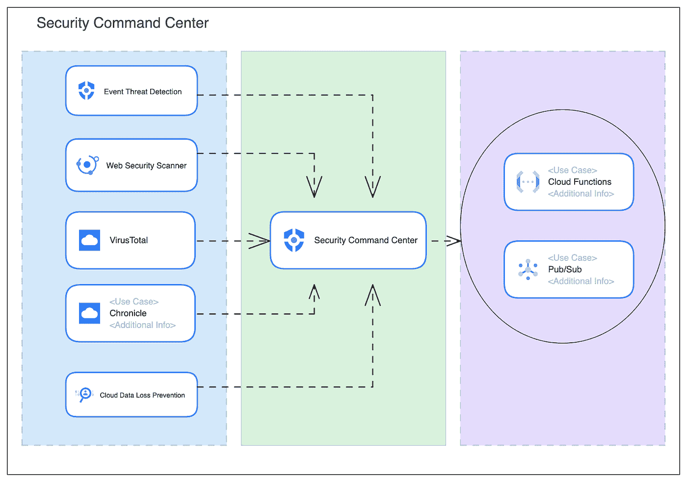

架构图

**配置安全指挥中心**

开始使用安全指挥中心

转到左侧菜单服务列表中的**安全**，点击**安全指挥中心**。

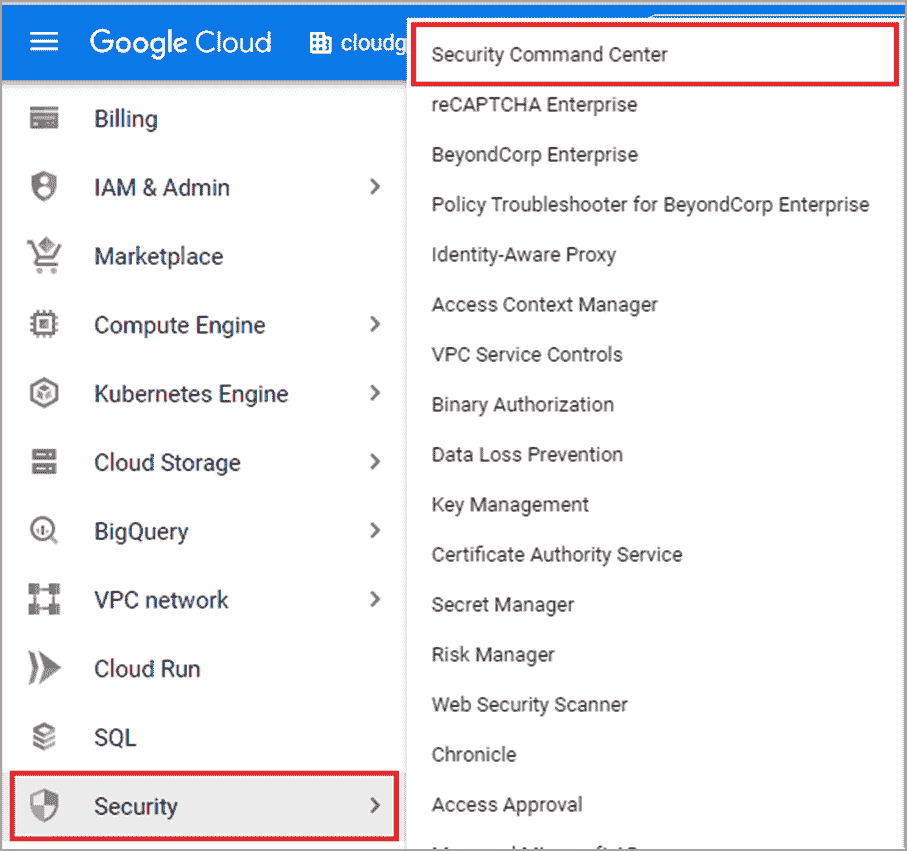

导航到安全指挥中心

这是您组织的一般**概述**控制面板，在这里您可以看到特定时间范围内的威胁并采取相应措施

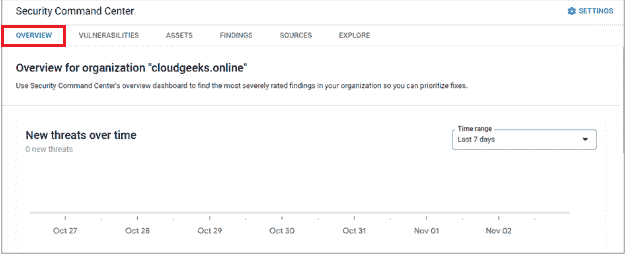

安全指挥中心仪表板

在“概述”选项卡中，向下滚动以查看**活动漏洞仪表板**安全团队可以查看基础架构中漏洞的严重性，这将有助于团队根据调查结果及时做出决策

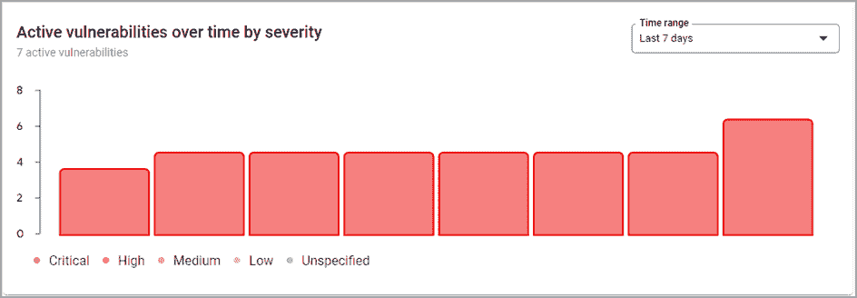

安全指挥中心漏洞仪表板

在**活动漏洞仪表板**中，安全团队可以找到以下漏洞的详细信息。安全团队可以单击漏洞进行深入研究，并根据调查结果采取措施

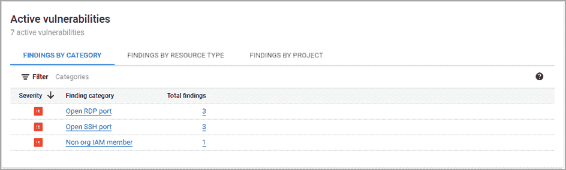

漏洞信息

安全团队可以根据严重性、标准、类别等列出漏洞，并可以单击漏洞了解更多相关信息。

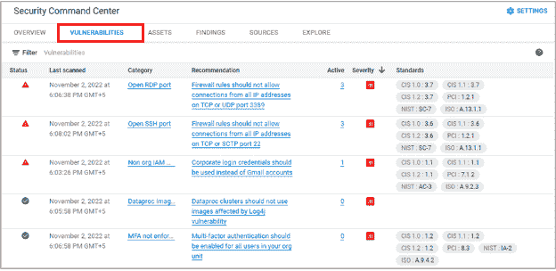

漏洞信息

在**资产**选项卡中，团队可以查看贵组织当前可用的所有云资源详情。各种过滤器链接可用，资源可以根据类型、项目等进行过滤。

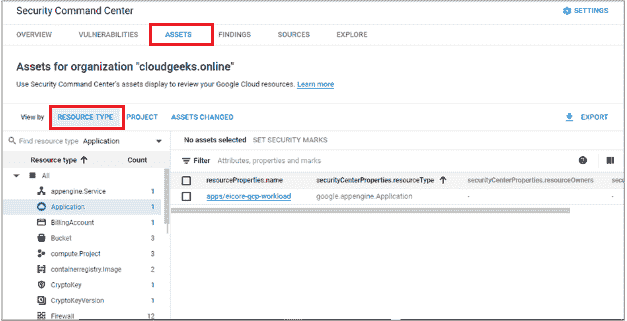

资产信息

在项目级别查看

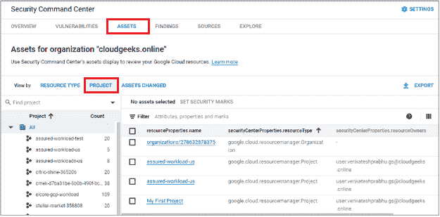

资产视图

资产变更时查看

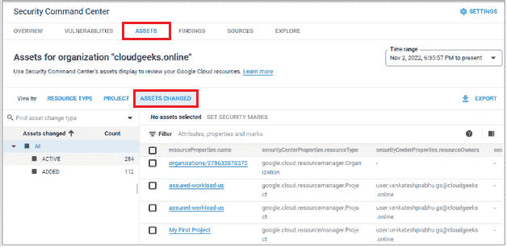

资产视图

在**调查结果**选项卡中，安全团队可以查看云资源的潜在安全威胁和风险。

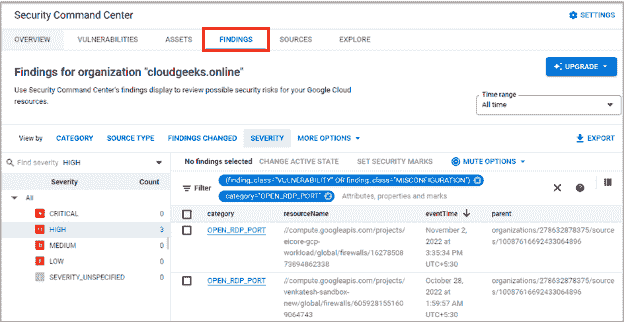

安全调查结果

安全团队可以单击“Compliance”选项卡来查看与基础架构的法规遵从性状态相关的信息，并可以根据调查结果采取行动/进行更改

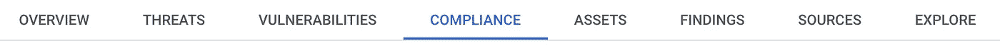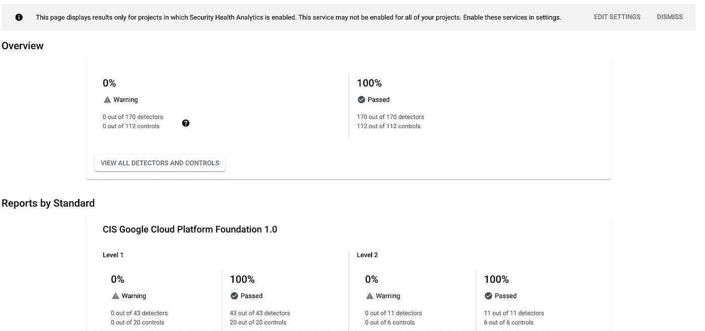

合规仪表板

该控制面板提供了合规性标准的摘要，如 NIST、OWASP、ISO 27001 等。

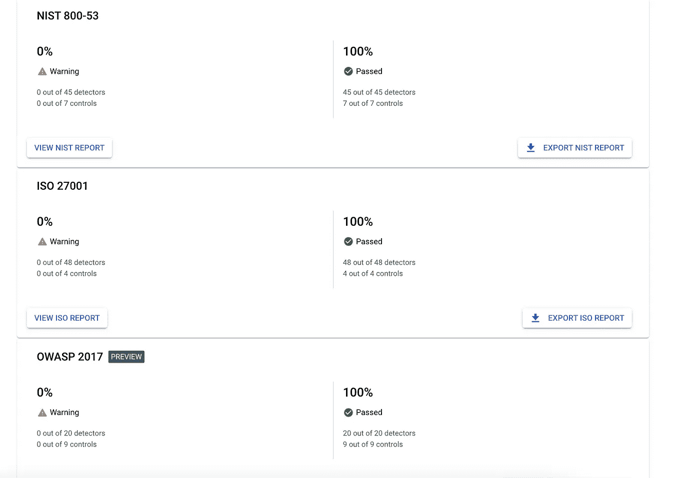

合规标准信息

在 **SOURCES** 选项卡中，您可以查看已启用的组合资产和调查结果的摘要。

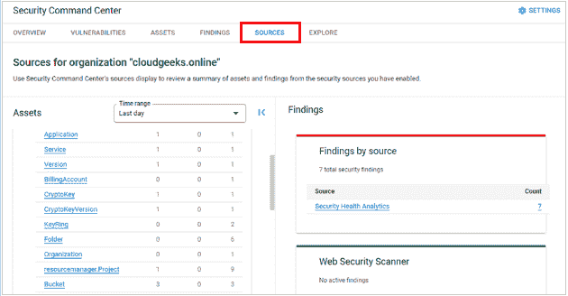

源特定信息

在 **EXPLORE** 选项卡中，您可以探索针对您的威胁和漏洞的其他新服务和解决方案。这些是 google cloud 的合作伙伴，为您的工作负载提供额外的安全性。

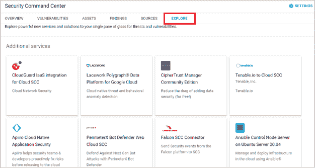

安全指挥中心集成选项

安全团队可以一键式从 SCC 转向各种集成工具，如 Chronicle 来调查事件并根据调查结果采取必要的措施

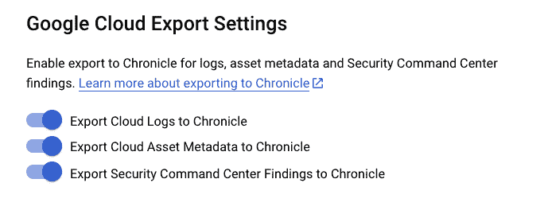

该博客由合作伙伴工程师谷歌云和云设计师 Quadra Systems 的 Muralidharan 共同撰写