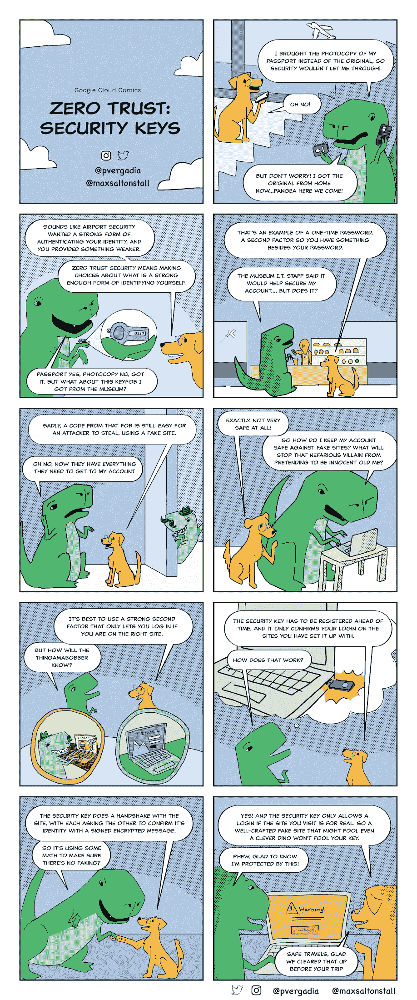

# 安全密钥和零信任

> 原文：<https://medium.com/google-cloud/security-keys-and-zero-trust-1c3efcfb302?source=collection_archive---------1----------------------->

## 零信任中安全密钥有多重要？

## GCP 漫画#6 网络安全中的安全关键

安全密钥是一种物理设备，它与您的用户名和密码一起向网站或应用程序验证您的身份。它们提供了比认证应用程序或短信代码更强的登录保护，并且同一设备可以用于许多服务，因此您不需要随身携带一串软件狗和智能钥匙。

> 安全密钥提供最高级别的登录保证和网络钓鱼防护。

在这一期的 [GCP 漫画](https://gcpcomics.com/)中，我们正在报道这一点。把安全密钥看作是保护你和你的公司免受不良密码和欺骗用户的侵害的一种方式，因为它可以阻止假冒网站欺骗人们登录。给你！

安全密钥和零信任

事实证明，密码本身对帐户的保护非常有限，所以我们看到了许多两步验证(也称为多因素身份验证)的新选项，这意味着登录“不仅仅是你的用户名和密码”。

通过短信或语音电话获得代码比仅仅获得密码要好一点，但你仍然可能被骗，将代码提供给一个虚假的网站，将你的帐户凭据交给攻击者。备份代码和验证器应用程序受到相同恶意策略的攻击，攻击者收集你的信息，然后使用它来执行自己的多因素验证，从而获得对你帐户的访问权限。

只有安全密钥才能阻止最聪明的网络钓鱼攻击。

为什么安全密钥优于其他多因素方法？

*   密钥必须预先注册到特定的帐户，这是一种提高登录安全性的措施。
*   安全密钥和网站执行加密握手，如果网站不验证密钥的身份，包括匹配先前注册的 URL，登录将被停止。
*   使用开放标准(FIDO ),相同的安全密钥可以用于多个站点和设备。你只需要随身携带一个，它们可以用于个人和工作账户和设备。
*   [谷歌泰坦安全密钥](https://cloud.google.com/titan-security-key/)的固件设计用于验证完整性，防止任何篡改。
*   它们有各种形状和大小，因此您可以选择 USB-A、USB-C 或 NFC 来匹配最适合您的用例！
*   在我们部署安全密钥来取代旧形式的两步验证的经验中，我们看到了更快的登录和更少的支持票。

# 资源

*   [泰坦安全钥匙](https://cloud.google.com/titan-security-key)
*   [两步验证概述](https://www.google.com/landing/2step/)
*   [高级保护程序](https://landing.google.com/advancedprotection/)

想要更多的 GCP 漫画吗？访问[gcpcomics.com](https://gcpcomics.com/)&在 medium[pvergadia](/@pvergadia/)&[max-salton stall](https://max-saltonstall.medium.com/)上关注我们，在 Twitter 上关注 [@pvergadia](https://twitter.com/pvergadia) 和 [@maxsaltonstall](https://twitter.com/maxsaltonstall) ，不要错过下一期！