# 自我修复数据管道

> 原文：<https://medium.com/google-cloud/self-healing-data-pipeline-d54f78983bc8?source=collection_archive---------0----------------------->

第一部分:[https://medium . com/@ murari 045/self-healing-data-pipeline-3148074057 A0](/@murari045/self-healing-data-pipeline-3148074057a0)

**问题陈述:**

一家名为 XYZ 私人有限公司的公司有一个名为 Joe Philip 的员工，他是该公司的数据工程师。该组织有许多数据管道来处理/转换大规模数据，以支持端到端分析用例。大多数数据管道以 CSV 格式从谷歌云存储中获取数据，并对其应用业务转换规则，然后将处理后的数据存储到 GCP 数据仓库服务 BigQuery 中。由于多个数据质量问题，Joe 需要花费大量时间来调试失败的数据管道，并跟踪被拒绝的记录。Joe 想通过利用机器学习的监督学习来自动化这个过程，以自动纠正被拒绝的记录。

这些损坏的数据或错误的数据可能会造成数百万美元的损失，并浪费组织中合格数据工程师的时间。这不仅仅是一个组织的问题。许多组织面临相似类型的问题，需要以相似的方式处理。

由于数据质量问题(如下所述)，任何数据摄取管道要么*失败，要么将这些记录推送到***【DLQ】/拒绝*** 目录，从而导致 ***重要数据******商业机会的丢失。****

*为了恢复这些丢失的数据，需要数据工程师/管家 的 ***手动干预，这将是针对无效记录的 ***【根本原因分析】*** 的多次迭代，手动 ***纠正*** 数据质量问题，并再次将其推回到 ***数据摄取*** 管道/源系统。****

*它在实际环境中看起来如何:*

*来源系统:GCS Bucket 如下图截图所示。*

*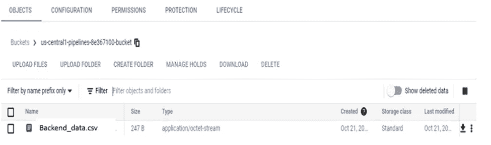*

*让我们看一下从前端接收到 GCS bucket 的源数据。*

*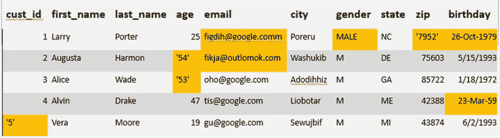***

*当 Joe 与 stackholders 共享这些数据时，他被要求将所有这些错误数据恢复为特定格式，并手动进行更改，这既耗时又繁琐。*

*让我们看看丢弃错误数据的数据流的图形表示。*

*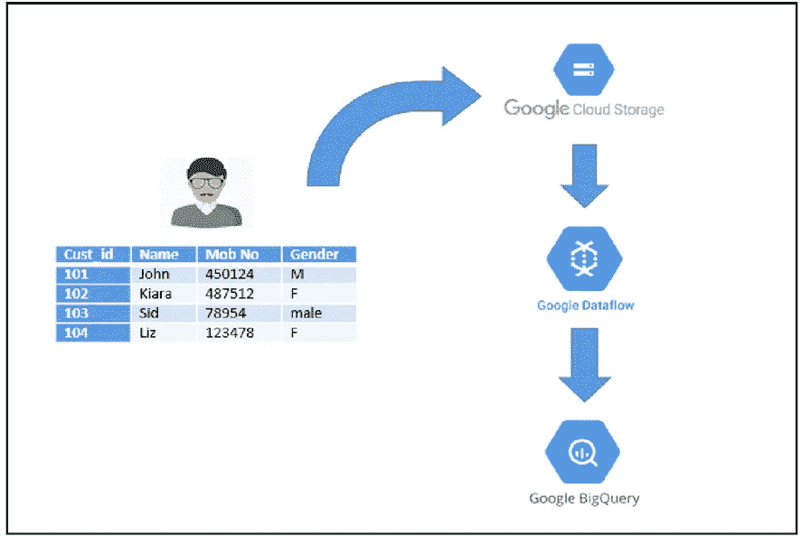*

****数据流图(数据摄取管道):****

*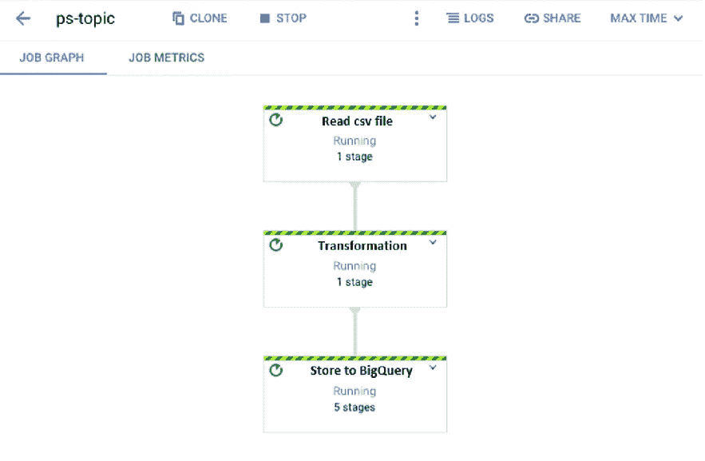*

*数据流作业中有三个步骤。以下是步骤:*

***读取 csv 文件:**在此步骤中，选择需要上传到仓库的 CSV 文件。*

***转换:**在这一步中，应用所有的数据验证规则。以便任何损坏的数据都不会影响数据表示或未来的计算。*

***存储到 BigQuery:** 最后一步，所有转换后的数据都上传到 BigQuery 中。*

*通过将 ***自修复管道*** 整合到数据摄取/工程流程中，Joe 可以减少所有这些工作，并将他的技能用于其他重要任务。*

***建议的解决方案:***

*让我们在卸载 BigQuery 中的数据时添加两个分支。*

*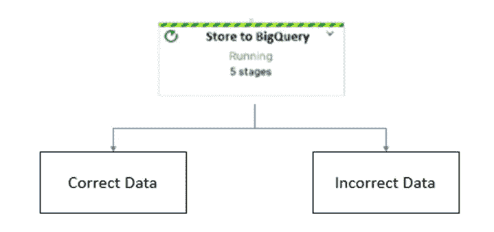*

*就在将数据上传到最终目标层之前，源数据可以分离出错误/拒绝的记录并将其存储在另一个数据集或表中，正确的记录将成功存储在另一个 **Bigquery** 表中，如上所示。*

*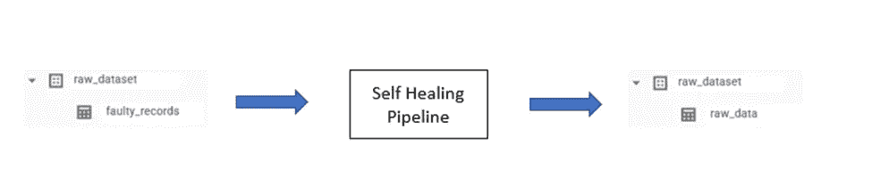*

*我们可以挑选存储在 bigquery 数据集中的错误/被拒绝的记录，并应用我们在 Vertex AI 中构建的 ML 算法来基于过去的模式纠正这些记录，并将它们存储回源 raw_data 表或 GCS 桶。*

*这也可以通过 GCS、Dataflow、BigQuery、Vertex AI 和 Looker(用于可视化)等本地服务实施到 GCP 环境中，以便更准确地理解数据。*

*让我们更深入地了解一下在 GCP 环境中，如何通过实现自我修复管道来转换数据。*

*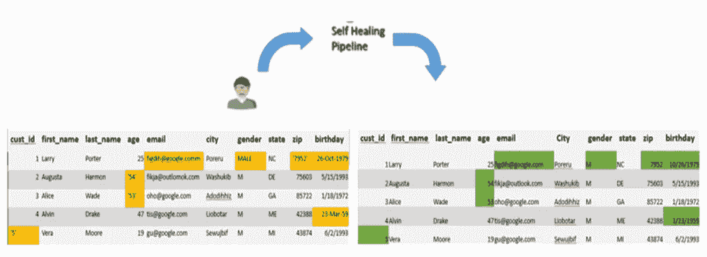*

***上图所示的一些数据质量问题列举如下:***

***1。** **性别栏:***

*从上图中我们可以看到**性别**一栏存在数据不符。*

*在数据流中，有逻辑通过关键字的“M”和“F”来确认这个人是男是女。但是有一个用户的性别写的是“男性”。这将使数据流忽略该记录并存储到拒绝/其他记录中。*

*该记录被拒绝，对客户执行的分析可能不会有 100%准确的结果。*

*因此，为了改善客户拒绝记录，自我修复管道可以帮助解决这个巨大的问题。*

***2。** **缺失值:***

*-如果数据集中的一些值缺失，可以使用插补和最大似然算法进行恢复。*

*-开发具有填空精度和不正确数据的 ML 模型将从源数据中获得更多见解。*

*-随着训练数据的增加，模型的准确性也会增加。这可以提供一致性、可靠性和数据完整性。*

**请注意:* *唯一标识符缺失，无法恢复。**

*我们可以在代码片段中实现 GCP **顶点 AI** ，这可以帮助我们从州、城市和过去地址模式的组合中预测**邮政编码**，如下图所示。*

*通过 Vertex API，我们可以在统一的人工智能平台内使用预定义和定制的工具，更快地构建、开发和扩展 ML 模型。*

*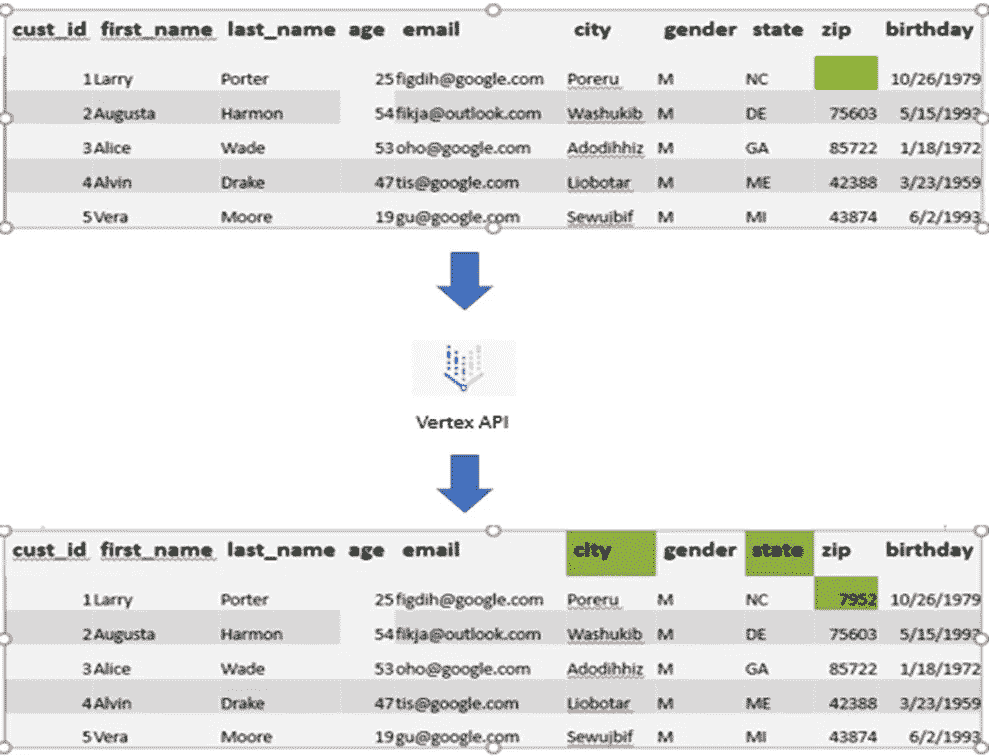*

*可能还有其他数据质量问题，可以通过 Vertex AI (Auto ML/Custom Model)基于用例来解决。这可以通过理解数据质量问题并对其进行合理的修改，在很多方面帮助我们快速解决问题。*

*顶点人工智能模型可以定期重新训练，以检测新的数据错误。通过这种实现，经过一段时间后，顶点人工智能模型将能够处理几乎所有的数据质量错误。*

*这些顶点人工智能训练的模型，然后可以进一步用于不同的组织作为预训练的模型，以便于检测数据质量错误。*

*ML 模型可以从大量的数据集中学习并找出模式*

*模型随着数据的发展而发展*

*我们可以接管因 DQ ( *数据质量*)问题而发生的问题。下图解释了数据利用的困难。*

*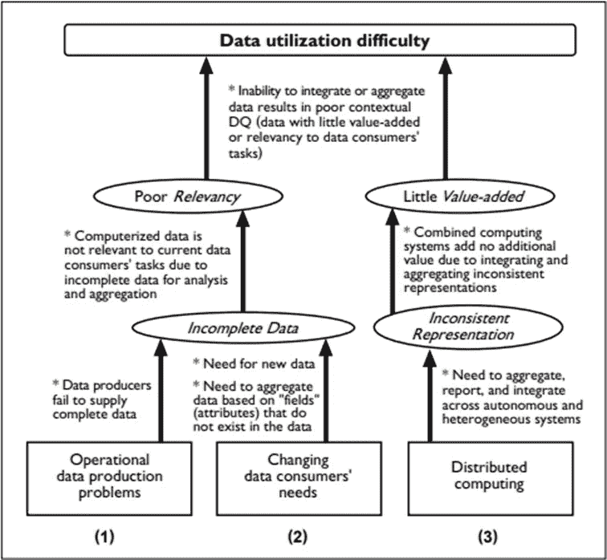*

*我们可以实现一个定制的监督学习模型，该模型可以理解数据，观察数据质量问题的原因，并对其进行预测。*

*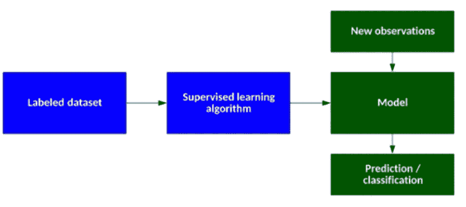*

**请注意:**

***3。** **日期字段及格式:***

*这是另一种数据质量问题。如果不同记录的日期字段的格式不同，则需要将其更改为单一一致的预期格式。这可以是基于规则的格式，可以应用到源数据中以使日期字段一致。*

*例如:年-月-日，年-月-日，年-月-日*

*例如，字符串到数字数据类型，2001 年 1 月 21 日到 2001 年 1 月 21 日*

***4。** **数据类型错误:***

*常见的数据质量问题之一，它影响大多数数据管道。源数据中的特定输入属性需要不同的数据类型，但得到的是不同的数据类型。*

*例如，数字值的字符串值。*

***有限场景示例代码说明:***

**请注意:以下代码示例仅用于演示目的，并比较样本用例的两个文件(正确的和被拒绝的)。**

*○ **用户界面后端:**自修复管道基于 Python 环境中托管的 Flask 接口。用户需要以数据文件的形式输入/提供源数据。*

*○让我们看一个代码示例，这里用户需要上传他们的文件，以使用自修复管道执行数据质量纠正操作。在下面的 python 代码中，您可以看到我们正在保护文件并将其存储到一个文件指针中。*

*○我们还提供了在源数据中指定分隔符的灵活性。*

*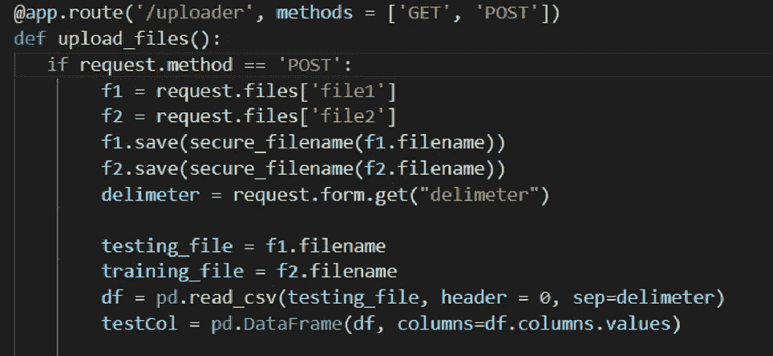*

*○在读取输入文件后，代码检查用户要求纠正的列。*

*○我们正在比较可以从提供的样本数据中修正的值。*

*○我们还为用户提供选择对每列数据执行的特定操作。*

*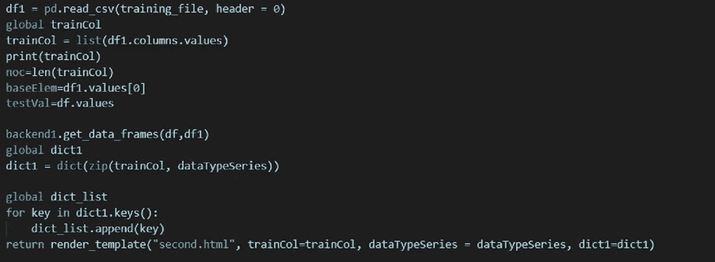*

*○ **后端包:**该包用于执行自我修复管道中提供的所有功能。它存储对损坏数据实施的纠正操作背后的所有 ML 逻辑。*

*下图是为该演示/文章实现的一些代码逻辑:*

*■资本化*

*■性别纠正*

*■缩进*

*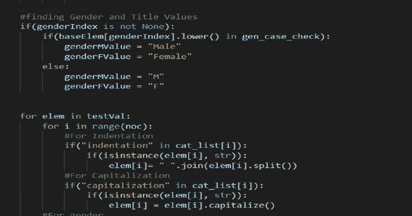*

*自修复管道执行完成后，我们提供两个文件，命名为可恢复文件和不可恢复文件。*

**可恢复:包含所有已更正的记录。**

**不可恢复:包含因其未定义的性质或技术限制而无法恢复的记录。**

***工具的用户界面:***

*   *这里，用户必须提供两种类型的数据文件。例如样本数据和损坏的数据。如下图所示。*

*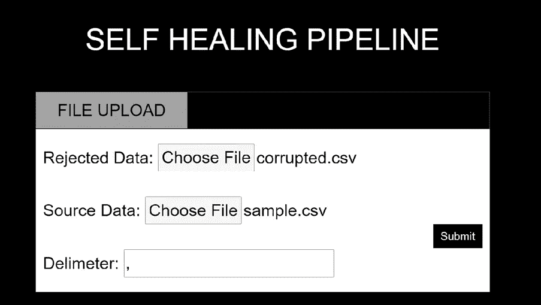*

*   *代码将读取文件元数据，并在屏幕下方显示，以应用数据质量检查，如缩进/大写/标题/性别。用户可以选择他们想要对其数据进行哪些更正，并实施这些更改。*

*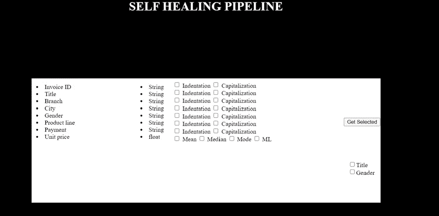*

*   *选择所需的数据质量校正后，用户可以单击运行按钮，该按钮将获取被拒绝的数据文件，并在被拒绝的数据中应用所有选择的校正。这节省了大量的人工干预，并且记录将被自动纠正。*
*   *将有两个输出文件，将得到生成的可恢复和不可恢复的文件。*
*   *可恢复文件是纠正了数据质量问题的数据文件，可用于第二天/运行数据摄取周期。*
*   *不可恢复的文件需要到源系统数据管理员那里查看那些被拒绝的记录。*

***结束语:***

*这只是通过一个简单的 UI/代码对这一思想的高级演示，可以进一步扩展以解决更复杂的数据质量用例。*

*免责声明:这是为了告知读者，文中表达的观点、想法和意见仅属于作者，不一定属于作者的雇主、组织、委员会或其他团体或个人。*

**有兴趣了解有关如何实施自愈数据管道的更多信息吗？伸手* [*穆拉里拉姆卡*](https://www.linkedin.com/in/murari-ramuka-98a440a/) *。**