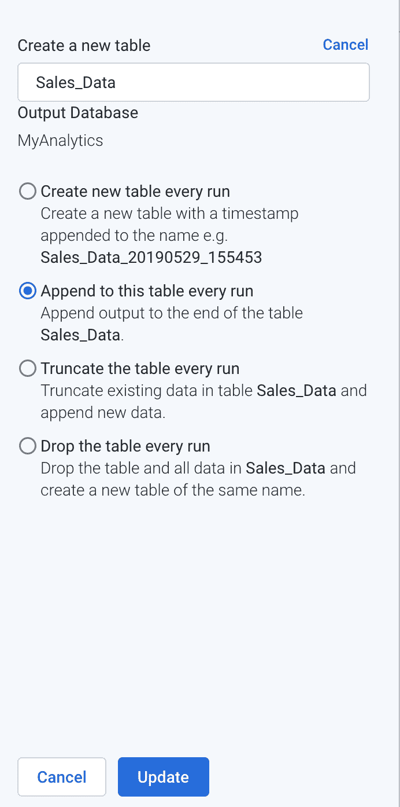
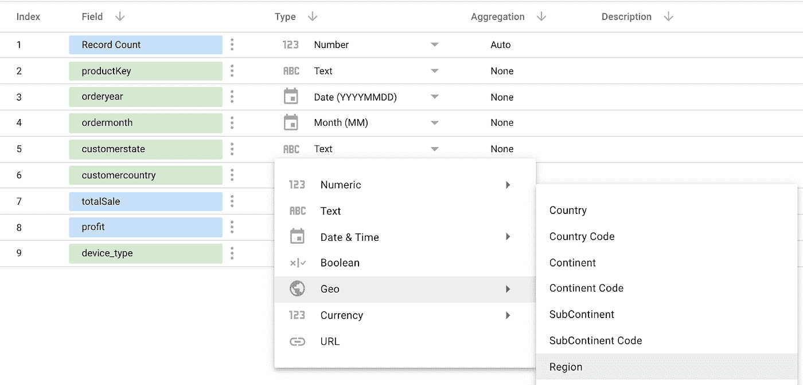

# BigQuery 上的自助服务分析在 30 分钟内上线，秒表在手！

> 原文：<https://medium.com/google-cloud/self-service-analytics-on-bigquery-live-in-30-min-stopwatch-in-hand-b106fc223652?source=collection_archive---------0----------------------->

或者如何利用 BigQuery、Cloud DataPrep 和 Data Studio 将您的原始数据转化为漂亮的报告，而无需除您之外的任何人的帮助。得益于谷歌云平台智能分析套件，这一切只需不到 30 分钟。

但是，在你启动计时器之前，请确保你熟悉谷歌云平台上自助服务分析的基本概念。这篇博客[“使用云数据准备开始 BigQuery 自助分析”](/@bcariou/understanding-self-service-analytics-on-bigquery-with-cloud-dataprep-7f1ed729a42a)将会给你这些知识。

然后，你需要有一个 GCP 项目供你支配。我们将在这个博客中提到“我的自助服务分析”项目。如果你还没有 GCP 项目，请按照[的指示](https://cloud.google.com/bigquery/docs/quickstarts/quickstart-web-ui)创建你的项目。

对于您的第一个自助服务分析项目，您的目标是创建一个 Data Studio 仪表板，报告您的电子商务网站绩效和推动收入的最佳网络渠道。它会告诉你在哪里投资更多，哪些产品需要更多的关注。

您必须在 Cloud Dataprep 中清理和组合多个数据源，将其输出到 BigQuery，以便在 Google Data Studio 中使用，并创建您的仪表板。

3…2…1 你现在可以开始计时了。30 分钟秒表在手！

# 设置 BigQuery、Cloud Dataprep 和 Google Data Studio

# BigQuery 设置

您必须创建一个数据集，即在 BigQuery 中组织表和视图的顶级容器。

*   转到[大查询控制台](https://console.cloud.google.com/bigquery)。如果要求，请接受条款和条件以激活服务。可能需要几分钟。
*   在左侧选择您的 GCP 项目“我的自助服务分析”。
*   选择“创建数据集并将其命名为“MyAnalytics”

# 云数据准备设置

*   转到[云数据准备](https://clouddataprep.com)。接受条款和条件以激活服务。可能需要几分钟。
*   创建“我的分析”流

*   通过导入文件 [Sales_Data.csv 和 Ad_Clicks.csv](https://drive.google.com/open?id=1P3Rb5_QLDPUXWByhxua_LWBPSS9NPNmf) 将数据添加到您的流中，这两个文件分别包含电子商务交易和捕获网站流量信息的点击流广告日志文件。选择“添加数据集”，然后选择“导入数据集”，“选择文件”，以及“导入&添加到流程”

# Google Data Studio 设置

*   前往[数据工作室](https://datastudio.google.com)。接受条款和条件。

现在，您已经准备好准备数据和设计报表了。保持 3 个选项卡打开，您将重复使用它们。

# 准备数据

我们想了解哪些领域为电子商务网站带来了最多的流量，哪些领域的转化率最高。为了实现这一点，我们需要将 Ad_Clicks 和 Sales_Data 结合起来。然而，这两个数据集不能按原样组合，并且缺少一些指标。我们需要准备数据，以便可以合并和丰富报告。以下是我们需要经历的数据操作:

在 Ad_Clicks 数据集中，我们需要了解广告的是哪种产品，因此我们需要从 URL 中提取 product_id，如下所示:

在 Sales_Data 中，我们需要按产品计算利润，以确定表现最好的网络渠道。

然后，我们可以将这两个数据集组合在一起，并将其加载到 BigQuery 中，以便对其进行进一步的报告。

# 准备数据的步骤

*   转到[云数据准备](https://clouddataprep.com)
*   选择“我的分析”流程。应该是这样的。

*   向 Ad_click.csv 添加并编辑新配方

*   在网格界面中，展开**栏的网址**

*   突出显示 pid=旁边的值

*   选择第一个建议来提取产品 id

*   通过单击列标题并选择“重命名”，将新创建的列重命名为 product_id。

现在，您已经提取了 product_id，这是将 Ad_Clicks 和 Sales_Data 数据集组合在一起所必需的。

*   点击“我的分析>”切换回流程视图

*   为 Sales_Data.csv 添加和编辑新配方
*   数据集打开后，在网格界面的最右侧选择 Recipe

*   添加一个“新步骤”，输入“新公式”，然后输入(或复制/粘贴)“NUMFORMAT(totalSale — totalCost，' ###。## ')"并在新列名中输入“利润”

现在，您已经为每笔交易创建了一个代表利润的新指标。

*   要合并(连接)Sales_data 和 Ad_clicks，请使用连接工具并选择要连接的 Ad_Clicks 数据集，然后接受
*   编辑/添加连接条件以反映这些特征

*   然后选择 Next 并检查这些输出列:
*   订单月份
*   订单年度
*   产品密钥
*   客户状态
*   顾客国家
*   总销售额
*   利润
*   领域
*   设备类型
*   然后查看并保存至配方。

现在，您已经创建了一个可以用 DataStudio 报告的组合数据集，但是在这一步之前，我们需要将数据集结果加载到 BigQuery 中。

*   运行作业以发布到 BigQuery。

*   在数据流上运行作业屏幕中，编辑发布操作以替换默认文件发布到 BigQuery 表。
    选择 BigQuery、MyAnalytics 数据集，然后选择创建新表

*   选择每次运行和更新时追加到此表

*   并选择“运行作业”
*   现在数据被处理，结果将被加载到 BigQuery 表中

# 将数据可视化

现在，数据已经在 Cloud Dataprep 中准备好并加载到 BigQuery 表中，您已经准备好使用 Data Studio 创建报表了。

*   前往[谷歌数据工作室](https://datastudio.google.com)
*   选择数据源并选择

*   要添加新源

*   如果需要，选择 BigQuery 并授权 Data Studio 使用 BigQuery

*   导航 BigQuery 数据集以连接到 Sales _ Data 您可能需要授权 Bigquery 访问

*   将 customerstate 更改为 Geo。区域类型和客户国家类型转换为地理国家类型。它将允许使用特定的地理图表来表示数据。

*   将 orderyear 更改为年份(YYYY)格式。这将是图表中显示的默认格式。

*   完成后选择创建报告
*   在报告中添加新的地理图表

*   拖放 customerstate 字段以替换 customer country 维度部分。
    拖放 totalSales 字段以替换指标部分的记录计数
    它应该是这样的。这是快速了解你的产品在哪些州畅销的好方法。

*   向报告中添加条形图

*   拖放 domain 字段以替换 productKey 维度部分
    拖放 profit 字段到 metric 部分并删除 Record Count
    它应该是这样的。这个加法图可以让你了解利润最大的网站(当你除去所有与产品广告相关的费用时)。

*   现在，您可以切换到视图模式来可视化报表并与之交互。

停止你的计时器！你做了多少？你可以在评论里发帖让我知道；-)

# 结论

虽然这是一个基本示例，但您现在已经完成了建立可扩展自助服务分析解决方案的基本步骤，利用了:

*   用于存储和检索数据的 BigQuery
*   云数据准备清理、组合和创建指标
*   谷歌数据工作室可视化报告你的数据。

通过更深入地探索每项 GCP 服务并重复这些原则，您将能够以自助方式解决任何分析需求。虽然可能需要 30 多分钟，但您将完全控制端到端流程，这将为您提供更快、更准确和个性化的数据洞察所需的敏捷性，从而推动您的业务发展。

*原载于 2019 年 7 月 25 日*[*www.trifacta.com/blogs*](http://www.trifacta.com/blogs)*。*