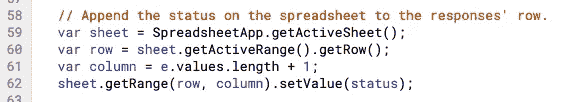
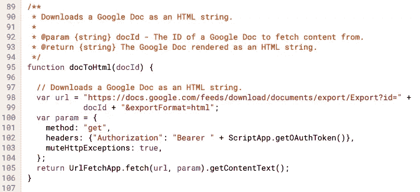

# 通过谷歌表单和应用程序脚本自动发送内容

> 原文：<https://medium.com/google-cloud/send-content-automatically-via-a-google-sheet-and-an-apps-script-c65d82284f5f?source=collection_archive---------0----------------------->

托管在 [G 套件解决方案库](https://developers.google.com/gsuite/solutions/content-signup)上的解决方案

# 简要介绍

如此多的人能够**在网上**创造内容，如*白皮书、电子书、信息视频或博客；*围绕不同的话题。因此，在网站、电子邮件签名或即时消息中链接一个**谷歌表单**很方便，可以帮助人们**请求你作为**主题列表**提供的资产**，并让它们自动发送给他们。如果你在谷歌电子表格中添加一个**应用程序脚本**，它会在每次有人使用**谷歌文档**作为其**模板**提交表单和发送电子邮件时自动运行，这是可能的。

# 目的

在本文中，我将带您了解:

1.  如何**尝试**上面提到的 **Google Sheet、**和 **Apps 脚本**。
2.  如何**随意定制** 3 件事:表单&代码中的**主题**，邮件**模板**，代码中邮件的**主题**行。
3.  通过**了解**和**代码**和**如何工作**。

# 尝试

1)复制一份****(在你的浏览器中)。它将自动包括一个谷歌表单和你需要的代码，即所谓的应用程序脚本。****

****2)从您的电子表格中点击**工具** > **脚本编辑器**。这将带您进入*应用程序脚本编辑器。*****

****3)现在*点击**“选择功能”**下拉菜单>选择**“安装触发器”，运行脚本***。然后点击运行按钮()。****

****4)当出现提示时，单击**审查权限**并单击**允许**以便脚本可以代表您发送电子邮件。****

> ****I****

******5)授予权限后，将自动为您的工作表创建一个触发器。通过点击脚本编辑器中的**触发器图标**(看起来像一个时钟)暂时访问该触发器。******

> *******注意*** :如果你多次运行这个脚本，它会生成*多个触发器*复制邮件。确保您只运行脚本一次，并且触发器页面上没有多个触发器。如果您不小心创建了更多，只需将鼠标悬停在每个点上并单击 **3 个点** **>** 然后单击**删除即可删除所有其他点。******

****5)授予权限后，**将**返回到您的**电子表格**并定位到**表单** > **进入实时表单。**这将把你带到谷歌表单，当你分享它的链接时，人们会看到它。*填写*所有字段，*确保*使用您有权访问的*电子邮件地址*，点击**提交**。****

> *****注意:*确保输入您可以登录的电子邮件地址。电子邮件将包括您填写的姓名和主题。如果没有选择主题，将不会发送电子邮件。****

****6)回到你的电子表格。您应该有一个输入了值的行。其中一个栏目叫**确认，**会说**发送。**这确认您在表格中选择的主题已通过电子邮件发送。****

***** *等等——我没有看到数据进入我的电子表格，现在该怎么办？****

> ******注意**:如果你**在你的工作表**中没有看到数据，这意味着表格*可能需要重新链接* ***全部是*** ，所以从你的电子表格中点击**表格** > **进入实时表格。**在表单上，点击**右上角**的**铅笔图标**进入编辑模式。然后点击**响应**选项卡> **3 点** > **解除链接** **表格** > **确认**动作解除链接。然后点击 **3 点**再点一次> **选择响应目的地** > **选择已有的电子表格** >从驱动器文件中选择弹出的第一个名为**的文件复制(自动复制 w/ sheet)表格接收内容** > **选择**。返回电子表格并访问第一个选项卡(创建了一个名为**表单响应 2** 的新表)，然后单击**表单** > **从**表单响应 2** 转到实时表单**——您的响应应该会立即显示在那里。****

**7)最后，**登录到您在表单条目中提供的电子邮件**帐户，看看您是否收到了主题行为:**“Howdy”**，邮件正文类似于 [**这个 Google Doc 的模板**](https://docs.google.com/document/d/1HGXj6551jxUqFqxsuYMWovI0_nypSUPIdlc-RXf2pHE/edit#heading=h.t48vj9f6fmak) 的电子邮件。**

# **选择性地自定义您的脚本**

***1)【可选】*发出的电子邮件来自已经设置好的谷歌文档模板。但是，如果您希望自定义该模板，您可以通过[单击此链接](https://docs.google.com/document/d/1HGXj6551jxUqFqxsuYMWovI0_nypSUPIdlc-RXf2pHE/copy)制作自己的副本，并将权限设置为*任何人*均可查看，除非您的受众是您组织内的人员，请将权限设置为*您组织内的任何人*。然后从*浏览器*中复制其 *URL 地址*，并替换脚本代码中`EMAIL_TEMPLATE_DOC_URL`变量中的 URL。**

> **注意:Google 文档中的{{NAME}}和{{TOPICS}}是占位符，用于插入用户提交表单时选择的主题的名称和内容链接。**

***2)【可选】*如果你想改变你邮件的主题行，替换脚本代码中`EMAIL_SUBJECT`变量中的文本。**

***3)【可选】*如果您希望重命名表单中的主题，在更改它们时，也将新的主题名称粘贴到脚本代码中的`topicUrls`变量中。**

> ***注意:*当*重命名*表单中的主题时，确保也在代码中粘贴准确的*主题名称*。确保该单词包含在表单的选项中。例如:如果你在表格中将“(营养)纯素食食谱”重命名为“(正念)学习如何在忙碌的世界中冥想”，请确保返回`topicUrls`变量，并将“营养”替换为“正念”+ *你希望人们收到的链接***

# **代码如何工作**

**这个解决方案大约。106 行代码，包括所有注释:)如果您希望查看整个代码，您可以在此处找到(或者在前面提到的表格中，如果单击**工具** > **脚本编辑器**)。**

****第一行通过获取表单中提供的 **URL** 、**电子邮件主题**和**主题**及其各自的链接来设置**Google Doc 模板。**

****

**接下来的几行描述了一个名为` **installTrigger`** 的函数。在应用程序脚本编辑器中运行该函数后，它会自动在应用程序脚本项目中创建一个触发器，该触发器会在用户提交响应时，安排**在其下方运行另一个名为` **onFormSubmit`** 的函数**。**

****

****`onFormSubmit`** 是一个**函数**，当**用户提交响应**时被调用。当它被调用时，它接收一个事件对象，该对象包含一些细节，比如表单中最近提交的响应、它们在电子表格中的行号等等。注意 trim 方法用于**删除用户可能意外进入表单的多余空格**。**

****

**声明了一个名为 topics 的变量，它将**检查主题，**如果**有，**被表单提交者**使用 for 循环**选择。如果**没有主题**被**选择**，则**不会将任何项目**推送到该**变量的列表**，从而阻止下一步发送电子邮件。**

****

**如果选择了**主题**(索引为*大于 0* )，那么**电子邮件**将**发送到**，使用的是表格中的地址**和变量` **emailSubject`** 中脚本开头列出的**主题行**。电子邮件的**正文**由一个名为` **htmlBody`** 的变量组成，我们稍后会谈到这个变量。还要注意，当选择主题时，名为` **status`** 的变量存储了关于电子邮件是否已`**发送`**或者是否因为最后没有`**选择主题`**而没有发送电子邮件**的信息。******

****`MailApp`** 是一个应用程序脚本**类**，它包含一个名为`**sendmail`**的静态方法，该方法就是这么做的。**

****

**这里我们创建一个名为` **sheet`** 的变量，它使用一个名为 getActiveSheet 的方法来定位您所在的响应表。名为 **row** **的变量定位**新响应**的行**，以便**确保**只处理**该新行**，而**不处理整个电子表格**，否则一旦有**数百个响应**，就会使**大大降低脚本**的速度。变量` **column`** 检查以查看**新响应**的**列位置**是什么，并且**将该数字**加“1 ”,以便定位最近的空列来写入状态。名为 status 的变量填充同一行的空单元格，以显示是否发送了电子邮件。**

****

**为了**调试的目的**，我们使用 [`Logger.log](https://developers.google.com/apps-script/guides/logging) ，这是一个 Apps 脚本类，包含一个日志函数，帮助查看处理的**响应**，以及当您在脚本编辑器中点击**查看>日志**时**是否发送了一封电子邮件**。**

**下一个名为` **createEmailBody`** 的函数表示 **HTML** 中的**主题**列表，并使用我之前提到的名为` **topicsHTML`** 的变量来**创建一个列表**(以项目符号形式),其中包含主题名称及其各自的嵌入了的**超链接，以便读者可以点击列出的每个项目并找到内容。****

****

**变量 **emailBody** 中的**波形占位符**称为 **{{NAME}}** 和 **{{TOPICS}}** 被**替换为**信息** **输入到 **Google Doc** 中的表单中作为**模板**(我们将它的 URL 粘贴在脚本 up 的第一行******

最后，docToHtml 函数帮助将**谷歌文档模板**下载到邮件正文中。我们**使用 UrlFetchApp 应用程序脚本库通过 **REST API** 获取文档**。

我们需要通过 **OAuth2.0** 使用**驱动范围权限**进行授权。**认证**通常是一个**繁琐的**过程，但值得庆幸的是 **Apps 脚本**为我们提供了 ScriptApp.getOAuthToken() **函数**来做到这一点，但我们还需要一定的**范围权限**用于驱动、电子邮件等。我们通过**将**范围添加到 **manifest fil** e 来设置这些，它是一个 **JSON** 文件，指定了关于项目的基本信息。

清单文件

> 注意:你可以从脚本编辑器的工作表中选择**视图** > **显示清单文件。**

下一步是什么？从我们的 [G 套件解决方案库](https://developers.google.com/gsuite/solutions)查看更多您可以使用的解决方案。