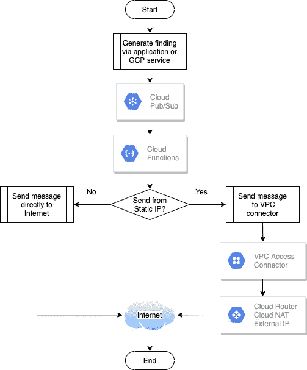

# 从 Google Cloud 发布/订阅事件本机发送电子邮件

> 原文：<https://medium.com/google-cloud/sending-emails-natively-from-google-cloud-pub-sub-events-f8260ffa6a89?source=collection_archive---------0----------------------->

# 概观

Google Cloud 通常推荐使用 [SendGrid 等工具从 Cloud Pub/Sub](https://cloud.google.com/security-command-center/docs/how-to-enable-real-time-notifications) 触发的云功能发送邮件。出于商业原因，一些组织可能不希望使用第三方发送电子邮件。此外，您可能希望您的电子邮件来自静态 IP 地址，这将需要使用更高级别的此类服务，从而产生额外的费用。

pubsub_sendmail 是一个谷歌[云功能](https://cloud.google.com/functions)，它可以由谷歌云 [Pub/Sub](https://cloud.google.com/pubsub) 触发，然后使用 Python [smtplib](https://docs.python.org/3/library/smtplib.html) 向所需的收件人发送电子邮件。你也可以通过使用 [VPC 接入连接器](https://cloud.google.com/vpc/docs/configure-serverless-vpc-access)和[云 NAT](https://cloud.google.com/nat/docs/overview) 让电子邮件来自一个静态 IP 地址。

pubsub_sendmail 是使用部署 shell 脚本中的环境变量配置的。这些环境变量将在本文档的后面部分描述。欢迎修改或修复错误。当然，您也可以修改代码以适应任何未涵盖的用例。

诸如 SendGrid 之类的服务在不同的服务层提供了许多生产级别的特性，并且受到服务供应商的支持。如果您的邮件量相对较低，但您需要从静态 IP 发送电子邮件，使用像 pubsub_sendmail 这样的原生云功能是另一种选择。代价是您必须实现并支持云功能。pubsub_sendmail 函数支持通过 VPC 接入连接器和云 NAT 使用静态 IP。

# 图表

下图显示了从 Cloud Pub/Sub 发出的消息如何通过 Cloud 函数，然后生成电子邮件。

# 加密

您可以将 pubsub_sendmail 配置为使用强制加密、机会加密或不加密。使用*强制加密*(也称为*隐式*)，与邮件服务器的整个会话从头到尾都是加密的。没有明文。使用*机会加密*(也称为*显式*)会话以明文开始，但随后通过发送 STARTTLS 命令提升为加密。换句话说，如果服务器允许*加密*(但不要求*)，那么它就是*机会性的*。如果服务器需要，则*强制*。当不支持加密时，整个会话都是明文(极不可能)。*

# *想了解更多？*

*有关包括配置和故障排除步骤在内的其他信息，请参考 [GitHub 知识库](https://github.com/GoogleCloudPlatform/cloud-pubsub-sendmail)。如果您想进行改进，请随时提交拉取请求。*