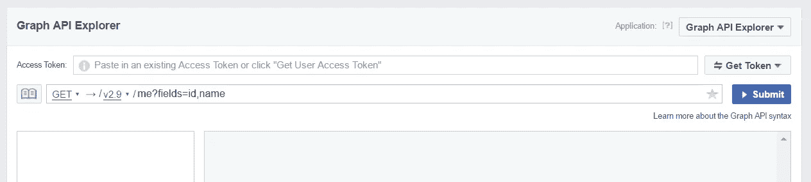
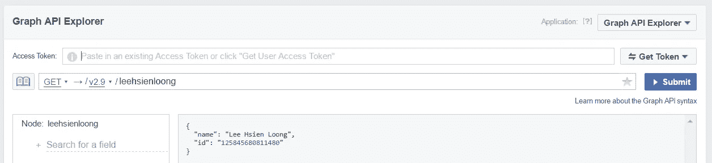
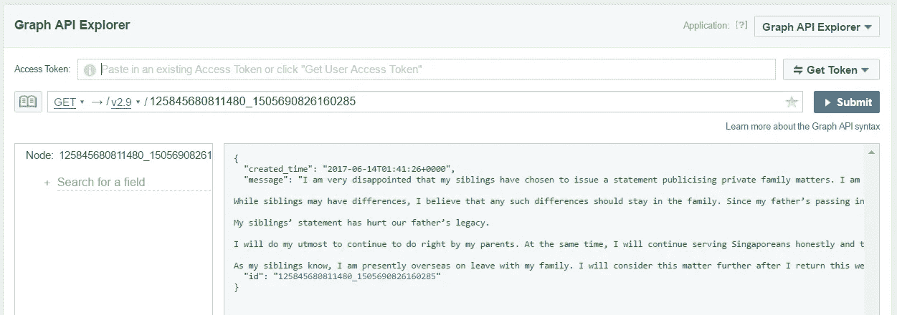
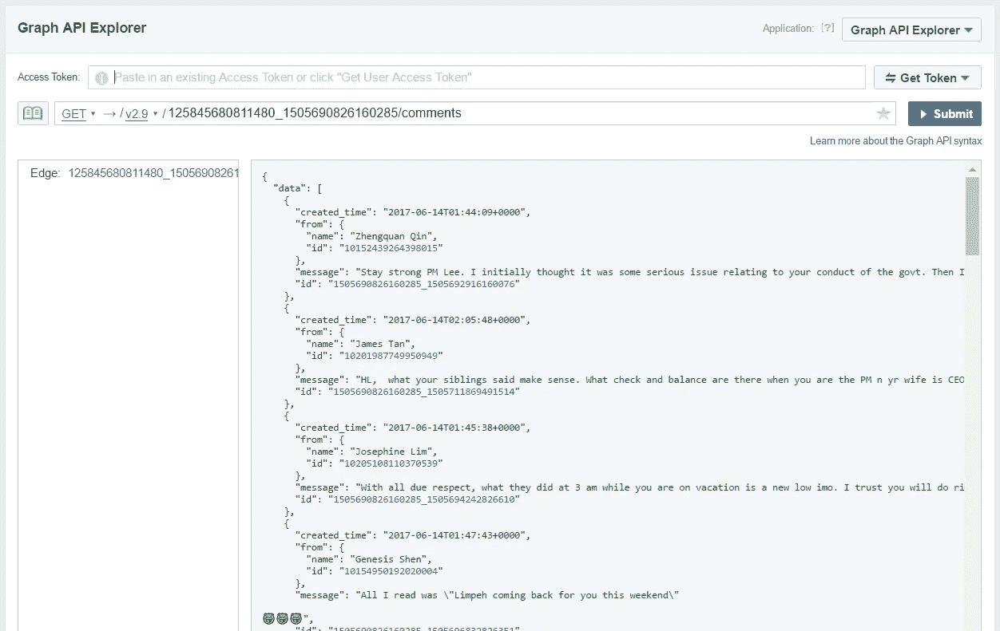

# LHL 脸书页面评论的情感分析

> 原文：<https://medium.com/google-cloud/sentiment-analysis-of-comments-on-lhls-facebook-page-9db8b3a60eb3?source=collection_archive---------0----------------------->

学习如何使用[脸书图形 API](https://developers.facebook.com/docs/graph-api) 和[谷歌云自然语言 API](https://cloud.google.com/natural-language/)

## 更新 2018 年 8 月 21 日

脸书最近在今年 7 月实施了更多的 API 限制，这意味着下面概述的获取个人访问令牌的方法不再有效:

 [## 平台更新

### 今天，我想解释一下我们为了更好地保护人们的信息而实施的附加 API 限制:

newsroom.fb.com](https://newsroom.fb.com/news/2018/07/a-platform-update/) 

> 今天，开发人员可以使用我们的 **Graph API Explorer 应用程序运行测试查询。**今天，7 月 2 日，我们将弃用这款应用，开发者需要使用他们自己的应用访问令牌在 [Graph API Explorer](https://developers.facebook.com/docs/graph-api/explorer) 上进行测试查询。

从现在开始，为了能够下载评论，您需要有一个活动的脸书应用程序来获取访问令牌。

原帖在下面。

# 爆炸性新闻

这是新加坡一个多事的早晨。

[](http://www.asiaone.com/singapore/lee-wei-ling-lee-hsien-yang-issue-statement-say-they-have-lost-confidence-pm-lee-hsien) [## 李凌薇，李显扬发表声明说他们已经对总理李显龙失去信心…

### 总理李显龙的兄弟姐妹，李凌薇博士和李显扬发表声明星期三(6 月 14 日)…

www.asiaone.com](http://www.asiaone.com/singapore/lee-wei-ling-lee-hsien-yang-issue-statement-say-they-have-lost-confidence-pm-lee-hsien) [](http://mothership.sg/2017/06/lee-hsien-yang-wants-to-leave-singapore-publishes-open-letter-with-sister-to-criticize-pm/) [## 李显扬想离开新加坡，与姐姐发表公开信批评总理李

### 拜拜。6 月 14 日，新加坡人一觉醒来，发现自己被最近迅速发展的家庭戏剧所困扰…

母舰. sg](http://mothership.sg/2017/06/lee-hsien-yang-wants-to-leave-singapore-publishes-open-letter-with-sister-to-criticize-pm/) [](http://www.straitstimes.com/singapore/lee-wei-ling-lee-hsien-yang-issue-statement-on-pm-lee-hsien-loong) [## 李凌薇，李显扬发表声明说他们已经对他们的兄弟总理失去了信心…

### 新加坡——李凌薇博士和李显扬先生周三(6 月 14 日)发表了一份六页的公开声明，称他们…

www.straitstimes.com](http://www.straitstimes.com/singapore/lee-wei-ling-lee-hsien-yang-issue-statement-on-pm-lee-hsien-loong) 

# 但是人们怎么想呢？


新加坡总理李显龙

让我们根据脸书的评论来衡量一下公众对这些声明的反应。为此，我们将使用:

*   **Python 3**
*   **脸书图形 API** 从脸书下载评论
*   用于执行情感分析的**谷歌云自然语言 API**

首先，我们将使用脸书图形 API 从脸书邮报下载评论。在这篇博客文章中，我们将使用 LHL 脸书页面上的这篇文章来回应他兄弟姐妹的声明:[https://www . Facebook . com/leehsienloong/posts/1505690826160285](https://www.facebook.com/leehsienloong/posts/1505690826160285)。

我们将使用的方法可以很容易地适用于脸书公共页面上的任何帖子，例如[李显扬的原始帖子](https://www.facebook.com/LeeHsienYangSGP/posts/1897892393784194)。

然后我们将使用谷歌云自然语言 API 将这些帖子上的评论分为正面、中立或负面，并计算这些帖子中每一个帖子上正面、中立和负面评论的比例。

## 重要说明

脸书绝不是客观观点的来源，我们会发现这些帖子的评论极有可能包含某种程度的偏见。也有适度的可能，进一步降低了我们发现的客观性。这篇博文应该被视为纯粹的使用脸书图形 API 和谷歌云自然语言 API 的练习，而不是对新加坡的政治局势下任何结论。

# 入门指南

## 设置 Python 3

下载和安装 Python 3 不在这篇博文的讨论范围之内。你可以在这里查阅 Python 文档[。但是为了检查您的 Python 版本，请打开 Python 提示符并检查其输出。您应该会看到类似如下的内容:](https://docs.python.org/3/using/index.html)

```
Python 3.6.0 (v3.6.0:41df79263a11, Dec 23 2016, 08:06:12) [MSC v.1900 64 bit (AMD64)] on win32
Type "help", "copyright", "credits" or "license" for more information.
>>>
```

如果你看到`Python 3.x.x`，你就可以走了。如果你看到`Python 2.x.x`并且你运行的是 Linux/MacOS，你可以尝试用`python3`代替`python`。否则，您将需要安装 Python 3(或者自行将代码转换为 Python 2)。

我们还将使用`requests`和`google-cloud-language`库进行 HTTP 请求和情感分析。要安装这些程序，请运行:

```
# if you are using the python3 command, you may need to use pip3 here as well
pip install --upgrade requests google-cloud-language
```

(更新 2018–01–05)本帖已更新使用 Google Cloud Python 库 v0.26.1 及更新版本。如果您遇到类似于`AttributeError: module 'google.cloud.language' has no attribute 'LanguageServiceClient'`的错误，那么您可以尝试重新运行上面的命令来更新您的包。

## **获取脸书图形 API 访问令牌**

您将需要一个脸书帐户来访问图形 API。我们可以在 https://developers.facebook.com/tools/explorer/[用脸书图形 API 浏览器得到这个。](https://developers.facebook.com/tools/explorer/)



图形 API 浏览器

点击右上角的“获取令牌”，然后点击“获取用户访问令牌”。您将看到一个选择权限的大对话框。尽管没有必要检查任何东西，因为 LHL 的脸书页面是公开的。点击右下角的“获取访问令牌”，您的访问令牌将被填入访问令牌字段。暂时把这个放在这里。

## 创建谷歌云平台项目

与 AWS 不同，Google 云平台上的资源是按项目分组的。进入[https://cloud . Google . com/natural-language/docs/getting-started](https://cloud.google.com/natural-language/docs/getting-started)，按照步骤 1-6 设置项目。您可能还需要安装 Google Cloud SDK 才能使用`gcloud`。

# 下载脸书评论

我们的目标是下载 LHL 在脸书页面上回复他兄弟姐妹的帖子的所有评论:

[https://www . Facebook . com/leehsienloong/posts/1505690826160285](https://www.facebook.com/leehsienloong/posts/1505690826160285)

我们将通过遍历脸书图形 API 来实现这一点。

## 脸书图形 API 的工作原理

图形 API 将脸书数据显示为图形，由连接的实体组成。这些实体可以是脸书上的任何东西，比如一个脸书用户，一个页面，甚至一条评论。实体的完整列表可以在[图形 API 参考](https://developers.facebook.com/docs/graph-api/reference)中找到。

实体由顶点链接，顶点是实体的属性。例如，一个帖子实体链接到许多评论实体，代表该帖子上的每个评论。

我们需要找到与 LHL 的帖子相对应的帖子实体，并检查与之相关的所有评论实体。为简单起见，post 实体由一个 ID 引用，该 ID 由发布帖子的用户或页面的 ID 以及帖子本身的 ID 组成，可以在帖子 URL 中找到。

要通过 Graph API Explorer 获得 LHL 的页面 ID，我们只需在查询框中输入他的页面用户名:



LHL 的脸书页面 ID

在我们得到他的页面 ID 后，我们可以找到他的帖子:



只需将`/comments`添加到帖子 ID，我们就可以获得帖子上的所有评论:



但是，我们不想使用 Graph API Explorer 来手动保存所有注释，所以我们将使用 Python 脚本来代替(更新于 2018 年 1 月 15 日):

```
import requests
import signal
import sys

graph_api_version = 'v2.9'
access_token = 'YOUR_FACEBOOK_ACCESS_TOKEN_HERE'

# LHL's Facebook user id
user_id = '125845680811480'

# the id of LHL's response post at https://www.facebook.com/leehsienloong/posts/1505690826160285
post_id = '1505690826160285'

# the graph API endpoint for comments on LHL's post
url = 'https://graph.facebook.com/{}/{}_{}/comments'.format(graph_api_version, user_id, post_id)

comments = []

# set limit to 0 to try to download all comments
limit = 200

def write_comments_to_file(filename):
    print()

    if len(comments) == 0:
        print('No comments to write.')
        return

    with open(filename, 'w', encoding='utf-8') as f:
        for comment in comments:
            f.write(comment + '\n')

    print('Wrote {} comments to {}'.format(len(comments), filename))

# register a signal handler so that we can exit early
def signal_handler(signal, frame):
    print('KeyboardInterrupt')
    write_comments_to_file('comments.txt')
    sys.exit(0)

signal.signal(signal.SIGINT, signal_handler)

r = requests.get(url, params={'access_token': access_token})
while True:
    data = r.json()

    # catch errors returned by the Graph API
    if 'error' in data:
        raise Exception(data['error']['message'])

    # append the text of each comment into the comments list
    for comment in data['data']:
        # remove line breaks in each comment
        text = comment['message'].replace('\n', ' ')
        comments.append(text)

    print('Got {} comments, total: {}'.format(len(data['data']), len(comments)))

    # check if we have enough comments
    if 0 < limit <= len(comments):
        break

    # check if there are more comments
    if 'paging' in data and 'next' in data['paging']:
        r = requests.get(data['paging']['next'])
    else:
        break

# save the comments to a file
write_comments_to_file('comments.txt')
```

默认情况下，这个脚本将在下载 200 条评论后停止。你可以调整脚本里面的`limit`变量来下载更多，或者设置为 0 来尝试下载所有东西。也可以用 Ctrl-C 中断下载，保存到目前为止下载的所有评论。

这个脚本可以工作，因为我们可以通过直接访问 Graph API URL 从 Graph API Explorer 获得相同的输出。这个脚本做了几件事:

1.  发出一个 HTTP 请求来获取对 LHL 帖子的评论
2.  将帖子上的评论文本保存到 Python 列表中
3.  检查是否有更多的注释(使用请求中返回的分页光标，有关分页的更多信息，请参考[https://developers . Facebook . com/docs/graph-API/using-graph-API](https://developers.facebook.com/docs/graph-api/using-graph-api))。
4.  把我们得到的评论保存到一个文件里。

# 分析评论情绪

现在我们有了一个想要分析的评论列表，我们可以使用谷歌云自然语言来获得每个评论的情感。云自然语言 API 做了很多事情，但在这篇博客文章中，我们将只使用情感分析功能，它将检查一个文本块，并确定主要的情感是积极的、消极的还是中性的。

我们在上一节中生成的`comments.txt`文件包含 LHL《脸书邮报》上每条评论的文本，每行一条(这就是为什么我们从每条评论中删除了换行符)。现在我们将浏览这个列表，确定每个评论的情绪是积极、消极还是中性，并计算每个情绪的总体比例(更新于 2018–01–05):

```
import signal
import sys

from google.cloud import language
from google.api_core.exceptions import InvalidArgument

# create a Google Cloud Natural Languague API Python client
client = language.LanguageServiceClient()

# a function which takes a block of text and returns its sentiment and magnitude
def detect_sentiment(text):
    """Detects sentiment in the text."""

    document = language.types.Document(
        content=text,
        type=language.enums.Document.Type.PLAIN_TEXT)

    sentiment = client.analyze_sentiment(document).document_sentiment

    return sentiment.score, sentiment.magnitude

# keep track of count of total comments and comments with each sentiment
count = 0
positive_count = 0
neutral_count = 0
negative_count = 0

def print_summary():
    print()
    print('Total comments analysed: {}'.format(count))
    print('Positive : {} ({:.2%})'.format(positive_count, positive_count / count))
    print('Negative : {} ({:.2%})'.format(negative_count, negative_count / count))
    print('Neutral  : {} ({:.2%})'.format(neutral_count, neutral_count / count))

# register a signal handler so that we can exit early
def signal_handler(signal, frame):
    print('KeyboardInterrupt')
    print_summary()
    sys.exit(0)

signal.signal(signal.SIGINT, signal_handler)

# read our comments.txt file
with open('comments.txt', encoding='utf-8') as f:
    for line in f:
        # use a try-except block since we occasionally get language not supported errors
        try:
            score, mag = detect_sentiment(line)
        except InvalidArgument as e:
            # skip the comment if we get an error
            print('Skipped 1 comment: ', e.message)
            continue

        # increment the total count
        count += 1

        # depending on whether the sentiment is positve, negative or neutral, increment the corresponding count
        if score > 0:
            positive_count += 1
        elif score < 0:
            negative_count += 1
        else:
            neutral_count += 1

        # calculate the proportion of comments with each sentiment
        positive_proportion = positive_count / count
        neutral_proportion = neutral_count / count
        negative_proportion = negative_count / count

        print(
            'Count: {}, Positive: {:.3f}, Neutral: {:.3f}, Negative: {:.3f}'.format(
                count, positive_proportion, neutral_proportion, negative_proportion))

print_summary()
```

您可以按 Ctrl-C 来中途中止分析，并查看到目前为止的结果。运行这个脚本，我们将得到如下输出:

```
...
Count: 379, Positive: 0.657, Neutral: 0.190, Negative: 0.153
Count: 380, Positive: 0.655, Neutral: 0.192, Negative: 0.153
Count: 381, Positive: 0.656, Neutral: 0.192, Negative: 0.152
Count: 382, Positive: 0.657, Neutral: 0.191, Negative: 0.152
Count: 383, Positive: 0.658, Neutral: 0.191, Negative: 0.151
Count: 384, Positive: 0.659, Neutral: 0.190, Negative: 0.151
...
```

最后:

```
Total comments analysed: 781
Positive : 530 (67.86%)
Negative : 109 (13.96%)
Neutral  : 142 (18.18%)
```

# 结论

根据我们对 LHL《脸书邮报》的情感分析，我们看到近 70%的评论是正面的。虽然这可能被解释为公众对我们的项目经理的强烈支持，但我们也需要考虑到脸书页面的访问者可能会偏向该页面的事实，以及评论适度的可能性。

## 潜在的改进

在测试我的脚本时，我不得不多次运行情感分析脚本，每次都不必要地请求相同的评论。考虑到脸书帖子的动态性质，可以修改代码来按 ID 缓存评论，并且只分析新评论的情绪。这一点尤其重要，因为谷歌云自然语言 API 每月只有 5k API 调用的免费配额。

## 源代码

以上例子的源代码可以在[https://gist . github . com/yi-Jiayu/b 94d 9 df 77007 D8 a 6683 F3 df 0990 da 0 f 6](https://gist.github.com/yi-jiayu/b94d9df77007d8a6683f3df0990da0f6)找到。

# 结尾注释

这也是我的第一篇博文，我希望这是对脸书图形应用编程接口和谷歌云平台的介绍。如果你是新加坡人，并且乘坐公共汽车，一定要看看我的电报机器人， [@BusEtaBot](https://t.me/BusEtaBot) 获取公共汽车信息！

## 承认

黄俊凯
爱德蒙
T2【李芸婵

## 修订历史

2018–01–15:更新了用于分析情绪的代码以使用谷歌云 Python 库 v 0 . 26 . 1([https://Cloud . Google . com/natural-language/docs/Python-client-migration](https://cloud.google.com/natural-language/docs/python-client-migration))