# 使用谷歌云自然语言 API 的情感分析

> 原文：<https://medium.com/google-cloud/sentiment-analysis-using-google-cloud-machine-learning-552be9b9c39b?source=collection_archive---------0----------------------->

本教程将引导您使用 Google Cloud 自然语言 API 进行情感分析，该 API 使用一个**analyze perspective**请求，对文本执行*情感分析*。*情绪分析*试图确定总体态度(积极或消极)，并由数值分数和量值表示。关注我的博客[***techwithsach.com***](https://techwithsach.com)了解更多关于谷歌云机器学习 API 的教程。本教程是一步一步的方法来设置，配置，启用和使用谷歌云机器学习 API 来执行情感分析。

# 使用谷歌云自然语言 API 的情感分析:

云自然语言 API 允许您从文本中提取实体，执行情感和语法分析，并将文本分类。因此，我们将在这个快速教程中探索所有这些。

## 要求:

*   谷歌云平台项目
*   浏览器如 Chrome 或 Firefox

## 设置:

*   首先，确保你已经有一个谷歌账户。登录[谷歌云平台控制台](http://console.cloud.google.com/)。
*   转到[管理资源页面](https://console.cloud.google.com/cloud-resource-manager)并点击**创建项目，创建一个新项目。**

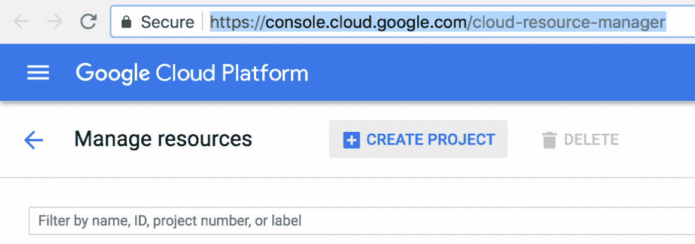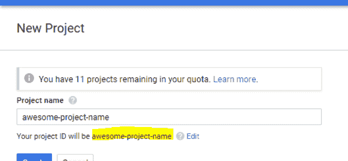

*   请记住您的项目 ID，如下图所示。此外，请确保添加您唯一的项目名称。
*   如果这是你第一次使用谷歌云平台，新用户有资格获得 300 美元的积分。
*   此外，您必须为您的帐户启用[计费](https://console.developers.google.com/billing)。


## 配置:

*   既然帐户创建和项目设置已经完成，让我们继续配置我们的项目，以启用 Google Cloud 自然语言 API。
*   进入仪表板菜单，点击[API&服务](https://console.cloud.google.com/apis)。
*   此外，点击**启用 API 和服务。**

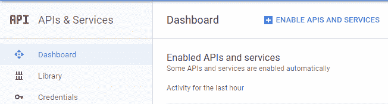

*   于是乎，搜索*谷歌云自然语言 API* ，点击。

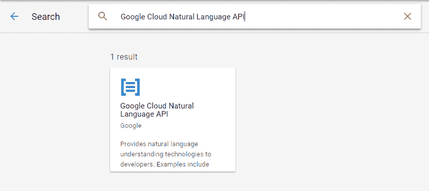

*   另外，点击 **ENABLE** 启用云自然语言 API。几秒钟后，应该会启用 API。

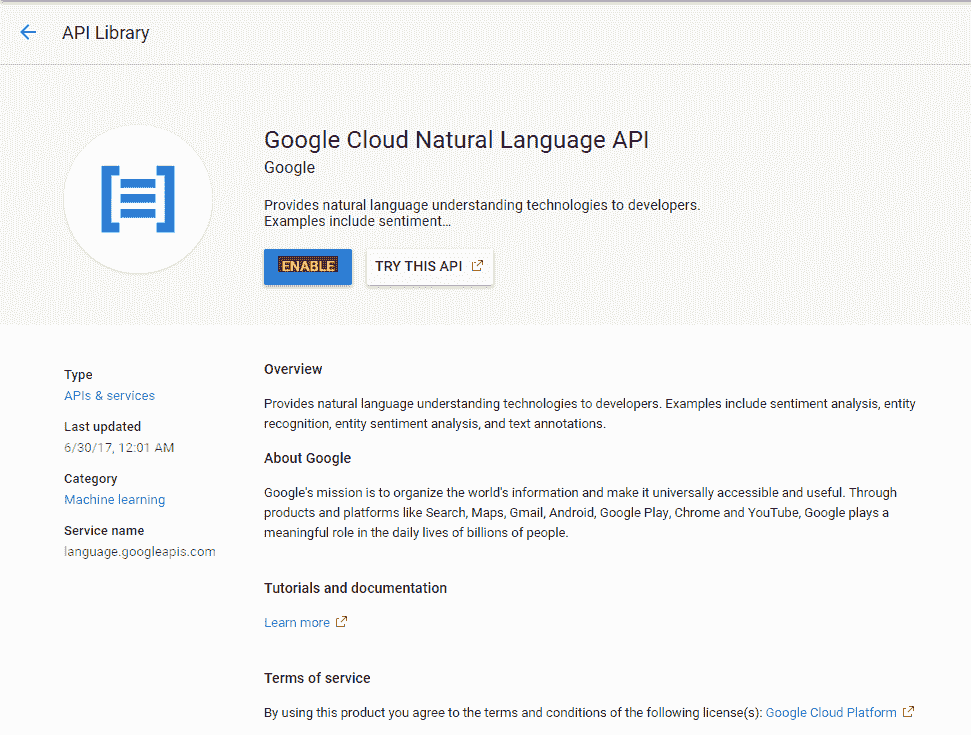

## 激活云外壳:

*   Google Cloud Shell 是一个 Shell 环境，用于管理托管在 Google 云平台上的资源。它是一个运行在云中的[命令行环境](https://cloud.google.com/shell/#how_do_i_get_started)。
*   此外，我们将使用 Cloud Shell 来创建我们对自然语言 API 的请求。
*   首先，点击标题栏右上角的激活外壳图标上的右上角图标，如下图所示。

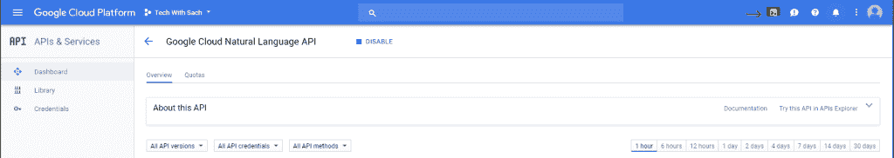

*   因此，云 Shell 会话会在控制台底部的新框架中打开，并显示命令行提示符。等到 user@project:~$提示符出现

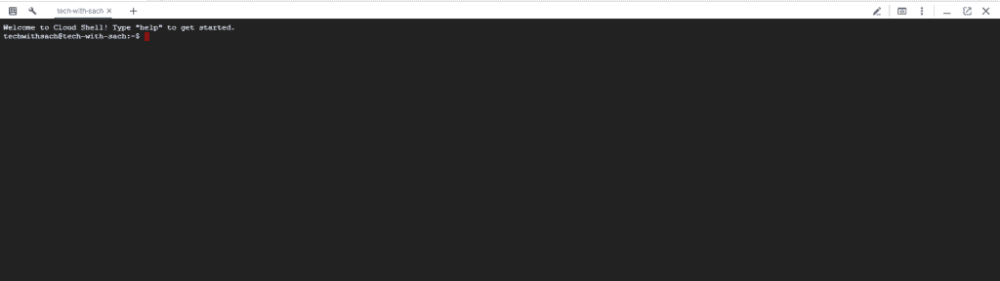

## 创建 API 密钥:

*   我们需要生成一个 API 键，因为我们将使用 curl 向自然语言 API 发送请求。
*   要创建 API 密钥，请导航到云控制台中 API&服务的[凭证部分](https://console.cloud.google.com/apis/credentials):
*   点击**创建凭证**下拉菜单并选择 API 密钥。

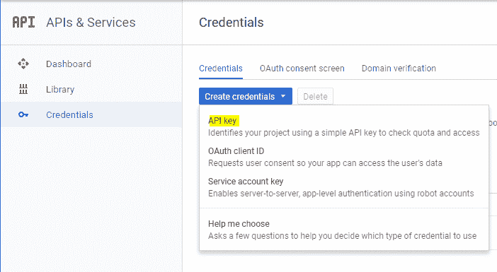

*   因此，您将看到一个弹出窗口，其中显示了您生成的 API 密钥。复制 API 密钥并将其安全地保存在您的系统中。
*   让我们回到 Google Cloud Shell 命令行，输入以下命令。

```
export API_KEY=<YOUR_API_KEY>
```

*   用我们在上一步中复制的 API 键替换<your_api_key>。在终端中执行上面的行可以确保 API_KEY 已经添加到环境变量中，并且不需要为每个请求调用它。</your_api_key>

## 使用谷歌云自然语言 API 的情感分析:

*   最后，我们来到了所有机器学习和魔法发生的地方。
*   自然语言 API 允许您对文本块执行情感分析。
*   首先，让我们用想要执行情感分析的文本创建一个 JSON 请求。
*   在您的云 Shell 环境中，用下面的代码创建文件 **request.json** 。
*   您可以使用您喜欢的命令行编辑器(nano、vim、emacs)创建该文件，也可以使用 Cloud Shell 中内置的 Orion 编辑器，如下所示。


因此，这将在**云壳中启动编辑器。**点击文件- >新建- >文件，输入文件名 **request.json**

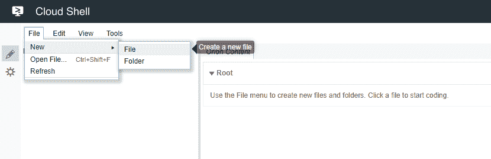

从下面复制内容并粘贴到 request.json 文件中。

```
{"document":{"type":"PLAIN_TEXT","content":"Inception is one of the best movies of all time. I think everyone should watch it."},"encodingType": "UTF8"}
```

*   在请求中，我们告诉自然语言 API 我们将要发送的文本。支持的类型值是`PLAIN_TEXT`或`HTML`。在内容方面，我们将文本发送给自然语言 API 进行分析。
*   自然语言 API 还支持发送存储在云存储中的文件进行文本处理。如果我们想从云存储中发送一个文件，我们可以用`gcsContentUri`替换`content`，并给它一个云存储中文本文件的 uri 值。
*   告诉 API 在处理我们的文本时使用哪种类型的文本编码。

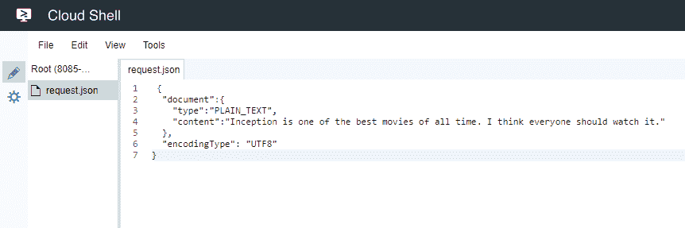

## 调用自然语言 API 来执行情感分析:

*   现在，您可以通过 curl 命令将请求和我们之前保存的 API Key 环境变量一起传递给自然语言 API，如下所示。
*   我们将把请求发送到 API 的**analyse timent**端点。
*   从这里复制 curl 命令，并在您的云 shell 命令行中运行它。

```
curl "https://language.googleapis.com/v1/documents:analyzeSentiment?key=${API_KEY}" -s -X POST -H "Content-Type: application/json" --data-binary @request.json
```

*   你的回答应该是这样的:

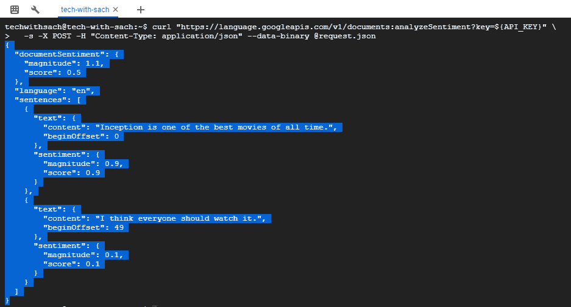

*   从回复中，你可以明确我们是如何使用谷歌云自然语言 API 做情感分析的。
*   让我们深入研究一下响应，了解一下发生了什么。你会看到两个部分。一个是文档情感，用于整个文本或文档块。另一个是我们有被每个句子分解的情感。
*   每个句子的**情绪**得分都不同。
*   量级表示该句子的强度或量级值。
*   一个**量级**是一个范围从 0 到无穷大的数。它代表了陈述中表达的情绪的权重，无论是积极的还是消极的。具有高权重语句的较长文本块具有较高的量值。
*   情感得分是一个数字，范围从-1 到+1。
*   -1 真的很差到+1 很好。任何接近 0 的分数都是中性分数。
*   从上面的回答中，您可以看到该文档的总体得分为 0.5，幅度为 1.1。而第一句话的情感得分是 0.9(这意味着非常好)。还有，第二句分别是 0.1。

## 游戏时间:

*   让我们用展示一些负面陈述的不同文本执行另一个请求，看看使用 Google Cloud 自然语言 API 的情感分析是如何执行的。
*   回到**请求**。 **json** 文件并编辑内容添加一些负面反馈。

```
{"document":{"type":"PLAIN_TEXT","content":"The food was really bad at this restaurant. However, really enjoyed the drinks."},"encodingType": "UTF8"}
```

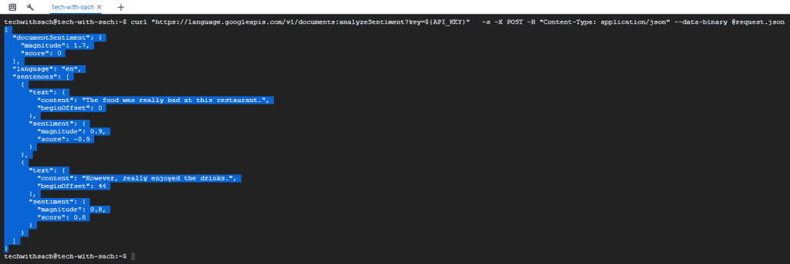

*   从回答中可以看出，第一句话的情绪得分为-0.9。
*   第二种说法 0.8 情绪分。
*   但整个反馈的总体情绪得分是中性的，为 0 分。

## 重要使用案例:

*   这个 API 的能力真的是无限的，因为它有无限的可能性。
*   一旦这样的用例是与我的谷歌助理应用程序集成，以获取用户的反馈。
*   然后通过 webhook 使用情感分析来处理反馈。

## 结论:

这是关于如何使用谷歌云自然语言 API 执行情感分析的总结。

让我知道你对这个强大的 API 的想法。

**实体**、**语法**和**多语言自然语言处理**将在后续教程中介绍。

所以，下期教程再见。关注我的[博客版块](https://techwithsach.com/blog/)获取更多有趣的教程。查看下面的更多教程。

[](/google-cloud/how-to-create-a-chatbot-using-dialogflow-enterprise-edition-and-dialogflow-api-v2-923f4a965176) [## 如何使用 Dialogflow 企业版和 Dialogflow API V2 创建聊天机器人

### 在本教程中，我们将学习如何使用 Dialogflow 企业版和 Dialogflow API V2 创建聊天机器人。这个…

medium.com](/google-cloud/how-to-create-a-chatbot-using-dialogflow-enterprise-edition-and-dialogflow-api-v2-923f4a965176) [](/google-cloud/how-to-build-your-own-smart-speaker-google-assistant-google-cloud-actions-on-google-and-b5beb96da119) [## 如何打造自己的智能音箱——谷歌助手、谷歌云、谷歌上的动作和…

### 在本教程中，我们将学习如何使用谷歌助手和 ReSpeaker Core v2.0 构建自己的智能扬声器…

medium.com](/google-cloud/how-to-build-your-own-smart-speaker-google-assistant-google-cloud-actions-on-google-and-b5beb96da119) [](/google-cloud/how-to-build-your-own-smart-speaker-google-assistant-google-cloud-actions-on-google-and-eec1169d9435) [## 如何打造自己的智能音箱——谷歌助手、谷歌云、谷歌上的动作和…

### 在本教程中，我们将学习如何使用谷歌助手、谷歌云、在…上的操作来构建自己的智能扬声器

medium.com](/google-cloud/how-to-build-your-own-smart-speaker-google-assistant-google-cloud-actions-on-google-and-eec1169d9435) [](/google-cloud/build-a-self-driving-rc-car-using-raspberry-pi-and-machine-learning-using-google-colab-8ca2b4ae547f) [## 使用 Raspberry Pi 构建自动驾驶遥控汽车，使用 Google Colab 进行机器学习

### 在本教程中，我们将学习如何使用 Raspberry Pi 构建自动驾驶遥控汽车，以及使用 Google 进行机器学习…

medium.com](/google-cloud/build-a-self-driving-rc-car-using-raspberry-pi-and-machine-learning-using-google-colab-8ca2b4ae547f)