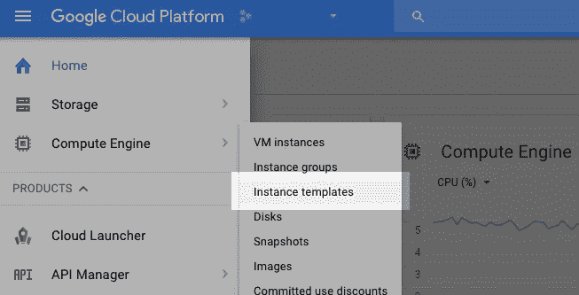
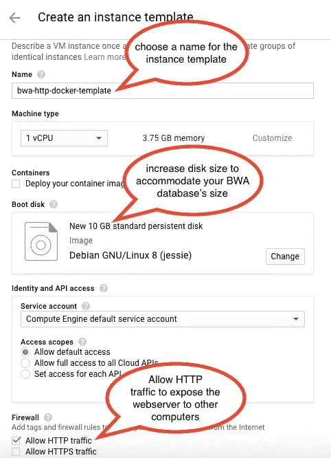
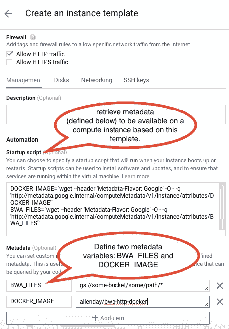
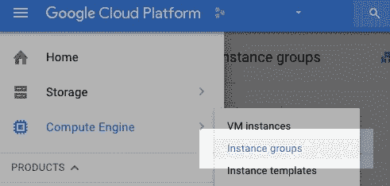
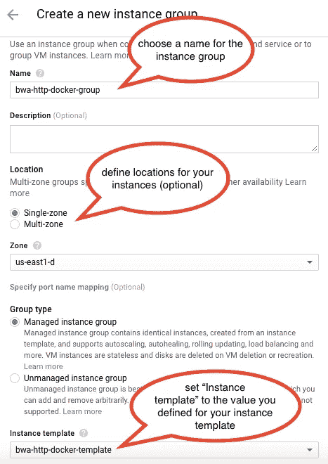
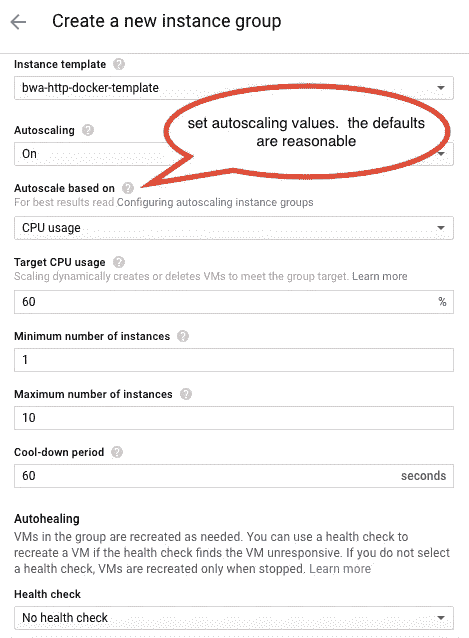
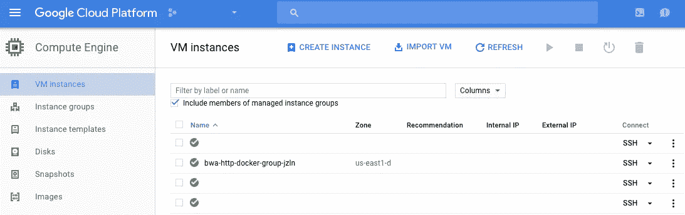
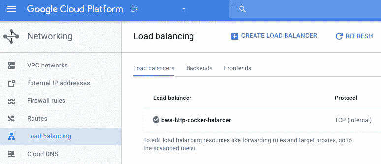
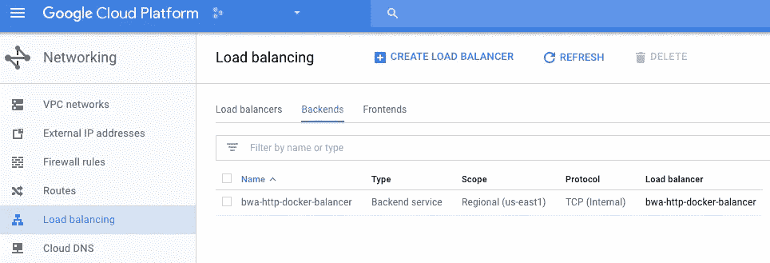
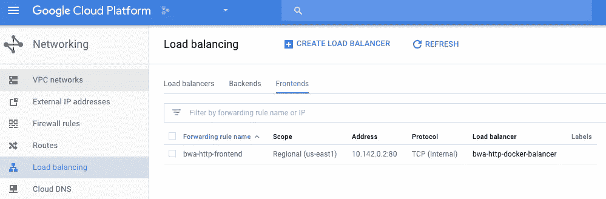

# 作为云服务的 DNA 序列比对

> 原文：<https://medium.com/google-cloud/sequence-alignment-as-a-cloud-service-2fbd8146522b?source=collection_archive---------1----------------------->

**TL；DR:** DNA 序列比对非常适合容器/微服务部署模型。使用我的 [GitHub 代码](https://github.com/allenday/bwa-http-docker)和 [Docker 图像](https://hub.docker.com/r/allenday/bwa-http-docker/)在 [Google Cloud](http://cloud.google.com) (下面是图解教程)上部署一个对齐服务，该服务根据传入的 DNA 测序仪读取次数自动扩展。


来自 DNA 测序仪的数据的典型分析工作流程从**序列比对**开始。大多数 DNA 测序仪批量发射数据，而直接下游序列比对步骤可以流式传输数据。

# DNA 测序仪:数据输出的类型和速度

在稳态测序设备运行的过程中，DNA 测序机器(例如来自 [Illumina](http://illumina.com) 的机器)以 [FastQ 格式](https://en.wikipedia.org/wiki/FASTQ_format)产生一批数据记录，运行几个小时或几天，然后发出几 GB 或几 TB 的数据。

数据处理工程师将认识到这种有规律的数据脉冲模式，并有特定的技术来处理随时间推移而出现的“尖峰”数据量。对于在“重新排序”工作流程中负责处理这些数据的工程师来说，处理序列器读数的第一步是对齐。

序列比对操作是无状态的。每个操作将单个 FastQ 记录作为输入，将其与参考基因组序列进行比较以识别零个或多个匹配，并将每个匹配的坐标发送给参考序列。该操作通常受 CPU 限制，对磁盘和内存的要求较低。磁盘和内存需求与参考基因组大小成次线性比例关系(人类基因组约为几 GB)。具有这些性能特征的操作是自动伸缩服务的良好候选。

# 云服务自动扩展

什么是自动缩放？[维基百科定义得很好](https://en.wikipedia.org/wiki/Autoscaling):

> 自动扩展[…]是云计算中使用的一种方法，通过这种方法，服务器场中的计算资源量(通常以活动服务器的数量来衡量)会根据服务器场中的负载自动扩展。它与负载平衡的思想密切相关，并建立在它的基础上。

在 DNA 序列分析工作流程的背景下，这意味着所需的比对操作的数量随时间而变化(由批量输出引起)，并且我们可以使用自动缩放技术根据对那些资源的需求来提供和释放比对资源。

# 虚拟机中的对齐服务

在这一节中，我将描述我使用 Docker 创建的一个虚拟机映像。当从这个映像创建虚拟机时，它运行一个 web 服务器。包含 [FastQ 记录](https://en.wikipedia.org/wiki/FASTQ_format)的 HTTP 请求可以被发送到这个 web 服务器，它将使用 [SAM 记录](https://en.wikipedia.org/wiki/SAM_(file_format))进行响应——比对序列的输出记录格式。

这里是 Docker 图像:[https://hub.docker.com/r/allenday/bwa-http-docker/](https://hub.docker.com/r/allenday/bwa-http-docker/)，它可以这样运行:

```
docker pull allenday/bwa-http-docker
docker run -P \
  --name=bwa-http \
  -e **BWA_FILES=gs://some/storage/path/*** \
  allenday/bwa-http-docker
```

上面的命令所做的是将`allenday/bwa-http-docker`映像检索到本地环境，然后启动一个虚拟机，将变量`BWA_FILES`设置为对应于 BWA 格式数据库的 URL。`BWA_FILES`识别`gs://`、`[http://](http://,)`、[、](http://,)和`https://`URL，并且可以接受这些 URL 的空格分隔列表。它还会自动解压以`.tar.gz`结尾的网址。

# 使用谷歌云自动缩放 DNA 比对

现在我们有了 Docker 图像，我们可以用它来创建一个实例模板和自动缩放实例组。这可以通过编程来实现，但是为了便于理解，我将使用[图形云控制台](http://console.cloud.google.com)并截图展示如何实现。

作为第一步，这可能是显而易见的，但 BWA 格式的数据库需要创建并托管在[谷歌云存储](http://cloud.google.com/storage)或对谷歌云虚拟机可见的网络服务器上。如果您想走云存储路线，请查看`[gsutil](https://cloud.google.com/storage/docs/gsutil)`。

**创建实例模板**

点击左上角的汉堡，选择"计算引擎" > "实例模板":



单击“创建实例模板”:


现在“创建实例模板”:

*   根据您的偏好为模板选择一个名称。
*   增加基于此模板创建的实例的磁盘大小。对于人来说，10GB 有点紧，但 20GB 应该足够了。YMMV 取决于你正在分析的数据库/物种。
*   单击“允许 HTTP 流量”,以便此模板的实例可以处理传入的 HTTP 请求。这就是我们连接校准器的方式。



继续使用相同的“创建实例模板”表单:

*   定义“元数据”:我们需要定义两个变量:

1.  `BWA_FILES`:这是作为`gs://`、`[http://](http://,)`、[、](http://,)或`https://` URL 的位置，指向对准器将使用的参考基因组的 BWA 索引的位置。这些可以在`.tar.gz`中结束，并将被自动解压缩。
2.  `DOCKER_IMAGE`:使用`allenday/bwa-http-docker`作为[艾伦·戴](https://medium.com/u/4671bccf7793?source=post_page-----2fbd8146522b--------------------------------)的形象，或者定义自己的形象。

*   定义“启动脚本”:在这个字段中，我们有一些样板代码(第 2–3 行)，用于提取元数据(如上所述)，以便计算实例上的逻辑可以启动 docker 容器(第 5–6 行):



你不必从我的截图中复制文本，这里有“启动脚本”代码:

点击“创建”:


**创建一个实例组**

再次转到汉堡包，选择“计算引擎”>“实例组”:



然后“创建新的实例组”:

*   为实例组定义一个名称
*   定义位置信息(可选)
*   将您之前定义的实例模板与此实例组相关联。这将导致该模板的实例由管理该组的(系统)进程创建和管理。



继续使用相同的“创建新实例组”表单:

*   定义自动缩放系统将使用的属性，以确定机器是否足够、太多或太少。你可以看一段视频

或者在这里阅读更多关于自动缩放的内容:[https://cloud.google.com/compute/docs/autoscaler/](https://cloud.google.com/compute/docs/autoscaler/)



点击“创建”:


现在回到汉堡菜单“计算引擎”>“虚拟机实例”，查看可用虚拟机实例列表。您将看到一个实例，其名称基于您定义的实例组名称，后缀为 4 个随机字符:



如果你看到一个实例，恭喜你！自动缩放实例组正在工作。

**创建一个负载平衡器**

请注意，在实例组步骤中，使用自动分配的 IP 地址创建虚拟机实例。虽然可以为我们可能拥有的最大数量的机器(在本配置中为 10 台)预分配 IP 地址，以及这些机器中哪些是可用的，但是有效地重新实现路由表需要大量的簿记工作。幸运的是，我们有一个负载平衡器。我们将使用的方法是:

*   将 LB 公开为单个 IP 前端地址和端口(内部端口 80)
*   将 LB 配置为使用 BWA 实例组作为后端服务

你可以在汉堡菜单>“网络”>“负载平衡”下找到配置。完整的配置如下所示:



负载平衡器本身只是一个带有名称的记录，前端/后端服务需要连接在一起(见下图)



负载平衡器配置的“后端服务”是我们在上一节中创建的实例组



负载平衡器配置的“前端服务”只是一个 IP 和端口(在这种情况下是内部 IP)

# **使用校准服务**

用`curl`发送一个简单的 HTTP 请求来测试服务。您需要知道实例的 IP 地址(在“VM 实例”控制台视图中可见)。然后，您可以 HTTP POST 到负载平衡器的 IP，如下面我的会话所示:

# 最后的想法

这也可以使用 Kubernetes 和 Google Container Engine(而不是实例模板和实例组)来实现，以获得更大的功能和更多的乐趣。这超出了本文档的范围。

这个 web 服务可以建立在使用其他云服务的基础上，如[云数据流](https://cloud.google.com/dataflow/)和[云功能](https://cloud.google.com/functions/)。这些以后再详细说！