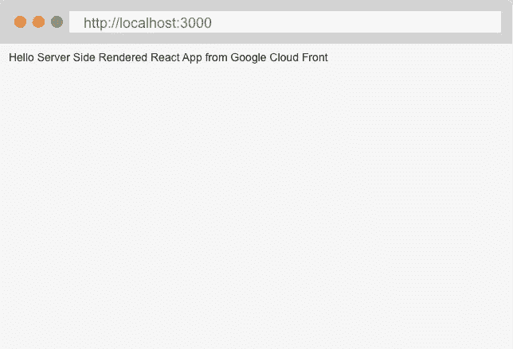
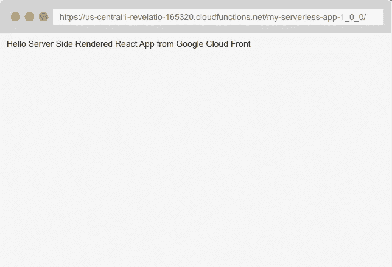
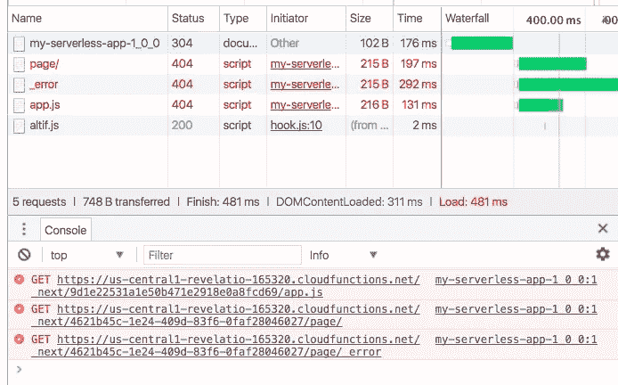

# 服务器端渲染谷歌云函数

> 原文：<https://medium.com/google-cloud/server-side-rendered-react-on-google-cloud-functions-8b51b2b0878c?source=collection_archive---------0----------------------->

渲染 HTML 是我第一次尝试的 Serverless 的用例之一。我喜欢这个想法:

1.  单一功能**(无服务器)**
2.  渲染 React 组件**(服务器端渲染)**
3.  在 HTTP 端点上**(微服务组合)**
4.  返回完整的应用程序/页面。**(单页应用)**

每个评论的好处都在网上有详细的记录。从在移动设备上提供更好的 SEO 和更快的响应的 SSR，到定义当今大多数大公司基础设施的微服务，到为我们最喜爱的社交网络应用和在线协作工具提供动力的日益复杂的 SPA，到无服务器在成本节约和无限可扩展性方面的惊人潜力。

让我们尝试将一个简单的例子放在一起，说明如何在一个 SPA 中实现所有这些功能，这个例子是用部署在 Google Cloud Functions 上的 React 编写的。


这座城市

## 无服务器功能

让我们从一个简单的谷歌云功能开始。

```
$ mkdir my-serverless-app
$ cd my-serverless-app
$ npm init -y
```

让我们在 *index.js* 添加一些代码:

以及 *package.json* 的脚本部分的新值:

```
"scripts": {
  **"deploy": "gcloud beta functions deploy my-serverless-app-1_0_0 --entry-point handler --trigger-http --stage-bucket medium-post-functions --memory=2048MB"**
},
```

一旦我们有了这几个部分，我们可以简单地做:

```
$ yarn deploy
```

观看我们的 GCF 被部署。注意，我使用了 2048Mb 内存。(以后可以随意更改这个)。此时，我们有一个返回静态内容的 HTTP 端点。

## 服务器端渲染反应

此时为 React 创建另一个 SSR 实现并不是很有成效。已经有很多很好的实现了。再加上一大堆库来加快 React 开发的速度。

*   *create-react-app*([https://www.npmjs.com/package/create-react-app](https://www.npmjs.com/package/create-react-app))用 React 启动的时候解决了很多问题，但是没有 SSR。
*   *nwb*([https://www.npmjs.com/package/nwb](https://www.npmjs.com/package/nwb))类似于 create-react-app 但是支持 Preact、Inferno、组件库等。
*   https://github.com/storybooks/react-cdk 很喜欢这个，故事书是一个很好的创建组件库的方式，它有实时的风格指南。
*   *razzle*([https://www.npmjs.com/package/razzle](https://www.npmjs.com/package/razzle))好库，看不上 SSR。+1 表示使用反应路由器 v4。
*   *下一个*([https://www.npmjs.com/package/next](https://www.npmjs.com/package/next))大概是现在功能最全的 React 库了。Does SSR 及其示例文件夹是纯 JS 黄金。；)

所以，我会用 *Nextjs* 。学习如何使用它的最好方法是去 https://learnnextjs.com/的(我做到了，花了我~20 分钟掌握基本知识)。继续同一个回购，让我们先添加 *Nextjs* 依赖项。

```
$ yarn add react react-dom next
$ mkdir pages
```

让我们制作一个 *pages/index.js* 作为我们应用程序的根。

以及对 *package.json* 的一个小补充:

```
{
  "scripts": {
    **"dev": "next"**
  }
}
```

所以我们现在可以做的是:

```
$ yarn devDONE  Compiled successfully in 3775ms                                                                                                                             > Ready on http://localhost:3000
```

去[*http://localhost:3000*](http://localhost:3000)*看看我们的“App”*

**

*浏览器框架艺术[https://dribbble.com/shots/1582463-Browser-mockup](https://dribbble.com/shots/1582463-Browser-mockup)*

*不错，但对服务器端渲染或谷歌云功能来说不太好。我们需要构建我们的应用程序，并使用处理函数来服务它。Nextjs 推荐的方法是创建一个定制服务器([https://learnnextjs . com/basics/Server-side-support-for-clean-URLs/create-a-Custom-Server](https://learnnextjs.com/basics/server-side-support-for-clean-urls/create-a-custom-server))*

*由于我们的定制服务器仅用于 GCF，因此我们可以将其简化为:*

*并且在 *package.json* 上再添加一个脚本，将我们的应用程序构建成一个可部署的变体。(默认情况下，内置应用程序存储在*上。下一个*文件夹，查看一下)*

```
*{
  "scripts": {
    **"build": "next build"**
  }
}*
```

*最后:*

```
*$ yarn build
$ yarn deploy....
httpsTrigger:
  url: [https://us-central1-revelatio-165320.cloudfunctions.net/my-serverless-app-1_0_0](https://us-central1-revelatio-165320.cloudfunctions.net/my-serverless-app-1_0_0)
....*
```

*如果我们访问:[https://us-central 1-revelation-165320 . cloud functions . net/my-server less-app-1 _ 0 _ 0](https://us-central1-revelatio-165320.cloudfunctions.net/my-serverless-app-1_0_0)/*

**

*注意端点调用末尾的斜杠(/)。GCF 和 *Nextjs* ends 似乎有一些错误。GCF 假设默认路由是一个空字符串，所以*

```
*[https://us-central1-revelatio-165320.cloudfunctions.net/my-serverless-app-1_0_0](https://us-central1-revelatio-165320.cloudfunctions.net/my-serverless-app-1_0_0)req.url === ''[https://us-central1-revelatio-165320.cloudfunctions.net/my-serverless-app-1_0_0/](https://us-central1-revelatio-165320.cloudfunctions.net/my-serverless-app-1_0_0/)req.url === '/'*
```

*如果路径为空，则 *Nextjs* 失败。这个小怪癖打破了没有尾随斜线的端点。我们的处理函数的一个更健壮的版本可以是:*

*在重新部署之后，我们可以安全地访问端点 HTTP，而不需要尾部的斜杠。服务器端渲染。*

## *微服务组合*

*SSR 部分一切正常。但是，我们的应用程序在客户端有致命的缺陷。*

**

*浏览器控制台上显示的失败资源。*

*我们的应用程序资源无法从 GCF 下载。这些资源基本上包括所有的应用资产，比如 Javascript 包、CSS 和图片(如果有的话)。 *Nextjs* 使用绝对路由获取资产并处理路由。我们需要从一个域的基本根路径或/来提供我们的应用程序。*

*一个简单的方法是使用 NGINX:*

```
*http {
  upstream app_server {
    server [us-central1-revelatio-165320.cloudfunctions.net](https://us-central1-revelatio-165320.cloudfunctions.net/my-serverless-app-1_0_0);
  } server {
    listen       80;
    server_name  [www.mi-app.com](http://www.mi-app.com);location / {
      proxy_pass   https://[app_server](http://ws_server/)[/my-serverless-app-1_0_0](https://us-central1-revelatio-165320.cloudfunctions.net/my-serverless-app-1_0_0);
      proxy_redirect off;
      proxy_http_version 1.1;
      proxy_set_header Upgrade $http_upgrade;
      proxy_set_header Connection "upgrade";
    }
  }
}*
```

*NGINX 是一款非常非常好的软件。但是，我认为真正的无服务器方法应该在服务器维护上零成本(cero)。所以，让我们选择另一个提供商，在这个例子中，快速([https://www.fastly.com/](https://www.fastly.com/))*

*我们可以快速创建一项服务:*

1.  *设置我们自己的应用程序域。*
2.  *设置主机为我们的云功能域，包括子域。(例如:us-central1-revelatio-165320.cloudfunctions.net)*
3.  *启用 TLS 并使用端口 443*
4.  *证书主机名和 SNI 主机名的值与#2 相同*
5.  *覆盖与#2 相同的主机设置*
6.  *创建一个头规则来转换请求的 req.url 属性，并重写所有 url，从/*到[/my-server less-app-1 _ 0 _ 0](https://us-central1-revelatio-165320.cloudfunctions.net/my-serverless-app-1_0_0)/*(类型:**请求/正则表达式**，目的地: **url** ，源: **req.url** ，正则表达式: **^(.*)$** ，替换:**/my-server less-app-1 _ 0 _ 0 \ 1**)*

*当然，Fastly 要求您在域名 DNS 上添加一个 CNAME 注册中心才能正常工作。*

*一旦所有这些设置就绪(花了我 6 个版本才弄对)，你就可以通过一个高性能的缓存和全局 CDN 在 GCF 上部署你的应用了。*

*其他谷歌云功能，如 API 后端，可以使用相同的方法部署，当然是在不同的路线上。/api/v1 或/api/graphql。*

**(查看如何在 GCF 上制作一个简单的 mongoDB 后端*[*https://medium . com/Google-cloud/creating-a-mongoDB-crud-back end-on-Google-cloud-functions-88 bb 5 C1 cef 77*](/google-cloud/creating-a-mongodb-crud-backend-on-google-cloud-functions-88bb5c1cef77)*)**

## *单页应用程序*

*在这一点上，这篇文章变得太长了。所以，去[https://learnnextjs.com](https://learnnextjs.com)和[https://github.com/zeit/next.js/tree/v3-beta/examples](https://github.com/zeit/next.js/tree/v3-beta/examples)开发伟大的应用。*

*编辑 1:稍微修改了 NGINX 上游的例子。我还没有完全测试过这种方法，我建议您使用 Kong API Gateway(https://get Kong . org)。*